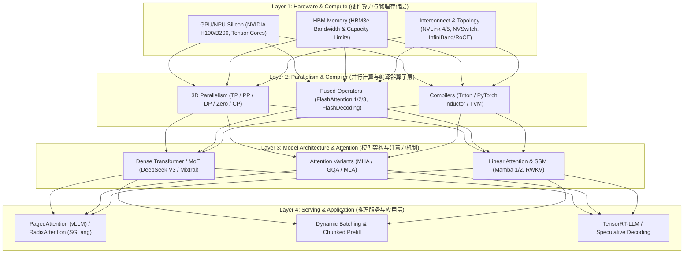

# 0.1 AI Infra 四层架构全景剖析与 Roofline 瓶颈图谱

> **📌 本章导读**
> 在大型语言模型（LLM）与生成式 AI 快速演进的今天，许多开发者和算法工程师容易落入“孤立看算法”的误区——仅关注 Transformer 的 Math 方程或注意力变体，却忽视了底层的硬件访存限制与上层的 Serving 调度。
> 
> 工业级大模型性能的突破，本质上是**全栈 AI Infra（人工智能基础设施）配合**的结果。本文引入 **AI Infra 4 层架构拓扑**，并以 **Roofline Model（算术强度瓶颈模型）** 贯穿全栈，系统剖析从底层 Silicon（晶圆与 HBM）到顶层 Token 吞吐调优的完整映射链条。

---

## 🌳 1. AI Infra 四层架构拓扑与演进主干图

AI 基础设施可划分为从底层物理硬件到顶层应用调度的四个核心层级：



### 四层职责定义与演进脉络

1. **Layer 1: 硬件算力与物理存储 (Hardware & Silicon)**
   - **核心驱动**：提供 Compute FLOPS（如 FP16/FP8 Tensor Cores）与 HBM Bandwidth（内存带宽）。
   - **物理瓶颈**：随着算力增长（摩尔定律放缓）与 HBM 带宽增长的不对等，“存储墙 (Memory Wall)”成为主要矛盾。
2. **Layer 2: 并行与编译器 (Parallelism & Operator Compiler)**
   - **核心驱动**：打破单卡显存与算力极限，利用 Triton/FlashAttention 手写高性能 CUDA 算子与 3D 并行拓扑。
   - **优化目标**：减少 SRAM 到 HBM 的不必要 DRAM 读写，最大化 Tensor Core 利用率（MFU, Model FLOPs Utilization）。
3. **Layer 3: 模型架构与注意力 (Model Architecture & Attention)**
   - **核心驱动**：重构注意力计算逻辑，降低 KV Cache 显存占用与计算复杂度。
   - **代表演进**：从标准 MHA 演进为 GQA/MLA（DeepSeek 多头潜向量压缩），甚至扩展至 Mamba 亚二次方线性 Attention。
4. **Layer 4: 推理服务与应用 (Serving & Production Engine)**
   - **核心驱动**：面向高并发 SLA 生产环境，解决多轮对话与 Agent 场景下的内存碎片与 KV Cache 重复计算。
   - **代表演进**：vLLM PagedAttention（按页管理 KV Cache）到 SGLang RadixAttention（前缀树匹配共享 KV Cache）。

---

## 🕸️ 2. 四层架构瓶颈矩阵与 Roofline 算术强度

### 2.1 Roofline 模型核心理论

Roofline 模型定义了计算系统的性能上限，其公式如下：

$$P = \min(P_{\text{peak}}, I \times B_{\text{mem}})$$

其中：
- $P$：系统实际达到的计算性能（TFLOPS）。
- $P_{\text{peak}}$：硬件峰值算力（TFLOPS）。
- $B_{\text{mem}}$：硬件 HBM 内存带宽（TB/s）。
- $I$：**算术强度 (Arithmetic Intensity)**，单位为 $\text{FLOPs/Byte}$：
  $$I = \frac{\text{总浮点运算次数 (Total FLOPs)}}{\text{内存数据传输量 (Total Memory Access Bytes)}}$$

硬件的拐点值（拐点算术强度 $I_{\text{turn}}$）为：
$$I_{\text{turn}} = \frac{P_{\text{peak}}}{B_{\text{mem}}}$$

- 当模型算子的 $I < I_{\text{turn}}$ 时，系统处于 **Memory-Bound（内存带宽受限区）**。
- 当模型算子 $I > I_{\text{turn}}$ 时，系统处于 **Compute-Bound（算力受限区）**。

```
实际性能 P (TFLOPS)
  ^
  |                     ======================== 峰值算力 P_peak (Compute-Bound)
  |                    /
  |                   /
  |                  /  <- 瓶颈转折点 (I_turn)
  |                 /
  |                /
  |               /
  |              /  (Memory-Bound) 性能由带宽 B_mem * I 决定
  +-------------+-----------------------------------> 算术强度 I (FLOPs/Byte)
```

### 2.2 四层架构在 Prefill 与 Decode 阶段的瓶颈贯穿

在 LLM 的生命周期中，**Prefill 阶段**与 **Decode 阶段**表现出截然相反的 Roofline 特性：

| 维度 | Prefill 阶段 (Context Ingestion) | Decode 阶段 (Autoregressive Token Gen) |
| :--- | :--- | :--- |
| **计算模式** | Batch Size $\ge 1$，输入 Sequence Length $N$ 大 | Batch Size 一般受限，逐字输出 Token ($N=1$) |
| **Roofline 归属** | **Compute-Bound (算力受限)** | **Memory-Bound (显存带宽受限)** |
| **Layer 1 瓶颈** | FP16/FP8 Tensor Core 矩阵乘法峰值 $P_{\text{peak}}$ | HBM3 / HBM3e 内存读取带宽 $B_{\text{mem}}$ |
| **Layer 2 优化** | FlashAttention 算子分块重算 (Tiling) | FlashDecoding 跨 Head / KV 并行加速读取 |
| **Layer 3 优化** | 混合精度与 MoE 稀疏激活 | MQA / GQA / MLA 压缩 KV Cache 字节数 |
| **Layer 4 优化** | Chunked Prefill / Batch 分段抢占 | PagedAttention 消除页外碎片 / RadixTree 复用 |

---

## 💻 3. Python 实战：Roofline Model 分析器

以下 Python 脚本用于精确评估指定模型参数（如 7B/70B）在 Prefill / Decode 阶段基于 NVIDIA A100 与 H100 上的算术强度及 Roofline 瓶颈类型。

```python
import torch

class RooflineAnalyzer:
    """
    分析指定模型在不同硬件（A100 vs H100）上的 Roofline 瓶颈与算术强度
    """
    HARDWARE_SPECS = {
        "A100-80GB-SXM": {
            "fp16_tflops": 312.0,      # FP16 Tensor Core Peak
            "fp8_tflops": 624.0,       # FP8
            "hbm_bw_tbs": 2.0,         # 2.0 TB/s HBM2e
        },
        "H100-SXMGPU": {
            "fp16_tflops": 989.0,      # FP16 Tensor Core Peak (Dense)
            "fp8_tflops": 1978.0,      # FP8 Tensor Core Peak
            "hbm_bw_tbs": 3.35,        # 3.35 TB/s HBM3
        }
    }

    def __init__(self, num_params_billions: float, num_layers: int, hidden_size: int):
        self.params = num_params_billions * 1e9
        self.num_layers = num_layers
        self.hidden_size = hidden_size

    def analyze_decode_step(self, batch_size: int, precision_bytes: int = 2) -> dict:
        """
        计算单步 Decode (SeqLen=1) 的 Arithmetic Intensity
        每个 Token 前向传播大约需要 2 * Num_Params FLOPs
        内存读取包括模型权重 (Params * precision_bytes) 和 KV Cache 读取
        """
        total_flops = 2 * self.params * batch_size
        model_bytes = self.params * precision_bytes
        # 简化假设：无额外 KV Cache
        total_bytes = model_bytes
        arithmetic_intensity = total_flops / total_bytes  # FLOPs/Byte

        results = {}
        for hw_name, spec in self.HARDWARE_SPECS.items():
            peak_flops = spec["fp16_tflops"] * 1e12
            hbm_bw = spec["hbm_bw_tbs"] * 1e12
            turning_point = peak_flops / hbm_bw
            
            attainable_flops = min(peak_flops, arithmetic_intensity * hbm_bw)
            bound_type = "Compute-Bound" if arithmetic_intensity >= turning_point else "Memory-Bound"
            mfu = (attainable_flops / peak_flops) * 100.0

            results[hw_name] = {
                "arithmetic_intensity_flops_per_byte": round(arithmetic_intensity, 2),
                "turning_point": round(turning_point, 2),
                "bound_type": bound_type,
                "attainable_tflops": round(attainable_flops / 1e12, 2),
                "theoretical_mfu_percent": round(mfu, 2)
            }
        return results

if __name__ == "__main__":
    # 以 Llama-2-7B 为例
    analyzer = RooflineAnalyzer(num_params_billions=7.0, num_layers=32, hidden_size=4096)
    
    print("--- Decode Phase (Batch Size = 1, FP16) ---")
    decode_analysis = analyzer.analyze_decode_step(batch_size=1, precision_bytes=2)
    for hw, metrics in decode_analysis.items():
        print(f"[{hw}] => Intensity: {metrics['arithmetic_intensity_flops_per_byte']} FLOPs/B, "
              f"Turning Point: {metrics['turning_point']} FLOPs/B, "
              f"Status: {metrics['bound_type']}")
```

---

## 🔥 4. 连环面试追问 (Level 1 ~ Level 6)

### Level 1: 概念阐释
> **问：如何用一句话解释 GPU 的算术强度 (Arithmetic Intensity)？**
>
> **答**：算术强度是指某个计算 Kernel 或模型在前向/反向传播过程中，**每从内存（HBM/DRAM）读取或写入 1 个 Byte 的数据，所完成的浮点计算次数（FLOPs/Byte）**。算术强度越高，说明显存带宽利用得越充分，越容易榨干 GPU 的算力。

---

### Level 2: 机制对比
> **问：为什么大模型训练主要吃算力 (Compute-Bound)，而单人 Decode 推理主要吃显存带宽 (Memory-Bandwidth Bound)？**
>
> **答**：
> 1. **训练与 Prefill 阶段**：通常 Batch Size 和 Sequence Length 都很大，GEMM（矩阵乘法）维度高。计算量按 $O(B \times S \times D^2)$ 增长，而权重只读一次。算术强度很高（如 $>200\text{ FLOPs/Byte}$），远超 GPU 拐点，因此受限于 FP16/FP8 Tensor Core 的 Peak TFLOPS（Compute-Bound）。
> 2. **单人 Decode 阶段**：由于是自回归生成，每次只能输入 1 个 Token ($S=1$)。对于每一个 Token，都需要将数十 GB 的模型权重完整从 HBM 搬运到 GPU 核心 SRAM 中，计算量却仅有 $2 \times \text{Params}$。算术强度极低（如在 FP16 下算术强度仅为 $2 / 2 = 1.0\text{ FLOPs/Byte}$），因此受限于 HBM 带宽上限（Memory-Bound）。

---

### Level 3: 架构传导
> **问：四层架构中，底层硬件改进（如 H100 FP8 Tensor Cores）是如何一步步传导并改变上层推理框架（如 TensorRT-LLM / vLLM）实现的？**
>
> **答**：
> - **Layer 1 $\rightarrow$ Layer 2**：H100 引入了 Transformer Engine 和 FP8 Tensor Core。Layer 2 算子层（Triton/CUDA）必须重新手写支持 E4M3 和 E5M2 数据格式的 GEMM 算子，并重构 FlashAttention-3 以适应 FP8 逻辑。
> - **Layer 2 $\rightarrow$ Layer 3**：因为 FP8 的动态范围有限，Layer 3 模型架构在设计上引入了 Block-wise 量化与 Dynamic Scale 机制。
> - **Layer 3 $\rightarrow$ Layer 4**：Layer 4 服务框架（vLLM/TRT-LLM）必须重构其内存管理器，将 KV Cache 缓存池从原本 FP16 的 16-bit 存储降为 FP8 8-bit 页表，并利用硬件 Transformer Engine 进行在线 Dynamic Dequantization 调度。

---

### Level 4: 算子重构
> **问：FlashAttention 为什么能打破标准 Attention 在 Layer 1 HBM 带宽上的瓶颈？其原理在 Roofline 上如何表现？**
>
> **答**：
> - **标准 Attention**：中间结果 $S = Q K^T$ 和 $P = \text{softmax}(S)$ 的大小为 $N \times N$。在 $N$ 较大时必须频繁写回 HBM，再从 HBM 读取进行乘 $V$ 操作。内存读写复杂度为 $O(N^2)$。
> - **FlashAttention**：利用 **Tiling（分块）** 与 **Online Softmax** 算法，将 $Q, K, V$ 分块加载到片上高速 SRAM（带宽高一个数量级）中计算，中间过程绝不写回 HBM。HBM 存取复杂度降至 $O(N)$。
> - **Roofline 表现**：FlashAttention 大幅降低了 Total Memory Access Bytes，从而将注意力算子的算术强度 $I$ 提升了数倍，使其从 Memory-Bound 区间向 Compute-Bound 移动。

---

### Level 5: 系统瓶颈
> **问：在前缀缓存（Prefix Caching）场景下，SGLang 的 RadixAttention 与 vLLM 的 PagedAttention 在 Layer 4 调度层有何本质区别？**
>
> **答**：
> - **PagedAttention**：解决了 KV Cache 的**显存碎片化**问题。通过虚拟内存分页映射（Physical Block Table），避免连续显存预分配浪费，但默认缺乏高效的多轮对话树形前缀查找机制。
> - **RadixAttention**：在分页管理之上，建立了一个**动态前缀树（Radix Tree）**结构，将系统中的历史 KV Cache Block 作为节点进行树形归并。当有新请求（如 System Prompt 或 Tree-of-Thought 分支）进入时，通过 Prefix Radix Match 快速复用已有缓存，使得 Cache Hit 场景下的 Prefill 计算量直接降低为 0，突破了 Layer 4 的首字延迟（TTFT）上限。

---

### Level 6: 极限设计
> **问：假设设计一款专为 100K 极致长文本推理的芯片与 Serving 系统，你会如何在 4 个层级协同设计？**
>
> **答**：
> 1. **Layer 1 (Silicon)**：采用 HBM3e 搭配超大片上 SRAM（SRAM 扩展至 1GB+），并使用 PCIe 5.0/NVLink4 提供极高互联带宽。
> 2. **Layer 2 (Compiler)**：开发支持 Ring-Attention 与 Chunked FlashDecoding 的融合算子，将超长 KV 按照 Head 与 Sequence 维映射到全集群分布式 SRAM。
> 3. **Layer 3 (Architecture)**：抛弃标准 MHA，采用 DeepSeek MLA（多术潜向量压缩，将 KV Cache 压缩 93%）或 Mamba 2 / SSD 亚二次方线性架构。
> 4. **Layer 4 (Serving)**：引入 Chunked Prefill + Radix Tree 树形 Cache 共享机制，实现长文本 Prefill 与 Decode 动态 Overlap 计算。

---

## 🔗 5. 扩展学习资源与论文/Repo

- **[NVIDIA Roofline Model Documentation](https://docs.nvidia.com/deeplearning/performance/dl-performance-gpu-background/index.html)**：官方深度学习 GPU 性能与算术强度白皮书。
- **[FlashAttention-2/3 Papers (Tri Dao)](https://github.com/Dao-AILab/flash-attention)**：Fast and Memory-Efficient Exact Attention with IO-Awareness.
- **[vLLM Project](https://github.com/vllm-project/vllm)**：Easy, fast, and cheap LLM serving for everyone (PagedAttention 论文实现).
- **[SGLang Architecture Guide](https://github.com/sgl-project/sglang)**：Efficient Execution of Structured Language Model Programs (RadixAttention 前缀树引擎).
