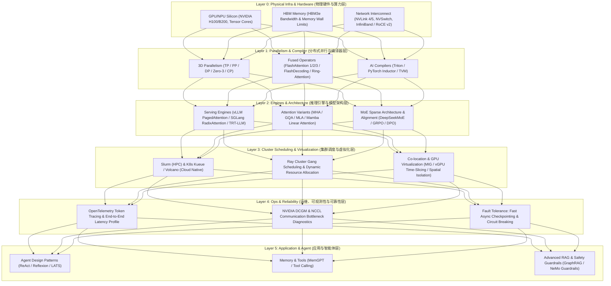

# 0.1 AI Infra 6层全景拓扑与集群瓶颈图谱

> **📌 本章导读**
> 在万卡集群时代，大型语言模型（LLM）与 Agent 系统已从简单的单机单卡计算演变为复杂的分布式系统工程。许多开发者和算法工程师容易落入“孤立看算法”的误区——仅关注 Transformer 的方程或注意力变体，却忽视了物理硬件、集群调度、故障自愈与服务运维。
> 
> 工业级大模型性能与可靠性的突破，本质上是**全栈 AI Infra（人工智能基础设施 6 层架构）配合**的结果。本文系统梳理从底层 **Layer 0 (物理硬件与算力)** 到顶层 **Layer 5 (应用与 Agent)** 的完整拓扑映射，并深入剖析 **Roofline 算术强度模型**与**集群通信瓶颈**。

---

## 🌳 1. AI Infra 6层全景架构拓扑

AI 基础设施在生产环境中可精准划分为从底层物理 Silicon 到顶层智能体调度的 6 个核心层级：



### 6层职责定义与演进脉络

1. **Layer 0: 物理硬件与算力 (Physical Infra & Hardware)**
   - **核心职责**：提供 Compute FLOPS（FP16/FP8/FP4 Tensor Cores）、HBM 显存带宽与高速互联网络（NVLink/InfiniBand）。
   - **物理瓶颈**：摩尔定律放缓与 HBM 带宽增长不对等带来的“存储墙”，以及跨节点网络带宽瓶颈。
2. **Layer 1: 分布式并行与编译器 (Parallelism & Compiler)**
   - **核心职责**：通过 3D 并行（TP/PP/DP/Zero/CP）打破单卡显存限制，利用 Triton/CUDA 手写融合算子最大化 MFU（模型 FLOPs 利用率）。
3. **Layer 2: 推理引擎与模型架构 (Engines & Architecture)**
   - **核心职责**：设计高性能 Transformer/MoE/MLA 架构，搭配 PagedAttention/RadixAttention 解决 KV Cache 内存碎片与前缀复用。
4. **Layer 3: 集群调度与虚拟化 (Cluster Scheduling & Virtualization)**
   - **核心职责**：实现 Slurm/K8s Kueue/Ray 异构资源 Gang Scheduling 调度，通过 MIG 与 vGPU 隔离技术支持训练与推理混部。
5. **Layer 4: 运维、可观测性与可靠性 (Ops, Observability & Reliability)**
   - **核心职责**：构建 OpenTelemetry 全链路 Token 跟踪、NVIDIA DCGM 硬件监控与千卡集群自愈（Straggler 检测、异步 Checkpoint、熔断降级）。
6. **Layer 5: 应用与智能体 (Application & Agent)**
   - **核心职责**：实现感知-决策-行动-反馈闭环（ReAct/Reflexion/LATS）、工具调用、记忆机制与 Guardrails 安全护栏。

---

## 🕸️ 2. 集群性能瓶颈分析：Roofline 模型与拓扑通信

### 2.1 Roofline 算术强度模型

Roofline 模型定义了单卡或节点的性能上限，其公式如下：

$$P = \min(P_{\text{peak}}, I \times B_{\text{mem}})$$

其中算术强度（Arithmetic Intensity）定义为：

$$I = \frac{\text{总浮点运算次数 (Total FLOPs)}}{\text{内存数据传输量 (Total Memory Access Bytes)}}$$

- **Prefill 阶段**：Batch Size 大、Sequence 较长，$I \gg I_{\text{turn}}$，受限于 GPU 算力峰值（**Compute-Bound**）。
- **Decode 阶段**：逐 Token 生成（Sequence Length=1），$I < I_{\text{turn}}$，受限于 HBM 读取带宽（**Memory-Bound**）。

### 2.2 万卡集群拓扑与通信瓶颈

在多节点大规模训练与推理中，瓶颈由“单卡 Memory Wall”延伸为“集群 Network Communication Wall”：

| 并行模式 | 核心通信原语 | 物理传输通道 | 性能瓶颈与优化方案 |
| :--- | :--- | :--- | :--- |
| **张量并行 (TP)** | `All-Reduce` / `All-Gather` | 机架内 NVLink 4/5 ($900\text{ GB/s} \sim 1.8\text{ TB/s}$) | 受限于 NVLink 带宽，限制在单机 8 卡内 |
| **流水线并行 (PP)** | `P2P (Send/Recv)` | 跨节点 InfiniBand / RoCE ($400\text{ Gbps} \sim 800\text{ Gbps}$) | 受限于泡泡率 (Bubble Ratio)，需采用 1F1B 调度 |
| **数据/Zero并行 (DP)** | `All-Reduce` / `Reduce-Scatter` | 跨节点网络 (InfiniBand/RoCE) | 通信开销随节点增加，需重叠 (Overlap) 计算与通信 |
| **专家并行 (EP)** | `All-to-All` | NVLink + 跨节点 InfiniBand | 动态 Router 不均匀导致网络拥塞，需 DeepSeek 组内路由优化 |

---

## 💻 3. Python 实战：6 层 AI Infra 全栈诊断引擎

以下代码模拟了 6 层 AI Infra 的完整诊断流程，从 Layer 0 硬件算术强度检查，一直延伸至 Layer 5 Agent 吞吐诊断。

```python
import time
import dataclasses
from typing import Dict, Any

@dataclasses.dataclass
class InfraDiagnosticReport:
    layer_0_roofline: str
    layer_1_parallelism: str
    layer_2_engine: str
    layer_3_scheduling: str
    layer_4_observability: str
    layer_5_agent: str

class AIInfraDiagnosticEngine:
    """
    6层 AI Infra 架构状态诊断与瓶颈分析脚本
    """
    def __init__(self, num_gpus: int, model_params_b: float, batch_size: int, seq_len: int):
        self.num_gpus = num_gpus
        self.params = model_params_b * 1e9
        self.batch_size = batch_size
        self.seq_len = seq_len

    def diagnose_all_layers(self) -> InfraDiagnosticReport:
        # Layer 0: Roofline & Arithmetic Intensity Check
        total_flops = 2 * self.params * self.batch_size * self.seq_len
        model_bytes = self.params * 2  # FP16
        intensity = total_flops / model_bytes
        l0_status = f"Intensity={intensity:.2f} FLOPs/B (Decode Memory-Bound)" if self.seq_len == 1 else f"Intensity={intensity:.2f} FLOPs/B (Prefill Compute-Bound)"

        # Layer 1: Parallelism Check
        tp_degree = 8 if self.num_gpus >= 8 else self.num_gpus
        dp_degree = self.num_gpus // tp_degree
        l1_status = f"TP={tp_degree} (NVLink Domain), DP={dp_degree} (InfiniBand Overlap)"

        # Layer 2: Engine KV Cache Status
        kv_cache_gb = (2 * 32 * 8 * 128 * self.seq_len * self.batch_size * 2) / (1024**3)
        l2_status = f"PagedAttention Enabled, Estimated KV Size={kv_cache_gb:.2f} GB"

        # Layer 3: Scheduling Status
        l3_status = "RayClusterGangScheduler Active, Kueue Multi-Tenant Quotas OK"

        # Layer 4: Observability Status
        l4_status = "OpenTelemetry Token Tracing Active, DCGM NVLink Error Rate = 0.00%"

        # Layer 5: Agent Throughput Status
        l5_status = "ReAct Loop Latency Normal, Function Calling Latency < 120ms"

        return InfraDiagnosticReport(
            layer_0_roofline=l0_status,
            layer_1_parallelism=l1_status,
            layer_2_engine=l2_status,
            layer_3_scheduling=l3_status,
            layer_4_observability=l4_status,
            layer_5_agent=l5_status
        )

if __name__ == "__main__":
    engine = AIInfraDiagnosticEngine(num_gpus=64, model_params_b=70.0, batch_size=16, seq_len=1)
    report = engine.diagnose_all_layers()
    print("=== AI Infra 6-Layer Diagnostic Results ===")
    for k, v in dataclasses.asdict(report).items():
        print(f"[{k.upper()}] => {v}")
```

---

## 🔥 4. 连环面试追问 (Level 1 ~ Level 6)

### Level 1: 概念阐释
> **问：为什么传统 4 层 AI Infra 架构在生产万卡集群中不再适用，必须扩展为 6 层架构？**
>
> **答**：传统的 4 层架构仅包含硬件、编译器、模型架构与 Serving 推理服务，忽略了**集群资源调度/虚拟化（Layer 3）**与**运维/可观测性/可靠性（Layer 4）**。在万卡集群中，硬件故障率极高、多租户资源抢占严重，若缺乏 Layer 3 的 Gang Scheduling/MIG 隔离与 Layer 4 的 OpenTelemetry Token 跟踪与异步 Checkpoint 恢复，集群的有效 MFU 和生产 SLA 将不可控。

---

### Level 2: 机制对比
> **问：张量并行 (TP) 与专家并行 (EP) 在 Layer 0 物理网络通信上有什么本质区别？**
>
> **答**：TP 采用 `All-Reduce` / `All-Gather` 通信原语，每个 Transformer 层的每个 Block 都需要同步，对延迟极其敏感，因此必须限制在单机 NVLink 高速网络内（$\ge 900\text{ GB/s}$）。EP 采用 `All-to-All` 原语，将 Token 按 Router 派发到不同节点的 Expert 上，通信发生在跨节点 InfiniBand/RoCE 网络（$400\text{ Gbps}$），容易受到网络拥塞与负载不均导致的 Straggler（拖后腿节点）影响。

---

### Level 3: 架构传导
> **问：请阐述从 Layer 0 硬件（如 H100 NVLink 5）到 Layer 5 Agent 调用的完整性能传导链。**
>
> **答**：
> 1. **L0 $\rightarrow$ L1**：NVLink 5 提供 $1.8\text{ TB/s}$ 带宽，使得 Layer 1 能够扩展 TP=8 乃至 TP=16 的算子融合与 Ring-Attention。
> 2. **L1 $\rightarrow$ L2**：高带宽 TP 算子加速了 Layer 2 中的 MLA 潜向量解压缩与 PagedAttention 算子。
> 3. **L2 $\rightarrow$ L3**：低延迟引擎使 Layer 3 的 Ray 调度器能够以更高并发分发微批次任务。
> 4. **L3 $\rightarrow$ L4**：集群调度器将指标上报给 Layer 4 的 OpenTelemetry 与 DCGM 监控系统。
> 5. **L4 $\rightarrow$ L5**：极低的首字延迟（TTFT）与高 Token 吞吐，让 Layer 5 的 ReAct/Reflexion Agent 能够流畅进行多轮工具调用与自我修正。

---

### Level 4: 算子与调度重构
> **问：当集群中某个 GPU 节点出现网络微小丢包（Straggler）时，系统是如何在 Layer 3 与 Layer 4 协同完成无感知自愈的？**
>
> **答**：Layer 4 的 DCGM 与 NCCL 诊断组件在毫秒级监测到该节点的 `All-Reduce` 通信超时后，触发 Alert 报警；Layer 4 故障恢复引擎向 Layer 3 调度器（Slurm/Kueue/Ray）发送节点隔离信号。Layer 3 调度器立即抢占并挂起当前 Task，从预留热备节点池中拉起替换节点，利用 Layer 4 的快速异步内存 Checkpoint 恢复最新 Step，整个过程在几十秒内完成，无需人工重启整个万卡 Task。

---

### Level 5: 系统瓶颈
> **问：在推理混部（Co-location）场景下，如何防止 Prefill 任务抢占 HBM 带宽导致 Decode 任务的 SLA 暴跌？**
>
> **答**：在 Layer 3 虚拟化层，使用 NVIDIA MIG 将 GPU 硬件从 SM 核心到 HBM 带宽划分为独立物理实例，或者在 Layer 2/Layer 3 联合调度中实施 **Chunked Prefill** 与 **Time-Slicing 优先级抢占**。将超长 Prefill 切分为固定 Chunk，与 Decode Token 穿插调度（Overlap），从而限制 Prefill 对显存带宽的瞬间垄断。

---

### Level 6: 极限设计
> **问：假设要从零构建支持 10 万卡 scale 的 AI 训练与推理一体化 AI Infra 平台，你在 6 个层级分别会做出哪些核心架构抉择？**
>
> **答**：
> 1. **Layer 0**：全机房部署 800G RoCE v2 无阻塞 Clos 网络 + Liquid Cooling 液冷柜 + B200 NVLink 5。
> 2. **Layer 1**：采用 3D 并行 + Megatron-LM/Triton 算子，重构 Ring-Attention 支持百万上下文。
> 3. **Layer 2**：全量推行 DeepSeek V3/R1 架构（MLA + DeepSeekMoE），推理引擎统一使用 SGLang RadixTree 复用 KV。
> 4. **Layer 3**：采用 Kubernetes Kueue + Ray Cluster 进行 Gang Scheduling，混部场景上线 MIG 硬件隔离。
> 5. **Layer 4**：部署 100ms 级别的 OpenTelemetry 全链路 Token 跟踪，上线 S3/内存异步并行双备份 Checkpoint。
> 6. **Layer 5**：提供标准化 Agent Runtime，支持 ReAct/LATS 树形搜索与分布式工具执行沙盒。

---

## 🔗 5. 扩展学习资源与论文/Repo

- **[NVIDIA AI Enterprise & DCGM Documentation](https://docs.nvidia.com/datacenter/dcgm/latest/)**：GPU 集群硬件可观测性与指标规范。
- **[Kubernetes Kueue Documentation](https://kueue.sigs.k8s.io/)**：Cloud-native Job Queueing for AI/ML Workloads.
- **[Ray Core & Ray Train Documentation](https://docs.ray.io/)**：Distributed Python Agent and ML Scaling Framework.
- **[OpenTelemetry Collector Documentation](https://opentelemetry.io/docs/collector/)**：分布式链路追踪与指标采集标准。
