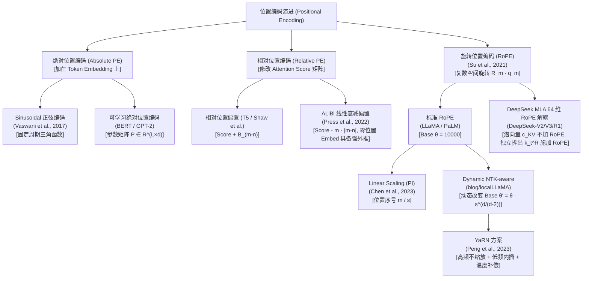
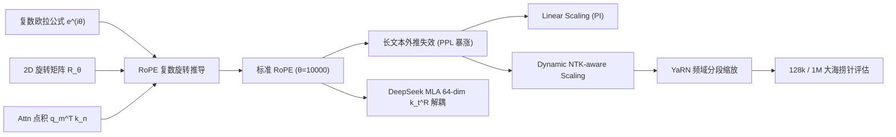
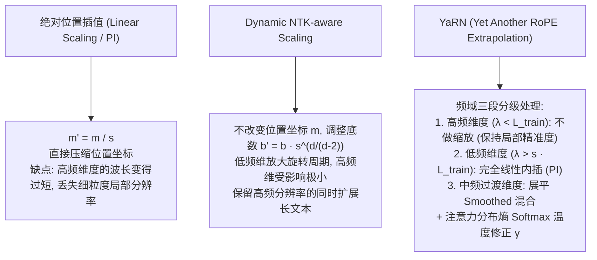

# 1.2 位置编码深挖：从 Sinusoidal 到 RoPE、ALiBi 与 YaRN

> [!IMPORTANT]
> 位置编码（Positional Encoding, PE）是自注意力机制（Self-Attention）具备序列时序感知能力的核心前提。自注意力本身具有**置换不变性（Permutation Invariance）**，如果不注入位置信息，句子 "Dog bites man" 与 "Man bites dog" 的注意力计算结果将完全相同。随着大模型上下文窗口从 2k/4k 跨越至 128k 甚至 1M，位置编码不仅承担“表示当前位置”的功能，更成为了**长文本上下文外推（Context Extrapolation）**与**外推注意力衰减控制**的致命瓶颈。

---

## 📖 1. 导言与背景：绝对 vs 相对位置编码与外推困境

Transformer 模型的自注意力计算为：

$$\text{Attention}(Q, K, V) = \text{softmax}\left(\frac{QK^T}{\sqrt{d_k}}\right)V$$

若没有任何位置信息，对输入 Token 序列进行任意打乱，计算出的注意力权重矩阵与输出特征仅发生对应的行/列置换，无法感知单词间的相对距离与先后顺序。

针对这一问题，学术界与工业界经历了从**绝对位置编码（Absolute Positional Encoding）**到**相对位置编码（Relative Positional Encoding）**的范式转移：

1. **绝对位置编码 (Sinusoidal / Learnable PE)**：直接为序列中第 $m$ 个 Token 生成一个固定的向量 $\mathbf{p}_m \in \mathbb{R}^d$，并将其加到词向量上 $\mathbf{x}_m = \mathbf{e}_m + \mathbf{p}_m$。
   - *致命缺陷*：**缺乏长文本外推能力（Extrapolation Failure）**。若模型训练时的最大序列长度为 $L=2048$，当推理遇到 $m > 2048$ 时，可学习位置编码缺乏未见过的 $p_m$ 向量；而 Sinusoidal 正弦编码虽然理论上有公式，但由于超出训练范围的高频/低频相位未在 Attention 中被模型拟合过，注意力分数分布迅速崩塌，困惑度（PPL）飙升至无穷大。
2. **相对位置编码 (Relative Positional Encoding)**：关注 Token $m$ 与 Token $n$ 之间的**相对距离 $(m - n)$**。点积注意力分数由纯绝对位置变成关于 $(m-n)$ 的函数。
3. **旋转位置编码 (RoPE) 与外推技术**：通过复数空间旋转矩阵，将绝对位置坐标在 $Q, K$ 作用后自然转化为相对位置点积，同时兼具复数乘法的优良性质，为 Linear Scaling、Dynamic NTK 和 YaRN 等外推扩展奠定了数学基础。

---

## 🌳 2. 位置编码技术演进分支树

位置编码的发展主要分为绝对位置、相对偏置和旋转外推三大分支：



> **分支路线图解读**：
> - 📌 **绝对位置编码**：实现简单，但无法很好地捕捉距离相对性，外推长度受限。
> - 📌 **ALiBi 线性偏置**：完全抛弃位置向量，通过在注意力矩阵上直接加上随距离线性递减的负偏置（$-m \cdot |m-n|$），展现出极强的零样本上下文外推能力。
> - 📌 **RoPE 旋转网络及其外推族**：成为现代开源 LLM（LLaMA 1/2/3, Qwen 1/2/2.5, Mistral）的绝对标准。演进路径从简单位置插值（Linear Scaling）走向频域分步缩放（YaRN）与解耦设计（DeepSeek MLA）。

---

## 🕸️ 3. 知识网格与图谱依赖

### 入度与出度依赖关系

| 依赖方向 | 关联概念 / 技术点 | 阐述与影响 |
| :--- | :--- | :--- |
| **前置依赖 (In-Degree)** | 复数欧拉公式 $e^{i\theta} = \cos\theta + i\sin\theta$ | 2D 向量旋转矩阵与复数乘法的等价性推导基础。 |
| **前置依赖 (In-Degree)** | 2D 旋转变换矩阵 $R_\theta$ | 旋转位置编码 RoPE 将向量内积转化为相对角度差值的几何本质。 |
| **前置依赖 (In-Degree)** | Self-Attention 点积计算 | $q_m^T k_n$ 如何感知位置 $m, n$ 的内在机制。 |
| **后置影响 (Out-Degree)** | Long-Context 128k / 1M 扩展 | 依靠 Dynamic NTK 与 YaRN 实现不回训或微调少量步数扩增上下文窗口。 |
| **后置影响 (Out-Degree)** | DeepSeek MLA (Multi-Head Latent Attention) | 为什么 MLA 的 KV 潜向量不能直接施加 RoPE？如何通过解耦 64 维 RoPE Key 实现矩阵吸收？ |
| **后置影响 (Out-Degree)** | Needle in a Haystack (大海捞针测试) | Positional Encoding 的频域退化直接决定长文本召回准确率。 |



---

## 🧮 4. 数学推导与硬核机制

### 4.1 RoPE 的二维复数旋转推导

给定位置 $m$ 处的 Query 向量 $\mathbf{q}_m \in \mathbb{R}^d$ 与位置 $n$ 处的 Key 向量 $\mathbf{k}_n \in \mathbb{R}^d$。旋转位置编码（RoPE）的核心目标是寻找一个函数 $\mathbf{R}_m$，使得应用编码后的 Query $\tilde{\mathbf{q}}_m = \mathbf{R}_m \mathbf{q}_m$ 与 Key $\tilde{\mathbf{k}}_n = \mathbf{R}_n \mathbf{k}_n$ 的内积**仅与相对位置 $(m - n)$ 有关**：

$$\langle \mathbf{R}_m \mathbf{q}_m, \mathbf{R}_n \mathbf{k}_n \rangle = g(\mathbf{q}_m, \mathbf{k}_n, m - n)$$

#### 2D 向量推导
先考虑 2 维向量 $\mathbf{q}_m = (q^{(1)}, q^{(2)})^T$。在复平面上，该向量可表示为复数：

$$q_m = q^{(1)} + i q^{(2)}$$

根据欧拉公式，将复数乘上旋转因子 $e^{i m \theta}$：

$$\tilde{q}_m = q_m \cdot e^{i m \theta} = (q^{(1)} + i q^{(2)}) (\cos(m\theta) + i \sin(m\theta))$$

展开实部与虚部：

$$\text{Re}(\tilde{q}_m) = q^{(1)}\cos(m\theta) - q^{(2)}\sin(m\theta)$$
$$\text{Im}(\tilde{q}_m) = q^{(1)}\sin(m\theta) + q^{(2)}\cos(m\theta)$$

写成二维矩阵乘法形式：

$$\mathbf{R}_{\Theta, m}^{(2D)} \mathbf{q}_m = \begin{pmatrix} \cos(m\theta) & -\sin(m\theta) \\ \sin(m\theta) & \cos(m\theta) \end{pmatrix} \begin{pmatrix} q^{(1)} \\ q^{(2)} \end{pmatrix}$$

同理，对 Key 向量 $\mathbf{k}_n$ 施加旋转 $\mathbf{R}_{\Theta, n}^{(2D)}$：

$$\tilde{\mathbf{k}}_n = \begin{pmatrix} \cos(n\theta) & -\sin(n\theta) \\ \sin(n\theta) & \cos(n\theta) \end{pmatrix} \begin{pmatrix} k^{(1)} \\ k^{(2)} \end{pmatrix}$$

#### 相对位置保性推导
计算旋转后的内积 $\tilde{\mathbf{q}}_m^T \tilde{\mathbf{k}}_n$：

在复数向量空间中，两向量内积相当于 $\text{Re}(\tilde{q}_m \cdot \tilde{k}_n^*)$，其中 $*$ 表示复共轭：

$$\tilde{q}_m \cdot \tilde{k}_n^* = (q_m e^{i m \theta}) (k_n e^{i n \theta})^* = q_m k_n^* e^{i (m-n)\theta}$$

取实部：

$$\tilde{\mathbf{q}}_m^T \tilde{\mathbf{k}}_n = \text{Re}\left( q_m k_n^* e^{i(m-n)\theta} \right)$$

很显然，内积结果完全由相对角度差 $(m-n)\theta$ 决定！这就是 RoPE 的完美数学性质。

#### 高维 $d$ 维拓展
对于 $d$ 维空间（$d$ 为偶数），RoPE 将 $d$ 维向量划分为 $d/2$ 个两两独立的二维子空间，使用块对角旋转矩阵 $\mathbf{R}_{\Theta, m}^{(d)}$：

$$\mathbf{R}_{\Theta, m}^{(d)} = \text{diag}\left( \mathbf{R}_{\theta_1, m}^{(2D)}, \mathbf{R}_{\theta_2, m}^{(2D)}, \dots, \mathbf{R}_{\theta_{d/2}, m}^{(2D)} \right)$$

其中每个维度的旋转角频率为：

$$\theta_i = b^{-2(i-1)/d}, \quad i \in \{1, 2, \dots, d/2\}, \quad \text{默认 } b = 10000$$

---

### 4.2 长上下文外推与 YaRN 频域 Scaling 原理

当序列长度超出训练窗口（如从 $L_{train}=4096$ 延伸至 $L_{test}=32768$，缩放因子 $s = 8$）时，主要有三种扩展技术：



#### YaRN 频域分界点计算
给定维度 $i$ 的旋转周期（波长） $\lambda_i = \frac{2\pi}{\theta_i} = 2\pi \cdot b^{2(i-1)/d}$：

1. **高频区 ($\lambda_i < \frac{L_{train}}{\alpha}$)**：波长远小于训练窗口，局部信息密集，**不进行任何插值**（缩放比 $r_i = 1$）。
2. **低频区 ($\lambda_i > L_{train}$)**：波长超出训练窗口，容易产生外推震荡，**完全采用 Linear Scaling 插值**（缩放比 $r_i = s$）。
3. **中频过渡区**：采用 Smooth 升速函数在 $1$ 与 $s$ 之间插值。

此外，由于外推后 Token 数量增加导致注意力分布被稀释，Softmax 的熵会增大。YaRN 引入了**温度因子 $\gamma$** 对 Query/Key 进行标量缩放：

$$\text{Attention Score} = \text{softmax}\left( \frac{\tilde{\mathbf{q}}_m^T \tilde{\mathbf{k}}_n}{\sqrt{\gamma d_k}} \right)$$

---

## 🔥 5. 连环面试追问 (Level 1~6 Onion Chain)

### Level 1: 为什么 RoPE 不需要显式加在 Input Embedding 上，而是乘在 Q 和 K 上？
> **面试官深度追问**：Sinusoidal 和 Learnable APE 都是加在输入词向量 $x$ 上，为什么 RoPE 选择在每一层的 Self-Attention 计算 $Q, K$ 时施加矩阵乘法？

- **底层逻辑**：
  1. 如果直接将 RoPE 作用于 Input Embedding $\mathbf{x}_m$，在随后的多层 Feed-Forward Network (FFN) 和 Non-linear 激活函数（如 SwiGLU）处理后，非线性变换会**破坏旋转矩阵的复数可加性与相对位置内积保性**。
  2. 只有直接施加在 $Q_m = W_q x_m$ 和 $K_n = W_k x_n$ 上，才能保证在点积 $Q_m K_n^T$ 计算的第一时间直接转化为相对角度差 $(m-n)\theta$。
  3. Value 向量 $V_n$ 记录的是语义内容信息，不需要注入相对位置属性，因此 RoPE **不对 $V$ 向量施加**。

---

### Level 2: 为什么简单的 Linear Scaling (PI) 上下文外推在超出训练窗口后困惑度 (PPL) 会暴涨？
> **面试官深度追问**：Linear Scaling 将位置序号 $m$ 缩小为 $m/s$，看似将长文本压缩进了训练窗口，为什么未微调时 PPL 依然会升高？

- **底层逻辑**：
  1. **高频细粒度信息丢失（High-Frequency Resolution Loss）**：在高频维度（即 $\theta_i$ 很大、周期很短的维度），相邻 Token（例如 pos $m$ 与 pos $m+1$）的旋转角度差为 $\Delta \theta = \theta_i$。当采用 $m/s$ 后，旋转角度差被压缩为 $\frac{\theta_i}{s}$。在非常高的维度上，相邻 Token 的角度差别过小，导致模型无法区分相邻近词的词序（例如 "not happy" 变成 "happy not"）。
  2. **注意力注意力分布稀释（Entropy Divergence）**：序列变长 $s$ 倍后，Softmax 参与归一化的 Token 数量骤增 $s$ 倍，导致 Softmax 输出分布过度平缓（熵增大），模型注意力分散。

---

### Level 3: Dynamic NTK-aware Scaling 改变基数 $\theta$ ($\text{base}=10000 \to 500000$) 的数学原理是什么？
> **面试官深度追问**：Dynamic NTK-aware 为什么不改变位置序号 $m$，而是去动态增大基底 $b$ (base)？

- **底层逻辑**：
  1. **NTK (Neural Tangent Kernel) 理论启示**：神经网络在学习高频信息时速度快，学习低频信息时速度慢。若对全频段等比例压缩（如 PI），高频信息拟合最先崩塌。
  2. **非同比例缩放（Non-uniform Scaling）**：
     RoPE 的频率公式为 $\theta_i = b^{-2i/d}$。将基底 $b$ 扩展为 $b'$：

     $$b' = b \cdot s^{\frac{d}{d-2}}$$

     对于高频维度（$i \to 0$），$\theta_i$ 的变化非常微小，维持了**高频局部细粒度的分辨率（不缩放）**；
     对于低频维度（$i \to d/2$），频率缩放比例近似等于 $1/s$，实现了**低频全局视角的平滑扩展（内插）**。
  3. **Dynamic 动态感知**：在推理前 prompt 长度 $< L_{train}$ 时，保持 $s=1$（零性能损失）；当推理输入 $L_{cur} > L_{train}$ 时，实时按比例 $s = L_{cur} / L_{train}$ 动态计算 $b'$。

---

### Level 4: ALiBi 线性偏置算法在没有位置 Embedding 的情况下，为什么具备极强的长文本外推能力？
> **面试官深度追问**：ALiBi (Attention with Linear Biases) 彻底抛弃了位置向量，仅凭在 Softmax 前加上 $-m \cdot |i-j|$ 偏置，其外推成功的本质是什么？

- **底层逻辑**：
  1. **结构化单调衰减假设**：ALiBi 在计算 Head $h$ 的 Attention Score 时引入硬编码偏置：

     $$\text{Score}_{ij} = \mathbf{q}_i^T \mathbf{k}_j - m_h \cdot |i - j|$$

     其中 $m_h = 2^{-\frac{8}{H} \cdot h}$ 为每个 Attention Head 固定的斜率。
  2. **显式相对距离惩罚**：随着距离 $|i - j|$ 增加，负偏置呈线性递增，使模型天然倾向于关注近距离 Token，避免远距离噪点的干扰。
  3. **外推稳定**：因为没有位置向量，在推理长度 $L_{test} > L_{train}$ 时，模型面对超长距离仅需继续执行线性递减，不会遇到未见过的向量状态或高频震荡，因此具备近乎完美的 Length Extrapolation 能力。

---

### Level 5: DeepSeek-V3 为何要在 MLA 低秩潜向量之外额外拆出一组 64 维的 $k_t^R$ 单独施加 RoPE？
> **面试官深度追问**：DeepSeek MLA 架构将 KV Cache 压缩为低秩潜向量 $\mathbf{c}_t^{KV} \in \mathbb{R}^{d_c}$。为什么不能直接对 $\mathbf{c}_t^{KV}$ 施加 RoPE，而必须解耦出一组 64 维的 $\mathbf{k}_t^R$？

- **底层逻辑**：
  1. **矩阵吸收（Matrix Absorption）失效冲突**：
     MLA 为了在 Decode 阶段不恢复完整的 KV Cache，将 Key 投影矩阵 $W^K$ 和 Query 投影矩阵 $W^Q$ 提前融合吸收：

     $$\mathbf{q}_t^T \mathbf{k}_j = (\mathbf{c}_t^Q W^{UQ})^T (\mathbf{c}_j^{KV} W^{UK}) = \mathbf{c}_t^Q \cdot (W^{UQ} W^{UK^T}) \cdot \mathbf{c}_j^{KV}$$

     这样只需要在内存中存低秩潜向量 $\mathbf{c}_j^{KV}$。
  2. **RoPE 位置矩阵夹在中间破坏融合**：
     如果给 $\mathbf{k}_j$ 加上 RoPE 旋转矩阵 $\mathbf{R}_{j}$，内积形式变为：

     $$\mathbf{q}_t^T \mathbf{k}_j = (\mathbf{R}_t \mathbf{q}_t)^T (\mathbf{R}_j \mathbf{k}_j) = \mathbf{q}_t^T \mathbf{R}_{j-t} \mathbf{k}_j = \mathbf{c}_t^Q W^{UQ} \mathbf{R}_{j-t} W^{UK} \mathbf{c}_j^{KV}$$

     中间夹着随相对位置 $j-t$ 变化而变化的旋转矩阵 $\mathbf{R}_{j-t}$，导致矩阵 $W^{UQ}$ 和 $W^{UK}$ **无法被提前乘起来吸收**！Decode 时必须解压恢复完整的 $d_h \times n_h$ 维 KV Vector，低秩压缩彻底失效。
  3. **解耦 RoPE（Decoupled RoPE）解决方案**：
     DeepSeek 巧妙地将 Query 和 Key 拆分为两部分：
     - **未旋转部分（Un-rotated Content Component）**：占用绝大部分维度，通过 $\mathbf{c}_t^{KV}$ 存储，享受矩阵吸收，计算无位置的 Content Attention Score。
     - **旋转位置部分（Rotated Positional Component）**：单独拆出一组 64 维的 $\mathbf{k}_t^R$ 和 $\mathbf{q}_{t,h}^R$，专门施加 RoPE。这两部分在 Attention Score 中相加：

     $$\text{Score}_{t, j, h} = \underbrace{(\mathbf{c}_{t,h}^Q W^{UQ}_h) (W^{UK}_h \mathbf{c}_j^{KV})}_{\text{语义内积 (矩阵吸收)}} + \underbrace{(\mathbf{R}_t \mathbf{q}_{t,h}^R)^T (\mathbf{R}_j \mathbf{k}_j^R)}_{\text{位置内积 (64 维 RoPE)}}$$

     这一解耦设计既享受了低秩压缩带来的 KV Cache 大幅削减，又完美保留了 RoPE 的相对位置感度！

---

## 💻 6. PyTorch 算法实战：带 Dynamic NTK Scaling 的 RotaryEmbedding

以下为生产级 Python / PyTorch 实现，包含完整的 2D 复数旋转、Cache 预计算以及 Dynamic NTK 动态外推缩放机制：

```python
import torch
import torch.nn as nn
from typing import Tuple, Optional


class DynamicNTKRotaryEmbedding(nn.Module):
    """
    带 Dynamic NTK-aware Scaling 扩展的旋转位置编码 (RoPE)
    支持自动根据输入序列长度更新 base 频域基底
    """
    def __init__(
        self,
        dim: int,
        max_position_embeddings: int = 4096,
        base: float = 10000.0,
        scaling_factor: float = 1.0,
        device: Optional[torch.device] = None,
    ):
        super().__init__()
        self.dim = dim
        self.max_position_embeddings = max_position_embeddings
        self.base = base
        self.scaling_factor = scaling_factor

        # 预先计算基础频率 theta
        inv_freq = 1.0 / (
            self.base ** (torch.arange(0, self.dim, 2, dtype=torch.int64).float() / self.dim)
        )
        self.register_buffer("inv_freq", inv_freq, persistent=False)

        # 构建基础 cos / sin 缓存
        self._set_cos_sin_cache(seq_len=max_position_embeddings, device=device)

    def _set_cos_sin_cache(self, seq_len: int, device: Optional[torch.device] = None):
        self.max_seq_len_cached = seq_len

        # Dynamic NTK-aware Scaling 逻辑
        if seq_len > self.max_position_embeddings:
            # 超过训练长度，动态调整 base
            base_new = self.base * (
                (self.scaling_factor * seq_len / self.max_position_embeddings)
                - (self.scaling_factor - 1)
            ) ** (self.dim / (self.dim - 2))
            inv_freq = 1.0 / (
                base_new ** (torch.arange(0, self.dim, 2, dtype=torch.int64).float() / self.dim)
            )
        else:
            inv_freq = self.inv_freq

        inv_freq = inv_freq.to(device)
        t = torch.arange(seq_len, device=device, dtype=inv_freq.dtype)
        
        # 计算外积 m * theta
        freqs = torch.outer(t, inv_freq) # [seq_len, dim / 2]

        # 沿最后一维拼接成 [seq_len, dim]
        emb = torch.cat((freqs, freqs), dim=-1)
        self.register_buffer("cos_cached", emb.cos(), persistent=False)
        self.register_buffer("sin_cached", emb.sin(), persistent=False)

    def forward(self, x: torch.Tensor, seq_len: int) -> Tuple[torch.Tensor, torch.Tensor]:
        """
        x: [batch_size, num_heads, seq_len, head_dim]
        返回匹配当前 seq_len 的 (cos, sin)
        """
        if seq_len > self.max_seq_len_cached:
            self._set_cos_sin_cache(seq_len=seq_len, device=x.device)

        return (
            self.cos_cached[:seq_len].to(dtype=x.dtype),
            self.sin_cached[:seq_len].to(dtype=x.dtype),
        )


def _rotate_half(x: torch.Tensor) -> torch.Tensor:
    """
    将向量后半部分取负值并与前半部分互换，实现复数乘法 (-x2, x1)
    x: [..., dim] -> [x1, x2] -> [-x2, x1]
    """
    x1 = x[..., : x.shape[-1] // 2]
    x2 = x[..., x.shape[-1] // 2 :]
    return torch.cat((-x2, x1), dim=-1)


def apply_rotary_pos_emb(
    q: torch.Tensor,
    k: torch.Tensor,
    cos: torch.Tensor,
    sin: torch.Tensor,
    position_ids: Optional[torch.Tensor] = None,
) -> Tuple[torch.Tensor, torch.Tensor]:
    """
    施加 RoPE 变换: q * cos + rotate_half(q) * sin
    """
    # 广播维度匹配 [batch, num_heads, seq_len, head_dim]
    cos = cos.unsqueeze(0).unsqueeze(1) # [1, 1, seq_len, head_dim]
    sin = sin.unsqueeze(0).unsqueeze(1) # [1, 1, seq_len, head_dim]

    q_embed = (q * cos) + (_rotate_half(q) * sin)
    k_embed = (k * cos) + (_rotate_half(k) * sin)
    return q_embed, k_embed


# ==========================================
# 单元测试与外推验证
# ==========================================
if __name__ == "__main__":
    bs, num_heads, head_dim = 2, 8, 64
    train_max_len = 2048
    test_seq_len = 8192 # 4x 外推

    rope = DynamicNTKRotaryEmbedding(
        dim=head_dim,
        max_position_embeddings=train_max_len,
        base=10000.0,
    )

    q = torch.randn(bs, num_heads, test_seq_len, head_dim)
    k = torch.randn(bs, num_heads, test_seq_len, head_dim)

    cos, sin = rope(q, seq_len=test_seq_len)
    q_rope, k_rope = apply_rotary_pos_emb(q, k, cos, sin)

    print("Q Input shape:", q.shape)
    print("Q RoPE shape :", q_rope.shape)
    print("Dynamic NTK Base Cache updated successfully for 8192 len!")
```

---

## 🔗 7. 扩展学习与多维资源

### 🎬 视频与知名博客
1. **Andrej Karpathy - Building LLaMA from Scratch**
   - 包含 RoPE 矩阵运算的单步 Tensor 计算与维度拆解过程。
2. **苏剑林 (Jianlin Su) - 科学空间 Blog 专栏**
   - [让 Research 飞一会儿：Transformer 相对位置编码 (RoPE) 深度解析](https://kexue.fm/archives/8265)
   - [YaRN：极其简单的 RoPE 长上下文外推方案](https://kexue.fm/archives/9708)

### 📄 经典学术论文
- **RoFormer**: *RoFormer: Enhanced Transformer with Rotary Position Embedding* (Su et al., 2021) [arXiv:2104.09864](https://arxiv.org/abs/2104.09864)
- **ALiBi**: *Train Short, Test Long: Attention with Linear Biases Enables Input Length Generalization* (Press et al., 2022) [arXiv:2108.12409](https://arxiv.org/abs/2108.12409)
- **YaRN**: *YaRN: Efficient Context Window Extension of Large Language Models* (Peng et al., 2023) [arXiv:2309.00071](https://arxiv.org/abs/2309.00071)
- **DeepSeek-V3 Technical Report**: [DeepSeek-V3 Paper](https://arxiv.org/abs/2412.19437)

### 📦 开源源码参考
- **HuggingFace Transformers**: `transformers.models.llama.modeling_llama.LlamaRotaryEmbedding`
- **vLLM Core**: `vllm.model_executor.layers.rotary_embedding`
