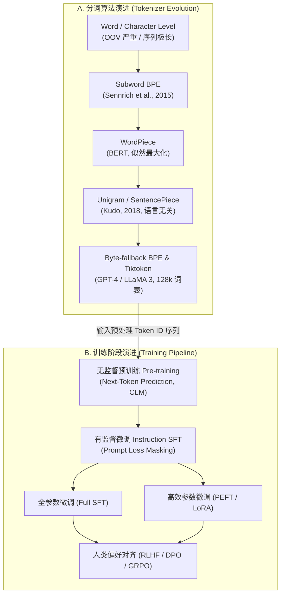
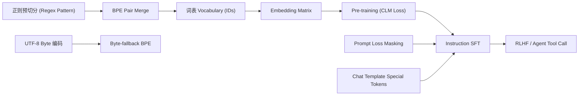

# 1.3 预训练、SFT 与 Tokenizer 详解

> **摘要**：大语言模型（LLM）的语言理解与生成能力建构于三大核心基础之上：**离散文本到向量空间的映射桥梁（Tokenizer）**、**海量无监督文本的基座预训练（Pre-training）**，以及**对齐人类指令意图的有监督微调（Supervised Fine-Tuning, SFT）**。本文将从文本切分演进路线切入，硬核剖析 Byte-Pair Encoding (BPE) 算法推导、SFT 阶段关键的 Prompt Loss Masking 数学原理，并配合 Python 手写 BPE 训练器与 PyTorch SFT Data Collator 进行实战验证。

---

## 📖 1. 导言与背景

自然语言处理（NLP）在迈向大模型时代前，长期面临离散符号（Text Tokens）与连续高维向量空间（Embedding Space）之间的表征映射难题。

1. **Word2Vec 与 Word-level 时代**：早期的 Word2Vec / GloVe 采用词级别（Word-level）切分。在英语中，由于时态、单复数变体极多（如 `look`, `looking`, `looked`），词表暴增至数百万仍无法解决未登录词（Out-Of-Vocabulary, OOV）问题；而在中文等无自然空格分隔的语言中，极度依赖分词工具（如 Jieba），分词错误会直接在后续模型中累积传播。
2. **Subword BPE 的突破**：以 Byte-Pair Encoding (BPE) 为代表的子词切分算法，将高频词保持完整、低频词拆分为子词单位（如 `un` + `believable`），成功将词表大小控制在万级到十万级之间，实现词表灵活性与表征效率的最佳平衡。
3. **无监督预训练 (Unsupervised Pre-training)**：大模型通过在海量 Unlabeled 数据（万亿级 Tokens）上执行自回归因果语言建模（Causal Language Modeling, CLM），学会预测下一个 Token（Next-Token Prediction），在神经网络参数中隐式压缩并构建了关于世界知识的统计概率模型。
4. **有监督指令微调 (Instruction SFT)**：预训练模型具备极其强大但不可控的“文本接续”能力。为了让模型成为听懂人类指令的“助手”，需要使用高质量 Prompt-Response 对进行 SFT 训练。在此阶段，**Prompt Loss Masking（掩码损失计算）** 是确保模型学会“回答”而非“背诵问题”的核心机制。

---

## 🌳 2. 演进分支树 (Mermaid Graph)

下列 Mermaid 架构图展示了词表切分算法与模型训练范式的双轨演进路径：



---

## 🕸️ 3. 知识网格与图谱依赖

### 依赖关系分析 (Degree Table)

| 入度 (Prerequisites) | 本章核心内容 (Current Node) | 出度 (Downstream Concepts) |
| :--- | :--- | :--- |
| **文本清洗与正则切分** (Regex Tokenization) | **BPE Pair Frequency Merge 算法** | **RLHF / DPO 偏好对齐** (Reward Modeling) |
| **UTF-8 Byte 字符编码** (Byte-fallback) | **Prompt Loss Masking 数学推导** | **Agent 结构化输出** (JSON / Tool Call Special Tokens) |
| **Cross-Entropy Loss** (交叉熵损失) | **SFT Data Collator 设计与实战** | **长上下文扩展** (Long Context Scaling) |

### 知识拓扑图



---

## 🧮 4. 数学推导与硬核机制

### 4.1 BPE 词表合并算法推导

设训练语料词频集合为 $\mathcal{D} = \{(w_1, f_1), (w_2, f_2), \dots, (w_N, f_N)\}$，初始状态下将所有词拆分为字符序列（再加上序列结尾符 `</w>`）。

1. **统计相邻字节对频率**：对任意连续两个 Token $(t_i, t_j)$，计算其全语料加权出现频率：
   $$
   \text{Freq}(t_i, t_j) = \sum_{k=1}^{N} f_k \times \text{Count}_{(t_i, t_j)}(w_k)
   $$
2. **贪心选择最大频率对**：
   $$
   (t_A^*, t_B^*) = \arg\max_{(t_i, t_j)} \text{Freq}(t_i, t_j)
   $$
3. **合并并扩展词表**：新建新 Token $t_{\text{new}} = t_A^* t_B^*$，加入词表 $\mathcal{V} \leftarrow \mathcal{V} \cup \{t_{\text{new}}\}$，并在全语料中将所有连续的 $(t_A^*, t_B^*)$ 替换为 $t_{\text{new}}$。重复该过程直至达到目标词表大小 $V_{\text{target}}$。

---

### 4.2 SFT Prompt Loss Masking 数学公式

在 Pre-training 阶段，训练目标是针对整个序列 $X = (x_1, x_2, \dots, x_T)$ 计算标准因果交叉熵：

$$
\mathcal{L}_{\text{Pretrain}}(\theta) = -\sum_{t=1}^{T} \log P_\theta(x_t \mid x_{<t})
$$

而在 SFT 阶段，样本由 **Prompt ($X$)** 和 **Response ($Y$)** 拼接而成：符合格式 $S = (x_1, \dots, x_m, y_1, \dots, y_n)$。

如果对 Prompt 部分也计算 Loss，模型容易强行背诵 User 的输入句式而非专注学习 Response 的生成逻辑。因此，必须引入掩码矩阵 $M_t \in \{0, 1\}$：

$$
M_t = \begin{cases} 
0, & \text{if } t \le m \quad (\text{Prompt / Instruction Tokens}) \\
1, & \text{if } m < t \le m+n \quad (\text{Response / Answer Tokens})
\end{cases}
$$

SFT 阶段的加权 Masked Cross-Entropy Loss 公式为：

$$
\mathcal{L}_{\text{SFT}}(\theta) = -\frac{1}{\sum_{t=1}^{T} M_t} \sum_{t=1}^{T} M_t \cdot \log P_\theta(S_t \mid S_{<t})
$$

在 PyTorch 中，实现 Prompt Loss Masking 的标准机制是将 Prompt 部分的 Target Token ID 设置为特殊标记 `-100`（即 `torch.nn.CrossEntropyLoss(ignore_index=-100)`）。

---

## 🔥 5. 连环面试追问 (Level 1~6 Onion Chain)

> [!TIP]
> 逐层递进的面试追问链涵盖了 Tokenizer 机制、语言压缩率比值、Loss Masking 实现细节与超大词表带来的显存/吞吐量权衡。

### Level 1: 为什么大模型不直接用 Character 或 Word 作为输入，而要用 Subword (BPE)？
* **回答重点**：
  * **Word-level** 缺点：词表极大（数十万到数百万），无法处理未登录词（OOV），存在严重的数据稀疏性问题。
  * **Character-level** 缺点：序列长度会增加 3~5 倍，Transformer 的 Attention 计算复杂度是 $O(N^2)$，极大拖慢训练与推理速度；且单个字符语义过于稀疏。
  * **Subword (BPE)** 优势：兼具两者的优点，高频词作为一个整体 Token 保持极短序列，低频词拆分为子词碎片（甚至退化为 Byte），从根本上消除了 OOV 现象。

### Level 2: 为什么中英文混合训练时，中文往往比英文消耗更多 Token？如何缓解？
* **回答重点**：
  * **根源（Byte 碎片化）**：早期 Tokenizer（如 GPT-2/3、LLaMA 1/2）训练语料中英文占比超过 90%，中文字符在 UTF-8 中编码为 3 个字节。若 BPE 词表中未充分收录中文词汇，一个中文字符常被切分为 2~3 个 Byte Token。
  * **影响**：中文压缩率极低（英文一个 Token 平均 4 个字母，中文一个 Token 可能仅 0.5 个汉字），导致相同的中文文本消耗数倍 Context Window，且推理吞吐量急剧下降。
  * **缓解方案**：扩展中文词表（如 Qwen、LLaMA 3、DeepSeek），在预训练前对中文语料进行专门的词表扩充与 BPE 训练。

### Level 3: 在 SFT 训练时，如果不加 Prompt Loss Masking 会产生什么后果？
* **回答重点**：
  * **梯度污染与任务偏移**：若对 Prompt 部分计算 Loss，模型梯度会分配很大一部分权重去“记忆”用户提问的语法结构和特定词汇，导致模型在推理阶段过拟合 Prompt 的句型，无法产生多样化、高质量的回答。
  * **计算资源浪费**：Backpropagation 在 Prompt 阶段产生不必要的梯度更新。屏蔽 Prompt Loss 可显著提高收敛效率与对齐质量。

### Level 4: Chat Template Special Tokens 的底层作用机制是什么？
* **回答重点**：
  * 大模型本质是单向文本接续生成器，无法区分“谁在说话”。
  * 通过插入特殊 Token（如 `<|im_start|>user\nHello!<|im_end|>\n<|im_start|>assistant\n`），特殊 Token 在 Attention Matrix 中扮演“对话边界符”的角色，指示 Transformer 层在注意力机制中隔离用户输入与系统助手回答，确保模型精确感知对话上下文角色。

### Level 5: LLaMA 3 为什么将词表从 LLaMA 2 的 32k 扩大到 128k？产生了什么影响？
* **回答重点**：
  * **收益**：
    1. **文本压缩率（Compression Ratio）极大提升**：序列平均长度缩短 15%~20%，显著节省 KV Cache 显存占用并提升 Inference 吞吐量。
    2. **多语言与代码能力增强**：更加均衡地覆盖非英语语料与代码结构。
  * **代价（Trade-off）**：
    1. **Embedding Matrix 参数暴涨**：$128,000 \times d_{\text{model}}$，当 $d_{\text{model}}=4096$ 时，单个 Embedding 层占用参数约 5.2 亿（全精度约 1GB 显存）。
    2. **Softmax 计算与 Logits 输出开销增加**：最终 Output Head 层分类计算量增加 4 倍。

### Level 6: 在具有多轮对话与复杂 Tool Call 的 SFT 场景中，如何精确构造 Data Collator 的 Mask 矩阵？
* **回答重点**：
  * 对多轮对话序列：`[User 1] -> [Assistant 1] -> [User 2] -> [Assistant 2]`
  * **Masking 策略**：只有 `Assistant 1` 和 `Assistant 2` 的内容（以及必要的结束符 `<|im_end|>`）Mask 设置为 `1`（Target 保持原 ID），而 `User 1`、`User 2` 以及系统提示词 `System` 的 Mask 必须全部设为 `0`（Target 替换为 `-100`）。
  * 对 **Tool Call** 场景：模型产生的 `Tool Calls` JSON 预测需要计算 Loss（Target 保留），而外部环境返回的 `Tool Output / Observation` 属于环境反馈，必须被 Mask 掉（Target 设置为 `-100`）。

---

## 💻 6. PyTorch & Python 算法实战

### 6.1 纯 Python 实现简易 BPE 训练器

以下代码展示了 BPE 算法的核心逻辑：统计 Frequency Pair、合并最频繁字节对并更新词表。

```python
import re
from collections import defaultdict

class SimpleBPETrainer:
    def __init__(self, vocab_size: int):
        self.vocab_size = vocab_size
        self.merges = {}  # (p1, p2) -> merged_token
        self.vocab = []

    def get_stats(self, corpus_words):
        pairs = defaultdict(int)
        for word, freq in corpus_words.items():
            symbols = word.split()
            for i in range(len(symbols) - 1):
                pairs[(symbols[i], symbols[i + 1])] += freq
        return pairs

    def merge_vocab(self, pair, corpus_words):
        bigram = re.escape(' '.join(pair))
        pattern = re.compile(r'(?<!\S)' + bigram + r'(?!\S)')
        new_corpus = {}
        replacement = ''.join(pair)
        for word in corpus_words:
            w_out = pattern.sub(replacement, word)
            new_corpus[w_out] = corpus_words[word]
        return new_corpus

    def train(self, texts: list[str]):
        # 1. 初始切分为字符序列并加 </w>
        corpus_words = defaultdict(int)
        for text in texts:
            for word in text.split():
                chars = ' '.join(list(word)) + ' </w>'
                corpus_words[chars] += 1

        num_merges = self.vocab_size - 256  # 假设基础字符集
        for i in range(num_merges):
            pairs = self.get_stats(corpus_words)
            if not pairs:
                break
            best_pair = max(pairs, key=pairs.get)
            corpus_words = self.merge_vocab(best_pair, corpus_words)
            self.merges[best_pair] = ''.join(best_pair)
            print(f"Merge #{i+1}: {best_pair} -> {''.join(best_pair)} (Freq: {pairs[best_pair]})")

# 运行测试
if __name__ == "__main__":
    sample_text = ["hug tree hugger hugging hugs", "learning bpe tokenizer is fun"]
    trainer = SimpleBPETrainer(vocab_size=260)
    trainer.train(sample_text)
```

---

## 6.2 PyTorch SFT Data Collator (含 Prompt Loss Masking)

在实际的大模型微调框架（如 LLaMA-Factory / DeepSpeed / HuggingFace Trainer）中，Data Collator 负责接收格式化后的 Prompt-Response 列表，将其转换为带 `labels` 的 Tensor，其中 Prompt 位置填 `-100`。

```python
import torch
from dataclasses import dataclass
from typing import List, Dict, Any

@dataclass
class SFTDataCollatorWithLossMasking:
    tokenizer: Any
    pad_token_id: int = 0
    ignore_index: int = -100

    def __call__(self, instances: List[Dict[str, List[int]]]) -> Dict[str, torch.Tensor]:
        """
        instances 中的每一项包含:
        - 'prompt_ids': List[int]
        - 'response_ids': List[int]
        """
        input_ids_batch = []
        labels_batch = []

        for instance in instances:
            prompt = instance['prompt_ids']
            response = instance['response_ids']
            
            # 1. 拼接 Input IDs
            input_ids = prompt + response
            
            # 2. 构造 Labels: Prompt 部分掩码为 ignore_index (-100)，Response 保留原 ID
            labels = [self.ignore_index] * len(prompt) + list(response)
            
            input_ids_batch.append(torch.tensor(input_ids, dtype=torch.long))
            labels_batch.append(torch.tensor(labels, dtype=torch.long))

        # 3. Dynamic Padding
        padded_input_ids = torch.nn.utils.rnn.pad_sequence(
            input_ids_batch, batch_first=True, padding_value=self.pad_token_id
        )
        padded_labels = torch.nn.utils.rnn.pad_sequence(
            labels_batch, batch_first=True, padding_value=self.ignore_index
        )

        # 4. 构造 Attention Mask (Padding 位置为 0，其余为 1)
        attention_mask = padded_input_ids.ne(self.pad_token_id).long()

        return {
            "input_ids": padded_input_ids,
            "labels": padded_labels,
            "attention_mask": attention_mask
        }

# 单元测试验证
if __name__ == "__main__":
    collator = SFTDataCollatorWithLossMasking(tokenizer=None, pad_token_id=0, ignore_index=-100)
    batch_samples = [
        {"prompt_ids": [101, 205, 308], "response_ids": [401, 502, 102]},
        {"prompt_ids": [101, 500], "response_ids": [601, 102]}
    ]
    batch = collator(batch_samples)
    print("Padded Input IDs:\n", batch["input_ids"])
    print("Padded Labels (Prompt masked as -100):\n", batch["labels"])
    print("Attention Mask:\n", batch["attention_mask"])
```

---

## 🔗 7. 扩展学习与多维资源

### 🎬 视频教程推荐
* **Andrej Karpathy**: *Let's build the GPT Tokenizer* ([YouTube Video](https://www.youtube.com/watch?v=zduSFxRajkE))
  * `00:15:00` - UTF-8 Byte 级别切分原理与拆解
  * `00:42:00` - 手把手实现 BPE merge 循环
  * `01:15:00` - Special Tokens (`<|endoftext|>`) 与 Tiktoken 深度解析

### 📄 经典论文与技术报告
1. **Neural Machine Translation of Rare Words with Subword Units** (Sennrich et al., 2015) — BPE 首次引入 NLP 领域 [arXiv:1508.07909](https://arxiv.org/abs/1508.07909)
2. **SentencePiece: A simple and language independent subword tokenizer** (Kudo & Richardson, 2018) [arXiv:1808.06226](https://arxiv.org/abs/1808.06226)
3. **The Llama 3 Herd of Models** (Meta, 2024) — 包含 128k Tiktoken 词表优化细节 [arXiv:2407.21783](https://arxiv.org/abs/2407.21783)

### 🐙 开源仓库 anchor
* [OpenAI Tiktoken 官方 GitHub 仓库](https://github.com/openai/tiktoken)
* [HuggingFace Tokenizers 库](https://github.com/huggingface/tokenizers)
