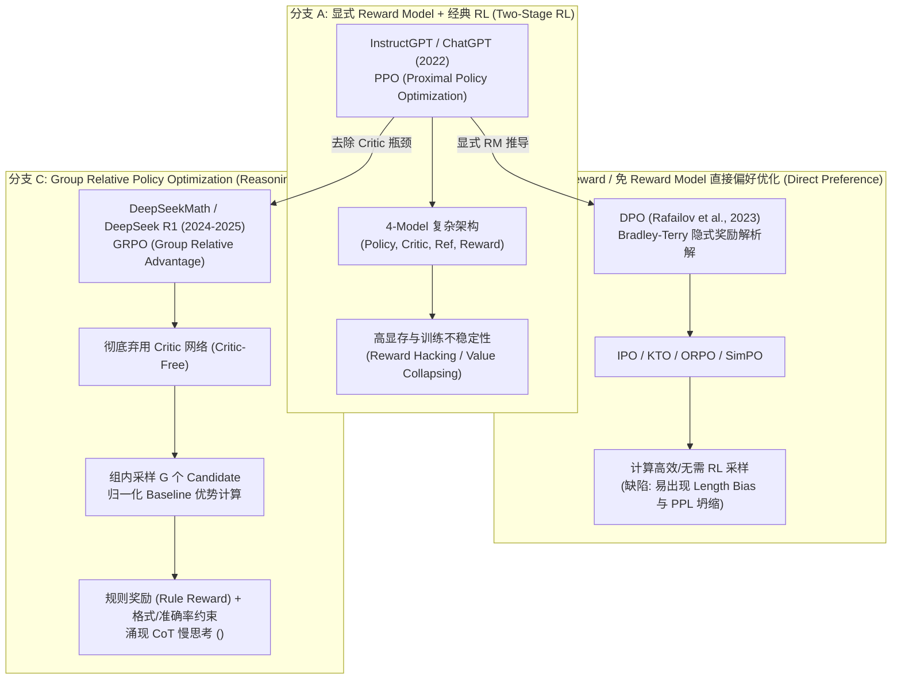

# 1.4 强化学习 RLHF, DPO 与 GRPO (DeepSeek R1)

> **摘要**：经过有监督微调（SFT）的大模型虽然能够模仿指令格式进行回答，但在面对复杂推理、安全性约束以及多轮对齐时，往往容易产生**幻觉（Hallucination）**、**盲目迎合（Sycophancy）** 与 **分布外泛化能力不足**。强化学习（Reinforcement Learning, RL）通过将模型视为 Agent，将生成文本动作化，引入标量奖励函数，彻底打破了传统 Cross-Entropy 损失逐 Token 硬匹配的桎梏。本文硬核解析从经典 **PPO (Proximal Policy Optimization)** 到隐式偏好优化 **DPO (Direct Preference Optimization)**，再到 DeepSeek R1 / DeepSeek Math 引爆大模型推理革命的 **GRPO (Group Relative Policy Optimization)** 的演进逻辑，推导其数学本源，并提供完整 PyTorch 实战实现。

---

## 📖 1. 导言与背景

在大语言模型（LLM）的生命周期中，预训练（Pre-training）赋予模型海量的世界知识，有监督微调（SFT）使模型掌握特定指令模版与对话范式。然而，单纯依赖基于 Maximum Likelihood Estimation (MLE) 的 SFT 存在天然缺陷：

1. **Exposure Bias（暴露偏差）与 Error Accumulation（错误累积）**：SFT 在训练阶段依赖 Teacher Forcing，而在推理阶段模型自回归生成 Token 时，先前的错误预测会被当作上下文输入给下一个 Token，导致误差指数级累积。
2. **Surface Form Competition（表面形式竞争）与模式坍缩**：对于同一数学问题或推理逻辑，正确答案的表达方式可能成千上万。MLE 强制模型精准预测训练集中指定的特定 Token 序列，严重限制了模型的自主解题视角与泛化探究。
3. **人类偏好对齐（Alignment）与安全性**：安全（Helpful & Harmless）、事实性（Factuality）等复杂指标无法用简单逐词 Cross-Entropy 衡量，需要通过标量奖励信号来调控模型输出的整体分布。
4. **推理与慢思考能力的涌现（Reasoning Emergence）**：在 DeepSeek R1-Zero 的实验中，纯粹基于 Rule-based Reward 的强化学习训练驱动模型自发涌现了长 Chain-of-Thought (`<think>`)、自我纠错（Self-Correction）、反思与多路径试错能力，标志着 RL 从单纯的“偏好风格对齐”跨越至“高等认知推理能力构建”的核心支柱。

---

## 🌳 2. 演进分支树 (Mermaid Graph)

下列 Mermaid 架构图详细梳理了大模型强化学习算法的演进主线：



---

## 🕸️ 3. 知识网格与图谱依赖

### 前置知识 (In-Degree)
- **SFT Model ($\pi_{\text{sft}}$)**：强化学习策略模型的初始权重基准。
- **Policy Model ($\pi_\theta$)**：正在被训练更新生成 Response 的自回归模型。
- **Reference Model ($\pi_{\text{ref}}$)**：用于计算 KL 散度约束、防止策略漂移的冻结模型。
- **Reward Model ($r_\psi$)**：评估 Prompt-Response 标量得分的判别模型或规则校验器。
- **Bradley-Terry Preference Model**：两两成对偏好概率建模的概率论基础。

### 后续延伸 (Out-Degree)
- **DeepSeek R1 / Reasoning Models**：突破复杂逻辑、代码、数学推理上界。
- **Self-Correction & Agent Reflection**：模型在生成过程中动态检测并修正前文逻辑错误。
- **Autonomous Agent Tool-Use Policy**：多步骤环境交互中离散 Action 的长期回报优化。

| 概念节点 | 上游依赖 (In-Degree) | 下游应用 (Out-Degree) | 核心算法/公式 |
| :--- | :--- | :--- | :--- |
| **PPO-KL** | SFT Model, Reward Model | LLM 偏好安全对齐 | $\min(r_t \hat{A}_t, \text{clip}(r_t, 1-\epsilon, 1+\epsilon)\hat{A}_t) - \beta D_{\text{KL}}$ |
| **DPO** | Bradley-Terry Model, SFT | 低资源高效偏好对齐 | $-\log \sigma \left( \beta \log \frac{\pi_\theta(y_w|x)}{\pi_{\text{ref}}(y_w|x)} - \beta \log \frac{\pi_\theta(y_l|x)}{\pi_{\text{ref}}(y_l|x)} \right)$ |
| **GRPO** | Group Sampling, Rule Reward | DeepSeek R1 慢思考 Reasoning | $A_i = \frac{r_i - \text{mean}(r)}{\text{std}(r)}$，无 Critic 显存开销 |

---

## 🧮 4. 数学推导与硬核机制

### 4.1 PPO 中的 KL 散度约束与 Clip 目标函数

在经典 RLHF 范式中，最大化标量奖励 $r_\psi(x, y)$ 的同时，必须防止策略模型 $\pi_\theta$ 偏离原始人类表达能力基准（即防止 **Reward Hacking**，如重复生成无意义高分词汇或极端文本）。强化学习的目标函数定义为：

$$
\max_{\theta} \mathbb{E}_{(x, y) \sim \pi_\theta} \left[ r_\psi(x, y) \right] - \beta D_{\text{KL}}(\pi_\theta(y|x) \parallel \pi_{\text{ref}}(y|x))
$$

其中 KL 散度可以逐 Token 展开为离散概率的比值开方或对数差值：

$$
R_{\text{total}}(x, y) = r_\psi(x, y) - \beta \sum_{t=1}^{T} \left( \log \pi_\theta(y_t | x, y_{<t}) - \log \pi_{\text{ref}}(y_t | x, y_{<t}) \right)
$$

在 Actor 网络训练中，采用 PPO 的 **Clipped Surrogate Objective**：

$$
\mathcal{L}_{\text{PPO-Actor}}(\theta) = \hat{\mathbb{E}}_t \left[ \min \left( r_t(\theta) \hat{A}_t, \, \text{clip}(r_t(\theta), 1-\epsilon, 1+\epsilon) \hat{A}_t \right) \right]
$$

其中策略概率比值为：

$$
r_t(\theta) = \frac{\pi_\theta(y_t | x, y_{<t})}{\pi_{\theta_{\text{old}}}(y_t | x, y_{<t})}
$$

---

### 4.2 DPO 隐式 Reward 完整推导（从 Bradley-Terry 模型到 DPO）

DPO (Direct Preference Optimization) 的核心突破在于：**通过代数变换，直接用 Policy Model 和 Reference Model 的概率比值替换显式 Reward Function，实现了无需 Reward Model 和 RL 采样的纯监督二元交叉熵优化。**

#### 步骤 1：显式 Reward 策略的最优解表达

在带 KL 散度约束的偏好优化问题中，寻找最优策略 $\pi^*$:

$$
\max_{\pi} \mathbb{E}_{x \sim \mathcal{D}, y \sim \pi(\cdot|x)} \left[ r(x, y) \right] - \beta D_{\text{KL}}(\pi(y|x) \parallel \pi_{\text{ref}}(y|x))
$$

展开 KL 散度定义：

$$
\int \pi(y|x) r(x, y) dy - \beta \int \pi(y|x) \log \frac{\pi(y|x)}{\pi_{\text{ref}}(y|x)} dy = -\beta \int \pi(y|x) \log \frac{\pi(y|x)}{\pi_{\text{ref}}(y|x) \exp\left( \frac{1}{\beta} r(x, y) \right)} dy
$$

定义归一化配分函数（Partition Function） $Z(x) = \sum_y \pi_{\text{ref}}(y|x) \exp\left( \frac{1}{\beta} r(x, y) \right)$，式中积分可改写为标准 KL 散度格式：

$$
= -\beta D_{\text{KL}} \left( \pi(y|x) \, \parallel \, \frac{\pi_{\text{ref}}(y|x) \exp\left( \frac{1}{\beta} r(x, y) \right)}{Z(x)} \right) + \beta \log Z(x)
$$

由于 KL 散度是非负的（当且仅当两分布完全一致时为 0），当策略 $\pi(y|x) = \pi^*(y|x)$ 时，极值取到：

$$
\pi^*(y|x) = \frac{\pi_{\text{ref}}(y|x) \exp\left( \frac{1}{\beta} r(x, y) \right)}{Z(x)}
$$

#### 步骤 2：对数变换与 Reward 隐式反解

两边取对数并移项，得到隐式 Reward $r(x, y)$ 与概率分布 $\pi^*$ 之间的精确映射关系：

$$
\log \frac{\pi^*(y|x)}{\pi_{\text{ref}}(y|x)} = \frac{1}{\beta} r(x, y) - \log Z(x)
$$

$$
\implies r(x, y) = \beta \log \frac{\pi^*(y|x)}{\pi_{\text{ref}}(y|x)} + \beta \log Z(x)
$$

#### 步骤 3：代入 Bradley-Terry 偏好模型

Bradley-Terry 偏好概率模型表示人类对胜出回答 $y_w$ 优于败者回答 $y_l$ 的条件概率：

$$
P(y_w \succ y_l | x) = \sigma \left( r(x, y_w) - r(x, y_l) \right)
$$

将步骤 2 推导出的隐式 Reward 表达式代入：

$$
r(x, y_w) - r(x, y_l) = \left( \beta \log \frac{\pi_\theta(y_w|x)}{\pi_{\text{ref}}(y_w|x)} + \beta \log Z(x) \right) - \left( \beta \log \frac{\pi_\theta(y_l|x)}{\pi_{\text{ref}}(y_l|x)} + \beta \log Z(x) \right)
$$

注意！归一化项 $\beta \log Z(x)$ 在相减过程中被**完美抵消**：

$$
r(x, y_w) - r(x, y_l) = \beta \log \frac{\pi_\theta(y_w|x)}{\pi_{\text{ref}}(y_w|x)} - \beta \log \frac{\pi_\theta(y_l|x)}{\pi_{\text{ref}}(y_l|x)}
$$

#### 步骤 4：构建最终 DPO Loss 目标函数

将上式代入负对数似然损失中，即得到简洁优雅的 DPO 损失函数：

$$
\mathcal{L}_{\text{DPO}}(\theta; \pi_{\text{ref}}) = -\mathbb{E}_{(x, y_w, y_l) \sim \mathcal{D}} \left[ \log \sigma \left( \beta \log \frac{\pi_\theta(y_w|x)}{\pi_{\text{ref}}(y_w|x)} - \beta \log \frac{\pi_\theta(y_l|x)}{\pi_{\text{ref}}(y_l|x)} \right) \right]
$$

---

### 4.3 GRPO 组内相对优势计算 (Group Relative Advantage)

在 DeepSeekMath 与 DeepSeek R1 架构中，针对数学和编程等具备明确标准答案（Ground Truth）或自动化测试用例的任务，传统的 PPO 面临两个核心难题：
1. **Critic 模型极其庞大**：在 LLM 规模下，单独维持一个与 Policy 同等体积的 Value/Critic 模型会导致显存占用翻倍、通信延迟加剧。
2. **Value 函数估计准确度低**：对文本生成的多步骤 Token 序列建模全局 State-Value $V(s)$ 难度极大。

GRPO (Group Relative Policy Optimization) 摒弃了传统的 Critic 网络。其核心机制在于：对于每个 Prompt $x$，让当前 Policy $\pi_{\theta_{\text{old}}}$ 独立采样生成一个包含 $G$ 个候选回答的组（Group）：

$$
\{y_1, y_2, \dots, y_G\} \sim \pi_{\theta_{\text{old}}}(\cdot | x)
$$

由 Reward 函数（例如 Python 代码运行结果、数学解析计算结果等 Rule-based Reward）给组内每个回答评定标量分数 $\{r_1, r_2, \dots, r_G\}$。组内样本的优势值 $A_i$ 直接通过组内均值和标准差归一化得到：

$$
A_i = \frac{r_i - \text{mean}(\{r_1, \dots, r_G\})}{\text{std}(\{r_1, \dots, r_G\}) + \epsilon}
$$

GRPO 的总优化目标函数包含 Clip 代理损失与逐 Token 的 KL 散度正则：

$$
\mathcal{L}_{\text{GRPO}}(\theta) = -\frac{1}{G} \sum_{i=1}^{G} \frac{1}{|y_i|} \sum_{t=1}^{|y_i|} \min \left( \frac{\pi_\theta(y_{i,t}|x, y_{i,<t})}{\pi_{\theta_{\text{old}}}(y_{i,t}|x, y_{i,<t})} A_i, \, \text{clip}\left( \frac{\pi_\theta(y_{i,t}|x, y_{i,<t})}{\pi_{\theta_{\text{old}}}(y_{i,t}|x, y_{i,<t})}, 1-\epsilon, 1+\epsilon \right) A_i \right) + \beta D_{\text{KL}}(\pi_\theta \parallel \pi_{\text{ref}})
$$

> [!NOTE]
> **为什么 GRPO 归一化后不需要 Critic？**
> 在传统 Reinforcement Learning 中，Baseline $V(s)$ 的作用是降低梯度的方差（Variance Reduction）。GRPO 利用“组内多样本采样的平均表现”作为天然的相对 Baseline，高于组内平均水平的回答获得正向 Advantage，低于平均水平的获得负向 Advantage，从而在不依赖 Value 函数拟合的前提下极度稳定了梯度估计。

---

## 🔥 5. 连环面试追问 (Level 1~6 Onion Chain)

### L1 追问：PPO 训练中为什么要引入 Reference Model $\pi_{\text{ref}}$ 并加上 KL 散度惩罚？
> **答**：
> 1. **防止 Reward Hacking（奖励篡改/抢分）**：显式 Reward Model 是一个非完美的判别神经网络，存在漏洞。如果没有 KL 约束，Policy 会迅速脱离真实文本分布，通过重复特定高分 Token 或拼接无意义字符欺骗 RM 获得极高分数（例如生成极长重复赞美词）。
> 2. **保持语言本底分布**：维持 Policy 的语言表征能力与通用流畅度，防止因过拟合单一 RL 奖励而丧失基座预训练和 SFT 积累的多样化语言知识。

### L2 追问：为什么 PPO 训练需要同时维护 4 个模型？对显存与分布式训练挑战何在？
> **答**：
> 1. **4 模型构成**：
>    - **Actor Model ($\pi_\theta$)**：策略模型，待优化的自回归生成模型。
>    - **Critic Model ($V_\phi$)**：价值模型，预测状态价值 $V(s)$ 辅助计算 GAE 优势。
>    - **Reference Model ($\pi_{\text{ref}}$)**：冻结基准模型，用于逐 Token KL 散度计算。
>    - **Reward Model ($r_\psi$)**：判别模型，评估生成 Sequence 的标量 Reward。
> 2. **显存与通信挑战**：在 70B 参数规模下，4 模型全量加载需要庞大的显存（即使 Ref 和 RM 冻结，仍需占用 Weights 显存）。PPO 循环在 Rollout 采样阶段（Generation 密集）与 SGD 优化阶段（Backward 密集）之间频繁交替，计算图切换频繁，导致 GPU 利用率低、多卡/多节点通信开销巨大。

### L3 追问：DPO 是如何通过数学推导把 Reward Model 直接消掉的？DPO 有什么潜在缺陷？
> **答**：
> 1. **消去 RM 原理**：DPO 证明了在带 KL 散度约束的极值问题中，最优策略 $\pi^*$ 与隐式 Reward $r(x,y)$ 存在显式 Log-Likelihood Ratio 的一对一映射。代入 Bradley-Terry 成对偏好模型后，配分函数 $Z(x)$ 在胜败对比中相减抵消，从而可以直接用概率比值表达偏好损失。
> 2. **DPO 缺陷**：
>    - **Length Bias（长度偏好过度增益）**：由于对数概率累加特征，DPO 倾向于过度奖励更长的回答，导致模型生成冗长不简练的回复。
>    - **PPL Collapse / Out-of-Distribution 风险**：当 $y_w$ 概率接近 1 时，DPO 的隐式 Reward 增益梯度会迅速衰减（Log-sigmoid 饱合），但在训练数据外的 Token 容易产生错误的负向推挤，导致概率分布失真。

### L4 追问：DeepSeek R1 采用的 GRPO 是如何做到彻底去掉 Critic 网络的？为什么在数学推理场景下效果极佳？
> **答**：
> 1. **去 Critic 机制**：GRPO 对每个 Prompt 一口气采样 $G$ 个不同的 Candidate Response。以这 $G$ 个 Response 的标量 Reward 均值作为基准 Baseline、标准差作为缩放因子，计算组内相对优势 $A_i$。组内相对评价直接扮演了传统 Baseline $V(s)$ 的角色。
> 2. **数学推理适用性**：数学和代码任务具有**离散且确定性的 True/False 规则奖励（Rule-based Reward）**。GRPO 的 Group 对比使得只要 $G$ 个采样中有一个回答踩中了正确推理路径与正确结果，就能给该候选赋予极高正优势，同时压制组内错误路径，快速引导模型在探索中锁定标准解题格式与逻辑。

### L5 追问：DeepSeek R1-Zero 为什么能纯靠强化学习（Rule-based Reward）涌现出 `<think>` 慢思考与 Self-Correction 能力？
> **答**：
> 1. **试错与长序列奖励增益**：R1-Zero 的 Reward 函数极简，仅验证**结果正确性**与**格式规范性**。为了在复杂难题上提高获得奖励概率，策略模型在自回归探索中发现：在最终答案前生成长推导链（CoT）能够显著提高最终算对的概率。
> 2. **探索（Exploration）的自然演进**：GRPO 的组内相对优势计算在多次迭代后，将正向梯度集中在包含“自我检测”（如：“Wait, let me double check this equation...”）的生成轨迹上。模型在不提供任何 Prompt 演示的前提下，自发演化出顿悟（Aha Moment）、回溯验证与重新推理等高级慢思考能力。

---

## 💻 6. PyTorch 算法实战

### 6.1 手写 Standalone DPOLoss PyTorch 模块

```python
import torch
import torch.nn as nn
import torch.nn.functional as F


class DPOLoss(nn.Module):
    """
    Direct Preference Optimization (DPO) Loss Module.
    Ref: Rafailov et al., 2023 (https://arxiv.org/abs/2305.18290)
    """
    def __init__(self, beta: float = 0.1, label_smoothing: float = 0.0):
        super().__init__()
        self.beta = beta
        self.label_smoothing = label_smoothing

    def _get_batch_logps(
        self,
        logits: torch.FloatTensor,
        labels: torch.LongTensor,
        average_log_prob: bool = False
    ) -> torch.FloatTensor:
        """
        计算给定 logits 和 labels 的自回归 Token-level 对数概率累加值
        """
        assert logits.shape[:-1] == labels.shape

        # 错位移项计算 Causal Language Modeling 概率
        labels = labels[:, 1:].clone()
        logits = logits[:, :-1, :]

        # 忽略 padding index (假设 -100 为 padding 掩码)
        loss_mask = (labels != -100)

        # 替换 invalid index 防止 gather 崩溃
        labels[labels == -100] = 0

        # 计算 log_softmax 概率
        per_token_logps = torch.gather(
            logits.log_softmax(-1), dim=2, index=labels.unsqueeze(-1)
        ).squeeze(-1)

        if average_log_prob:
            return (per_token_logps * loss_mask).sum(-1) / loss_mask.sum(-1).clamp(min=1.0)
        else:
            return (per_token_logps * loss_mask).sum(-1)

    def forward(
        self,
        policy_chosen_logits: torch.FloatTensor,
        policy_rejected_logits: torch.FloatTensor,
        reference_chosen_logits: torch.FloatTensor,
        reference_rejected_logits: torch.FloatTensor,
        chosen_labels: torch.LongTensor,
        rejected_labels: torch.LongTensor,
    ):
        """
        前向传播计算 DPO 损失与隐式奖励（Implicit Rewards）
        """
        policy_chosen_logps = self._get_batch_logps(policy_chosen_logits, chosen_labels)
        policy_rejected_logps = self._get_batch_logps(policy_rejected_logits, rejected_labels)

        with torch.no_grad():
            reference_chosen_logps = self._get_batch_logps(reference_chosen_logits, chosen_labels)
            reference_rejected_logps = self._get_batch_logps(reference_rejected_logits, rejected_labels)

        # 计算 Policy 与 Reference 的 Log Ratio
        pi_logratios = policy_chosen_logps - policy_rejected_logps
        ref_logratios = reference_chosen_logps - reference_rejected_logps

        logits = pi_logratios - ref_logratios

        # DPO 核心 Sigmoid 损失
        losses = -F.logsigmoid(self.beta * logits) * (1 - self.label_smoothing) - \
                 F.logsigmoid(-self.beta * logits) * self.label_smoothing

        # 计算隐式 Rewards 用于 Monitor 指标追踪
        chosen_rewards = self.beta * (policy_chosen_logps - reference_chosen_logps).detach()
        rejected_rewards = self.beta * (policy_rejected_logps - reference_rejected_logps).detach()

        return losses.mean(), chosen_rewards.mean(), rejected_rewards.mean()


#单元测试验证
if __name__ == "__main__":
    batch_size, seq_len, vocab_size = 2, 16, 1000
    dpo_criterion = DPOLoss(beta=0.1)

    dummy_policy_chosen = torch.randn(batch_size, seq_len, vocab_size)
    dummy_policy_rejected = torch.randn(batch_size, seq_len, vocab_size)
    dummy_ref_chosen = torch.randn(batch_size, seq_len, vocab_size)
    dummy_ref_rejected = torch.randn(batch_size, seq_len, vocab_size)

    labels = torch.randint(0, vocab_size, (batch_size, seq_len))
    labels[:, :3] = -100  # 模拟 Prompt 部分被 Mask

    loss, chosen_r, rejected_r = dpo_criterion(
        dummy_policy_chosen, dummy_policy_rejected,
        dummy_ref_chosen, dummy_ref_rejected,
        labels, labels
    )

    print(f"[DPO Check] Loss: {loss.item():.4f} | Chosen Reward: {chosen_r.item():.4f} | Rejected Reward: {rejected_r.item():.4f}")
```

---

### 6.2 手写 GRPOTrainer 组内 Advantage 算子与 Loss 规范化

```python
import torch
import torch.nn as nn
import torch.nn.functional as F


class GRPOGroupAdvantageCalculator(nn.Module):
    """
    DeepSeek R1 / DeepSeekMath GRPO Group Relative Advantage & Loss Calculator.
    """
    def __init__(self, clip_eps: float = 0.2, kl_beta: float = 0.04):
        super().__init__()
        self.clip_eps = clip_eps
        self.kl_beta = kl_beta

    def compute_group_advantages(self, rewards: torch.FloatTensor, group_size: int) -> torch.FloatTensor:
        """
        rewards: Shape (num_prompts * group_size,)
        将一维平铺的样本重新重构为 (num_prompts, group_size)，在组内计算归一化优势
        """
        assert rewards.numel() % group_size == 0
        num_prompts = rewards.numel() // group_size
        rewards_grouped = rewards.view(num_prompts, group_size)

        # 组内计算 Mean 与 Std
        group_mean = rewards_grouped.mean(dim=-1, keepdim=True)
        group_std = rewards_grouped.std(dim=-1, keepdim=True)

        # 避免除以零
        advantages = (rewards_grouped - group_mean) / (group_std + 1e-8)
        return advantages.view(-1)  # 重新展平为 (B * G,)

    def forward(
        self,
        policy_logps: torch.FloatTensor,      # (B * G, seq_len)
        old_policy_logps: torch.FloatTensor,  # (B * G, seq_len)
        ref_logps: torch.FloatTensor,         # (B * G, seq_len)
        advantages: torch.FloatTensor,        # (B * G,)
        mask: torch.BoolTensor                # (B * G, seq_len) Token-level 响应掩码
    ) -> torch.FloatTensor:
        """
        前向传播计算 GRPO PPO-Style Clip Loss 与 KL 散度正则
        """
        # 1. 策略重要性采样比率 (Probability Ratio)
        # r_t = exp(log_pi - log_pi_old)
        log_ratio = policy_logps - old_policy_logps
        ratio = torch.exp(log_ratio)

        # 2. 优势展平扩维以匹配 Sequence 维度
        adv_expanded = advantages.unsqueeze(-1)  # (B * G, 1)

        # 3. PPO Clipped Surrogate Loss
        surr1 = ratio * adv_expanded
        surr2 = torch.clamp(ratio, 1.0 - self.clip_eps, 1.0 + self.clip_eps) * adv_expanded
        policy_loss = -torch.min(surr1, surr2)  # (B * G, seq_len)

        # 4. 计算逐 Token 的 KL 散度 (Unbiased Estimator: exp(log_ref - log_pi) - (log_ref - log_pi) - 1)
        # 或者简化为: log_pi - log_ref
        kl_div = torch.exp(ref_logps - policy_logps) - (ref_logps - policy_logps) - 1.0

        # 5. 组合总损失
        total_loss = policy_loss + self.kl_beta * kl_div

        # 结合 Mask 计算各样本序列平均损失
        masked_loss = (total_loss * mask).sum(dim=-1) / mask.sum(dim=-1).clamp(min=1.0)
        return masked_loss.mean()


# 单元测试验证
if __name__ == "__main__":
    num_prompts, group_size, seq_len = 2, 4, 32
    total_samples = num_prompts * group_size

    grpo_calc = GRPOGroupAdvantageCalculator(clip_eps=0.2, kl_beta=0.04)

    # 模拟 8 个生成响应的 Rule Reward (如数学测试用例打分 0.0 或 1.0)
    raw_rewards = torch.tensor([1.0, 0.0, 0.0, 1.0,   0.0, 0.0, 0.0, 0.0]) # Prompt 1 采 4 个，Prompt 2 采 4 个

    # 计算组内相对优势
    advantages = grpo_calc.compute_group_advantages(raw_rewards, group_size=group_size)
    print(f"[GRPO Check] Calculated Group Advantages:\n{advantages.view(num_prompts, group_size)}")

    policy_logps = torch.randn(total_samples, seq_len)
    old_policy_logps = policy_logps + torch.randn(total_samples, seq_len) * 0.01
    ref_logps = policy_logps + torch.randn(total_samples, seq_len) * 0.05
    mask = torch.ones(total_samples, seq_len, dtype=torch.bool)

    grpo_loss = grpo_calc(policy_logps, old_policy_logps, ref_logps, advantages, mask)
    print(f"[GRPO Check] Compute Loss: {grpo_loss.item():.4f}")
```

---

## 🔗 7. 扩展学习与多维资源

### 🎬 视频讲解与深度拆解 (YouTube & B站)
- **DeepSeek R1 论文与 GRPO 原理解析**：推荐观看 Unraveling DeepSeek R1 / Math RL Fine-Tuning 剖析。
- **Andrej Karpathy - Intro to Large Language Models (RLHF 章节)**：直观理解 人类反馈强化学习从 SFT 到 Reward Modeling 的全局视阈。

### 📄 必读经典学术论文
1. **InstructGPT (Ouyang et al., 2022)**: *Training language models to follow instructions with human feedback*. [arXiv:2203.02155](https://arxiv.org/abs/2203.02155)
2. **DPO (Rafailov et al., 2023)**: *Direct Preference Optimization: Your Language Model is Secretly a Reward Model*. [arXiv:2305.18290](https://arxiv.org/abs/2305.18290)
3. **DeepSeekMath (Shao et al., 2024)**: *DeepSeekMath: Pushing the Limits of Mathematical Reasoning in Open Language Models*. [arXiv:2402.03300](https://arxiv.org/abs/2402.03300)
4. **DeepSeek-R1 (DeepSeek-AI, 2025)**: *DeepSeek-R1: Incentivizing Reasoning Capability in LLMs via Reinforcement Learning*. [arXiv:2501.12948](https://arxiv.org/abs/2501.12948)

### 🐙 开源框架与代码库锚点
- **HuggingFace TRL (Transformer Reinforcement Learning)**:
  - [`DPOTrainer` 源码实现](https://github.com/huggingface/trl/blob/main/trl/trainer/dpo_trainer.py)
  - [`GRPOTrainer` 源码实现](https://github.com/huggingface/trl/blob/main/trl/trainer/grpo_trainer.py)
