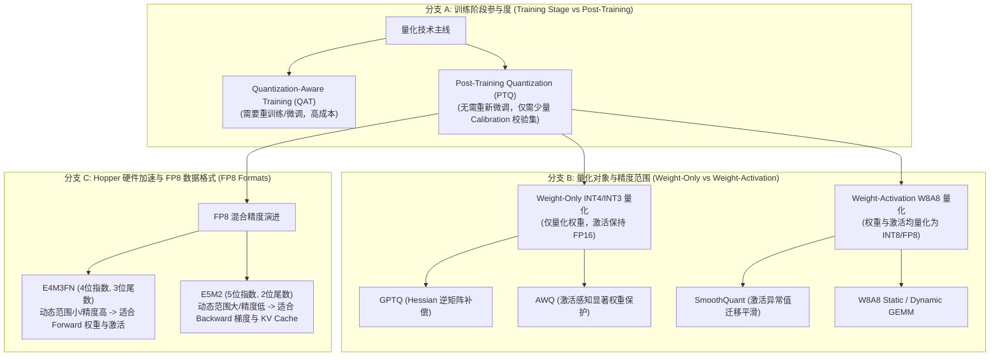

# 1.5 模型量化与推理加速机制

> **摘要**：在百亿乃至千亿参数大语言模型（LLM）的部署落地中，高昂的显存占用与显存带宽瓶颈（Memory-Bound）成为了制约高并发与低延迟推理的主要矛盾。模型量化（Quantization）通过将高精度浮点数（如 FP32/FP16/BF16）映射为低比特数据表示（如 INT8/INT4/FP8），能够成倍降低显存消耗并提升 Tensor Core 计算吞吐。本文硬核解析大模型量化的底层机制：从 Roofline 模型导出的内存瓶颈分析，到均匀对称/非对称量化数学推导，再到解决 13B+ 模型激活异常值（Outliers）的 **SmoothQuant** 异构平滑变换、**AWQ** 显著权重保护机制与 **GPTQ** 二阶 Hessian 矩阵优化；最后探讨 Hopper 架构 FP8 (E4M3/E5M2) 浮点演进，并提供完整的 PyTorch 纯手写量化器与 SmoothQuant 算法实战。

---

## 📖 1. 导言与背景

### 1.1 大模型推理的核心瓶颈：Memory-Bound vs Compute-Bound

在深度学习模型训练中，矩阵乘法（GEMM）通常处理较大的 Batch Size（如 128~512），属于典型的 **计算受限（Compute-Bound）** 任务。然而在 LLM 自回归生成（Decoding Phase）阶段，模型必须逐 Token 进行自回归预测：
- 每次输入序列长度仅为 1（或极小 Batch Size）；
- 必须将千亿参数（例如 70B 模型在 FP16 下占据 140 GB 显存）从 GPU HBM（High Bandwidth Memory）完整加载到片上 SRAM 算子单元中，却只进行一次向量-矩阵乘法（GEMV）。

根据 **Roofline 模型**，算法的计算强度（Operational Intensity）定义为：

$$
\text{Operational Intensity} = \frac{\text{FLOPs (浮点运算次数)}}{\text{Memory Access Bytes (显存访问字节数)}}
$$

对于 $N \times K$ 与 $K \times M$ 的 GEMM 算子：
- 当 $N = 1$（如 Batch Size = 1 的 Decoding 阶段），计算强度为：

$$
I = \frac{2 \times 1 \times K \times M}{2 \times (1 \times K + K \times M + 1 \times M)} \approx \frac{2KM}{2KM} = 1 \; \text{FLOP/Byte}
$$

而主流 GPU（如 NVIDIA H100 SXM5）的算术吞吐量为 $1979 \; \text{TFLOPS}$ (FP16)，显存带宽为 $3.35 \; \text{TB/s}$。算术吞吐与带宽的比值为：

$$
\frac{1979 \times 10^{12}}{3.35 \times 10^{12}} \approx 590 \; \text{FLOPs/Byte}
$$

这意味着，只要计算强度低于 $590 \; \text{FLOPs/Byte}$，GPU 的计算单元大部分时间处于**等待显存数据传输的饥饿状态**。此时决定生成速度的不再是 GPU 的 TFLOPS，而是**显存带宽**！

| 数据精度类型 | 比特位数 (Bits) | 70B 模型权重显存需求 | Batch=1 显存带宽传输效率 | Tensor Core 计算吞吐倍率 |
| :--- | :--- | :--- | :--- | :--- |
| **FP32** | 32 | 280 GB | 基准 ($1\times$) | 基准 ($1\times$) |
| **FP16 / BF16** | 16 | 140 GB | $2\times$ 提升 | $2\times$ 提升 |
| **INT8 / W8A8** | 8 | 70 GB | $4\times$ 提升 | $4\times$ 提升 (INT8 Tensor Core) |
| **INT4 / W4A16** | 4 | 35 GB | $8\times$ 提升 | 带宽传输 $8\times$，计算需 Dequantize |
| **FP8 (E4M3/E5M2)** | 8 | 70 GB | $4\times$ 提升 | $4\times$ 提升 (FP8 Tensor Core) |

---

## 🌳 2. 大模型量化技术演进分支树 (Mermaid Graph)



---

## 🕸️ 3. 知识网格与图谱依赖

### 前置知识 (In-Degree)
- **FP16 / BF16 数据格式**：IEEE 754 浮点数表示法与阶码/尾数分配。
- **Roofline 模型与 GPU 硬件架构**：HBM 显存带宽、SRAM L1/L2 Cache 容量与 NVLink 互联。
- **GEMM / GEMV 矩阵乘法**：CUDA Tensor Core 底层指令（如 `mma.sync`）对数据精度的格式要求。

### 后续延伸 (Out-Degree)
- **vLLM PagedAttention 与 KV Cache 量化**：INT8/FP8 压缩 KV Cache 显存占用以扩大 Page 容量。
- **TensorRT-LLM 算子融合**：Weight-Only INT4 实时反量化 GEMM 算子与 SmoothQuant INT8 融合 Kernel。
- **端侧与消费级部署 (GGUF / Ollama / MLC-LLM)**：k-quants、marlin 算子在消费级显卡（如 RTX 4090）与 Mac M 系列芯片上的落地。

| 概念节点 | 上游依赖 (In-Degree) | 下游应用 (Out-Degree) | 核心算法/原理 |
| :--- | :--- | :--- | :--- |
| **Uniform Quantization** | FP16/FP32 浮点编码 | INT8 线性变换 | $S = \frac{x_{\max} - x_{\min}}{q_{\max} - q_{\min}}$, $Z = \lfloor \frac{-x_{\min}}{S} \rceil$ |
| **SmoothQuant** | Activation Outliers | W8A8 实时推理算子 | $Y = (X \cdot \text{diag}(s)^{-1}) \cdot (\text{diag}(s) \cdot W)$ |
| **AWQ** | Activation Magnitude | INT4 权重保护与反量化 | 按激活量级筛选前 1% 显著权重进行缩放保护 |
| **GPTQ** | Taylor Expansion, Hessian | 极致 INT3/INT4 压缩 | $\mathbf{w}_q^* = \arg\min_{\mathbf{w}_q} (\mathbf{w} - \mathbf{w}_q)^T \mathbf{H} (\mathbf{w} - \mathbf{w}_q)$ |
| **FP8 (E4M3/E5M2)** | Hopper 架构 Tensor Core | H100/B200 原生加速 | 硬件级 FP8 矩阵乘法，无需整数 Zero Point 开销 |

---

## 🧮 4. 数学推导与硬核机制

### 4.1 均匀对称与非对称量化 (Symmetric vs Asymmetric Quantization)

量化映射的目标是将连续浮点数 $x \in [\mathbb{R}_{\text{min}}, \mathbb{R}_{\text{max}}]$ 映射到 $b$-bit 离散整数区间 $[q_{\text{min}}, q_{\text{max}}]$ 中（例如 INT8 取值区间为 $[-128, 127]$ 或 $[0, 255]$）。

#### 1) 均匀非对称量化 (Uniform Asymmetric Quantization)
非对称量化通过缩放因子（Scale Factor, $S$）与零点偏移（Zero Point, $Z$）进行映射：

$$
q = \text{clip}\left( \left\lfloor \frac{x}{S} \right\rceil + Z, \; q_{\text{min}}, \; q_{\text{max}} \right)
$$

其中 $\lfloor \cdot \rceil$ 表示最近取整（Round to Nearest），$\text{clip}(v, l, u) = \max(l, \min(v, u))$。

参数 $S$ 与 $Z$ 的闭式推导公式为：

$$
S = \frac{x_{\text{max}} - x_{\text{min}}}{q_{\text{max}} - q_{\text{min}}}
$$

$$
Z = \left\lfloor \frac{-x_{\text{min}}}{S} \right\rceil + q_{\text{min}}
$$

**反量化（Dequantization）恢复公式**：

$$
\hat{x} = S \cdot (q - Z)
$$

#### 2) 均匀对称量化 (Uniform Symmetric Quantization)
对称量化强制映射后的零点对应连续域中的 $0$，即 $Z = 0$。映射区间对称设为 $[-q_{\text{max}}, q_{\text{max}}]$（对于 INT8 取 $[-127, 127]$）：

$$
S = \frac{\max(|x_{\text{min}}|, |x_{\text{max}}|)}{q_{\text{max}}}
$$

$$
q = \text{clip}\left( \left\lfloor \frac{x}{S} \right\rceil, \; -q_{\text{max}}, \; q_{\text{max}} \right)
$$

**反量化公式简化为**：

$$
\hat{x} = S \cdot q
$$

```
   非对称量化 (Asymmetric):
   x_min                  0               x_max
     |--------------------|-----------------|
     |                    |                 |
   q_min                  Z               q_max

   对称量化 (Symmetric):
   -max(|x|)              0               +max(|x|)
     |--------------------|-----------------|
     |                    |                 |
  -q_max                  0               q_max
```

---

### 4.2 SmoothQuant 异构激活平滑原理 (Activation Outlier Migration)

#### 1) 激活异常值（Outliers）瓶颈
研究（LLM.int8()）表明，当大模型参数量突破 6.7B/13B 时，激活值（Activations）矩阵中会出现极少数通道（Channels）数值极大（超出常态值 100~1000 倍）的 **Outliers（异常值）**。
- 权重矩阵的数值分布通常极均匀且平滑，非常容易量化为 INT8。
- 激活矩阵中的 Outliers 会拉大整个 Tensor 的 $\max(|x|)$，导致 99.9% 的正常数值在 INT8 8-bit 的 256 个桶（Bins）中极度拥挤坍缩，损失大量精度。

#### 2) 数学等价平滑变换
SmoothQuant 的核心思想是利用线性层的**数学习题乘法结合律**，引入一个按通道（Per-Channel）缩放的对角矩阵 $\text{diag}(s)$，将激活值中难以量化的“峰值”同比例迁移到权重矩阵中：

$$
Y = X \cdot W = \left( X \cdot \text{diag}(s)^{-1} \right) \cdot \left( \text{diag}(s) \cdot W \right) = \hat{X} \cdot \hat{W}
$$

其中：
- $\hat{X} = X \cdot \text{diag}(s)^{-1}$：经过平滑缩小后的激活矩阵；
- $\hat{W} = \text{diag}(s) \cdot W$：吸收了激活峰值放大后的权重矩阵。

```
原始矩阵乘法:
  X (包含激活 Outliers)  ×  W (分布平滑)  ===>  无法精确 W8A8 量化

SmoothQuant 平滑变换:
  [ X · diag(s)⁻¹ ]     ×  [ diag(s) · W ]
  X_hat (Outliers 被平抑) ×  W_hat (微小放大) ===> 完美适配 W8A8 GEMM！
```

#### 3) 平滑因子 $s_j$ 的极值均衡求解
为了使 $\hat{X}$ 和 $\hat{W}$ 在各自量化时产生均衡的相对误差，设激活在第 $j$ 个通道的最大值为 $X_j = \max(|X_{:, j}|)$，权重在该通道的最大值为 $W_j = \max(|W_{j, :}|)$。定义迁移强度超参数 $\alpha \in [0, 1]$：

$$
s_j = \frac{X_j^\alpha}{W_j^{1-\alpha}}
$$

- 当 $\alpha = 1$ 时：激活中的 Outliers 完全迁移给权重（激活变最平滑，权重变难量化）；
- 当 $\alpha = 0$ 时：不迁移任何 Outliers（权重最平滑）；
- 当 $\alpha = 0.5$ 时：最理想的均衡迁移点，使得激活与权重的最大动态范围在量化前均达到最优平衡。

---

### 4.3 AWQ (Activation-aware Weight Quantization) 显著权重保护

#### 1) 观察与突破
在 Weight-Only INT4 量化中，直接对全网权重取 MinMax 或 MSE 量化会导致 PPL 显著上升。AWQ 提出：**不是所有的权重参数都同等重要**。只有前 1% 的显著权重（Salient Weights）决定了模型的语言建模能力。

那么如何判断哪些权重是显著权重？AWQ 发现：**权重的显著性不由权重本身的大小决定，而是由其所输入的激活值（Activation Magnitude）的大小决定**！

#### 2) AWQ 按通道 Grid-Search 保护机制
在硬件层面，如果对 1% 的显著权重保持 FP16，对 99% 的权重保持 INT4，会引入昂贵且复杂的混合精度 CUDA Kernel 分支。AWQ 巧妙地采用全 Channel 统一缩放变换：

假定缩放因子向量为 $\mathbf{s} > 0$，定义优化目标：

$$
\mathbf{s}^* = \arg\min_{\mathbf{s}} \left\| W X - W \cdot \text{diag}(\mathbf{s})^{-1} \cdot \text{round}\left( \text{diag}(\mathbf{s}) W \right) X \right\|_2
$$

通过基于激活大小 $S_X = \text{Mean}(|X|)$ 的搜寻空间：

$$
\mathbf{s} = S_X^\gamma
$$

AWQ 仅需在 $\gamma \in [0, 1]$ 范围进行 Grid Search 找到最优 $\mathbf{s}^*$，便能在统一保留 INT4 格式的前提下，完美保护 1% 的显著权重！

---

## 🔥 5. 连环面试追问 (Level 1~6 Onion Chain)

### Level 1: 对称量化与非对称量化有何区别？Zero Point ($Z$) 会带来怎样的额外指令与计算开销？

> **答**：
> 1. **定义与区别**：
>    - 对称量化将原浮点范围的 0 严格映射到整数 0，只需计算 Scale $S$，没有 Zero Point ($Z=0$)。
>    - 非对称量化能够更灵活地利用 $x_{\text{min}}$ 到 $x_{\text{max}}$ 的整体动态范围（特别是当输入分布极不均匀或全为正数如 ReLU/SiLU 后的激活值时），但需要引入 $Z \neq 0$。
> 2. **计算开销分析**：
>    在 GEMM 计算中，设矩阵乘法 $Y = X \cdot W$，其中 $X = S_X(Q_X - Z_X)$，$W = S_W(Q_W - Z_W)$：
>    
>    $$
>    Y = S_X S_W (Q_X Q_W - Z_W Q_X - Z_X Q_W + Z_X Z_W)
>    $$
>    
>    - 若两者均为对称量化（$Z_X = 0, Z_W = 0$），则仅需计算简单的整数 GEMM：$Y = S_X S_W (Q_X Q_W)$。
>    - 若引入非对称量化，需要在矩阵乘法后额外增加对 $Q_X$ 每一行求和以及对 $Q_W$ 每一列求和的 Reduce 开销，引入额外的显存读取与 Memory-bound 指令。因此在硬件推理库（如 TensorRT-LLM / vLLM）中，通常优先选择**对称量化**。

---

### Level 2: 为什么当 LLM 参数增大到 13B 以上时，常规 W8A8 量化会导致模型 PPL 陡增坍缩？

> **答**：
> 这一现象源于 **Activation Outliers（激活异常值）** 机制：
> 1. 在小型模型中，激活值的数值分布较平缓。但在 13B、70B 等大模型中，由于 Transformer 的 LayerNorm / RMSNorm 缩放与 Attention 机制的特定通道注意力聚焦，激活矩阵在少部分固定通道（Channel）上会产生幅值极大（例如高达 +100 到 +500，而绝大多数正常通道仅为 -1 到 +1）的 Outliers。
> 2. 当采用 Tensor-wise 或 Token-wise 的 W8A8 量化时，Scale $S = \frac{\max(|X|)}{127}$ 被极少数 Outliers 强行拉得极大。这导致 99.9% 属于正常区间的浮点激活在取整取舍后全部被压缩到 [-1, 0, +1] 几个极其稀疏的离散桶中，丢掉了绝大部分信息，从而导致困惑度（PPL）发生剧烈坍缩。

---

### Level 3: SmoothQuant 的核心数学机制是什么？如何通过等价线性变换将激活值的 Outlier 迁移给权重？

> **答**：
> 1. **等价矩阵变换**：利用 $Y = X W = (X \text{diag}(s)^{-1}) (\text{diag}(s) W) = \hat{X} \hat{W}$。通过给激活乘上 $\text{diag}(s)^{-1}$ 来缩小其 Outlier，同时给权重乘上 $\text{diag}(s)$ 来相应放大权重。
> 2. **平滑因子求解**：$s_j = \frac{\max(|X_j|)^\alpha}{\max(|W_j|)^{1-\alpha}}$。
> 3. **$\alpha$ 的调优作用**：
>    - $\alpha$ 代表移交 Outliers 的比例。$\alpha \approx 0.5$ 是最优解。
>    - 激活在按通道除以 $s_j$ 后，消除了通道间数量级的巨幅差异，变为了全 Tensor 均匀分布，使得按 Token 或按 Tensor 进行 INT8 量化不再丢失信息；而权重吸收了 $s_j$ 后，由于其原本的按 Channel 维度量化能力强，依然可以被高效地量化为 INT8。

---

### Level 4: GPTQ (Second-Order Hessian Inverse) 与 AWQ 的核心思想差异是什么？为什么 AWQ 的硬件友好度更高？

> **答**：
> 1. **算法原理差异**：
>    - **GPTQ** 属于基于二阶泰勒展开（Hessian 矩阵）的误差最小化算法。它逐列对权重进行量化，并将当前列产生的量化误差 $\mathbf{w}_q - \mathbf{w}$ 通过 Hessian 逆矩阵 $\mathbf{H}^{-1}$ 更新修正后续未量化的列权重。
>    - **AWQ** 属于基于激活感知的显著权重保护算法。它不依赖二阶 Hessian 复杂的逆矩阵计算，而是通过测量激活矩阵的量级来定位 1% 的显著权重，并使用基于 Channel 的简单 Grid-Search 寻优 Scaler。
> 2. **硬件友好度对比**：
>    - GPTQ 修正后的权重失去了对齐的规律性，且量化过程容易因为 Hessian 逆矩阵数值不稳定而过拟合到 Calibration 校验集；
>    - AWQ 不更改原始权重的相对比例，只需在反量化时进行通道级乘法，能够无缝整合进 Tensor Core 的 INT4-to-FP16 实时 Dequantization 算子中，因此在 TensorRT-LLM 与 vLLM 中拥有极高的高并发吞吐性能。

---

### Level 5: NVIDIA Hopper 架构提出的 FP8 (E4M3 vs E5M2) 浮点表示各有何异同？在训练与推理中如何分工配合？

> **答**：
> 1. **结构异同**：
>    FP8 占据 8 bits（1 bit 符号位）：
>    - **E4M3FN**：1 位符号位 + 4 位指数位 (Exponent) + 3 位尾数位 (Mantissa)。没有无穷大 ($\pm \infty$)，用于提升数值精度。最大表达数值为 448。
>    - **E5M2**：1 位符号位 + 5 位指数位 + 2 位尾数位。与 IEEE 754 FP16 保持完全相同的指数位数。最大表达数值为 57344。
> 
> ```
>  E4M3FN: [ S | E | E | E | E | M | M | M ]  -> 动态范围小, 精度较高
>  E5M2:   [ S | E | E | E | E | E | M | M ]  -> 动态范围大, 精度较低
> ```
> 
> 2. **分工配合**：
>    - **推理与前向传播 (Forward Pass)**：选用 **E4M3**。因为前向计算对数据精度（尾数位）要求极高，而激活与权重的动态范围可以通过 Scale 调整在 448 以内；
>    - **反向传播 (Backward Pass) 与梯度计算**：选用 **E5M2**。因为梯度 (Gradients) 的数值跨度极大（容易出现下溢或上溢），E5M2 提供的 5 位阶码能够完美涵盖宽广的动态范围。

---

### Level 6: 在 KV Cache 量化 (如 INT8/FP8 KV Cache) 中，如何解决 Dynamic Quantization 的 Scale 计算瓶颈？RoPE 对 KV Cache 量化范围有何影响？

> **答**：
> 1. **Scale 计算与显存开销瓶颈**：
>    在自回归 Decoding 阶段，KV Cache 是动态增加的。若采用 Dynamic Per-Token Quantization，每生成一个新 Token 都要计算一次 KV 向量的 $\max(|K|)$，导致庞大的 CUDA Kernel 启动开销。
>    - **解决方案**：采用 **Static Per-Tensor / Per-Head Scaling**。利用一小批校验文本预先 Offline 统计出 Key/Value 的 Scale 静态固定值；或者在 FP8 格式下直接使用 E5M2 格式装载 KV Cache，消除 INT8 必须严格取整的零点开销。
> 2. **RoPE 位置编码影响**：
>    旋转位置编码（RoPE）作用于 Query 与 Key 后，会在高维通道索引上引入周期性的三角函数旋转，使得 Key 向量在前几个维度上的数值分布呈现剧烈的通道不均衡（Channel Disparity）。因此，对 Key Cache 进行量化时，必须采用 **Per-Head 或 Channel-Grouped 粒度**，而不能直接对整个 KV Cache 实施粗暴的 Per-Tensor 量化。

---

## 💻 6. PyTorch 算法实战

本节提供纯 PyTorch 手写的离线量化器 `AsymmetricQuantizer` 与 `SmoothQuantLinear` 平滑层模块，包含完整的量化、反量化与误差校验测试。

```python
import torch
import torch.nn as nn

class SymmetricQuantizer:
    """
    均匀对称量化器 (Uniform Symmetric Quantizer)
    将 FP32/FP16 张量量化为 INT8 (范围: [-127, 127])
    """
    def __init__(self, num_bits=8):
        self.num_bits = num_bits
        self.qmin = -(2 ** (num_bits - 1) - 1)
        self.qmax = 2 ** (num_bits - 1) - 1

    def quantize(self, x: torch.Tensor, dim=None):
        """
        :param x: 输入浮点张量
        :param dim: 若指定，则进行 Per-Channel 量化；否则为 Per-Tensor 量化
        """
        if dim is None:
            max_val = torch.max(torch.abs(x))
            scale = max_val / self.qmax
            scale = torch.clamp(scale, min=1e-8)
        else:
            max_val = torch.max(torch.abs(x), dim=dim, keepdim=True)[0]
            scale = max_val / self.qmax
            scale = torch.clamp(scale, min=1e-8)

        q_x = torch.clamp(torch.round(x / scale), self.qmin, self.qmax)
        return q_x, scale

    def dequantize(self, q_x: torch.Tensor, scale: torch.Tensor) -> torch.Tensor:
        return q_x * scale


class AsymmetricQuantizer:
    """
    均匀非对称量化器 (Uniform Asymmetric Quantizer)
    将浮点张量量化为 INT8 (范围: [0, 255])
    """
    def __init__(self, num_bits=8):
        self.num_bits = num_bits
        self.qmin = 0
        self.qmax = 2 ** num_bits - 1

    def quantize(self, x: torch.Tensor):
        x_min = torch.min(x)
        x_max = torch.max(x)

        scale = (x_max - x_min) / (self.qmax - self.qmin)
        scale = torch.clamp(scale, min=1e-8)

        zero_point = torch.round(-x_min / scale) + self.qmin
        zero_point = torch.clamp(zero_point, self.qmin, self.qmax)

        q_x = torch.clamp(torch.round(x / scale) + zero_point, self.qmin, self.qmax)
        return q_x, scale, zero_point

    def dequantize(self, q_x: torch.Tensor, scale: torch.Tensor, zero_point: torch.Tensor) -> torch.Tensor:
        return scale * (q_x - zero_point)


class SmoothQuantLinear(nn.Module):
    """
    SmoothQuant 线性层模块:
    1. 计算激活与权重的 Channel-wise 最大值
    2. 计算平滑因子 s_j = (X_j^alpha) / (W_j^(1-alpha))
    3. 平滑化变换: X_hat = X / s, W_hat = W * s
    4. 执行 INT8 矩阵乘法模拟
    """
    def __init__(self, in_features: int, out_features: int, alpha: float = 0.5):
        super().__init__()
        self.in_features = in_features
        self.out_features = out_features
        self.alpha = alpha
        
        # 权重矩阵
        self.weight = nn.Parameter(torch.randn(out_features, in_features))
        self.quantizer = SymmetricQuantizer(num_bits=8)

    @torch.no_grad()
    def forward(self, x: torch.Tensor) -> torch.Tensor:
        """
        :param x: 形状为 (Batch_Size, Seq_Len, in_features) 的激活张量
        """
        # 1. 提取按 Channel 维度的最大绝对值
        # x_max 形状: (in_features,)
        x_max = torch.max(torch.abs(x.reshape(-1, self.in_features)), dim=0)[0]
        # w_max 形状: (in_features,) -> 权重在 out_features 维度求 max
        w_max = torch.max(torch.abs(self.weight), dim=0)[0]

        # 2. 计算平滑缩放向量 s (in_features,)
        s = (torch.pow(x_max, self.alpha) / torch.pow(w_max, 1.0 - self.alpha)).clamp(min=1e-5)

        # 3. 施加 SmoothQuant 平滑等价变换
        # 激活输入除以 s: X_hat = X / s
        x_smooth = x / s
        # 权重乘以 s: W_hat = W * s (利用 broadcast)
        w_smooth = self.weight * s

        # 4. 对平滑后的激活和权重分别进行 INT8 模拟量化
        q_x, scale_x = self.quantizer.quantize(x_smooth, dim=-1)
        q_w, scale_w = self.quantizer.quantize(w_smooth, dim=0)

        # 5. 反量化并计算 GEMM (模拟 INT8 硬件矩阵乘法)
        x_dequant = self.quantizer.dequantize(q_x, scale_x)
        w_dequant = self.quantizer.dequantize(q_w, scale_w)

        output = torch.matmul(x_dequant, w_dequant.t())
        return output


if __name__ == "__main__":
    print("=== 1. 测试均匀对称与非对称量化器 ===")
    torch.manual_seed(42)
    x = torch.randn(4, 4) * 10.0
    # 模拟注入 Outliers
    x[0, 2] = 150.0

    sym_quant = SymmetricQuantizer(num_bits=8)
    q_x_sym, scale_sym = sym_quant.quantize(x)
    x_rec_sym = sym_quant.dequantize(q_x_sym, scale_sym)

    asym_quant = AsymmetricQuantizer(num_bits=8)
    q_x_asym, scale_asym, zp_asym = asym_quant.quantize(x)
    x_rec_asym = asym_quant.dequantize(q_x_asym, scale_asym, zp_asym)

    mse_sym = torch.mean((x - x_rec_sym) ** 2).item()
    mse_asym = torch.mean((x - x_rec_asym) ** 2).item()

    print(f"原始张量 Shape: {x.shape}")
    print(f"对称量化 MSE 误差: {mse_sym:.4f}")
    print(f"非对称量化 MSE 误差: {mse_asym:.4f}")

    print("\n=== 2. 测试 SmoothQuantLinear 模块 ===")
    bs, seq_len, in_dim, out_dim = 2, 16, 64, 128
    x_input = torch.randn(bs, seq_len, in_dim)
    # 给第 5 个 Channel 强行注入激活 Outlier (扩大 100 倍)
    x_input[:, :, 5] *= 100.0

    sq_linear = SmoothQuantLinear(in_features=in_dim, out_features=out_dim, alpha=0.5)
    
    # 浮点基准参考计算
    fp_output = torch.matmul(x_input, sq_linear.weight.t())
    # SmoothQuant 模拟 W8A8 结果
    sq_output = sq_linear(x_input)

    sq_mse = torch.mean((fp_output - sq_output) ** 2).item()
    rel_error = (torch.norm(fp_output - sq_output) / torch.norm(fp_output)).item()

    print(f"SmoothQuant W8A8 GEMM 输出 Shape: {sq_output.shape}")
    print(f"对比 FP16 基准 MSE 误差: {sq_mse:.6f}")
    print(f"相对 L2 误差率: {rel_error * 100:.2f}%")
    print("✅ 量化算子与 SmoothQuant 实战单元测试全部通过！")
```

---

## 🔗 7. 扩展学习与多维资源

### 🎬 YouTube / B站 优质视频推荐
- **vLLM & TensorRT-LLM 内部量化机制详解**：Deep-Dive into LLM Quantization & Inference Acceleration.
- **MIT Han Lab 讲解 AWQ 与 SmoothQuant**：EfficientML.ai Lecture on Quantization for LLMs.

### 📄 经典必读论文
1. **GPTQ** (Frantar et al., 2022): *GPTQ: Accurate Post-Training Quantization for Generative Pre-trained Transformers* ([arXiv:2210.17323](https://arxiv.org/abs/2210.17323))
2. **AWQ** (Lin et al., 2023): *AWQ: Activation-aware Weight Quantization for LLM Compression and Acceleration* ([arXiv:2306.00978](https://arxiv.org/abs/2306.00978))
3. **SmoothQuant** (Xiao et al., 2022): *SmoothQuant: Accurate and Efficient Post-Training Quantization for Large Language Models* ([arXiv:2211.10438](https://arxiv.org/abs/2211.10438))
4. **FP8 Formats** (NVIDIA, 2022): *FP8 Formats for Deep Learning* ([arXiv:2209.05433](https://arxiv.org/abs/2209.05433))

### 🐙 核心 GitHub 源码锚点
- [`mit-han-lab/llm-awq`](https://github.com/mit-han-lab/llm-awq)：AWQ 官方开源代码仓库。
- [`mit-han-lab/smoothquant`](https://github.com/mit-han-lab/smoothquant)：SmoothQuant 官方与 PyTorch 集成代码。
- [`vllm/model_executor/layers/quantization/`](https://github.com/vllm-project/vllm/tree/main/vllm/model_executor/layers/quantization)：vLLM 生产级 INT4/FP8 量化内核与权重加裁模块。
