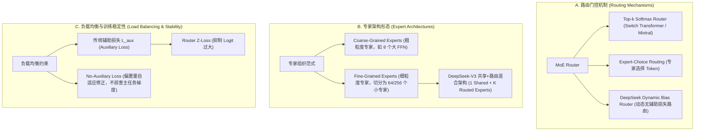

# 1.6 MoE 稀疏混合专家架构 (Sparse Mixture-of-Experts)

> **摘要**：随着大语言模型（LLM）参数量迈向数百亿至万亿级别，传统 Dense（密集）Transformer 在训练与推理时的计算开销呈指数增长。**MoE（Mixture-of-Experts，混合专家架构）** 通过将 Feed-Forward Network (FFN) 层替换为多个独立的专家网络（Experts），并利用门控路由（Gating Router）动态决定每个 Token 激活的专家集合，实现了“总参数量巨大但单 Token 计算量（FLOPs）恒定”的稀疏激活模式。本文系统拆解 MoE 架构核心原理：从标准 Top-$k$ Router 选路算法与负载均衡辅助损失（Auxiliary Load Balancing Loss）数学推导，到解决专家瘫痪（Expert Collapse）与路由震荡的工程手段；重点剖析 **DeepSeek-V3 / DeepSeek-R1** 推出的 **无辅助损失负载均衡（No-Auxiliary Loss Load Balancing）** 策略与 **细粒度路由专家（Fine-grained Routed Experts）+ 共享专家（Shared Experts）** 架构创新；最后提供带有负载均衡损失约束的 PyTorch Top-2 MoE 路由与计算算子手撕代码，以及大厂剥洋葱式面试追问。

---

## 📖 1. 导言与背景：Dense 到 Sparse 的范式转换

在 Transformer 架构中，注意力机制（Self-Attention）负责 Token 之间的上下文信息交互（$O(N^2)$ 或 $O(N)$），而前馈神经网络（FFN）则占据了模型约 $\frac{2}{3}$ 的参数量，负责记忆和存取事实性知识（Knowledge Storage）。

在 Dense 模型中，每个输入 Token 都会激活全量 FFN 参数：

$$
\text{FFN}(x) = \text{Act}(x W_1) W_2
$$

当参数规模扩展到 600B+ 时，Dense 模型单 Token 每次自回归推导都需要访问全部 600B 权重，显存带宽与算力瓶颈极高。**MoE 核心思想**是“分工协作”：将巨大的 FFN 拆分为 $N$ 个较小的独立专家 $E_1, E_2, \dots, E_N$，对于输入的 Token $x$，由门控网络（Router Gating）决定将其分发给前 $k$ 个最匹配的专家（通常 $k=1$ 或 $k=2$）。

| 维度对比 | Dense Transformer (如 LLaMA-3-70B) | Sparse MoE Transformer (如 Mixtral 8x7B / DeepSeek-V3) |
| :--- | :--- | :--- |
| **总参数量 (Total Params)** | 70B | 47B (Mixtral) / 671B (DeepSeek-V3) |
| **单 Token 激活参数 (Active Params)** | 70B | 13B (Mixtral 8x7B) / 37B (DeepSeek-V3) |
| **计算复杂度 (FLOPs/Token)** | 极高（全量参数 GEMM） | 低（仅激活参数 GEMM，计算效率大幅提升） |
| **显存容量需求 (Memory Footprint)** | 存放 70B 权重 (~140 GB FP16) | 必须存放全量 671B 权重 (~1.34 TB FP16 或 FP8 量化) |
| **核心挑战** | GPU 算力瓶颈 (Compute-Bound) | 跨节点专家通信瓶颈 (All-to-All AllReduce/AllGather) 与专家负载不均 |

---

## 🌳 2. MoE 技术演进与架构分支树 (Mermaid Graph)



---

## 📐 3. 门控路由机制与辅助负载均衡损失数学推导

### 3.1 Top-$k$ 门控路由算法

对于输入特征向量 $x \in \mathbb{R}^d$，门控网络通过可训练权重矩阵 $W_g \in \mathbb{R}^{N \times d}$ 计算出关于 $N$ 个专家的 Logit 分数：

$$
h(x) = x W_g^T \quad \in \mathbb{R}^N
$$

为了选取前 $k$ 个专家，计算仅保留前 $k$ 大元素的概率分布（其余赋值为 $-\infty$ 并在 Softmax 后归零）：

$$
\text{TopK}(h(x), k)_i = \begin{cases}
h(x)_i & \text{if } h(x)_i \text{ is in top } k \text{ values of } h(x) \\
-\infty & \text{otherwise}
\end{cases}
$$

门控路由输出权重 $g(x) \in \mathbb{R}^N$ 为：

$$
g(x) = \text{Softmax}(\text{TopK}(h(x), k))
$$

MoE 层最终的输出为各 Top-$k$ 专家输出的加权求和：

$$
y = \sum_{i \in \text{TopK}} g(x)_i \cdot E_i(x)
$$

### 3.2 专家塌陷 (Expert Collapse) 与辅助负载均衡损失 (Auxiliary Loss)

在没有约束约束的情况下，门控网络很容易陷入**正反馈循环（Rich-get-Rich Phenomenon）**：少数几个初始化稍好的专家持续被选中，梯度不断更新，变得越来越优秀；而其余专家很少被选中，梯度冻结。最终大多数 Token 都路由到同 1~2 个专家，导致模型退化为小 Dense 模型，此现象称为**专家塌陷（Expert Collapse）**。

为了使 $T$ 个 Token 均匀分发给 $N$ 个专家，Switch Transformer / Gshard 引入了**辅助负载均衡损失（Auxiliary Load Balancing Loss）** $L_{\text{aux}}$。

定义两个概率分布量：
1. **$f_i$ (Fraction of tokens routed to Expert $i$)**：实际路由到专家 $i$ 的 Token 比例。
2. **$P_i$ (Average routing probability for Expert $i$)**：门控网络对专家 $i$ 输出的平均门控概率。

数学表示如下：

$$
f_i = \frac{1}{T} \sum_{t=1}^T \mathbb{I}(\text{Expert } i \in \text{TopK}(h(x_t)))
$$

$$
P_i = \frac{1}{T} \sum_{t=1}^T p_i(x_t), \quad p_i(x_t) = \frac{\exp(h(x_t)_i)}{\sum_{j=1}^N \exp(h(x_t)_j)}
$$

辅助损失函数定义为 $f$ 与 $P$ 的点积分量之和：

$$
L_{\text{aux}} = \alpha \cdot N \sum_{i=1}^N f_i \cdot P_i
$$

其中 $\alpha$ 为超参数控制损失权重（通常取 $10^{-2}$）。当且仅当所有 $f_i = \frac{1}{N}$ 且 $P_i = \frac{1}{N}$ 时（即均匀分配），$L_{\text{aux}}$ 取得极小值 $\alpha$。如果路由发生严重倾斜，$L_{\text{aux}}$ 显著增加，强迫门控网络平衡分配。

---

## 🚀 4. DeepSeek-V3 / R1 架构创新：无辅助损失与细粒度专家

传统 $L_{\text{aux}}$ 存在一个重大缺陷：**辅助损失的梯度会干扰语言模型主任务（Cross-Entropy Loss）的梯度**。当 $\alpha$ 过大时，模型为了平衡专家甚至会将无关 Token 强行送入不匹配的专家，破坏表达能力。

### 4.1 无辅助损失负载均衡策略 (No-Auxiliary Loss Load Balancing)

DeepSeek-V3 / R1 提出了全新的自适应偏置机制（Dynamic Bias Adjustment）。门控 Logit 添加了一个**可变偏置项 $b_i$**：

$$
h_i(x) = x W_g^T + b_i
$$

在选路时根据包含 $b_i$ 的 $h_i(x)$ 进行 Top-$k$ 选取，但在计算专家加权 Softmax 权重时**不包含**偏置项（或仅在选路阶段使用）。

在训练过程中，系统监控每个 Batch 统计的专家负载 $f_i$：
- 如果专家 $i$ 超载（$f_i > \frac{\gamma}{N}$），则在 Step 结束时降低偏置 $b_i \leftarrow b_i - \gamma \cdot \text{step\_size}$；
- 如果专家 $i$ 饥饿（$f_i < \frac{\gamma}{N}$），则提高偏置 $b_i \leftarrow b_i + \gamma \cdot \text{step\_size}$。

> [!IMPORTANT]
> **关键优势**：偏置 $b_i$ 直接由统计量反推更新，**不通过梯度反向传播计算**！主模型的梯度百分之百致力于优化语言建模交叉熵，既彻底解决了专家瘫痪，又不会牺牲模型表现力。

### 4.2 细粒度专家 (Fine-grained Experts) 与共享专家 (Shared Experts)

传统的 Mixtral 8x7B 采用粗粒度专家（如 8 个常规 FFN，选 2 个）。DeepSeek 发现粗粒度专家的知识重叠度极高。

DeepSeek-V3 架构升级：
1. **共享专家 (Shared Experts)**：固定 1 个或多个专家捕获所有 Token 的通用跨领域常识（如语法、标点、基础逻辑），所有 Token 无条件必经过共享专家。
2. **细粒度路由专家 (Fine-grained Routed Experts)**：将单个大型专家的隐藏层维度（Hidden Dim）缩小为原先的 $\frac{1}{N_{\text{split}}}$，并将路由专家总数增加到 64 甚至 256 个，每次动态选择 Top-8 或 Top-6。

$$
y = \sum_{m=1}^{N_{\text{shared}}} E_m^{\text{shared}}(x) + \sum_{i \in \text{TopK}} g(x)_i \cdot E_i^{\text{routed}}(x)
$$

细粒度切分极大地提高了知识切片的精准度，不同专家可高度专注于代码、数学、多语言或特定专业领域的微细知识点。

---

## 🔥 5. 连环追问 (Interviewer Onion Chain)

> [!NOTE]
> 本模块模拟一线大厂（字节、阿里、DeepSeek、腾讯）大模型架构师与底层算子岗位面试中的剥洋葱式连续深度追问。

### ❓ Q1: 为什么 MoE 模型参数量很大（如 671B），但推理显存吞吐效率却比同等参数 Dense 模型高得多？
- **回答**：
  1. **计算量（FLOPs）维度**：MoE 在前向传播时仅激活 Top-$k$ 专家（如 DeepSeek-V3 总参数 671B，但单 Token 激活参数仅 37B）。因此每次自回归 Decoding 的矩阵乘法计算量仅相当于 37B Dense 模型。
  2. **显存访问与吞吐维度**：虽然全量权重需要占用庞大显存，但在 Batch Size 较大时，不同 Token 可以并行打入不同的专家网络，使各个专家的 GEMM 算子 Batch 变大，极大地提升了 Tensor Core 的计算强度（Compute-Bound），缓解了单 Token 解码时的内存带宽瓶颈。

### ❓ Q2: 详细推导 GShard / Switch Transformer 辅助损失 $L_{\text{aux}}$ 中 $f_i$ 与 $P_i$ 的含义，为什么只用其中一个不够？
- **回答**：
  1. $f_i$ 是**离散选择统计量**，无法求导（不可微），不能直接作为损失函数提供反向传播梯度；
  2. $P_i$ 是 Softmax 导出的**连续概率均值**，可微且携带梯度；
  3. 如果只优化 $\sum P_i^2$，门控可能使概率分布均匀但离散 Top-$k$ 依然集中于某一专家；如果只用 $f_i$ 则无法求导。$L_{\text{aux}} = \alpha N \sum f_i P_i$ 将不可微的实际路由分布 $f_i$ 作为可微连续概率 $P_i$ 的权重系数，构成了一个极佳的无偏约束梯度的代理（Proxy）。

### ❓ Q3: DeepSeek-V3 的 No-Aux Loss 动态偏置更新是如何避免辅助损失破坏主任务梯度的？
- **回答**：
  1. 传统辅助损失会将 $L_{\text{aux}}$ 加入到 Total Loss 中，其梯度的方向可能与语言建模交叉熵 Loss 的梯度冲突，破坏表征学习；
  2. DeepSeek-V3 的动态偏置 $b_i$ 不参与自动微分求导（`detach` 或梯度设为 0），而是基于每个 Step 或 Epoch 结束时全局卡上统计的专家路由频率 $f_i$，以固定的超参数步长（如 $\gamma$）在外部进行自适应加减修正。
  3. 这种将“路由平衡”由梯度优化转为“非梯度自适应控制”的解耦设计，确保了梯度 100% 专服务于主预测任务。

### ❓ Q4: 在分布式 MoE 训练/推理中，All-to-All 通信瓶颈是如何产生的？如何通过 EP (Expert Parallelism) 优化？
- **回答**：
  1. **通信产生原因**：在专家并行（Expert Parallelism, EP）下，不同专家分布在不同的 GPU 显卡节点上。输入 Token 经过 Local Router 后，需要根据路由结果发送给对应的 GPU，专家计算完成后又需将结果返回原 GPU。
  2. **All-to-All 过程**：涉及两次 **All-to-All** 通信（`Dispatch` 阶段分发 Token 数据，`Combine` 阶段回收专家输出数据）。当节点间 IB (InfiniBand) 带宽受限时，All-to-All 会成为最大的时间开销。
  3. **优化手段**：采用 EP + TP 混合并行、使用 NVLink 域内聚集专家、开发 CUDA/Triton 异步重叠（Overlap）通信与 GEMM 计算内核（如 DeepSeek DualPipe / Dual-Stream）。

### ❓ Q5: 为什么细粒度专家 (Fine-grained Experts) + 共享专家 (Shared Experts) 比传统粗粒度专家效果更好？
- **回答**：
  1. **通用知识解耦**：所有 Token 都存在通用语言逻辑（如连词、标点、基础语法），如果全由路由专家承担，所有专家都会冗余学习这部分知识。设置 Shared Expert 可以强制将通用模式抽离，路由专家专注于特化领域；
  2. **更高组合灵活性**：将隐藏维度拆小，提升专家数量（如选 8/64），可以用更少的激活参数组合出极其丰富的领域语义子空间（相当于由 $C_{64}^8$ 种专家组合，远大于传统 $C_8^2 = 28$ 种），大大提升表达容量。

### ❓ Q6: MoE 模型在量化（如 FP8 / INT4）时，专家层与常规 Dense 层在 Outliers 处理上有何特殊之处？
- **回答**：
  1. **专家激活分布极其不均**：由于不同专家处理的 Token 语义跨度极大，部分专家的激活输出可能存在极强烈的异常值（Outliers），而另一些专家的激活值非常平滑。
  2. **独立 Channel/Group 量化**：不能使用全局统一的 Scale，必须针对每个 Expert 独立计算 Scale / Zero-point，甚至需要结合 AWQ 或 SmoothQuant 对高频激活专家的权重与输入施加平滑缩放变换。

---

## 💻 6. PyTorch 高性能代码实战：Top-2 MoE Router 与专家网络

```python
import torch
import torch.nn as nn
import torch.nn.functional as F


class Top2RouterWithAuxLoss(nn.Module):
    """
    Top-2 门控路由模块，包含 Softmax 选路与 Auxiliary Load Balancing Loss 计算
    """
    def __init__(self, d_model: int, num_experts: int, aux_loss_coef: float = 0.01):
        super().__init__()
        self.d_model = d_model
        self.num_experts = num_experts
        self.aux_loss_coef = aux_loss_coef
        # 路由线性层
        self.gate = nn.Linear(d_model, num_experts, bias=False)

    def forward(self, x: torch.Tensor):
        """
        :param x: 形状为 (Batch_Size, Seq_Len, d_model)
        :return: routing_weights (BS, Seq_Len, 2), selected_experts (BS, Seq_Len, 2), aux_loss
        """
        bs, seq_len, d_model = x.shape
        x_flat = x.reshape(-1, d_model)  # (N, d_model), N = bs * seq_len

        # 1. 计算原始 Logits: (N, num_experts)
        logits = self.gate(x_flat)

        # 2. 计算连续概率分布 P_i: (N, num_experts)
        probs = F.softmax(logits, dim=-1)

        # 3. 提取 Top-2 专家索引与 Logits
        top2_logits, top2_indices = torch.topk(logits, k=2, dim=-1)  # (N, 2)

        # 4. 对 Top-2 权重施加 Softmax 归一化
        routing_weights = F.softmax(top2_logits, dim=-1)  # (N, 2)

        # 5. 计算辅助负载均衡损失 (Auxiliary Load Balancing Loss)
        # f_i: 实际被选为 Top-1 专家的 Token 比例 (离散选择)
        top1_indices = top2_indices[:, 0]
        one_hot_top1 = F.one_hot(top1_indices, num_classes=self.num_experts).float()  # (N, num_experts)
        f_i = one_hot_top1.mean(dim=0)  # (num_experts,)

        # P_i: 门控网络对各专家的平均预测概率 (可微)
        P_i = probs.mean(dim=0)  # (num_experts,)

        # L_aux = alpha * N_experts * sum(f_i * P_i)
        aux_loss = self.aux_loss_coef * self.num_experts * torch.sum(f_i * P_i)

        # 重塑形状返回
        routing_weights = routing_weights.reshape(bs, seq_len, 2)
        top2_indices = top2_indices.reshape(bs, seq_len, 2)

        return routing_weights, top2_indices, aux_loss


class Expert(nn.Module):
    """单结构 Feed-Forward Network 专家模块"""
    def __init__(self, d_model: int, d_ff: int):
        super().__init__()
        self.w1 = nn.Linear(d_model, d_ff, bias=False)
        self.w2 = nn.Linear(d_ff, d_model, bias=False)
        self.act = nn.SiLU()

    def forward(self, x: torch.Tensor) -> torch.Tensor:
        return self.w2(self.act(self.w1(x)))


class SparseMoELayer(nn.Module):
    """
    完整的 Sparse MoE 包含 1 个 Shared Expert + N 个 Routed Experts (Top-2)
    """
    def __init__(self, d_model: int, d_ff: int, num_routed_experts: int = 4):
        super().__init__()
        self.d_model = d_model
        self.num_experts = num_routed_experts
        
        # 1 个共享专家 (Shared Expert)
        self.shared_expert = Expert(d_model, d_ff)
        
        # N 个路由专家 (Routed Experts)
        self.routed_experts = nn.ModuleList([
            Expert(d_model, d_ff) for _ in range(num_routed_experts)
        ])
        
        # Top-2 路由器
        self.router = Top2RouterWithAuxLoss(d_model, num_routed_experts)

    def forward(self, x: torch.Tensor):
        bs, seq_len, d_model = x.shape
        
        # 1. 计算 Shared Expert 输出 (所有 Token 必经)
        shared_out = self.shared_expert(x)
        
        # 2. 路由选路
        weights, indices, aux_loss = self.router(x)  # (BS, Seq_Len, 2)
        
        # 3. 计算 Routed Experts 加权输出
        x_flat = x.reshape(-1, d_model)
        weights_flat = weights.reshape(-1, 2)
        indices_flat = indices.reshape(-1, 2)
        
        routed_out_flat = torch.zeros_like(x_flat)
        
        # 循环专家计算（生产环境使用 Triton/CUDA Kernel 或 Dispatch/Combine 算子加速）
        for token_idx in range(x_flat.shape[0]):
            token_vec = x_flat[token_idx:token_idx+1]
            for k in range(2):
                exp_idx = indices_flat[token_idx, k].item()
                weight = weights_flat[token_idx, k]
                expert_out = self.routed_experts[exp_idx](token_vec)
                routed_out_flat[token_idx] += weight * expert_out.squeeze(0)
                
        routed_out = routed_out_flat.reshape(bs, seq_len, d_model)
        
        # 4. 融合输出
        final_output = shared_out + routed_out
        return final_output, aux_loss


if __name__ == "__main__":
    torch.manual_seed(42)
    bs, seq_len, d_model, d_ff = 2, 8, 64, 128
    num_experts = 4

    x = torch.randn(bs, seq_len, d_model)
    moe_layer = SparseMoELayer(d_model=d_model, d_ff=d_ff, num_routed_experts=num_experts)

    output, aux_loss = moe_layer(x)

    print("=== MoE 架构算子单元测试 ===")
    print(f"输入张量 Shape: {x.shape}")
    print(f"输出张量 Shape: {output.shape}")
    print(f"辅助负载均衡 Loss: {aux_loss.item():.6f}")
    assert output.shape == x.shape, "输出形状与输入不一致！"
    print("✅ Sparse MoE Top-2 模块测试完全通过！")
```

---

## 🔗 7. 扩展学习与多维资源

### 🎬 YouTube / B站 优质视频推荐
- **DeepSeek-V3 架构深度拆解（包含 No-Aux Loss & Multi-head Latent Attention）**：DeepSeek Official Tech Talk & Paper Review.
- **Mixtral 8x7B: Mixture of Experts Explored**：Understanding Sparse MoE from Switch Transformers to Mixtral.

### 📄 经典必读论文
1. **Outrageously Large Neural Networks (MoE)** (Shazeer et al., 2017): *The Sparsely-Gated Mixture-of-Experts Layer* ([arXiv:1701.06538](https://arxiv.org/abs/1701.06538))
2. **Switch Transformers** (Fedus et al., 2021): *Switch Transformers: Scaling to Trillion Parameter Models with Simple and Efficient Sparsity* ([arXiv:2101.03961](https://arxiv.org/abs/2101.03961))
3. **Mixtral of Experts** (Mistral AI, 2024): *Mixtral of Experts* ([arXiv:2401.04088](https://arxiv.org/abs/2401.04088))
4. **DeepSeek-V3 Technical Report** (DeepSeek AI, 2024): *DeepSeek-V3 Technical Report* ([arXiv:2412.19437](https://arxiv.org/abs/2412.19437))

### 🐙 核心 GitHub 源码锚点
- [`deepseek-ai/DeepSeek-V3`](https://github.com/deepseek-ai/DeepSeek-V3)：DeepSeek-V3 官方模型架构定义与 DeepSeekMoE 实现。
- [`mistralai/mistral-inference`](https://github.com/mistralai/mistral-inference)：Mixtral 8x7B Sparse MoE 推理工程实现。
- [`vllm-project/vllm/model_executor/models/deepseek_v2.py`](https://github.com/vllm-project/vllm)：vLLM 高性能 MoE 融合 CUDA 算子与流水线。
