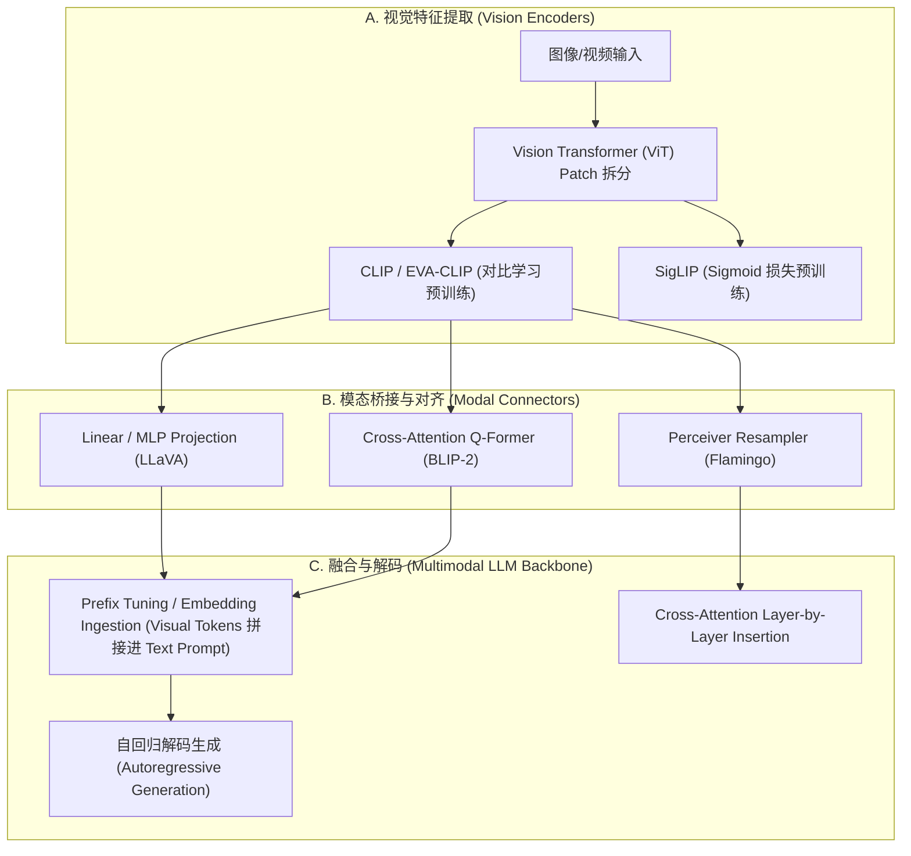

# 1.7 多模态大模型 VLM 架构 (Vision-Language Models)

> **摘要**：多模态大语言模型（Vision-Language Models, VLMs）打破了传统 LLM 仅能处理单模态文本数据的局限，使 AI 系统具备了感知图像、视频与音频并进行跨模态推理的能力。本文系统拆解 VLM 的三大核心构成与演进范式：从 **Vision Transformer (ViT)** 的图像 Patch 分块与位置编码，到 **CLIP** 跨模态对比学习（Contrastive Learning）与 InfoNCE Loss 数学推导；深入剖析从早期 **Linear Projection (LLaVA)**、**Q-Former (BLIP-2)** 到 **Perceiver Resampler (Flamingo)** 的模态对齐连接器（Connector）演进；最后解析 **GPT-4o / Gemini 1.5 / Qwen2-VL** 的原生多模态（Native Multimodal）统一 Token 化架构，并提供包含图像 Patchify、MLP 投影与嵌入拼接的完整 PyTorch 纯手写代码及剥洋葱式面试连环追问。

---

## 📖 1. 导言与演进：从 Late Fusion 到 Native Multimodal

将视觉模态引入大语言模型的发展经历了三个主要范式演进阶段：

1. **早期后期融合 (Late Fusion / Cross-Encoder)**：利用分类器或检测框提取特征，送入规则推理引擎，缺乏细粒度像素与文本语义的对齐。
2. **模块化拼接范式 (Modular Connector Approach - 如 LLaVA, BLIP-2)**：
   - 保持预训练好的**视觉编码器（Vision Encoder, 如 CLIP ViT-L/14）**与**大语言模型（LLM, 如 LLaMA/Vicuna）**参数冻结或微调；
   - 在两者之间设计一个轻量级 **连接器（Connector / Adapter）**，将视觉 Feature Map 投影为 LLM 能够理解的 Visual Tokens 嵌入空间。
3. **原生多模态统一范式 (Native Multimodal - 如 GPT-4o, Gemini, Qwen2-VL)**：
   - 从 Tokenizer 层面直接统一文本、图像、音频与视频输入；
   - 全模型自底向上采用统一的 Transformer 架构处理混合模态序列（Early Sharing），支持真正的全模态输入与全模态输出（Any-to-Any）。

| 方案对比 | 早期 Linear Projection (LLaVA-1.5) | Cross-Attention / Q-Former (BLIP-2) | 原生多模态 (GPT-4o / Qwen2-VL) |
| :--- | :--- | :--- | :--- |
| **视觉编码器** | CLIP ViT-L/14 (固定分辨率 $336 \times 336$) | EVA-CLIP (固定分辨率) | 动态分辨率 ViT (NaViT / 2D RoPE) |
| **连接器 (Connector)** | 2 层 MLP Projection | Q-Former (包含 32 个 Learnable Queries) | 统一 Embedding 层 (无显式 Connector) |
| **Visual Token 数量** | 固定 (如 576 tokens/图) | 固定缩减 (如 32 tokens/图) | 动态变长 (取决于图像分辨率与 Patch 密度) |
| **模态对齐能力** | 图文粗粒度与文本指令遵循 | 强细粒度图文特征交叉理解 | 高度图文/音视频交错与低延迟感知 |

---

## 🌳 2. VLM 架构演进与模态对齐分支树 (Mermaid Graph)



---

## 📐 3. ViT Patchify、CLIP 对比学习 Loss 与 Q-Former 数学推导

### 3.1 ViT Patchify (图像切分与向量化)

对于分辨率为 $H \times W \times C$ 的输入图像 $X$，Vision Transformer 首先将其切分为无重叠的 Patch 块，每个 Patch 的尺寸为 $P \times P$（如 $14 \times 14$）。

1. **Patch 数量 $N$**：

$$
N = \frac{H \cdot W}{P^2}
$$

2. **Patch 展平与线性投影**：每个 Patch 被展平为维数为 $x_p \in \mathbb{R}^{P^2 \cdot C}$ 的向量。通过可训练矩阵 $E \in \mathbb{R}^{(P^2 \cdot C) \times D}$ 映射至隐空间 $D$ 维，并加入可训练的 1D 位置编码 $E_{pos} \in \mathbb{R}^{(N+1) \times D}$ 及可学习的 `[CLS]` Token：

$$
z_0 = [x_{\text{class}}; x_p^1 E; x_p^2 E; \dots; x_p^N E] + E_{pos}
$$

### 3.2 CLIP 对比学习与 InfoNCE 损失函数推导

CLIP (Contrastive Language-Image Pre-training) 在一个 Batch 内包含 $B$ 对（图像 $I_i$, 文本 $T_i$）。通过 Vision Encoder 得到图像向量 $v_i \in \mathbb{R}^d$，Text Encoder 得到文本向量 $t_i \in \mathbb{R}^d$（已归一化，$\|v_i\|_2=1, \|t_i\|_2=1$）。

余弦相似度矩阵 $S \in \mathbb{R}^{B \times B}$ 表示为：

$$
s_{i,j} = \frac{v_i^T t_j}{\tau}
$$

其中 $\tau$ 为可训练的温度系数（Temperature Parameter）。

**InfoNCE 损失函数**由图像到文本（Image-to-Text）和文本到图像（Text-to-Image）双向交叉熵组成：

1. **Image-to-Text 损失 $L_{I \to T}$**：

$$
L_{I \to T} = -\frac{1}{B} \sum_{i=1}^B \log \frac{\exp(s_{i,i})}{\sum_{j=1}^B \exp(s_{i,j})}
$$

2. **Text-to-Image 损失 $L_{T \to I}$**：

$$
L_{T \to I} = -\frac{1}{B} \sum_{j=1}^B \log \frac{\exp(s_{j,j})}{\sum_{i=1}^B \exp(s_{i,j})}
$$

3. **CLIP 联合优化目标**：

$$
L_{\text{CLIP}} = \frac{1}{2} \left( L_{I \to T} + L_{T \to I} \right)
$$

### 3.3 Q-Former Cross-Attention 模态对齐

BLIP-2 提出的 Q-Former 解决了 ViT 输出 Token 过多的问题（如 576 个 Token 占用过大上下文）。Q-Former 初始化 $K$ 个可学习的查询向量（Learnable Query Tokens $Q \in \mathbb{R}^{K \times D}$，如 $K=32$）。

1. Query Tokens 在 Self-Attention 层中相互交互；
2. Query Tokens 与 ViT 提取的视觉特征 $Z_{\text{vision}} \in \mathbb{R}^{N \times D_{\text{vis}}}$ 在 **Cross-Attention** 层进行交叉注意力计算：

$$
\text{Attention}(Q, Z, Z) = \text{Softmax}\left( \frac{(Q W_Q) (Z W_K)^T}{\sqrt{d_k}} \right) (Z W_V)
$$

通过交叉注意力机制，原本 $N=576$ 的变长视觉 Token 被高度浓缩为 $K=32$ 个精炼的视觉语义 Token。

---

## 🚀 4. 原生多模态时代 (GPT-4o / Qwen2-VL) 架构创新

### 4.1 动态分辨率 (Naive Dynamic Resolution / NaViT)

早期 LLaVA 强制将不同宽高比的图像 Padding 或 Resize 为 $336 \times 336$，导致严重失真或文字模糊。现代 VLM 采用**动态分辨率切分**：
- 根据原始图像的宽高比例 $H \times W$，动态计算所需切分的 Patch 块网格 $(n_h, n_w)$；
- 使用 **2D RoPE（二维旋转位置编码）** 为不同行列位置的 Patch 分配空间相对位置 $R(x, y)$，完美支持任意分辨率与超大尺寸图表。

### 4.2 文本与视觉 Token 的在序列维度的交错拼接

在 Prompt 输入阶段，视觉 Token 与文本 Token 被统一对待：

```text
[BOS] <|vision_start|> V_token_1 V_token_2 ... V_token_K <|vision_end|> 请详细分析这张图片中的图表趋势。 [EOS]
```

在自回归生成时，模型像处理普通文本 Token 一样对 Visual Embedding 进行 Self-Attention 计算。

---

## 🔥 5. 连环追问 (Interviewer Onion Chain)

> [!NOTE]
> 本模块模拟一线大厂（字节、阿里、DeepSeek、腾讯）多模态算法专家岗位面试中的剥洋葱式连续深度追问。

### ❓ Q1: 为什么 CLIP 在预训练时采用双塔对比学习，而不能直接把 ViT 特征拼接进 GPT 进行 end-to-end 训练？
- **回答**：
  1. **训练效率与数据量**：对比学习计算极快，可以利用数十亿未标记的互联网图文对（如 LAION-5B）进行海量分布式预训练；
  2. **特征空间对齐**：双塔结构通过 InfoNCE 损失显式约束图像和文本分布于统一的度量空间中（Metric Space），为后续 LLM 的跨模态迁移提供了极佳的解耦表征。

### ❓ Q2: LLaVA 采用简单的 2 层 MLP Projection 效果就很好，为什么 BLIP-2 还要设计复杂的 Q-Former？两者的优劣势是什么？
- **回答**：
  1. **MLP Projection (LLaVA)**：
     - *优势*：结构极简、保留全量 Patch 空间信息、训练稳定且无细粒度特征丢失；
     - *劣势*：Token 数与图像 Patch 1:1 绑定（如 $336 \times 336$ 下为 576 个 Tokens），多图对话或视频推理时会迅速塞满 LLM 上下文。
  2. **Q-Former (BLIP-2)**：
     - *优势*：将任意分辨率图像压缩至固定少量 Token（如 32 个），极大节省 KV Cache 与 LLM 计算量；
     - *劣势*：Cross-Attention 瓶颈可能丢失细粒度空间位置（如 OCR 小字、细粒度物体检测坐标）。

### ❓ Q3: ViT 的 1D 位置编码在处理不同宽高比图像时会失效，2D RoPE 是如何解决动态分辨率位置编码问题的？
- **回答**：
  1. 1D 线性位置编码假设 Patch 按行优先一维展开，改变图像宽高比会导致相邻行 Patch 的 1D 距离剧烈变化，破坏空间邻近性；
  2. 2D RoPE 将通道维度切分为两半，一半赋予行位置编码 $R_y(\text{row})$，另一半赋予列位置编码 $R_x(\text{col})$。通过旋转矩阵的复数乘法，自然保证了二维网格在 $x$ 和 $y$ 两个方向上的相对位置平移不变性。

### ❓ Q4: 为什么视觉编码器（Vision Encoder）通常需要保留高分辨率特征（如 1024x1024），而 LLM 内部的文本隐层维度可以较小？
- **回答**：
  1. **视觉信息密度低**：图像像素包含大量高频噪声与冗余背景，高分辨率是捕捉细粒度文本（OCR）、小目标和精细边缘的物理前提；
  2. **文本语义高度抽象**：文本 Token 是经过 Tokenizer 符号化后的强语义单元。LLM 内部需要强大的逻辑推理空间，但不需要处理像素级密集采样。

### ❓ Q5: 在 VLM 训练的 Stage 1 (Pre-training) 和 Stage 2 (Instruction Tuning) 中，一般冻结哪些模块参数？为什么？
- **回答**：
  1. **Stage 1 (图文对齐预训练)**：通常**冻结 ViT 与 LLM** 权重，仅训练 Connector (MLP / Q-Former)。目的是让 Connector 快速学习将 Vision Space 映射到 Text Embedding Space，避免破坏已有预训练特征；
  2. **Stage 2 (指令微调)**：**冻结 ViT（或极小学习率微调），解除 LLM 与 Connector 的冻结**，输入图文 instruction 数据集，使模型学会自回归回答复杂多模态指令。

### ❓ Q6: SigLIP (Sigmoid Loss) 相比于 CLIP (Softmax InfoNCE) 有什么数学与工程上的重大改进？
- **回答**：
  1. **Softmax 全局归一化依赖**：CLIP 的 Softmax 必须在 Batch 内部所有样本间计算分母，因此多卡分布式训练时必须进行开销极大的 `AllGather` 跨卡通信；
  2. **SigLIP 逐对二分类**：SigLIP 将对比学习转化为独立的 Sigmoid 二分类问题 $L = -\sum_{i,j} z_{i,j} \log \sigma(s_{i,j}) + (1-z_{i,j}) \log(1-\sigma(s_{i,j}))$。不再需要跨卡计算分母，极大降低了分布式通信代价，且在小 Batch Size 下效果更稳定。

---

## 💻 6. PyTorch 高性能代码实战：Vision Projection 模态融合模块

```python
import torch
import torch.nn as nn
import torch.nn.functional as F


class PatchifyVisionEncoder(nn.Module):
    """
    简易 Vision Transformer Encoder 模块：
    1. 将输入图像 (BS, C, H, W) 进行 Patch 拆分
    2. 映射为 Patch Embeddings 并加上位置编码
    3. 经过 2 层 Transformer Encoder 提取特征
    """
    def __init__(self, img_size=56, patch_size=14, in_channels=3, embed_dim=128):
        super().__init__()
        self.img_size = img_size
        self.patch_size = patch_size
        self.num_patches = (img_size // patch_size) ** 2  # (56/14)^2 = 16
        
        # Patch Projection 卷积层
        self.proj = nn.Conv2d(in_channels, embed_dim, kernel_size=patch_size, stride=patch_size)
        # 1D 可学习位置编码
        self.pos_embed = nn.Parameter(torch.randn(1, self.num_patches, embed_dim))
        
        # Transformer Encoder Block
        encoder_layer = nn.TransformerEncoderLayer(d_model=embed_dim, nhead=4, batch_first=True)
        self.transformer = nn.TransformerEncoder(encoder_layer, num_layers=2)

    def forward(self, x: torch.Tensor) -> torch.Tensor:
        # x: (BS, C, H, W)
        x = self.proj(x)  # (BS, embed_dim, H/P, W/P)
        x = x.flatten(2).transpose(1, 2)  # (BS, num_patches, embed_dim)
        x = x + self.pos_embed
        x = self.transformer(x)
        return x  # (BS, num_patches, embed_dim)


class MultimodalLLMConnector(nn.Module):
    """
    2 层 MLP 模态投影连接器：将视觉隐层维度 (128) 投影到 LLM 文本隐层维度 (256)
    """
    def __init__(self, vis_dim=128, llm_dim=256):
        super().__init__()
        self.mlp = nn.Sequential(
            nn.Linear(vis_dim, llm_dim),
            nn.GELU(),
            nn.Linear(llm_dim, llm_dim)
        )

    def forward(self, vis_feats: torch.Tensor) -> torch.Tensor:
        return self.mlp(vis_feats)


class SimpleVLMInferencePipeline(nn.Module):
    """
    完整的 VLM 视觉-文本 Token 融合 Pipeline
    """
    def __init__(self, vocab_size=1000, llm_dim=256):
        super().__init__()
        self.vision_encoder = PatchifyVisionEncoder(embed_dim=128)
        self.connector = MultimodalLLMConnector(vis_dim=128, llm_dim=llm_dim)
        self.text_embedding = nn.Embedding(vocab_size, llm_dim)

    def forward(self, image: torch.Tensor, text_ids: torch.Tensor) -> torch.Tensor:
        """
        :param image: 形状 (BS, 3, H, W)
        :param text_ids: 形状 (BS, Text_Seq_Len)
        :return: 拼接后的多模态 Sequence Embedding (BS, Num_Patches + Text_Seq_Len, llm_dim)
        """
        # 1. 提取视觉特征: (BS, 16, 128)
        vis_feats = self.vision_encoder(image)
        
        # 2. Connector 投影到 LLM 空间: (BS, 16, 256)
        vis_tokens = self.connector(vis_feats)
        
        # 3. 提取文本 Embedding: (BS, Text_Seq_Len, 256)
        text_tokens = self.text_embedding(text_ids)
        
        # 4. 沿着 Sequence 长度维度拼接: [Visual_Tokens; Text_Tokens]
        multimodal_tokens = torch.cat([vis_tokens, text_tokens], dim=1)
        
        return multimodal_tokens


if __name__ == "__main__":
    torch.manual_seed(42)
    bs = 2
    image = torch.randn(bs, 3, 56, 56)  # 2 张 56x56 图像
    text_ids = torch.randint(0, 1000, (bs, 10))  # Batch Size=2, 文本长度=10

    vlm = SimpleVLMInferencePipeline(vocab_size=1000, llm_dim=256)
    multimodal_embeds = vlm(image, text_ids)

    print("=== VLM 模态融合与 Token 拼接测试 ===")
    print(f"输入图像 Shape: {image.shape}")
    print(f"输入文本 Token IDs Shape: {text_ids.shape}")
    print(f"视觉 Tokens 数量: {vlm.vision_encoder.num_patches}")
    print(f"融合后送入 LLM 的 Total Sequence Embedding Shape: {multimodal_embeds.shape}")
    
    expected_seq_len = vlm.vision_encoder.num_patches + text_ids.shape[1]
    assert multimodal_embeds.shape == (bs, expected_seq_len, 256), "融合形状与预期不符！"
    print("✅ VLM 模态连接器与 Token 融合算子单元测试全部通过！")
```

---

## 🔗 7. 扩展学习与多维资源

### 🎬 YouTube / B站 优质视频推荐
- **Stanford CS231n: Vision-Language & Multimodal Models**：Multimodal Transformers, CLIP, and VLM Architectures.
- **LLaVA & BLIP-2 论文源码带读**：Multimodal AI Architecture Deep Dive.

### 📄 经典必读论文
1. **ViT** (Dosovitskiy et al., 2020): *An Image is Worth 16x16 Words: Transformers for Image Recognition at Scale* ([arXiv:2010.11929](https://arxiv.org/abs/2010.11929))
2. **CLIP** (Radford et al., 2021): *Learning Transferable Visual Models From Natural Language Supervision* ([arXiv:2103.00020](https://arxiv.org/abs/2103.00020))
3. **BLIP-2** (Li et al., 2023): *BLIP-2: Bootstrapping Language-Image Pre-training with Frozen Image Encoders and Large Language Models* ([arXiv:2301.12597](https://arxiv.org/abs/2301.12597))
4. **LLaVA** (Liu et al., 2023): *Visual Instruction Tuning* ([arXiv:2304.08485](https://arxiv.org/abs/2304.08485))
5. **Qwen2-VL** (Qwen Team, 2024): *Qwen2-VL: To See the World More Clearly* ([arXiv:2409.12191](https://arxiv.org/abs/2409.12191))

### 🐙 核心 GitHub 源码锚点
- [`haotian-liu/LLaVA`](https://github.com/haotian-liu/LLaVA)：LLaVA 官方多模态训练与推理框架。
- [`salesforce/LAVIS`](https://github.com/salesforce/LAVIS)：BLIP-2 / InstructBLIP 官方开源代码库。
- [`QwenLM/Qwen2-VL`](https://github.com/QwenLM/Qwen2-VL)：Qwen2-VL 动态分辨率与 NaViT 生产级实现。
