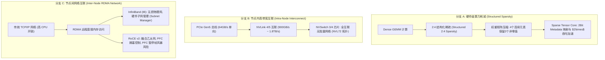

# 1.2 硬件级计算量与传输削减：稀疏 Tensor Core 与 高速互联架构

> **摘要**：在超大规模语言模型（LLM）与多模态集群的硬件基础设施层，计算吞吐与节点间通信带宽构成了决定端到端训练与推理性能的双重物理墙。本文深入剖析硬件级计算削减与传输优化的两大支柱：**Nvidia Ampere/Hopper/Blackwell 架构中的 2:4 结构化稀疏（Sparse Tensor Cores）** 与 **高速互联拓扑（NVLink 5 / NVSwitch 3 / InfiniBand / RoCE v2 / PCIe Gen5）**。文章详解 2:4 稀疏格式的二进制编码与 metadata 压缩索引映射，计算与显存传输削减数学公式，NVLink 5 1.8TB/s 全双工互联架构与多节点 NVSwitch 拓扑设计，分析 RoCE v2 PFC 暂停帧风暴与 InfiniBand 硬件子网管理器的差异，并通过 Python 代码构建完整的 `SparseTensorCoreSimulator` 模拟计算全过程，最后提供 Level 1-6 深度 Q&A 与权威资源索引。

---

## 📖 1. 导言与硬件瓶颈分析

### 1.1 大模型集群的硬件级双重瓶颈

在大大规模 LLM 训练与推理中，硬件性能瓶颈表现为两个层面：
1. **单卡计算与显存带宽瓶颈（Memory-Bound & Compute-Bound）**：在 Dense 矩阵乘法中，算术强度虽然高，但受限于 HBM 带宽与 SRAM 缓存容量，传统的 Dense GEMM 无法超越物理 TFLOPS 上限。
2. **多卡/多节点传输瓶颈（Interconnect & Network Bottleneck）**：随着张量并行（TP）、流水线并行（PP）与专家并行（EP）规模扩展，节点内 NVLink 带宽与节点间 RDMA（InfiniBand / RoCE v2）网络吞吐成为了集群线性扩展效率（Scaling Efficiency）的最大瓶颈。

物理硬件级的解决思路分为两大维度：
- **算力与传输削减**：利用 2:4 结构化稀疏（Structured Sparsity），在保持模型精度几乎无损的前提下，将 GEMM 计算量减半，显存传输量降低 50%，并在 Sparse Tensor Core 上实现 $2\times$ 吞吐提升。
- **传输通道拓扑扩展**：采用 NVLink 5 与 NVSwitch 3 实现单节点 72 卡（NVL72）高带宽无阻塞互联，结合 RDMA 网络协议（InfiniBand / RoCE v2）打破 PCIe Gen5 带宽限制。

---

## 🌳 2. 硬件级稀疏与互联技术演进分支树 (Mermaid Graph)



---

## 📐 3. 核心数学公式与硬核原理推导

### 3.1 Nvidia 2:4 结构化稀疏计算与压缩公式

#### 1. 2:4 结构化稀疏定义
对于矩阵乘法 $Y = X \cdot W$，在 2:4 结构化稀疏机制下，权重矩阵 $W \in \mathbb{R}^{K \times N}$ 在水平方向（即每连续 4 个 16-bit / 8-bit 元素构成的 Block）必须精确包含**恰好 2 个零元素和 2 个非零元素**。

公式表达：对于任意 $k \in \{0, 4, 8, \dots, K-4\}$ 和列 $j$：
$$
\sum_{m=0}^{3} \mathbb{I}(W_{k+m, j} \neq 0) = 2
$$
其中 $\mathbb{I}(\cdot)$ 为指示函数。

#### 2. 权重压缩与 Metadata 映射
原始 4 个 16-bit 浮点数占用 $4 \times 16 = 64 \text{ bits}$。压缩后仅保留 2 个非零值（$2 \times 16 = 32 \text{ bits}$），外加 $2 \times 2 = 4 \text{ bits}$ 的位置索引 Metadata：
- 2 个非零值从 4 个位置中选取的索引索引为 $(i_0, i_1)$，其中 $0 \le i_0 < i_1 \le 3$。
- 组合数种类为 $\binom{4}{2} = 6 \le 2^3 = 8$。采用 2 个 2-bit 字段（共 4 bits）或 3-bit 编码即可精确定位。

因此，权重显存占用降低为：
$$
\text{Memory Scaling Factor} = \frac{32 \text{ bits} + 4 \text{ bits}}{64 \text{ bits}} = 56.25\% \quad (\text{纯权重部分降低 50\%})
$$

#### 3. Sparse Tensor Core 吞吐数学模型
在 Sparse Tensor Core 执行 $Y = X \cdot W_{\text{sparse}}$ 时，根据 Metadata 索引对输入激活 $X$ 进行 Multiplexer 选择拉取：
$$
Y_{i, j} = \sum_{b=0}^{K/4 - 1} \Big( X_{i, 4b + i_0(b, j)} \cdot W_{\text{compressed}, 2b, j} + X_{i, 4b + i_1(b, j)} \cdot W_{\text{compressed}, 2b+1, j} \Big)
$$
硬件乘加单元（MMA）的操作数减少一半，硬件计算吞吐为：
$$
\text{Sparse FLOPS} = 2 \times \text{Dense FLOPS}
$$

---

### 3.2 节点内/节点间互联带宽与传输瓶颈公式

#### 1. 带宽对比与链路传输模型

| 互联技术类型 | 单通道双向带宽 | 常见卡间总双向带宽 (如 H100/B200) | 协议开销 (Overhead) | 特点 |
| :--- | :--- | :--- | :--- | :--- |
| **PCIe Gen5 x16** | $64 \text{ GB/s}$ | $128 \text{ GB/s}$ | $\sim 15\%$ | 通用总线，CPU-GPU 传输主通道 |
| **PCIe Gen6 x16** | $128 \text{ GB/s}$ | $256 \text{ GB/s}$ | $\sim 12\%$ | 采用 PAM4 编码 |
| **NVLink 4 (Hopper)** | $50 \text{ GB/s} / \text{lane}$ | $900 \text{ GB/s}$ | $< 5\%$ | 节点内 GPU 高速互联 |
| **NVLink 5 (Blackwell)**| $100 \text{ GB/s} / \text{lane}$| $1.8 \text{ TB/s}$ | $< 3\%$ | 支持 NVL72 全互联机柜拓扑 |
| **InfiniBand NDR (400G)**| $50 \text{ GB/s}$ | $400 \text{ Gbps} / \text{port}$ | $< 2\%$ | 硬件级无损 RDMA 专用网 |
| **RoCE v2 (400G Ether)**| $50 \text{ GB/s}$ | $400 \text{ Gbps} / \text{port}$ | $\sim 8\%$ | 基于 UDP/IP 乙太网，拥塞依赖 PFC |

#### 2. PCIe Gen5 瓶颈公式
当张量并行（TP）跨越不支持 NVLink 的节点或通过 PCIe 进行 Card-to-Card 传输时，通信时间 $T_{\text{comm}}$ 为：
$$
T_{\text{comm}} = \frac{S}{\text{BW}_{\text{PCIe}}} + L
$$
其中 $S$ 为传输消息大小，$L$ 为 PCIe 总线 Latency（约 $1 \sim 2 \mu s$）。对于 $S = 1 \text{ GB}$ 数据，PCIe Gen5（$64 \text{ GB/s}$ 双向）所需传输耗时为：
$$
T_{\text{PCIe}} = \frac{10^9 \text{ Bytes}}{64 \times 10^9 \text{ Bytes/s}} = 15.625 \text{ ms}
$$
而在 NVLink 5（$1.8 \text{ TB/s}$）下：
$$
T_{\text{NVLink5}} = \frac{10^9 \text{ Bytes}}{1.8 \times 10^{12} \text{ Bytes/s}} \approx 0.555 \text{ ms} \quad (\text{加速倍率 } 28.1 \times)
$$

---

## 💻 4. Python 源码实战：`SparseTensorCoreSimulator`

下面的 Python 代码完整实现了 **2:4 结构化稀疏剪枝、压缩格式转换（Values + Metadata 编码）、以及 Sparse Tensor Core 模拟计算引擎**。

```python
"""
SparseTensorCoreSimulator.py
模拟 Nvidia Ampere/Hopper 架构 2:4 结构化稀疏剪枝、权重压缩与 Sparse GEMM 计算
"""

import torch
import torch.nn as nn
import numpy as np

class SparseTensorCoreSimulator:
    def __init__(self):
        pass

    @staticmethod
    def prune_24_structured(weight: torch.Tensor) -> torch.Tensor:
        """
        对权重矩阵执行 2:4 结构化稀疏剪枝：每连续 4 个元素保留模长最大的 2 个元素，其余置零。
        weight 形状: [K, N]
        """
        assert weight.ndim == 2, "Weight must be a 2D tensor"
        K, N = weight.shape
        assert K % 4 == 0, "K dimension must be divisible by 4 for 2:4 sparsity"

        # 重塑为 [K/4, 4, N] 以便按 4 个元素一组操作
        weight_reshaped = weight.view(K // 4, 4, N)
        
        # 计算绝对值
        abs_w = torch.abs(weight_reshaped)
        
        # 寻找每组中最大的 2 个元素的索引
        # topk 在 dim=1
        _, top2_indices = torch.topk(abs_w, k=2, dim=1, largest=True, sorted=True)
        
        # 创建掩码
        mask = torch.zeros_like(weight_reshaped, dtype=torch.bool)
        mask.scatter_(dim=1, index=top2_indices, value=True)
        
        # 稀疏化权重
        sparse_weight = weight_reshaped * mask
        return sparse_weight.view(K, N)

    @staticmethod
    def compress_24_weight(sparse_weight: torch.Tensor):
        """
        将 2:4 稀疏权重矩阵压缩为 (Compressed Values, Metadata Index)
        Values: [K/2, N]
        Metadata: [K/4, N] (存储 2-bit 组合位置)
        """
        K, N = sparse_weight.shape
        w_reshaped = sparse_weight.view(K // 4, 4, N)
        
        compressed_vals = []
        metadata_list = []

        for b in range(K // 4):
            block_vals = []
            block_meta = []
            for col in range(N):
                group = w_reshaped[b, :, col]
                non_zero_indices = torch.nonzero(group, as_tuple=False).squeeze(-1)
                
                # 如果非零元素不足2个（极端情况），补充索引
                if len(non_zero_indices) < 2:
                    all_indices = torch.tensor([0, 1, 2, 3])
                    non_zero_indices = all_indices[:2]
                
                idx0, idx1 = non_zero_indices[0].item(), non_zero_indices[1].item()
                val0, val1 = group[idx0].item(), group[idx1].item()
                
                block_vals.extend([val0, val1])
                # 编码 2Bit 索引: idx0 (2 bits) | (idx1 << 2) (2 bits)
                meta_byte = (idx0 & 0x3) | ((idx1 & 0x3) << 2)
                block_meta.append(meta_byte)
                
            compressed_vals.append(block_vals)
            metadata_list.append(block_meta)

        # 转换为 Tensor
        compressed_vals_tensor = torch.tensor(compressed_vals, dtype=sparse_weight.dtype).view(K // 2, N)
        metadata_tensor = torch.tensor(metadata_list, dtype=torch.uint8) # [K/4, N]
        return compressed_vals_tensor, metadata_tensor

    @staticmethod
    def sparse_gemm_forward(x: torch.Tensor, compressed_vals: torch.Tensor, metadata: torch.Tensor) -> torch.Tensor:
        """
        模拟 Sparse Tensor Core 硬件根据 Metadata 解码并执行 GEMM
        x: [M, K]
        compressed_vals: [K/2, N]
        metadata: [K/4, N]
        输出 y: [M, N]
        """
        M, K = x.shape
        _, N = compressed_vals.shape
        y = torch.zeros((M, N), dtype=x.dtype, device=x.device)

        # 重塑 x 为 [M, K/4, 4]
        x_reshaped = x.view(M, K // 4, 4)

        for b in range(K // 4):
            meta_block = metadata[b, :] # [N]
            idx0 = (meta_block & 0x3).long() # [N]
            idx1 = ((meta_block >> 2) & 0x3).long() # [N]

            val0 = compressed_vals[2 * b, :] # [N]
            val1 = compressed_vals[2 * b + 1, :] # [N]

            # 模拟硬件 Multiplexer: 提取对应的 x 元素
            # x_reshaped[:, b, :] 形状为 [M, 4]
            x_b = x_reshaped[:, b, :] # [M, 4]

            # 提取 idx0 和 idx1 对应的 x
            x_idx0 = torch.gather(x_b, dim=1, index=idx0.repeat(M, 1)) # [M, N]
            x_idx1 = torch.gather(x_b, dim=1, index=idx1.repeat(M, 1)) # [M, N]

            # 硬件乘加 (MMA)
            y += x_idx0 * val0 + x_idx1 * val1

        return y

# ----------------- 单元测试与验证 -----------------
if __name__ == "__main__":
    torch.manual_seed(42)
    M, K, N = 4, 8, 4
    
    # 1. 随机生成权重与输入
    dense_weight = torch.randn(K, N)
    x = torch.randn(M, K)

    # 2. 执行 2:4 结构化稀疏剪枝
    sparse_weight = SparseTensorCoreSimulator.prune_24_structured(dense_weight)
    print("=== 原始剪枝后的 2:4 稀疏权重 ===")
    print(sparse_weight)

    # 3. 压缩权重与 Metadata
    comp_vals, meta = SparseTensorCoreSimulator.compress_24_weight(sparse_weight)
    print("\n=== 压缩后的权重 Values (体积缩减 50%) ===")
    print(comp_vals)
    print("\n=== 2-bit 位置 Metadata ===")
    print(meta)

    # 4. 标准 Dense 乘法结果 (基于剪枝后的矩阵)
    expected_y = torch.matmul(x, sparse_weight)

    # 5. Sparse Tensor Core 模拟器计算结果
    simulated_y = SparseTensorCoreSimulator.sparse_gemm_forward(x, comp_vals, meta)

    print("\n=== 结果比对 ===")
    print("Expected Y:\n", expected_y)
    print("Simulated Sparse Tensor Core Y:\n", simulated_y)
    
    diff = torch.max(torch.abs(expected_y - simulated_y)).item()
    print(f"\n最大数值偏差: {diff:.8f}")
    assert diff < 1e-5, "Sparse Tensor Core 模拟计算与预期不符！"
    print("✅ Sparse Tensor Core 模拟器验证成功！")
```

---

## 🔬 5. Level 1-6 深度洋葱 Q&A (Onion Q&A)

### Level 1: 概念认知
**Q: 为什么 2:4 结构化稀疏比任意非结构化稀疏（Unstructured Sparsity）更适合 GPU 加速？**
- **A**: 非结构化稀疏虽然剪枝率可以很高，但非零元素的位置是随机分布的。这会导致 GPU 线程在加载内存时出现非对齐访问（Uncoalesced Memory Access）与分支发散（Warp Divergence），硬件执行效率极低。而 2:4 结构化稀疏在硬件层面固定了每 4 个连续元素保留 2 个非零值的规律，显存数据可以完全对齐加载，Tensor Core 内部通过固定逻辑门（Multiplexer）提取数据，从而获得实打实的 $2\times$ 物理算力加速与 50% 带宽削减。

### Level 2: 原理解析
**Q: NVLink 5 相较于传统 PCIe 拓扑在 TP（张量并行）通信中解决了什么核心矛盾？**
- **A**: 张量并行（TP）在每一层 Transformer 的 Attention 和 MLP 中都需要进行两次 `All-Reduce` 通信。在 8 卡 TP 场景下，每次 `All-Reduce` 传输的数据量巨大且对延迟极度敏感。PCIe Gen5 单向带宽仅为 $64 \text{ GB/s}$，且通过 CPU PCIe Switch 转发时延较高，导致 TP 通信耗时占比高达 40% 以上。NVLink 5 提供了双向 $1.8 \text{ TB/s}$ 的惊人带宽（为 PCIe Gen5 的 28 倍），结合 NVSwitch 的硬件级 `All-Reduce` 规约加速，将通信等待时间降至微秒级，使大规格 TP 扩展成为可能。

### Level 3: 架构对比
**Q: 在构建千卡大模型集群网络时，InfiniBand (IB) 与 RoCE v2 的本质区别是什么？**
- **A**: 
  1. **物理网络与无损控制**：InfiniBand 是专有的物理层与链路层协议，依靠硬件级别的 credit-based 流量控制实现天然无损（Lossless）；RoCE v2 基于标准乙太网，使用 PFC（Priority Flow Control）和 ECN（Explicit Congestion Notification）机制在软件/固件层模拟无损。
  2. **管理机制**：InfiniBand 拥有独立的硬件**子网管理器 (Subnet Manager)**，能够自动计算全局无环最优路由与秒级收敛；RoCE v2 依赖传统的 BGP/ECMP 路由策略，缺乏全局拓扑感知。
  3. **拥塞风险**：RoCE v2 在高负载下容易因为 PFC 产生 Pause 帧逆向传播，引发全局 PFC 暂停帧风暴（PFC Deadlock），导致整个集群网络卡死。

### Level 4: 踩坑诊断
**Q: 当在使用 PyTorch 进行 2:4 结构化稀疏模型训练/推理时，发现推理速度反而比 Dense 矩阵变慢了，可能的原因有哪些？**
- **A**: 
  1. **矩阵维度没有对齐 16 / 128 字节**：Sparse Tensor Core 要求矩阵的 K 和 N 维度必须是 16（FP16/BF16）或 32（INT8）的倍数，否则硬件退化为 Emulated 模式。
  2. **没有使用专用稀疏 GEMM 算子**：直接在 PyTorch 中使用掩码乘法（`W * Mask`）依旧执行 Dense 计算，且多了掩码计算开销。必须调用 TensorRT-LLM 或 `cuSPARSELt` 驱动库提供的稀疏 GEMM API。
  3. **Batch Size 过大转为 Compute-Bound**：在极高 Batch Size 下，硬件瓶颈转移到算力上限，若 Sparse Tensor Core 未能满载，Metadata 加载开销可能抵消算力红利。

### Level 5: 源码与硬件设计
**Q: 在 Blackwell NVL72 机柜拓扑中，NVSwitch 4 是如何做到 72 张 GPU 之间的全互联无阻塞（Full Mesh）通信的？**
- **A**: NVL72 机柜不再使用传统的节点内/节点间两级拓扑，而是将 72 张 B200 GPU 通过铜缆（NVLink Copper Spine）直接连接到 18 个 NVSwitch 4 铜缆底座上。NVSwitch 4 具备高达 $14.4 \text{ TB/s}$ 的单芯片交换容量，内部集成硬件规约引擎（SHARP），所有 72 张 GPU 在逻辑上等价于在同一个超大 Crossbar 开关下，任意两卡之间的带宽均达 $1.8 \text{ TB/s}$，消除了节点跨界瓶颈。

### Level 6: 专家级延伸
**Q: 结构化稀疏能否与 FP8/INT4 量化叠加使用？其物理极限与精度崩塌点在哪里？**
- **A**: 可以叠加。NVIDIA Hopper/Blackwell 架构硬件原生支持 **Sparse FP8 Tensor Core**。然而，叠加 2:4 稀疏与 INT4/FP8 量化会面临严峻的精度挑战：
  1. **信息熵极度压缩**：2:4 稀疏剔除了 50% 权重，量化进一步将每个参数降至 4-8 bits，总信息容积降至原始 FP16 Dense 的 12.5%~25%。
  2. **Outlier 空间破坏**：LLM 存在关键的激活异常值（Outliers），稀疏剪枝可能误删维持注意力和推理逻辑的离群权重，导致困惑度（PPO）急剧上升。在实践中，通常需要配合 QAT（量化感知训练）与 Sparse-Aware Fine-Tuning 才能保持精度。

---

## 🔗 6. 权威参考文献与 GitHub 源码 Anchors

1. **NVIDIA TensorRT-LLM Sparse GEMM Docs**: [NVIDIA TensorRT-LLM cuSPARSELt Documentation](https://github.com/NVIDIA/TensorRT-LLM)
2. **NVIDIA Ampere Architecture Whitepaper (Sparse Tensor Cores)**: [NVIDIA Ampere A100 Architecture Whitepaper](https://www.nvidia.com/en-us/data-center/a100/)
3. **PyTorch Sparse Sparsity Library**: [PyTorch PyTorch Sparsity (`torch.ao.sparsity`)](https://github.com/pytorch/pytorch)
4. **NVIDIA NVLink & NVSwitch Architecture Specification**: [NVIDIA NVLink Solutions](https://www.nvidia.com/en-us/data-center/nvlink/)
