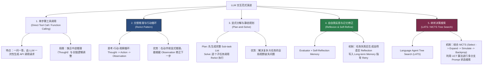
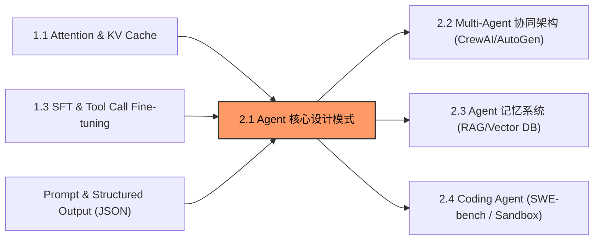

# 2.1 Agent 核心设计模式与架构

> **摘要**：大语言模型（LLM）的突破将 AI 从静态的“文本补全工具”推向了具备自主性的 **Agent（智能体）** 时代。单次提示词（Single-turn Prompt）受限于上下文长度、静态知识库与缺乏交互能力的局限，无法完成复杂的现实世界多步任务。Agent 通过构建 **感知（Perception）$\rightarrow$ 决策（Decision）$\rightarrow$ 行动（Action）$\rightarrow$ 反馈（Observation）** 的闭环控制系统，赋予了 LLM 使用工具、规划步骤、自我反思纠错以及在状态树中搜索最优解的能力。本文硬核解析 Agent 核心设计模式的演进脉络：从基础 Function Calling 到 **ReAct**（Reason + Act）、**Plan-and-Solve**、**Reflexion** 自自我纠错记忆演进，再到结合 Monte Carlo Tree Search 的 **LATS**（Language Agent Tree Search）。同时本文推导了 Agent 状态转移公式与归因更新方程，提供 Level 1~6 剥洋葱连环面试追问，以及可直接运行的纯 Python 手写 ReAct 引擎与 Reflexion 自自我纠错闭环实现。

---

## 📖 1. 导言与背景

### 1.1 从单次无状态 LLM 到自主 Agent 闭环

传统的 LLM 交互范式是**单步无状态映射**：输入 Context $X$，模型通过神经网络前向传播计算条件概率分布 $P_{\theta}(Y \mid X)$ 并生成 Response $Y$。这种范式在面对复杂的综合任务（例如“分析公司财报、调用股票 API 计算估值指标并撰写分析报告”）时面临三大致命瓶颈：

1. **幻觉与时效性缺陷**：模型参数中的知识截止于训练时刻，无法直接获取最新的外部事实；
2. **非确定性逻辑链崩溃**：一旦逻辑推导步骤变长，累积的自回归采样误差会发生指数级放论（Error Cascading），导致“一步错、步步错”；
3. **缺乏环境反思与干预（Zero Adaptation）**：模型无法在执行过程中接收外部环境（如代码执行错误、API 404 响应）的反馈并实时调整后续动作。

为了突破这一局限，**Agent（智能体）** 架构应运而生。Agent 的核心思想是**将 LLM 作为中央控制器（Brain）**，结合传感器（Perception）、执行器（Action Devices）与存储器（Memory），建立一个环境交互回路（Agent Environment Loop）：

```
                     ┌───────────────────────────────────┐
                     │          Environment              │
                     │  (APIs, Web, Python Exec, DB)     │
                     └─────────────────┬─────────────────┘
                                       │ Observation (O_t)
                                       ▼
 ┌─────────────────────────────────────────────────────────────────────────┐
 │                               Agent System                              │
 │                                                                         │
 │  ┌─────────────────┐       ┌─────────────────┐       ┌───────────────┐  │
 │  │ Memory (Short/  ├──────►│  LLM Controller ├──────►│ Action Engine │  │
 │  │  Long-term)     │       │ (Thought Engine)│       │(Tool Selection│  │
 │  └─────────────────┘       └─────────────────┘       └───────┬───────┘  │
 └──────────────────────────────────────────────────────────────┼──────────┘
                                                                │ Action (A_t)
                                                                ▼
                     ┌───────────────────────────────────┐
                     │          Environment              │
                     └───────────────────────────────────┘
```

在该闭环中：
- **Perception（感知）**：接收用户 Prompt、历史上下文 $S_t$ 以及外部工具返回的 Observation $O_t$；
- **Decision（决策）**：LLM 内部结合思考（Thought / Inner Monologue），生成具体的 Action 意图（如格式化的 JSON 工具调用）；
- **Action（行动）**：Agent 执行器调用目标 API、Python 解释器或搜索引擎；
- **Observation（反馈）**：解析工具执行结果（返回成功数据或 Exception 报错信息），作为下一轮决策的新 context 重新注入 LLM。

---

## 🌳 2. Agent 设计模式演进分支树

Agent 的设计模式经历了从“简单直连”到“交替推理”、从“静态规划”到“树状并行搜索”的演化路径。



### 演进分支核心模式对比表

| 模式名称 | 核心机制 | 适用场景 | 代表论文 / 提案 |
| :--- | :--- | :--- | :--- |
| **Function Calling** | LLM 生成结构化 JSON 指令直接执行 | 简单 API 查询、填表单 | OpenAI Tool Call Spec (2023) |
| **ReAct** | `Thought` $\rightarrow$ `Action` $\rightarrow$ `Observation` 迭代交替 | 多步查询、命令行诊断、信息检索 | Yao et al. (*ICLR 2023*) |
| **Plan-and-Solve** | 先 Plan 生成步骤列表，再逐项 Solve 执行 | 复杂项目开发、数学定理证明 | Wang et al. (*ACL 2023*) |
| **Reflexion** | Evaluator 试错评价 $\rightarrow$ Memory 文本反思 $\rightarrow$ Retry 尝试 | 代码自动修复、迭代写作、复杂 Task | Shinn et al. (*NeurIPS 2023*) |
| **LATS** | MCTS 树搜索 + LLM Value Evaluator + UCT 节点选择 | 极高确定性要求的复杂算法求解 | Zhou et al. (*ICML 2024*) |

---

## 🕸️ 3. 知识网格与图谱依赖

Agent 架构并不是孤立的技术，它深度依附于前续的 LLM 基础特性，并向后续的 Multi-Agent 系统扩展。

### 依赖关系表

| 依赖方向 | 关联模块 | 依赖核心原理 |
| :--- | :--- | :--- |
| **入度（前置依赖）** | **Context Window & KV Cache** | 循环长对话状态维护、KV Cache 增量追加与 Token 消费控制 |
| **入度（前置依赖）** | **Prompt Engineering** | ReAct 思考格式约束、Few-shot System Prompt、JSON Schema 校验 |
| **入度（前置依赖）** | **Structured Output / Quantization**| Function Calling 的 JSON 解析稳定性、端侧低延迟模型部署 |
| **出度（后向扩展）** | **Multi-Agent Systems** | AutoGen / CrewAI / LangGraph 多智能体协同、角色分工与通信协议 |
| **出度（后向扩展）** | **Autonomous Coding Agents** | SWE-bench 自主代码修缮、Devin / Claude Computer Use |

### 知识图谱依赖图



---

## 🧮 4. 状态机推导与归因逻辑

### 4.1 ReAct 状态转移数学推导

定义 Agent 在第 $t$ 步的状态空间为 $S_t \in \mathcal{S}$。初始时刻状态 $S_0 = (\text{SystemPrompt}, \text{UserQuery})$。

在第 $t$ 轮迭代中：
1. **决策策略映射**：Agent 语言模型策略网络 $\pi_\theta$ 根据当前累积上下文 $S_t$ 输出思维节点 $\text{Thought}_t$ 与动作指令 $A_t$：

$$
(\text{Thought}_t, A_t) \sim \pi_\theta(\cdot \mid S_t)
$$

2. **环境反馈（Execution Transition）**：环境（如 Python 解释器或搜索引擎 API）接收动作 $A_t$，转移并返回观测值 $O_t$：

$$
O_t = \text{Env}(A_t)
$$

3. **状态追加更新（State Append）**：

$$
S_{t+1} = S_t \oplus \text{Concat}(\text{Thought}_t, A_t, O_t)
$$

当策略网络输出终止标示符 $A_t = \text{Finish}(\text{FinalAnswer})$ 或达到最大步数上限 $t \ge T_{\max}$ 时，循环终止。

> [!NOTE]
> **思考节点（Thought Node）的数学意义**：
> 引入 $\text{Thought}_t$ 相当于在概率图模型中插入隐变量（Latent Reasoning Variables）。根据概率链式法则，显式生成 $\text{Thought}_t$ 将单步条件概率 $P(A_t \mid S_t)$ 分解为：
> $$ P(A_t \mid S_t) = \int P(A_t \mid \text{Thought}_t, S_t) P(\text{Thought}_t \mid S_t) d\text{Thought}_t $$
> 这极大降低了直接拟合复杂目标映射的熵，显著提高了复杂决策的准确率。

---

### 4.2 Reflexion 归因与长期记忆演进模型

Reflexion 架构引入了一个包含评价器（Evaluator）和自我反思记忆（Self-Reflection Memory）的反馈演进机制。

```
     ┌────────────────────────────────────────────────────────────┐
     │                       Episode k                            │
     │  Trajectory: τ_k = (S_0, A_0, O_0, ..., A_T, O_T)           │
     └─────────────────────────────┬──────────────────────────────┘
                                   │
                                   ▼
                   ┌──────────────────────────────┐
                   │     Evaluator R(τ_k)         │
                   │    Success (1) / Fail (0)    │
                   └───────────────┬──────────────┘
                                   │
                           If Fail (R = 0)
                                   │
                                   ▼
                   ┌──────────────────────────────┐
                   │    Self-Reflection Model     │
                   │  Generate Verbal Refl: mem_k │
                   └───────────────┬──────────────┘
                                   │
                                   ▼
                   ┌──────────────────────────────┐
                   │      Long-term Memory        │
                   │  M_{k+1} = M_k ∪ {mem_k}     │
                   └──────────────────────────────┘
```

设在第 $k$ 次 Episode 尝试中，Agent 生成的完整的轨迹为：

$$
\tau_k = (S_0, \text{Thought}_0, A_0, O_0, \dots, \text{Thought}_T, A_T, O_T)
$$

1. **标量评价（Evaluator）**：评价函数 $R(\tau_k) \in [0, 1]$ 给出轨迹评分（例如代码单元测试通过率或答案匹配度）。
2. **归因与反思生成（Credit Assignment & Verbal Reflection）**：
   若 $R(\tau_k) < \tau_{\text{threshold}}$（任务失败），调用反思模型 $M_{\text{refl}}$ 分析失败根因并提出改进建议：

$$
\text{mem}_k = M_{\text{refl}}(\tau_k, R(\tau_k))
$$

3. **记忆库空间拓扑演进**：长期记忆库集合 $M$ 按顺序或语义相似度追加：

$$
M_{k+1} = M_k \cup \{\text{mem}_k\}
$$

4. **下一轮 Episode 的 Context 注入**：在第 $k+1$ 次尝试中，策略网络将继承历史反思经验：

$$
(\text{Thought}_0, A_0) \sim \pi_\theta(\cdot \mid S_0, M_{k+1})
$$

这种“经验强化”避开了对权重参数梯度更新（Gradient Update）的依赖，实现了在 **In-Context 层面上的零样本强化学习**。

---

## 🔥 5. 连环面试追问 (Level 1~6 Onion Chain)

### Level 1: ReAct 模式中的 `Thought` 节点如果省略，直接做 Tool Call 会有什么隐患？

> **答**：
> 1. **缺乏缓冲推理空间（No Internal Monologue Space）**：LLM 属于自回归模型，如果直接要求生成 `Action: json`，模型必须在第一个 Token 生成时就完成对所有输入参数的计算。缺乏 `Thought` 的 Token 链缓冲，复杂推理难度极大增长。
> 2. **无脑死循环与参数幻觉（Blind Retries）**：当上一次工具返回 `Error 400 Bad Request` 时，若无 `Thought` 步骤让 LLM 显式分析“报错是因为参数格式不对还是缺少字段”，LLM 极大概率会用完全相同的参数反复重试同一工具，导致死循环。

---

### Level 2: 在生产环境中，如何防止 ReAct Agent 进入死循环（Infinite Loops）？

> **答**：防范 Agent 无限循环需构建三层防护网：
> 1. **Hard Limit 阶段**：限制最大迭代步数 $T_{\max}$（如 `max_iterations=10`），一旦触发强制中断并返回兜底结果。
> 2. **状态哈希去重（State Hashing & Trajectory Repetition Detection）**：
>    计算动作与参数组合的 Hash 值：$h_t = \text{Hash}(A_t, \text{Params}_t)$。若检测到连续 3 次 $h_t == h_{t-1}$ 且 Observation 返回重复报错，在 Context 中动态注入 **System Warning Prompt**：“你已经连续多次执行相同无效命令，请更换思考方向或使用其他工具！”
> 3. **Tool Execution Exception Handler**：捕获所有 Tool 异常，将 Traceback 严格包装为标准结构化的 Observation 返回给 LLM，防止进程直接 Crash。

---

### Level 3: Reflexion 与普通的 "Error & Retry" 机制有什么本质不同？

> **答**：
> - **简单 Retry（In-context Error Feedback）**：仅仅将报错字符串拼接到对话末尾再次调用 LLM。这仅更新短期上下文，当对话长度增加或轮数增多时，先前的失败经验会被注意力衰减覆盖，且容易导致注意力陷入局部错误状态（Attention Bias）。
> - **Reflexion 机制**：引入显式的 **Self-Reflection (自我批判)** 阶段。Agent 不会立刻 Retry，而是站在元认知（Metacognition）视角分析：“为什么我的假设是错的？错误的关键根因（Root Cause）是什么？下一次尝试绝对不能踩什么坑？”并将该句**高度精简的结论**写入独立的 `Memory` 模块。在下一次全新的 Attempt 开始时，将 `Memory` 置于 System Prompt 最高优先级位置，从根源指导行为重构。

---

### Level 4: 相比于 ReAct，Plan-and-Solve 模式在超长路径任务中的优缺点是什么？

> **答**：
> - **优势**：
>   1. **全局宏观视角（Global View）**：首先生成长达 10 步的 Task List，避免了 ReAct “走一步看一步”导致的局部贪婪解（Local Optima）或在子任务中迷失总体目标的问题。
>   2. **降低 Token 消耗**：主 Task List 一次生成，子步骤并行执行，减少了 ReAct 频繁重复输入大 Prompt 的开销。
> - **缺陷**：
>   1. **缺乏环境敏捷适应能力（Rigidity）**：如果在第 2 步时外部环境发生了突变（例如 API 接口失效或返回数据结构变动），预先生成的第 3~10 步 Task List 就会失效。
>   2. **依赖高阶 Task Planner**：若初始生成的 Plan 本身包含逻辑漏洞，后续的所有 Solve 步骤都是无效计算。因此现代框架通常采用 **Dynamic Replanning（Plan-and-Solve with Dynamic Replanning）** 来做折中。

---

### Level 5: 什么是 LATS (Language Agent Tree Search)？它是如何结合蒙特卡洛树搜索（MCTS）的？

> **答**：
> ReAct 和 Plan-and-Solve 本质上是在决策空间做**单路径深度优先搜索（DFS / Single Trajectory）**。当遇到关键错误分支时无法回溯。
> 
> **LATS** 将 LLM Agent 决策建模为显式的**树状搜索空间（Tree Search Space）**，引入 MCTS 的四个标准步骤：
> 1. **Selection（选择）**：从根节点（初始 Prompt）开始，根据 **UCT（Upper Confidence Bound applied to Trees）公式** 选择最具潜力的子节点：
>    $$ UCT(s, a) = V(s, a) + c \cdot \sqrt{\frac{\ln N(s)}{N(s, a)}} $$
> 2. **Expansion（扩展）**：利用 LLM 针对当前节点生成 $K$ 个不同的候选 Action/Thought 分支。
> 3. **Evaluation & Simulation（评估与模拟）**：调用 LLM 作为 Value Evaluator 对新扩展的节点状态进行打分 $V \in [0, 1]$，或结合环境 Reflection 给出分支质量。
> 4. **Backpropagation（反向传播）**：将评分与反思信息沿树路径向上传播，更新沿途所有父节点的访问次数 $N(s)$ 和价值均值 $Q(s, a)$。
> 
> 通过树搜索，Agent 能够在概率分支中提前“预览”多条路径，在回溯中避开死胡同，是目前解决极高难度代码生成与复杂推理的最佳范式。

---

### Level 6: 在构建 Enterprise Agent 架构时，如何解决 LLM 工具调用的安全隔离与幻觉风险？

> **答**：
> 1. **确定性沙箱隔离（Deterministic Sandbox Architecture）**：所有涉及代码执行（Python Exec / Bash）或敏感数据库修改的操作，必须在**轻量级无状态 Docker 容器或 WebAssembly (Wasm) 沙箱**中进行，并设置严格的 CPU/RAM/Network 隔离限制。
> 2. **双重 Schema 格式校验（Strict Output Guardrails）**：使用 Pydantic / JSON Schema 限制 LLM 输出。在 Agent 执行器层注入校验器（如 `Instructor` 或 `Outlines`），若 LLM 输出了不存在的参数或非法 API 名称，直接阻断并向 Agent 抛出 Schema Exception。
> 3. **人机协同确认机制（Human-in-the-Loop, HITL）**：在状态机中标记危险级别高的 Action（如删除文件、发邮件、交易支付），在转入 `Action Execution` 状态前触发挂起（Interrupt State），发送通知等待人类 Approval 信号后再恢复状态流转。

---

## 💻 6. Python 算法实战

本节提供一个完整的、纯 Python 实现的 Agent 框架，包含 **ReActAgentLoop Engine** 以及 **Reflexion Engine**。代码不依赖 LangChain 或 AutoGen 等第三方 Agent 库，完全基于基础标准库实现，便于彻底透视底层逻辑。

```python
import json
import re
from typing import List, Dict, Any, Callable, Tuple

# ==========================================
# 1. Tool Registry & Mock Environment
# ==========================================
class ToolRegistry:
    """工具注册中心，管理 Agent 可调用的函数及其 Schema 说明"""
    def __init__(self):
        self._tools: Dict[str, Callable] = {}
        self._schemas: Dict[str, str] = {}

    def register(self, name: str, description: str, func: Callable):
        self._tools[name] = func
        self._schemas[name] = description

    def get_tool_descriptions(self) -> str:
        return "\n".join([f"- {name}: {desc}" for name, desc in self._schemas.items()])

    def execute(self, tool_name: str, tool_input: str) -> str:
        if tool_name not in self._tools:
            return f"Error: Tool '{tool_name}' is not registered."
        try:
            return str(self._tools[tool_name](tool_input))
        except Exception as e:
            return f"Execution Error in '{tool_name}': {str(e)}"


# 模拟外部工具定义
def mock_calculator(expr: str) -> str:
    """简单的计算器工具"""
    try:
        # 清理非算术字符
        clean_expr = re.sub(r'[^0-9\+\-\*\/\(\)\.]', '', expr)
        result = eval(clean_expr)
        return f"Calculation Result: {result}"
    except Exception as e:
        return f"Calculator Error: {e}"

def mock_search_engine(query: str) -> str:
    """模拟搜索引擎"""
    knowledge_base = {
        "NVIDIA H100 FP16 TFLOPS": "NVIDIA H100 SXM5 FP16 Tensor Core performance is 1979 TFLOPS.",
        "H100 Memory Bandwidth": "NVIDIA H100 SXM5 HBM3 Memory Bandwidth is 3.35 TB/s.",
    }
    for key, val in knowledge_base.items():
        if any(k.lower() in query.lower() for k in key.split()):
            return f"Search Result: {val}"
    return "Search Result: No specific matches found in knowledge base."


# ==========================================
# 2. Standalone ReAct Agent Engine
# ==========================================
class ReActAgentLoop:
    """纯 Python 实现的 ReAct (Reason + Act) 状态循环引擎"""
    def __init__(self, llm_simulator: Callable[[str], str], tool_registry: ToolRegistry, max_iterations: int = 5):
        self.llm = llm_simulator
        self.tools = tool_registry
        self.max_iterations = max_iterations

    def run(self, task: str) -> str:
        system_prompt = (
            "You are an intelligent ReAct Agent.\n"
            "Answer the user request using the following format:\n\n"
            "Thought: <reasoning about what to do next>\n"
            "Action: <tool_name>\n"
            "Action Input: <tool_args>\n"
            "Observation: <environment output>\n"
            "... (this Thought/Action/Action Input/Observation can repeat N times)\n"
            "Thought: I now know the final answer\n"
            "Final Answer: <the ultimate answer to the user>\n\n"
            f"Available Tools:\n{self.tools.get_tool_descriptions()}\n"
        )
        
        trajectory = f"{system_prompt}\nTask: {task}\n"
        print(f"=== Starting ReAct Task: {task} ===")

        for iteration in range(1, self.max_iterations + 1):
            print(f"\n--- Iteration {iteration} ---")
            
            # Step 1: LLM Inference
            llm_response = self.llm(trajectory)
            print(f"[Agent Response]:\n{llm_response}")

            # Check if Final Answer reached
            if "Final Answer:" in llm_response:
                final_ans = llm_response.split("Final Answer:")[-1].strip()
                return final_ans

            # Parse Action and Action Input
            action_match = re.search(r"Action:\s*([^\n]+)", llm_response)
            action_input_match = re.search(r"Action Input:\s*([^\n]+)", llm_response)

            if action_match and action_input_match:
                tool_name = action_match.group(1).strip()
                tool_input = action_input_match.group(1).strip()

                # Step 2: Execute Action in Environment
                observation = self.tools.execute(tool_name, tool_input)
                print(f"[Observation]: {observation}")

                # Step 3: Append to Trajectory (State Transition S_{t+1})
                trajectory += f"\n{llm_response}\nObservation: {observation}\n"
            else:
                print("[Warning]: Parsing failed, prompt LLM to fix output format.")
                trajectory += f"\n{llm_response}\nObservation: Error: Invalid output format. You MUST provide 'Action:' and 'Action Input:' or 'Final Answer:'."

        return "Error: Max iterations reached without Final Answer."


# ==========================================
# 3. Reflexion Agent Engine
# ==========================================
class ReflexionAgent:
    """包含 Evaluator 与 Verbal Self-Reflection Memory 的自自我反思纠错引擎"""
    def __init__(self, actor_solver: Callable[[str, List[str]], Tuple[str, bool]], 
                 evaluator: Callable[[str], bool], 
                 reflector: Callable[[str, str], str], 
                 max_trials: int = 3):
        self.actor = actor_solver
        self.evaluator = evaluator
        self.reflector = reflector
        self.max_trials = max_trials
        self.long_term_memory: List[str] = []

    def run(self, task: str) -> str:
        print(f"=== Starting Reflexion Engine for Task: '{task}' ===")
        
        for trial in range(1, self.max_trials + 1):
            print(f"\n>>> Attempt {trial} / {self.max_trials} <<<")
            if self.long_term_memory:
                print(f"[Reflexion Memory Pool]:")
                for idx, mem in enumerate(self.long_term_memory, 1):
                    print(f"  {idx}. {mem}")

            # 1. Actor attempts the task with current Memory
            solution, is_valid_format = self.actor(task, self.long_term_memory)
            print(f"[Proposed Solution]: {solution}")

            # 2. Evaluator inspects solution
            success = self.evaluator(solution) if is_valid_format else False
            
            if success:
                print(f"✅ Evaluator PASSED! Solution verified in Trial {trial}.")
                return solution
            else:
                print(f"❌ Evaluator FAILED!")
                # 3. Reflector generates verbal critique based on failure
                reflection = self.reflector(solution, task)
                print(f"[Reflexion Critique Generated]: {reflection}")
                
                # Update Memory: M_{k+1} = M_k U {mem_k}
                self.long_term_memory.append(reflection)

        return "Error: Reflexion failed to pass evaluation within max trials."


# ==========================================
# 4. Simulation & Verification Execution
# ==========================================
if __name__ == "__main__":
    # --- Testing ReAct Agent ---
    registry = ToolRegistry()
    registry.register("Search", "Search technical docs and knowledge base", mock_search_engine)
    registry.register("Calculator", "Perform mathematical expression calculations", mock_calculator)

    # 模拟 LLM 行为的函数控制器
    def mock_llm(prompt: str) -> str:
        if "Operational Intensity" not in prompt and "Search" not in prompt and "Calculator" not in prompt:
            return (
                "Thought: I need to search for H100 TFLOPS and H100 Memory Bandwidth to calculate compute intensity.\n"
                "Action: Search\n"
                "Action Input: NVIDIA H100 FP16 TFLOPS"
            )
        elif "NVIDIA H100 SXM5 FP16 Tensor Core performance is 1979 TFLOPS" in prompt and "3.35 TB/s" not in prompt:
            return (
                "Thought: I got the TFLOPS (1979). Now I need the H100 Memory Bandwidth.\n"
                "Action: Search\n"
                "Action Input: H100 Memory Bandwidth"
            )
        elif "3.35 TB/s" in prompt and "Calculation Result" not in prompt:
            return (
                "Thought: Now I have TFLOPS = 1979 and Bandwidth = 3.35. Compute Ratio = 1979 / 3.35.\n"
                "Action: Calculator\n"
                "Action Input: 1979 / 3.35"
            )
        else:
            return (
                "Thought: I have calculated the ratio using the Calculator.\n"
                "Final Answer: The ratio of compute performance to memory bandwidth for NVIDIA H100 is approximately 590.75 FLOPs/Byte."
            )

    react_agent = ReActAgentLoop(mock_llm, registry, max_iterations=5)
    ans = react_agent.run("Calculate the Compute-to-Bandwidth ratio of NVIDIA H100.")
    print(f"\n[Final Output]: {ans}\n")

    # --- Testing Reflexion Agent ---
    def mock_actor(task: str, memory: List[str]) -> Tuple[str, bool]:
        if not memory:
            # First attempt fails due to off-by-one error
            return "def sum_n(n): return sum(range(n))", True
        else:
            # Learned from memory: range should be range(1, n+1)
            return "def sum_n(n): return sum(range(1, n + 1))", True

    def mock_evaluator(code: str) -> bool:
        # Check if sum_n(5) == 15
        try:
            exec_scope = {}
            exec(code, exec_scope)
            return exec_scope["sum_n"](5) == 15
        except Exception:
            return False

    def mock_reflector(failed_solution: str, task: str) -> str:
        return f"Solution '{failed_solution}' failed sum_n(5)==15 check. Root cause: range(n) produces 0..n-1, missing upper bound n. Must use range(1, n+1)."

    reflexion_agent = ReflexionAgent(mock_actor, mock_evaluator, mock_reflector, max_trials=3)
    code_ans = reflexion_agent.run("Write a python function sum_n(n) to calculate sum from 1 to n.")
    print(f"\n[Reflexion Final Code]: {code_ans}")
```

---

## 🔗 7. 扩展学习与多维资源

### 🎬 视频与讲座推荐
- **Andrew Ng (吴恩达) - *Agentic Reasoning Workflows & AI Patterns***  
  [YouTube 观影指南]：详细拆解从 Prompt Tuning 到 Sequential Refinement、Tool Use 以及 Multi-Agent Collaboration 的四种 Agentic Patterns。
- **LangChain / LangGraph 官方架构分析**  
  [YouTube 视频]：深入解析基于状态图（State Graph）的 Agent 环路控制与持久化 Checkpoint 机制。

### 📄 经典学术论文
1. **ReAct**: Yao et al., *ReAct: Synergizing Reasoning and Acting in Language Models*, ICLR 2023. [arXiv:2210.03629](https://arxiv.org/abs/2210.03629)
2. **Reflexion**: Shinn et al., *Reflexion: Language Agents with Verbal Reinforcement Learning*, NeurIPS 2023. [arXiv:2303.11366](https://arxiv.org/abs/2303.11366)
3. **Plan-and-Solve**: Wang et al., *Plan-and-Solve Prompting: Improving Zero-Shot Chain-of-Thought Reasoning by Large Language Models*, ACL 2023. [arXiv:2305.04091](https://arxiv.org/abs/2305.04091)
4. **LATS**: Zhou et al., *Language Agent Tree Search Unifies Reasoning, Acting, and Planning in Language Models*, ICML 2024. [arXiv:2310.04406](https://arxiv.org/abs/2310.04406)

### 🐙 经典开源框架与代码库锚点
- **LangGraph**: [`langchain-ai/langgraph`](https://github.com/langchain-ai/langgraph) —— 灵活基于 Cyclic Graph 构建具身 Agent 状态机的最主流 Python 库。
- **CrewAI**: [`crewAIInc/crewAI`](https://github.com/crewAIInc/crewAI) —— 专注于 Role-playing Multi-Agent 协作流的企业级框架。
- **AutoGen**: [`microsoft/autogen`](https://github.com/microsoft/autogen) —— 微软开源的多 Agent 对话与事件驱动架构。
