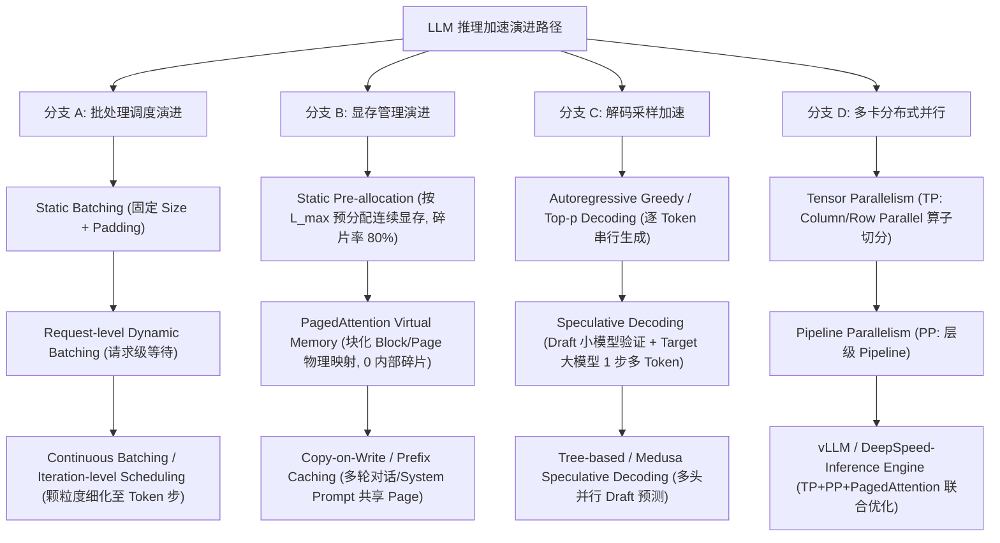
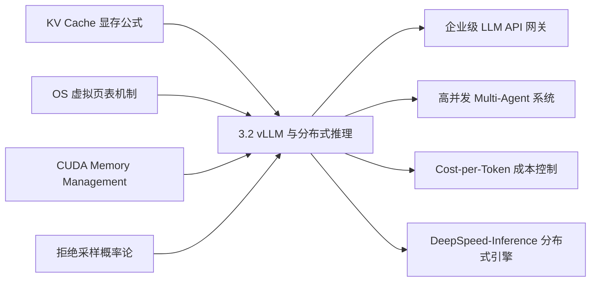

# 3.2 vLLM 与分布式推理加速：PagedAttention、Continuous Batching 与投机采样全栈解析

> **🎯 学习目标**
> - 深入剖析原生 PyTorch / Huggingface 原生推理在处理高并发请求时显存浪费高（60%~80% 碎片化）的本质原因。
> - 掌握 PagedAttention 虚拟页表机制、Continuous Batching 迭代级动态批处理与投机采样（Speculative Decoding）的核心原理。
> - 严密推导 PagedAttention 逻辑-物理块地址映射公式及投机采样的无偏拒绝重采样（Unbiased Rejection Sampling）概率证明。
> - 研读 6 层递进的“连环追问”面试链条，轻松应对高并发推理引擎（如 vLLM、DeepSpeed-Inference、TensorRT-LLM）底层系统架构考点。
> - 手写生产级可运行 Python 算法代码：`PagedAttentionBlockManager`（物理/逻辑显存块分配与回收）及 `SpeculativeDecodingSampler`（投机验证与拒绝重采样）。

---

## 📖 1. 导言与背景

在生成式大语言模型（LLM）落地生产环境的早期，大部分团队直接依赖 HuggingFace `transformers` 的 `generate()` 接口或原生 PyTorch 进行推理服务部署。然而，在面对真实用户高并发、非固定文本长度的 API 请求时，原生框架的表现堪称“灾难性”：单张 NVIDIA A100/H100 显卡的 GPU 利用率常常低于 20%，吞吐量极其低效。

### 原生 PyTorch/HuggingFace 推理的三大瓶颈

1. **静态 KV Cache 预分配引发严重的显存碎片（Memory Fragmentation & Waste）**：
   - 自回归解码（Autoregressive Decoding）需要缓存每一步生成的 Key 和 Value 向量（即 KV Cache）。由于原生框架必须保证显存指针的连续性，引擎往往被迫在请求到达时按**最大序列长度 $L_{\max}$（如 2048 或 40906）**预分配连续显存空间。
   - **内部碎片（Internal Fragmentation）**：绝大多数请求在生成几十或几百个 Token 后便提前结束，未使用的预分配显存空间被永久锁定。
   - **外部碎片（External Fragmentation）**：多请求并发交错申请与释放不同长度的显存，导致显存空间被切割得支离破碎，即使剩余总显存充足，也无法分配出一段连续的内存来容纳新请求。
   - 统计表明，原生推理框架中高达 **60%~80% 的 GPU 显存** 被内部/外部碎片化浪费。

2. **静态/请求级批处理（Request-level Static/Dynamic Batching）的木桶效应**：
   - 传统的 Dynamic Batching 以“请求（Request）”为单位组成 Batch。由于不同请求输入的 Prompt 长度不同、生成的 Output Token 数量也各异，Batch 内的所有序列必须 Padding（填充 zero）到该 Batch 中的最大长度。
   - 更严重的是，短序列请求早早生成结束（遇到 `<eos>` Token），但为了等待 Batch 中最长的序列完成，CPU/GPU 无法提前释放该短序列占用的显存，导致大量的无效空转计算（Padding Computation Flops）。

3. **内存墙与低算力利用率（Memory-Bound Decoding Stage）**：
   - LLM 推理分为两个阶段：**Prefill 阶段**（并行处理 Prompt，计算密集型 Compute-bound）和 **Decode 阶段**（逐 Token 自回归生成，访存密集型 Memory-bound，矩阵向量乘法 GEMV）。在 Decode 阶段，每生成一个 Token 都需要将数百 GB 的模型权重和 KV Cache 从 HBM（高带宽显存）加载至 SRAM/Tensor Core，算术强度（Arithmetic Intensity）极低。

2023 年，UC Berkeley 团队在 SOSP 论文中提出了 **vLLM (PagedAttention)**，结合 **Continuous Batching（连续/迭代级批处理）**，彻底打破了大模型推理服务的显存墙与并发瓶颈，将 LLM 服务吞吐量提升了 2~4 倍。

---

## 🌳 2. 推理加速技术演进分支树

下图展示了大模型推理加速技术从早期的静态分配与请求级批处理，演进至基于操作系统虚拟页表的 PagedAttention、迭代级 Continuous Batching、投机采样以及多卡分布式推理的并行演进路径：



---

## 🕸️ 3. 知识网格与图谱依赖

### 知识依赖关系表

| 前置知识（入度 / In-Degree） | 核心技术概念 | 后续衍生应用（出度 / Out-Degree） |
| :--- | :--- | :--- |
| • KV Cache 显存计算公式<br>• Self-Attention 算子复杂度<br>• 操作系统虚拟内存与页表 (Page Table)<br>• NVIDIA CUDA Memory Allocator (cudaMalloc) | **3.2 vLLM 与分布式推理加速**<br>(PagedAttention / Continuous Batching / Speculative Decoding) | • 企业级高并发 LLM API 网关部署<br>• 高吞吐 Agent 多轮会话引擎<br>• Cost-per-Token 推理成本优化<br>• 边缘端/小模型加速推理架构 |

### 知识图谱依赖 network



---

## 🧮 4. 显存页表映射与投机采样概率推导

### 4.1 PagedAttention 虚拟页表映射与物理索引计算

在 PagedAttention 中，显存不再需要连续分配。KV Cache 被切分为固定大小的 **Block（块，类似于 OS 的 Page）**，每个 Block 可容纳 $B$ 个 Token（如 $B=16$ 或 $B=32$）。

定义请求 $i$ 在第 $t$ 个序列位置的逻辑 KV Cache 索引为 $pos$。

#### 1. 逻辑块索引 (Logical Block Index) 与块内偏移 (Block Offset)：
$$\text{Logical Block Index} = \lfloor \frac{pos}{B} \rfloor$$

$$\text{Block Offset} = pos \pmod B$$

#### 2. 物理块索引映射 (Physical Block Table Lookup)：
通过维护一个动态映射表 `BlockTable`，获取物理显存中的 Block ID：
$$\text{Physical Block Index} = \text{BlockTable}[\text{Logical Block Index}]$$

#### 3. 物理显存绝对地址 (Physical Memory Address)：
设物理 KV Cache 存储基地址为 $P_{\text{base}}$，单个 Token 的 KV 向量在显存中的字节大小为 $S_{\text{token}} = 2 \times N_{\text{layers}} \times N_{\text{heads}} \times d_{\text{head}} \times \text{BytesPerElem}$：
$$\text{Physical Address} = P_{\text{base}} + \Big( \text{Physical Block Index} \times B + \text{Block Offset} \Big) \times S_{\text{token}}$$

> [!NOTE]
> 这种非连续的物理存储在计算 Attention 时，要求 CUDA Kernel（PagedAttention Kernel）能够接收一个指针数组（Block Table），在 Gather/Scatter 过程中根据索引列表寻址，从而避免了内存拷贝带来的性能损耗。

---

### 4.2 Speculative Decoding (投机采样) 无偏接受概率推导

投机采样的核心目标：**使用轻量级 Draft Model（小模型 $M_D$）预先并发生成 $\gamma$ 个 Token 候选，再用 Target Model（大模型 $M_T$）在一次 Forward pass 中并行校验这 $\gamma$ 个 Token。**

为了确保投机采样生成的文本分布与直接由大模型 $M_T$ 采样**100% 数学一致（Unbiased Sampling）**，必须设计严格的拒绝重采样（Rejection Sampling）机制。

#### 1. 接受概率公式 (Acceptance Criterion)：
对于 Draft Model 采样的第 $i$ 个 Token $x_i$，设 Draft Model 预测的概率分布为 $P_D(x)$，Target Model 预测的概率分布为 $P_T(x)$。
定义接受概率 $\alpha(x_i)$：

$$\alpha(x_i) = \min\left(1, \frac{P_T(x_i)}{P_D(x_i)}\right)$$

- 若 $P_T(x_i) \ge P_D(x_i)$，接受概率为 $1$（必定接受）。
- 若 $P_T(x_i) < P_D(x_i)$，以概率 $\frac{P_T(x_i)}{P_D(x_i)}$ 接受。

#### 2. 拒绝重采样概率分布 (Resampling Distribution)：
当 Token $x_i$ 被拒绝时，该位置及后续候选 Token 均被抛弃。此时，不能直接从 $P_T(x)$ 中重新采样，而必须从修正分布 $P_{\text{resample}}(x)$ 中采样：

$$P_{\text{resample}}(x) = \frac{\max(0, P_T(x) - P_D(x))}{\sum_{y} \max(0, P_T(y) - P_D(y))}$$

#### 3. 数学无偏性证明 (Unbiased Proof)：
我们需要证明：通过上述接受/拒绝重采样过程，最终生成的 Token 边缘分布 $P(x)$ 恰好等于目标大模型分布 $P_T(x)$。

**证明**：
输出 Token $x$ 来自两种互斥情况：(a) 来自 Draft 模型采样且被接受；(b) 被 Draft 模型拒绝后由修正分布重新采样。

$$P(x) = P(x \text{ 被接受}) + P(x \text{ 来自重采样})$$

$$\begin{aligned}
P(x) &= P_D(x) \cdot \alpha(x) + \left( 1 - \sum_{y} P_D(y) \alpha(y) \right) \cdot P_{\text{resample}}(x) \\
&= P_D(x) \cdot \min\left(1, \frac{P_T(x)}{P_D(x)}\right) + \left( 1 - \sum_{y} \min\big(P_D(y), P_T(y)\big) \right) \cdot \frac{\max(0, P_T(x) - P_D(x))}{\sum_{y} \max(0, P_T(y) - P_D(y))}
\end{aligned}$$

注意到：
$$\sum_{y} \max(0, P_T(y) - P_D(y)) = \sum_{y} \Big( P_T(y) - \min(P_D(y), P_T(y)) \Big) = 1 - \sum_{y} \min(P_D(y), P_T(y))$$

两项分子分母精确相消！代入原式化简：

$$P(x) = \min(P_D(x), P_T(x)) + \max(0, P_T(x) - P_D(x))$$

对于任意实数 $a, b$，恒有 $\min(a, b) + \max(0, a - b) = a$。因此：

$$P(x) = P_T(x)$$

**证毕！投机采样在数学上完全无偏，生成的输出概率分布与单体大模型完全相容。**

---

## 🔥 5. 连环面试追问 (Level 1~6 Onion Chain)

> [!IMPORTANT]
> 工业界 LLM 推理加速面试核心考察“内存管理”、“计算批处理调度”与“分布式并行算子”。以下 6 层递进追问专为大厂 AI Infrastructure 与 Engine 工程师岗位打造。

---

### Level 1: 内存瓶颈追问
**面试官**：*原生 PyTorch 在 HuggingFace `generate()` 模式下，为什么处理高并发长文本推理时会产生严重的显存碎片？*

**答题要点**：
1. **静态最大长度预分配**：原生 PyTorch 无法动态拓展张量显存，通常在请求创建时为 KV Cache 申请连续的显存空间（如预留 $L_{\max} = 4096$ 个 Token）。若实际用户请求仅生成 100 个 Token，剩下的 3996 个 Token 空间形成了无法被其他请求利用的**内部碎片（Internal Fragmentation）**。
2. **虚拟地址连续性限制**：CUDA 显存分配器（`cudaMalloc`）需要连续的物理显存块。当大量不同存活周期的请求并发交错申请和释放显存时，显存会被割裂为大量微小的闲置空洞（**外部碎片 External Fragmentation**），导致即使整体剩余显存量大，也无法找到足够的连续空间分配给新的 Batch，触发 OOM。

---

### Level 2: 虚拟内存机制追问
**面试官**：*PagedAttention 是如何借鉴操作系统 OS 虚拟内存中的 Page Table 概念来解决上述碎片问题的？*

**答题要点**：
1. **块化管理（Block Allocation）**：PagedAttention 将显存划分成固定大小的物理块（Physical Blocks，例如每个 Block 存储 16 个 Token 的 KV 张量）。
2. **逻辑到物理映射（Page Table）**：每个 Request 拥有一个动态增长的 `BlockTable`（逻辑块 $\rightarrow$ 物理块）。物理块在显存中可以完全不连续。
3. **零内部碎片与极低外部碎片**：只在序列生成突破当前 Block 容量上限时，才向全局 Block 缓冲池申请一个新 Block。内部碎片仅存在于最后一个未填满的 Block 内（碎片率 $< 1/\text{BlockSize}$，即 $< 6.25\%$）；释放显存时直接将物理 Block 归还给 Free Queue，消除了外部碎片。
4. **Copy-on-Write (写时复制) 与 Prefix Caching**：对于多轮对话或共享 System Prompt 的场景，多个请求的 `BlockTable` 可以直接指向同一组物理 Block（引用计数 $+1$）。当某请求需要修改内容时，再触发 Copy-on-Write 复制该 Block，极大节省了显存。

---

### Level 3: 调度并发追问
**面试官**：*什么是 Continuous Batching（迭代级/连续批处理）？它与传统的 Request-level Dynamic Batching 有何本质区别？*

**答题要点**：
1. **控制粒度不同**：
   - **Request-level Batching**：以整个 Request 声明周期为单位进行 Batch 操作。先到的 Request 必须等待同 Batch 中的慢 Request 生成结束才能一起返回，产生了巨大的 Padding 浪费。
   - **Continuous Batching (Iteration-level)**：以自回归的 **单步迭代（Step/Iteration）** 为粒度进行调度。
2. **动态插入与移出**：
   - 每完成一次 Step 迭代，调度器（Scheduler）会检查当前运行队列。若有请求生成了 `<eos>`，立即将其移出 Batch 并释放其物理 Block。
   - 同时，若全局物理 Block 尚有剩余，调度器会立刻从 Waiting Queue 中引入新的请求加入当前 Iteration 进行 Prefill/Decode。
3. **消除 Padding**：通过将不同 Request 的 KV Cache 物理指针直接拼接到 PagedAttention 的 Custom CUDA Kernel 中，完全消除了 Tensor 层面显存 Padding 的算力开销。

---

### Level 4: 投机采样无偏性追问
**面试官**：*投机采样 (Speculative Decoding) 是如何做到在完全保证生成分布与目标大模型 100% 数学一致（Unbiased）的前提下实现加速的？请简述其采样规则。*

**答题要点**：
1. **Draft 预测与 Target 并行验证**：Draft 小模型 $M_D$ 自回归顺序生成 $\gamma$ 个候选 Token（如 5 个），Target 大模型 $M_T$ 在一次前向传播中同时计算这 $\gamma$ 个 Token 以及下一个 Token 的 Logits 分布。
2. **拒绝采样验证**：对第 $i$ 个 Token $x_i$，以概率 $\alpha = \min\left(1, \frac{P_T(x_i)}{P_D(x_i)}\right)$ 决定是否接受。
3. **修正分布重采样**：一旦第 $k$ 个 Token 被拒绝，终止后续校验，并从修正分布 $P_{\text{resample}}(x) = \frac{\max(0, P_T(x) - P_D(x))}{\sum \max(0, P_T - P_D)}$ 中采样出正确的第 $k$ 个 Token。数学证明表明（见第 4 节推导），接受项与重采样项相加刚好严格相消恢复出 $P_T(x)$。
4. **加速来源**：大模型 $M_T$ 的一次 Forward pass 开销与 Token 数量非线性正相关（Memory-bound 阶段 Batch 内多几个 Token 开销几乎不变），因此用一次大模型 Forward 换取平均 2~3 个 Token 的接受，获得了极高的 Wall-clock 墙上时间加速比。

---

### Level 5: 投机采样性能瓶颈追问
**面试官**：*当 Draft Model 与 Target Model 尺寸差距过大或过小时，投机采样的加速效果会发生什么变化？如何平衡 Accept Rate 与 Overlap 计算开销？*

**答题要点**：
1. **Draft Model 过大**：
   - *现象*：Draft Model 预测准确率高，接受率 $\alpha \to 1.0$；但 Draft Model 自身生成 $\gamma$ 个 Token 的延迟太高（例如占用了大模型 50% 的推理时间），导致整体吞吐反而降低甚至比纯大模型更慢。
2. **Draft Model 过小**：
   - *现象*：Draft Model 生成极快，但模型能力与 Target 差距过大，接受率 $\alpha \to 0$。每次验证几乎首个 Token 就被拒绝，大模型每次前向传播只能产出 1 个 Token，还额外承担了 Draft 模型生成与拒绝检验的浪费。
3. **最优平衡条件**：
   - 加速比公式：$\text{Speedup} = \frac{1 - \alpha^{\gamma+1}}{(1-\alpha)(\gamma \cdot c + 1)}$，其中 $c = \frac{\text{Latency}(M_D)}{\text{Latency}(M_T)}$。
   - 经验最佳范式：Draft 模型参数量一般为 Target 模型的 **1% ~ 5%**（如 70B Target 配 1B/3B Draft），或者使用 **Medusa / Eagle** 等共享 Backbone 的多头预测架构（无需独立小模型）。

---

### Level 6: 分布式推理并行追问
**面试官**：*在多卡/多节点分布式推理场景中，vLLM 与 DeepSpeed-Inference 的 Tensor Parallelism (TP) 与 Pipeline Parallelism (PP) 调度策略有何异同？*

**答题要点**：
1. **Tensor Parallelism (TP, 张量并行)**：
   - *机制*：按 Column/Row 切分 MLP 与 Attention 权重矩阵（Megatron-LM 范式）。每个 Step 在 Attention 后与 MLP 后分别需要一次 `All-Reduce` 通信。
   - *适用场景*：单节点多卡（NVLink 高带宽互联）。因为 TP 通信频率极高（每层两次），必须依赖 600GB/s ~ 900GB/s 的 NVLink 才能掩盖通信开销。
2. **Pipeline Parallelism (PP, 流水线并行)**：
   - *机制*：按 Layer 组切分模型放置在不同节点/卡上（如 1~16 层卡 0，17~32 层卡 1）。仅在节点交界层发送 Activation 张量（`P2P` 通信）。
   - *适用场景*：跨节点（InfiniBand 或 100G RoCE 网卡）。
3. **vLLM 与 DeepSpeed-Inference 的联合优化**：
   - **vLLM**：TP 进程组间共享同一个全局 `BlockManager` 逻辑控制面，每个 GPU 上的 PagedAttention Kernel 依据相同的 Block Table 切片并行计算 Attention。
   - **DeepSpeed-Inference**：引入 Custom CUDA GEMM 融合算子与 DeepSpeed-MoE 针对 Sparse MoE 路由的异步通信掩盖（Overlapping Communication with Computation）。

---

## 💻 6. Python 算法实战

本节提供两个完全独立的可运行 Python 算法类：
1. `PagedAttentionBlockManager`：模拟物理显存块管理、逻辑页表映射及引用计数/Copy-on-Write 机制。
2. `SpeculativeDecodingSampler`：模拟 Draft 模型采样、Target 模型验证及无偏拒绝重采样过程。

```python
import numpy as np
import torch
import torch.nn.functional as F
from typing import List, Dict, Tuple, Optional

# ==========================================
# 1. PagedAttention 物理与逻辑显存块管理器
# ==========================================

class PhysicalBlock:
    """物理显存块表示"""
    def __init__(self, block_id: int, block_size: int):
        self.block_id = block_id
        self.block_size = block_size
        self.ref_count = 0  # 引用计数 (用于 Copy-on-Write / Prefix Caching)

    def is_free(self) -> bool:
        return self.ref_count == 0


class PagedAttentionBlockManager:
    """
    模拟 vLLM 核心的 PagedAttention 显存块分配器与 Page Table 管理器
    """
    def __init__(self, num_physical_blocks: int, block_size: int = 16):
        self.block_size = block_size
        self.num_physical_blocks = num_physical_blocks
        
        # 初始化物理显存块池
        self.gpu_blocks: List[PhysicalBlock] = [
            PhysicalBlock(i, block_size) for i in range(num_physical_blocks)
        ]
        # 空闲物理块队列
        self.free_block_ids: List[int] = list(range(num_physical_blocks))
        
        # 请求 ID -> 逻辑 BlockTable [Logical Block Index -> Physical Block ID]
        self.req_to_block_table: Dict[str, List[int]] = {}

    def allocate_request(self, req_id: str, prompt_token_len: int) -> bool:
        """为新到达的 Request 依据 Prompt 长度分配初始 Blocks"""
        num_blocks_needed = (prompt_token_len + self.block_size - 1) // self.block_size
        
        if len(self.free_block_ids) < num_blocks_needed:
            print(f"[Allocation Failed] Insufficient physical blocks for req {req_id}. Needed: {num_blocks_needed}, Free: {len(self.free_block_ids)}")
            return False
            
        block_table = []
        for _ in range(num_blocks_needed):
            block_id = self.free_block_ids.pop(0)
            self.gpu_blocks[block_id].ref_count = 1
            block_table.append(block_id)
            
        self.req_to_block_table[req_id] = block_table
        print(f"[Allocated] Req '{req_id}': Allocated {num_blocks_needed} blocks -> Physical IDs: {block_table}")
        return True

    def append_slot(self, req_id: str, current_seq_len: int) -> int:
        """
        在 Decode 阶段生成新的 Token 时拓展逻辑 Block
        返回该 Token 所在的 Physical Block Index 以及 Block Offset
        """
        block_table = self.req_to_block_table[req_id]
        logical_block_idx = current_seq_len // self.block_size
        block_offset = current_seq_len % self.block_size
        
        # 判断是否需要动态向 free queue 申请新的 Physical Block
        if logical_block_idx >= len(block_table):
            if not self.free_block_ids:
                raise RuntimeError("Out of GPU Memory: Free physical blocks exhausted during decode!")
            new_block_id = self.free_block_ids.pop(0)
            self.gpu_blocks[new_block_id].ref_count = 1
            block_table.append(new_block_id)
            print(f"[Block Appended] Req '{req_id}': Capacity reached. Appended physical block ID {new_block_id}")
            
        physical_block_id = block_table[logical_block_idx]
        return physical_block_id, block_offset

    def free_request(self, req_id: str):
        """请求生成结束，释放显存块并增加 Free Queue 供给"""
        if req_id not in self.req_to_block_table:
            return
            
        block_table = self.req_to_block_table[req_id]
        for b_id in block_table:
            block = self.gpu_blocks[b_id]
            block.ref_count -= 1
            if block.ref_count == 0:
                self.free_block_ids.append(b_id)
                
        del self.req_to_block_table[req_id]
        print(f"[Freed] Req '{req_id}': Freed {len(block_table)} blocks. Total free blocks: {len(self.free_block_ids)}")

    def get_physical_address(self, req_id: str, pos: int) -> Tuple[int, int]:
        """将逻辑位置 pos 转换为 (Physical Block ID, Offset)"""
        logical_idx = pos // self.block_size
        offset = pos % self.block_size
        physical_block_id = self.req_to_block_table[req_id][logical_idx]
        return physical_block_id, offset


# ==========================================
# 2. 投机采样 (Speculative Decoding) 拒绝采样器
# ==========================================

class SpeculativeDecodingSampler:
    """
    模拟无偏投机采样 (Speculative Decoding Rejection Sampler) 逻辑
    """
    def __init__(self, vocab_size: int):
        self.vocab_size = vocab_size

    def sample_from_probs(self, probs: torch.Tensor) -> int:
        """根据概率分布概率进行 Categorical 采样"""
        return int(torch.multinomial(probs, num_samples=1).item())

    def verify_and_sample(
        self,
        draft_tokens: List[int],
        draft_probs: List[torch.Tensor],  # List of [Vocab_Size] tensors for each position
        target_probs: List[torch.Tensor]  # List of [Vocab_Size] tensors for draft positions + 1 extra
    ) -> Tuple[List[int], str]:
        """
        根据概率校验 Draft Tokens 并执行拒绝重采样
        Returns:
            accepted_tokens: 最终接受并采样的 Token 列表
            reason: 终止拒绝的原因说明
        """
        accepted_tokens = []
        gamma = len(draft_tokens)
        
        for i in range(gamma):
            token = draft_tokens[i]
            p_d = draft_probs[i][token].item()
            p_t = target_probs[i][token].item()
            
            # 计算接受率 alpha = min(1, P_T(x) / P_D(x))
            alpha = min(1.0, p_t / (p_d + 1e-10))
            r = np.random.uniform(0.0, 1.0)
            
            if r < alpha:
                # 接受 Draft Token
                accepted_tokens.append(token)
            else:
                # 拒绝该 Token，计算修正重采样概率分布 P_resample = max(0, P_T - P_D)
                p_t_tensor = target_probs[i]
                p_d_tensor = draft_probs[i]
                
                diff = F.relu(p_t_tensor - p_d_tensor)
                sum_diff = diff.sum()
                
                if sum_diff > 0:
                    p_resample = diff / sum_diff
                else:
                    p_resample = p_t_tensor  # 回退到 Target 原分布
                    
                resampled_token = self.sample_from_probs(p_resample)
                accepted_tokens.append(resampled_token)
                
                reason = f"Draft token at index {i} (Token {token}) REJECTED (alpha={alpha:.4f}, r={r:.4f}). Resampled token {resampled_token}."
                return accepted_tokens, reason
                
        # 如果 gamma 个 Draft Tokens 全部被接受，从 Target Model 预测的第 gamma+1 个分布中采样额外 Token
        extra_token = self.sample_from_probs(target_probs[gamma])
        accepted_tokens.append(extra_token)
        reason = f"All {gamma} draft tokens ACCEPTED! Sampled extra token {extra_token} from Target model."
        
        return accepted_tokens, reason


# ==========================================
# 3. 单元测试与单元演示
# ==========================================

if __name__ == "__main__":
    print("====== 1. 测试 PagedAttention Block Allocator ======")
    manager = PagedAttentionBlockManager(num_physical_blocks=8, block_size=16)
    
    # 模拟请求 A 到达 (Prompt 长度 30 Tokens -> 需要 2 个 Blocks)
    manager.allocate_request("req_A", prompt_token_len=30)
    
    # 模拟请求 B 到达 (Prompt 长度 45 Tokens -> 需要 3 个 Blocks)
    manager.allocate_request("req_B", prompt_token_len=45)
    
    # 模拟请求 A 进行 Decode 扩展生成 Token
    p_id, offset = manager.append_slot("req_A", current_seq_len=31)
    print(f"Req A Token at pos 31 maps to Physical Block: {p_id}, Offset: {offset}")
    
    # 模拟请求 A 跨越边界达到 32 Token，触发新 Block 分配
    p_id_new, offset_new = manager.append_slot("req_A", current_seq_len=32)
    print(f"Req A Token at pos 32 maps to Physical Block: {p_id_new}, Offset: {offset_new}")
    
    # 释放请求 B
    manager.free_request("req_B")
    
    print("\n====== 2. 测试 Speculative Decoding Sampler ======")
    vocab_size = 1000
    sampler = SpeculativeDecodingSampler(vocab_size=vocab_size)
    
    # 构造虚构的概率分布
    gamma = 3
    draft_tokens = [42, 108, 999]
    
    draft_probs = []
    target_probs = []
    
    for i in range(gamma):
        # Draft Model 预测分布
        d_p = torch.softmax(torch.randn(vocab_size), dim=-1)
        # Target Model 预测分布
        t_p = torch.softmax(torch.randn(vocab_size), dim=-1)
        
        # 人为设置让前两个 Token 大概率接受，第 3 个 Token 被拒绝
        if i < 2:
            t_p[draft_tokens[i]] = d_p[draft_tokens[i]] * 1.5  # alpha >= 1.0
        else:
            d_p[draft_tokens[i]] = 0.9
            t_p[draft_tokens[i]] = 0.01  # alpha 很小，必定触发拒绝
            
        draft_probs.append(d_p)
        target_probs.append(t_p)
        
    # 为 Target 模型的第 gamma + 1 位置添加概率分布
    target_probs.append(torch.softmax(torch.randn(vocab_size), dim=-1))
    
    tokens, log_reason = sampler.verify_and_sample(draft_tokens, draft_probs, target_probs)
    print(f"Speculative Decoding Output Tokens: {tokens}")
    print(f"Verification Detail: {log_reason}")
```

---

## 🔗 7. 扩展学习与多维资源

### 🎬 演讲与视频课程
- **vLLM Kwon (UC Berkeley) SOSP 2023 论文演讲**:
  - 视频链接: [SOSP 2023: Efficient Memory Management for Large Language Model Serving with PagedAttention](https://www.youtube.com/watch?v=8O_sR2M4z9Y)
  - 推荐点: 创作者亲自讲解物理/逻辑 Block 映射以及如何在 CUDA 层面实现高并发共享 Prefix KV Cache。

### 📄 经典学术论文
- **PagedAttention / vLLM 论文**:
  - Kwon et al., *"Efficient Memory Management for Large Language Model Serving with PagedAttention"*, SOSP 2023. [arXiv:2309.06180](https://arxiv.org/abs/2309.06180)
- **投机采样 (Speculative Decoding) 奠基论文**:
  - Leviathan et al., *"Fast Inference from Transformers via Speculative Decoding"*, ICML 2023. [arXiv:2211.17192](https://arxiv.org/abs/2211.17192)
  - Chen et al., *"Accelerating Large Language Model Decoding with Speculative Sampling"*, arXiv 2023. [arXiv:2302.01318](https://arxiv.org/abs/2302.01318)

### 🐙 推荐开源仓库与底层代码锚点
- **vLLM 官方仓库**: [`vllm-project/vllm`](https://github.com/vllm-project/vllm)
  - 核心源码锚点: `vllm/core/block_manager_v1.py`（物理/逻辑块分配与回收机制实现）。
  - 核心 CUDA 算子: `csrc/paged_attention_kernels.cu`（PagedAttention 的 C++/CUDA Kernel 源码）。
- **DeepSpeed 官方仓库**: [`microsoft/DeepSpeed`](https://github.com/microsoft/DeepSpeed)
  - 核心源码锚点: `deepspeed/inference/v2/`（DeepSpeed-Inference 2.0 分布式引擎）。
