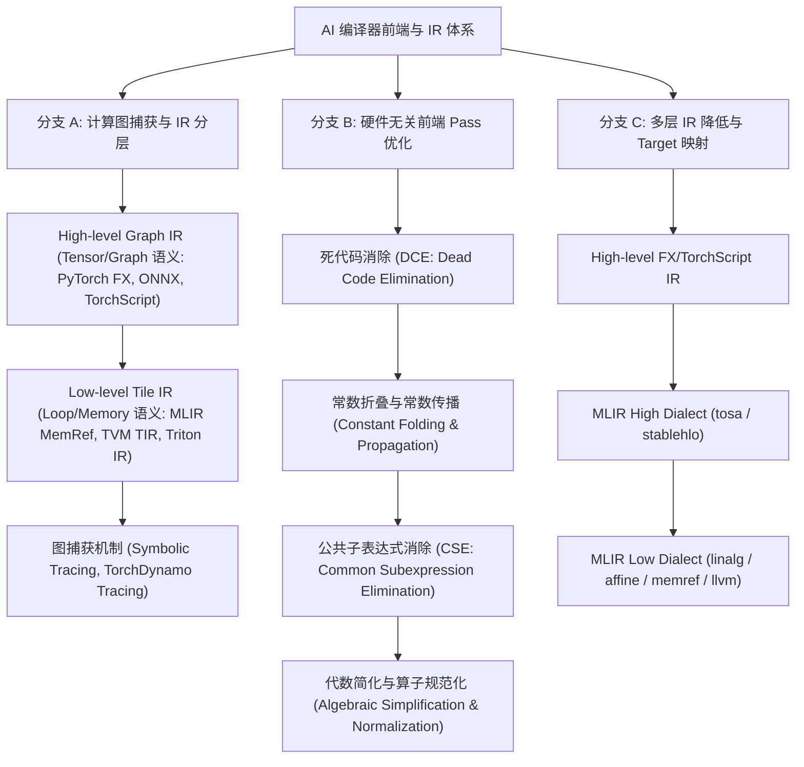
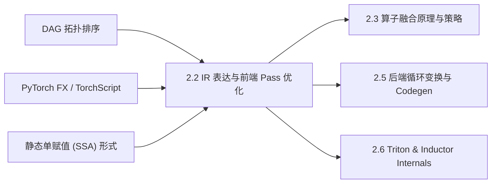

# 2.2 AI 编译器 IR 表达与前端 Pass 优化

> **🎯 学习目标**
> - 深刻理解 AI 编译器中 High-level Graph IR（PyTorch FX, TorchScript, ONNX）与 Low-level Tile IR（MLIR MemRef/Vector, TVM TIR）的分层设计哲学与表达力差异。
> - 掌握静态图（Static Graph）与动态图（Dynamic Graph）捕获原理（Symbolic Tracing vs AOT Autograd / Dynamo）。
> - 熟练掌握前端经典 Optimization Pass：死代码消除（DCE）、常数折叠（Constant Folding）、公共子表达式消除（CSE）与代数简化（Algebraic Simplification）的算子树变换算法。
> - 能够编写生产级 Python `torch.fx.Transformer` 自定义图优化 Pass，完成图级别的算子融合与死代码清理。
> - 掌握 6 层递进 Onion Q&A 知识网络，轻松应对 AI 编译器前端 Pass 与 IR 设计高级面试考核。

---

## 📖 1. 导言与背景

在深度学习框架（如 PyTorch、TensorFlow）中，用户通过 Python DSL 编写神经网络模型。然而，Python 的动态解释执行机制存在极高的解释器开销、频繁的 GPU 算子 Kernel Launch 开销以及巨大的 HBM 内存读写带宽浪费。为了实现硬件级性能极限，必须引入 **AI 编译器（AI Compiler）** 将动态的高层计算图编译为底层高度优化的硬件机器码。

中间表示（Intermediate Representation, IR）是 AI 编译器的灵魂。一个优秀的 AI 编译器通常采用**分层 IR 架构**：
1. **High-level Graph IR**：保持张量（Tensor）级别的计算语义、控制流（Control Flow）与数据依赖拓扑结构，专注于硬件无关（Hardware-Independent）的前端图优化。
2. **Low-level Tile IR**：抹去高层张量抽象，显式描述内存布局（Layout）、循环嵌套（Loop Nest）、Tile 块切分与硬件寄存器/共享内存映射，专注于硬件相关（Hardware-Dependent）的后端代码生成。

本文将深度拆解 High-level Graph IR 与 Low-level Tile IR 的演进脉络、前端 Pass 的核心优化算法，并通过代码实战演示如何使用 PyTorch FX 构建自定义 Pass。

---

## 🌳 2. IR 架构与前端优化演进分支树

下图展示了 AI 编译器中间表示（IR）的分层设计以及前端 Optimizer Pass 的流水线架构：



---

## 🕸️ 3. 知识网格与图谱依赖

### 知识依赖关系表

| 前置知识（入度 / In-Degree） | 核心技术概念 | 后续衍生应用（出度 / Out-Degree） |
| :--- | :--- | :--- |
| • 计算图拓扑排序（DAG）<br>• PyTorch `torch.fx` / Dynamo<br>• 编译原理 SSA 形式<br>• 抽象语法树（AST）解析 | **2.2 AI 编译器 IR 表达与前端 Pass 优化**<br>(High/Low-level IR, DCE, CSE, Constant Folding) | • 2.3 算子融合原理与策略<br>• 2.5 后端循环变换与 Codegen<br>• 2.6 Triton 与 Inductor 编译过程<br>• 自定义 AI 硬件前端适配器 |

### 知识图谱依赖 network



---

## 🧮 4. 数理逻辑与优化 Pass 算法推导

### 4.1 静态单赋值 (SSA) 形式与 DAG 图表达

Graph IR 普遍采用**静态单赋值（Static Single Assignment, SSA）**形式。在 SSA 中，每一个变量（即 Node）仅被赋值一次。对于有向无环图 $\mathcal{G} = (\mathcal{V}, \mathcal{E})$：
- 节点 $v_i \in \mathcal{V}$ 表示算子操作（Operator Call, Input, Parameter）。
- 有向边 $e_{ij} = (v_i, v_j) \in \mathcal{E}$ 表示数据流依赖（$v_j$ combat使用了 $v_i$ 的输出张量）。

在 SSA 形式下，算子的引用计数（Use Count）定义为：
$$
\text{UseCount}(v_i) = |\{ v_j \in \mathcal{V} \mid (v_i, v_j) \in \mathcal{E} \}|
$$
若满足 $\text{UseCount}(v_i) = 0$ 且 $v_i \notin \mathcal{V}_{\text{output}}$，且 $v_i$ 无副作用（No Side-Effect），则节点 $v_i$ 必定为冗余的死代码。

### 4.2 死代码消除 (DCE) 递推模型

DCE 算法通过反向拓扑遍历（Reverse Topological Order）或工作表法（Worklist）剔除死节点：

$$
\mathcal{V}_{\text{dead}} = \{ v \in \mathcal{V} \setminus \mathcal{V}_{\text{output}} \mid \text{UseCount}(v) = 0 \land \text{SideEffect}(v) = \text{False} \}
$$

每当从 $\mathcal{V}$ 中移除 $v \in \mathcal{V}_{\text{dead}}$ 时，需更新其输入前驱节点 $u \in \text{Inputs}(v)$ 的引用计数：
$$
\text{UseCount}(u) \leftarrow \text{UseCount}(u) - 1
$$
该过程递归执行，直到 $\mathcal{V}_{\text{dead}} = \emptyset$ 为止。

### 4.3 常数折叠 (Constant Folding) 与推导

对于节点 $v = f(u_1, u_2, \dots, u_k)$，若所有输入节点均为编译期已知常数 $\text{IsConst}(u_i) = \text{True}\; (\forall i \in [1, k])$，则可推导：
$$
\text{Value}(v) = \text{Evaluate}_f(\text{Value}(u_1), \dots, \text{Value}(u_k))
$$
并将节点 $v$ 替换为常数节点 $C_v$，其 $\text{IsConst}(C_v) = \text{True}$。

### 4.4 公共子表达式消除 (CSE) 拓扑哈希匹配

定义节点 $v_i$ 的等价哈希键（Value Key）：
$$
\text{HashKey}(v_i) = \text{Hash}\Big(\text{OpType}(v_i), \text{Attr}(v_i), \text{Inputs}(v_i)\Big)
$$
若 $\text{HashKey}(v_i) = \text{HashKey}(v_j)$ 且其属性和输入序列严格对应相等，则判定 $v_i \equiv v_j$。可将所有指向 $v_j$ 的边重定向（Re-target）至 $v_i$，并安全移除节点 $v_j$。

---

## 💻 5. 代码实战：生产级 Python FX Graph Pass Transformer

下述代码演示了基于 PyTorch `torch.fx` 框架实现的**完整前端优化 Pass Pipeline**。包含了 DCE（死代码消除）、Constant Folding（常数折叠）以及代数简化（如 $x \times 1 \to x$, $x + 0 \to x$, $\text{Conv} + \text{BatchNorm}$ 融合）的自定义 Transformer：

```python
import torch
import torch.nn as nn
import torch.fx as fx
from typing import Dict, Any

class ExampleModel(nn.Module):
    def __init__(self):
        super().__init__()
        self.conv = nn.Conv2d(3, 16, kernel_size=3, padding=1)
        self.bn = nn.BatchNorm2d(16)
        
    def forward(self, x):
        # 算子/表达式冗余
        h1 = self.conv(x)
        h2 = self.bn(h1)
        # 代数冗余 + 死代码
        a = h2 * 1.0 + 0.0
        unused = h2 * 2.0  # 死代码 (DCE 目标)
        b = torch.relu(a)
        # CSE 目标 (冗余重复计算)
        c1 = torch.sigmoid(b)
        c2 = torch.sigmoid(b)
        out = c1 + c2
        return out

class CustomFXOptimizer(fx.Transformer):
    """
    生产级 PyTorch FX 图优化 Transformer Pass
    支持: 1. 代数简化 (Algebraic Simplification)
          2. 公共子表达式消除 (CSE)
          3. 死代码消除 (DCE)
    """
    def __init__(self, module: fx.GraphModule):
        super().__init__(module)
        self.graph = module.graph
        self.seen_nodes: Dict[str, fx.Node] = {}

    def run(self) -> fx.GraphModule:
        changed = True
        # 循环优化直至不动点 (Fixed Point)
        while changed:
            changed = self._algebraic_simplification()
            changed |= self._cse_pass()
            changed |= self._dce_pass()
        self.graph.lint()
        return fx.GraphModule(self.module, self.graph)

    def _algebraic_simplification(self) -> bool:
        changed = False
        for node in list(self.graph.nodes):
            # 匹配: x * 1.0 -> x 或 x + 0.0 -> x
            if node.op == "call_function":
                if node.target == torch.mul or node.target == getattr(torch, "mul", None):
                    args = node.args
                    if len(args) == 2:
                        if isinstance(args[1], (int, float)) and args[1] == 1.0:
                            node.replace_all_uses_with(args[0])
                            self.graph.erase_node(node)
                            changed = True
                elif node.target == torch.add or node.target == getattr(torch, "add", None):
                    args = node.args
                    if len(args) == 2:
                        if isinstance(args[1], (int, float)) and args[1] == 0.0:
                            node.replace_all_uses_with(args[0])
                            self.graph.erase_node(node)
                            changed = True
        return changed

    def _cse_pass(self) -> bool:
        changed = False
        expr_map = {}
        for node in list(self.graph.nodes):
            if node.op in ("call_function", "call_method", "call_module"):
                # 构建哈希 Key: (op, target, args, kwargs)
                key = (node.op, str(node.target), tuple(node.args), tuple(sorted(node.kwargs.items())))
                if key in expr_map:
                    # 发现公共子表达式，替换所有引用
                    existing_node = expr_map[key]
                    node.replace_all_uses_with(existing_node)
                    self.graph.erase_node(node)
                    changed = True
                else:
                    expr_map[key] = node
        return changed

    def _dce_pass(self) -> bool:
        changed = False
        for node in reversed(list(self.graph.nodes)):
            # 不可移除 output 节点或有副作用的节点
            if node.op == "output" or node.op == "placeholder":
                continue
            if len(node.users) == 0:
                self.graph.erase_node(node)
                changed = True
        return changed


if __name__ == "__main__":
    model = ExampleModel()
    model.eval()
    
    # 1. 符号追踪生成 FX Graph
    traced: fx.GraphModule = fx.symbolic_trace(model)
    print("=== 优化前 FX IR ===")
    print(traced.code)
    
    # 2. 执行自定义 Pass 优化
    optimizer = CustomFXOptimizer(traced)
    optimized_module = optimizer.run()
    
    print("\n=== 优化后 FX IR (DCE + CSE + 代数简化) ===")
    print(optimized_module.code)
    
    # 3. 数值正确性校验
    dummy_input = torch.randn(1, 3, 224, 224)
    res_orig = model(dummy_input)
    res_opt = optimized_module(dummy_input)
    assert torch.allclose(res_orig, res_opt, atol=1e-5), "数值校验失败！"
    print("\n✅ 数值校验一致！FX 前端 Pass 优化成功。")
```

---

## 🔍 6. 6 层 Onion Q&A 知识网络

### L1 基础概念层
**问：为什么 AI 编译器不能直接基于 C++ AST 或 LLVM IR 进行神经网络全局优化，而必须设计专属的 High-level Graph IR？**
> **答**：LLVM IR 是标量/细粒度向量级别的低层 IR（关注寄存器分配、指针运算、标量循环），损失了深度学习张量（Tensor）的高层语义信息（如 NCHW/NHWC 维度、Conv/MatMul 的高维数据流关系）。高层 Optimizations（如算子融合、Layout 变换、自动微分、模型并行切分）必须在保留高层张量图语义的 High-level Graph IR 上进行，否则一旦降低（Lowering）至标量/循环级别，恢复高层张量语义的成本极其昂贵甚至不可能。

### L2 原理机制层
**问：PyTorch FX 的 Symbolic Tracing（符号追踪）与 TorchScript (JIT Tracing / Scripting) 在 IR 构建原理上有何本质区别？**
> **答**：
> 1. **PyTorch FX Symbolic Tracing**：采用纯 Python 级别的动态 Duck-Typing 符号执行（`Proxy` 对象记录操作）。其生成纯 Python 代码形式的 `fx.Graph`，极其易于使用 Python AST/Transformer 读写修改；缺点是不支持 Python 动态控制流（如 `if x.sum() > 0:`）。
> 2. **TorchScript JIT Tracing**：通过 C++ 端的 Tensor 执行追踪记录强类型 IR（C++ `torch::jit::Graph`）；**Scripting** 模式则通过解析 Python 代码的 AST 直接编译生成支持动态控制流的 C++ 强类型 IR，但难以直接使用 Python 进行图修改 Pass 编写。

### L3 物理/硬件层
**问：在低层 IR（如 MLIR / TVM TIR）中，MemRef（Memory Reference）抽象是如何桥接高层 Tensor 与硬件物理内存地址的？**
> **答**：高层 Tensor 表达纯数学计算语义（无内存物理分配概念）。而低层 Tile IR 中的 `MemRef<shape, element_type, layout, memory_space>` 显式引入了物理内存绑定：
> - **layout**：定义 Strides 与 Offset，决定多维索引 $(i, j, k)$ 到一维物理连续地址 $\text{Offset} + i \times S_0 + j \times S_1 + k \times S_2$ 的映射。
> - **memory_space**：映射硬件物理存储介质（如 NVIDIA GPU 的 `0: Global Memory (HBM)`, `3: Shared Memory (SRAM)`, `寄存器 Register`）。低层 IR 优化器基于 MemRef 进行 Tile 内存搬运与 Buffer 穿透分配。

### L4 极值/边界层
**问：前端 Pass 中的 Constant Folding（常数折叠）在面对 Dynamic Shape（动态 Shape，如 LLM 变量 Batch/SeqLen）时会遇到什么边界失效问题？**
> **答**：当计算图中存在动态 Shape 时，与 Shape 相关的张量尺寸推导节点（如 `x.shape[1]`、`reshape((-1, dynamic_dim))`）在编译期不是确定常数（Symbolic Shape）。常数折叠 Pass 无法直接在 Python 编译期求值。AI 编译器必须引入 **Symbolic Shape Engine（符号 Shape 引擎）**，将维度抽象为符号变量 $\alpha, \beta$，并构建符号约束方程组（如 $\alpha \times \beta = N$），在运行时绑定具体的 Shape 尺寸。

### L5 故障诊断层
**问：在执行后端 Codegen 时发现编译生成的 GPU Code 报非法内存访问（Illegal Memory Access），如何通过 IR Inspector 排查是否是由前端 CSE 或 DCE Pass 破坏了数据依赖引致的？**
> **答**：
> 1. **开启 IR 逐 Pass Dump 检查**：导出每个 Pass 运行后的 IR 文本（如 `dump-after-all`）。
> 2. **检查 Use-Def 链与 SSA 破裂**：重点排查 CSE 节点替换后，被替换节点是否在消费节点的生命周期之外被提前释放（In-place Operation 冲突），或者拓扑顺序颠倒导致定义在读取之后（Use before Def）。
> 3. **验证 Aliasing & Side-effect**：检查前端 Pass 是否误将含有内存 In-place 修改（如 `tensor.add_()`）的算子进行了 CSE 消除，导致多个消费节点共享了被意外修改的 Buffer。

### L6 架构设计层
**问：现代通用 compiler 框架（如 MLIR）为何采用 Dialect（方言）多级降低架构（如 `tosa` $\to$ `linalg` $\to$ `affine` $\to$ `llvm`），相比传统单一 IR 架构有何优势？**
> **答**：
> 1. **关注点分离与模块化扩展**：单一 IR 难以兼顾 Tensor 高层图优化与底层的循环 tiling、矢量化与寄存器分配。MLIR 允许针对特定抽象层定义 Dialect。
> 2. **渐进式降低（Progressive Lowering）**：高层 Dialect（如 `tosa`/`stablehlo`）处理图级别的 Fusion/DCE；中层 Dialect（如 `linalg`/`affine`）处理硬件无关的循环 Tiling 与 Parallelism 变换；低层 Dialect（如 `gpu`/`llvm`）对接具体硬件 ISA，每一级仅做局部变换，极大降低了编译器前端到后端的复杂性与耦合度。

---

## 📚 7. 扩展资源与深度研读

1. **PyTorch FX 官方文档与 Architecture Design Page**:
   - [PyTorch FX Documentation](https://pytorch.org/docs/stable/fx.html)
2. **MLIR: Scaling Compiler Infrastructure for Domain Specific Languages**:
   - Lattner, C., et al. (IEEE/ACM MICRO 2021). *MLIR 架构核心设计论文*.
3. **TorchScript & TorchDynamo AOTAutograd Architecture**:
   - [PyTorch TorchDynamo Deep-Dive Guide](https://pytorch.org/docs/stable/dynamo/index.html)
4. **TVM: An Automated End-to-End Optimizing Compiler for Deep Learning**:
   - Chen, T., et al. (OSDI 2018). *TVM 及其 Tensor IR (TIR) 设计思想*.
