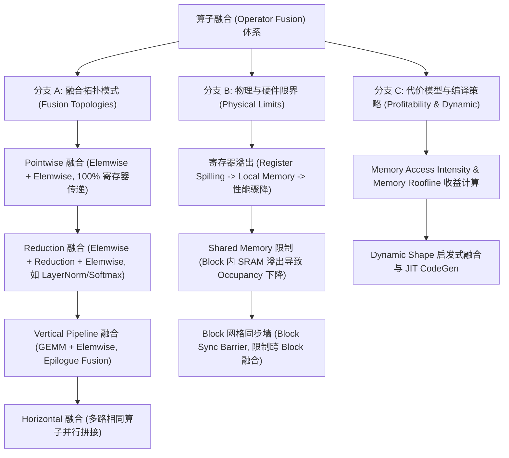
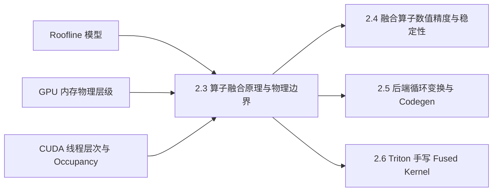

# 2.3 算子融合原理、策略与物理边界

> **🎯 学习目标**
> - 深入理解算子融合（Operator Fusion）消除 GPU HBM（High Bandwidth Memory）读写带宽瓶颈的核心物理原理。
> - 掌握 Pointwise（逐元素）、Reduction（规约）、Vertical Pipeline（纵向流水）与 Horizontal（横向）融合策略及 Loop Tiling 关联机制。
> - 深刻理解 GPU 硬件物理边界对算子融合的制约：寄存器压力（Register Pressure & Spilling）、Shared Memory 限制、SRAM 缓存行与动态 Shape 编译瓶颈。
> - 编写生产级 Python `FusionProfitabilityModel` 算子融合收益代价预测分析器，定量评估融合算子的 Speedup。
> - 掌握 6 层 Onion Q&A 知识体系，精准解答算子融合、Memory Bound 优化与 CUDA Kernel 融合架构考题。

---

## 📖 1. 导言与背景

在现代 GPU 架构（如 NVIDIA A100/H100）上，算子的执行效率受限于两大瓶颈：**计算瓶颈（Compute-Bound）** 与 **Memory/Bandwidth 瓶颈（Memory-Bound）**。

在深度学习模型（尤其是 Transformer/LLM）中，除了巨量的 GEMM/Conv（计算密集型）外，还充斥着大量的逐元素算子（BiasAdd, ReLU, Gelu, Dropout）、规约算子（LayerNorm, Softmax, RMSNorm）与 Reshape 变换。这些非 GEMM 算子属于典型的 **Memory-Bound** 算子，其算术强度（Arithmetic Intensity = $\text{FLOPs} / \text{Bytes}$）极低。

如果按照传统框架（如 Native PyTorch）逐算子 Launch CUDA Kernel 的方式：
1. 每一个中间变量都必须从 GPU SRAM/Register 写入外部 HBM（Global Memory），下一个算子再重新从 HBM 读取。
2. 频繁触发 Kernel Launch 开销（CPU 调度与 GPU 启动延迟约 3~5 $\mu s$）。

**算子融合（Operator Fusion）** 是 AI 编译器后端最关键的优化技术。它将计算图中的多个连续算子合并为一个单一的 CUDA Kernel，在 GPU 寄存器（Register）或 Shared Memory (SRAM) 中完成中间变量传递，彻底消除中间 Tensor 对外部 HBM 的物理读写，实现数倍甚至数十倍的访存性能加速。

---

## 🌳 2. 算子融合分类与演进分支树

下图展示了 AI 编译器中算子融合的分类、融合范式以及受硬件物理限界影响的降级分支：



---

## 🕸️ 3. 知识网格与图谱依赖

### 知识依赖关系表

| 前置知识（入度 / In-Degree） | 核心技术概念 | 后续衍生应用（出度 / Out-Degree） |
| :--- | :--- | :--- |
| • Roofline 性能模型<br>• GPU 显存层级 (HBM, SRAM, Register)<br>• CUDA Block/Thread 线程层次结构<br>• 2.2 IR 表达与前端 Pass | **2.3 算子融合原理、策略与物理边界**<br>(HBM IO Elimination, Pointwise/Reduction Fusion, Register Spilling) | • 2.4 融合算子数值精度与稳定性<br>• 2.5 后端循环变换与 Codegen<br>• 2.6 Triton 手写 Fused RMSNorm/Softmax<br>• FlashAttention 融合机制 |

### 知识图谱依赖 network



---

## 🧮 4. 物理数理模型与融合收益公式推导

### 4.1 HBM I/O 带宽消除定量推导

假设存在 $N$ 个连续逐元素（Pointwise）算子链 $f_1, f_2, \dots, f_N$，作用于元素量为 $M$ 的张量 $X$（数据类型字节数为 $B$ Bytes，如 FP16 $B=2$）：

**未融合模式（Unfused Mode）**：
每个算子 $f_i$ 必须读入输入、写出输出至 HBM。
- 读总字节量：$D_{\text{read}} = N \times M \times B$
- 写总字节量：$D_{\text{write}} = N \times M \times B$
- 总 HBM I/O 访存量：$D_{\text{unfused}} = 2 N \cdot M \cdot B$
- 总时间消耗（忽略计算）：
$$
T_{\text{unfused}} \approx \frac{2 N \cdot M \cdot B}{\text{BW}_{\text{HBM}}} + N \times T_{\text{launch}}
$$

**融合模式（Fused Mode）**：
所有计算在 GPU 寄存器中完成流水线链接，仅读取原始输入 $X$ 1 次，写出最终结果 $Y$ 1 次。
- 总 HBM I/O 访存量：$D_{\text{fused}} = 2 \cdot M \cdot B$
- 总时间消耗：
$$
T_{\text{fused}} \approx \frac{2 \cdot M \cdot B}{\text{BW}_{\text{HBM}}} + 1 \times T_{\text{launch}}
$$
- **理论加速比（Speedup）**：
$$
\text{Speedup}_{\text{ideal}} = \frac{T_{\text{unfused}}}{T_{\text{fused}}} \approx N + \frac{N \times T_{\text{launch}}}{\frac{2 M B}{\text{BW}_{\text{HBM}}}}
$$

### 4.2 物理边界 1：寄存器溢出（Register Spilling）阈值计算

在 NVIDIA CUDA 架构中，每个 SM（Streaming Multiprocessor）配有固定容量的 Register File（如 64K 32-bit 寄存器）。每个 Thread 所分配的寄存器数量 $R_{\text{thread}}$ 受到如下物理限制：
- 若 $R_{\text{thread}} \le 255$ 且符合 SM 总限制，硬件高效运行。
- 若算子过度融合导致变量生命周期交叠过长，编译器尝试分配 $R_{\text{thread}} > R_{\text{max}}$ 时，发生 **Register Spilling（寄存器溢出）**。溢出的变量会被迫压入 **Local Memory（物理上位于 HBM）**。

其导致的延迟惩罚为：
$$
T_{\text{spill\_penalty}} = N_{\text{spill}} \times L_{\text{HBM\_latency}} \quad (L_{\text{HBM\_latency}} \approx 200\text{--}400 \text{ cycles})
$$
这将导致算子融合性能急剧倒退（Negative Speedup）。

### 4.3 物理边界 2：Shared Memory 限制与 Occupancy 降级

对于 Reduction（规约）融合算子（如 LayerNorm/Softmax），线程块内部必须借助 Shared Memory 进行 Block-level Reduction。
设 SM 上的 Shared Memory 总容量为 $S_{\text{SM}}$，每个 Thread Block 请求的 SRAM 为 $S_{\text{block}}$。SM 上并发执行的 Active Blocks 数量 $N_{\text{active\_blocks}}$ 为：
$$
N_{\text{active\_blocks}} = \min \left( \left\lfloor \frac{S_{\text{SM}}}{S_{\text{block}}} \right\rfloor, N_{\text{max\_blocks\_per\_SM}} \right)
$$
若融合算子引入了过大 Shared Memory 缓存，导致 $N_{\text{active\_blocks}}$ 下降，SM 的 **Occupancy（线程占有率）** 显著降低，进而无法掩盖访存延迟（Memory Latency Hiding 失效）。

---

## 💻 5. 代码实战：Python 算子融合收益代价模型分析器

下述代码实现了一个生产级 Python `FusionProfitabilityModel` 评估器，能够基于硬件物理参数（HBM 带宽、SM 寄存器限制、SRAM 容量）和算子图拓扑，自动判断算子融合收益并预判物理溢出风险：

```python
import dataclasses
from typing import List, Dict, Tuple

@dataclasses.dataclass
class HardwareSpec:
    name: str
    hbm_bandwidth_gbps: float  # HBM 带宽 (GB/s)
    clock_ghz: float           # 核心时钟频率 (GHz)
    max_registers_per_thread: int = 255
    sm_shared_memory_bytes: int = 100 * 1024  # 100 KB
    kernel_launch_overhead_us: float = 3.5    # Launch 开销 (微秒)

@dataclasses.dataclass
class OperatorNode:
    name: str
    op_type: str  # 'pointwise', 'reduction', 'gemm'
    flops: int
    read_bytes: int
    write_bytes: int
    est_registers_used: int
    est_shared_mem_bytes: int = 0

class FusionProfitabilityModel:
    """
    算子融合收益与物理边界评估模型
    """
    def __init__(self, hw: HardwareSpec):
        self.hw = hw

    def evaluate_fusion(self, nodes: List[OperatorNode]) -> Dict[str, Any]:
        assert len(nodes) >= 1
        
        # 1. 评估未融合 (Unfused) 总时间
        unfused_io_bytes = sum(n.read_bytes + n.write_bytes for n in nodes)
        unfused_flops = sum(n.flops for n in nodes)
        unfused_launch_time_us = len(nodes) * self.hw.kernel_launch_overhead_us
        
        unfused_io_time_us = (unfused_io_bytes / (self.hw.hbm_bandwidth_gbps * 1e9)) * 1e6
        unfused_total_time_us = unfused_io_time_us + unfused_launch_time_us

        # 2. 评估融合 (Fused) HBM I/O: 仅读取第一个算子的 Input，仅写入最后一个算子的 Output
        fused_io_bytes = nodes[0].read_bytes + nodes[-1].write_bytes
        fused_flops = unfused_flops
        fused_launch_time_us = self.hw.kernel_launch_overhead_us
        fused_io_time_us = (fused_io_bytes / (self.hw.hbm_bandwidth_gbps * 1e9)) * 1e6

        # 3. 物理限界判断: 寄存器与 Shared Memory
        max_reg_needed = sum(n.est_registers_used for n in nodes)  # 估算活跃寄存器
        total_sram_needed = sum(n.est_shared_mem_bytes for n in nodes)

        reg_spill_warning = max_reg_needed > self.hw.max_registers_per_thread
        sram_overflow_warning = total_sram_needed > self.hw.sm_shared_memory_bytes

        # 惩罚计算
        spill_penalty_us = 0.0
        if reg_spill_warning:
            # 溢出至 Local Memory (HBM) 导致的重大读写惩罚
            spill_bytes = (max_reg_needed - self.hw.max_registers_per_thread) * 4 * 100000
            spill_penalty_us = (spill_bytes / (self.hw.hbm_bandwidth_gbps * 1e9)) * 1e6 * 5.0

        fused_total_time_us = fused_io_time_us + fused_launch_time_us + spill_penalty_us
        speedup = unfused_total_time_us / max(fused_total_time_us, 1e-6)

        return {
            "unfused_time_us": round(unfused_total_time_us, 2),
            "fused_time_us": round(fused_total_time_us, 2),
            "theoretical_speedup": round(speedup, 2),
            "register_spilling": reg_spill_warning,
            "sram_overflow": sram_overflow_warning,
            "recommendation": "FUSE" if (speedup > 1.15 and not reg_spill_warning) else "DO_NOT_FUSE"
        }


if __name__ == "__main__":
    # 配置 NVIDIA A100 SXM 硬件参数
    a100_spec = HardwareSpec(
        name="NVIDIA A100-SXM4-80GB",
        hbm_bandwidth_gbps=2039.0,  # ~2.0 TB/s
        clock_ghz=1.41
    )

    model_evaluator = FusionProfitabilityModel(a100_spec)

    # 场景 1: 典型 LayerNorm 前后的 4 个 Pointwise 算子 (BiasAdd + Gelu + Add + Dropout)
    pointwise_chain = [
        OperatorNode("BiasAdd", "pointwise", flops=2048*4096, read_bytes=2048*4096*2, write_bytes=2048*4096*2, est_registers_used=16),
        OperatorNode("Gelu",    "pointwise", flops=2048*4096*8, read_bytes=2048*4096*2, write_bytes=2048*4096*2, est_registers_used=24),
        OperatorNode("Add",     "pointwise", flops=2048*4096, read_bytes=2048*4096*2, write_bytes=2048*4096*2, est_registers_used=16),
        OperatorNode("Dropout", "pointwise", flops=2048*4096*2, read_bytes=2048*4096*2, write_bytes=2048*4096*2, est_registers_used=20),
    ]

    res1 = model_evaluator.evaluate_fusion(pointwise_chain)
    print("=== 场景 1: Pointwise 算子链融合评估 ===")
    print(f"未融合预测耗时: {res1['unfused_time_us']} us")
    print(f"融合预测耗时:   {res1['fused_time_us']} us")
    print(f"预计加速比:     {res1['theoretical_speedup']}x")
    print(f"决策建议:       {res1['recommendation']}\n")

    # 场景 2: 过度融合导致寄存器溢出 (Over-fusion)
    overfused_chain = [
        OperatorNode(f"ComplexOp_{i}", "pointwise", flops=10000, read_bytes=1000, write_bytes=1000, est_registers_used=70)
        for i in range(5)  # 总寄存器需求 350 > 255
    ]

    res2 = model_evaluator.evaluate_fusion(overfused_chain)
    print("=== 场景 2: 过度融合 (Register Spilling) 评估 ===")
    print(f"寄存器溢出警告: {res2['register_spilling']}")
    print(f"融合预测耗时:   {res2['fused_time_us']} us (含 Spill 惩罚)")
    print(f"决策建议:       {res2['recommendation']}")
```

---

## 🔍 6. 6 层 Onion Q&A 知识网络

### L1 基础概念层
**问：为什么 GEMM（矩阵乘）算子融合与纯 Pointwise（逐元素）算子融合在收益本质上有巨大差异？**
> **答**：
> 1. **Pointwise 算子**：算术强度极低（$\text{FLOPs/Byte} < 1$），属于强 **Memory-Bound**。融合消除 HBM I/O 可直接线性换取几倍的带宽吞吐提升。
> 2. **GEMM 算子**：算术强度极高（$\text{FLOPs/Byte} \gg 100$），属于 **Compute-Bound**。GEMM 融合（如 GEMM + Epilogue Bias/ReLU）收益不在于 GEMM 主体本身的带宽，而在于将 Epilogue 算子完全“免费”挂载在 GEMM 的寄存器写回阶段，节省额外的 Epilogue 独立 Kernel Launch 与 HBM 读写。

### L2 原理机制层
**问：Vertical Pipeline Fusion（纵向流水融合）与 Horizontal Fusion（横向融合）在 DAG 图结构与 GPU 硬件调度上有何不同？**
> **答**：
> - **Vertical Pipeline Fusion**：针对 DAG 图中存在“生产者-消费者（Producer-Consumer）”依赖关系的上下游算子。通过将生产者的数据直接缓存在 Register/SRAM 中传给消费者，消除中间 Buffer 的 HBM 读写。
> - **Horizontal Fusion**：针对 DAG 图中相互独立的同类算子（如 Multi-Head Attention 中对 Q, K, V 投影矩阵的 3 个独立 GEMM）。通过在网格维度（Grid Stride / Batch Dimension）上将其拼接为一个联合 CUDA Kernel 打包 Launch，增加 GPU 并发 Tile 数以填满 SM。

### L3 物理/硬件层
**问：为什么 GPU 上的跨 Block（Block-level）全局同步是极其危险的？这如何限制了算子融合的拓扑边界？**
> **答**：NVIDIA CUDA 硬件在架构设计上**故意不支持**由硬件保证的 Grid-wide Block 同步机制（没有硬件级别的 `grid.sync()` 指令）。因为 SM 上的 Block 调度是动态且无序的。若融合算子需要在全局节点间做 Cross-block 屏障同步（如全局 Reduction），一旦活跃 Block 占满了 SM 资源而等待未被调度的 Block，会导致**死锁（Deadlock）**。因此，通用 AI 编译器严禁跨越需要全局 Grid 同步的拓扑边界进行 Kernel 融合（FlashAttention 等算法通过数学重构将全局 Reduction 局部化在 Block 内部解耦）。

### L4 极值/边界层
**问：在 Dynamic Shape（动态 SeqLen）场景下，静态融合 Kernel 会面临什么性能退化风险？编译器如何应对？**
> **答**：在 Dynamic Shape 下，静态编译生成的融合 Kernel 其 Tile Block 尺寸（如 $128 \times 128$）可能在 SeqLen 较小（如 SeqLen=16）时产生巨大的 Thread 浪费与 Tail Wave 尾部效应（SM 充不满）。现代 AI 编译器（如 PyTorch Inductor / Triton）采用 **Guarded JIT Autotuning** 机制：根据运行时传入的具体 Shape 动态匹配/编译最优 Tile 参数的融合 Kernel 模板。

### L5 故障诊断层
**问：在编写 Triton / CUDA 融合算子后，用 Nsight Compute (NCU) 分析发现 `SOL Memory` （Memory Speed of Light）与 `SOL Compute` 均极低，且 `Occupancy` 降至 12.5%，最可能的物理根因是什么？如何排查？**
> **答**：
> 1. **根因剖析**：`Occupancy` 骤降至 12.5% 表明 SM 内部并发 Block/Thread 数量极少，主要诱因是融合 Kernel 消耗了过多的 **Shared Memory** 或 **Register 资源**，达到了 SM 物理分配上限。
> 2. **排查步骤**：在 NCU 中检查 `Launch Statistics` 与 `Occupancy Peak Limiters` 报告。查看 `Registers Per Thread` 是否接近/达到 255，或 `Shared Memory Per Block` 是否占满了 SM 单块上限。
> 3. **解决方案**：在代码中减小 Tile Size（如将 $128 \times 128$ 降至 $64 \times 64$），或手动插入 `#pragma unroll 1` 限制循环展开以降低寄存器压力。

### L6 架构设计层
**问：PyTorch 2.0 Inductor 与 TVM MetaSchedule 在处理算子融合策略选择时，规则匹配（Rule-based）与搜索优化（Cost-Model Search）各自的利弊是什么？**
> **答**：
> - **Rule-based（基于启发式规则，如 Inductor）**：依据预定义的计算图模式（如 Pointwise+Pointwise, GEMM+Epilogue）进行融合。**优势**：编译开销极低（毫秒级），非常适合 Interactive 训练与 JIT 场景；**劣势**：无法发现复杂/非标算子组合的最优融合方案。
> - **Cost-Model Search（基于代价模型搜索，如 TVM MetaSchedule/AutoTVM）**：定义巨大的 Fusion & Tile 搜索空间，结合 ML 性能预测模型进行数百次实测采样。**优势**：能推导出逼近硬件极限的极致 Kernel；**劣势**：编译时间长达数小时，难以直接用于动态 Shape/训练过程。

---

## 📚 7. 扩展资源与深度研读

1. **NVIDIA Nsight Compute Kernel Profiling Guide**:
   - [NCU Occupancy & Memory Speed of Light Analysis](https://docs.nvidia.com/nsight-compute/ProfilingGuide/index.html)
2. **PyTorch 2.0 Deep Dive: TorchInductor Fusion Heuristics**:
   - [PyTorch TorchInductor Compiler Paper & Code](https://pytorch.org/get-started/pytorch-2.0/)
3. **Triton: An Intermediate Language and Compiler for Tile-Based Neural Network Programs**:
   - Tillet, P., et al. (MAPL 2019). *Triton 算子融合与 Tile 表达原理*.
