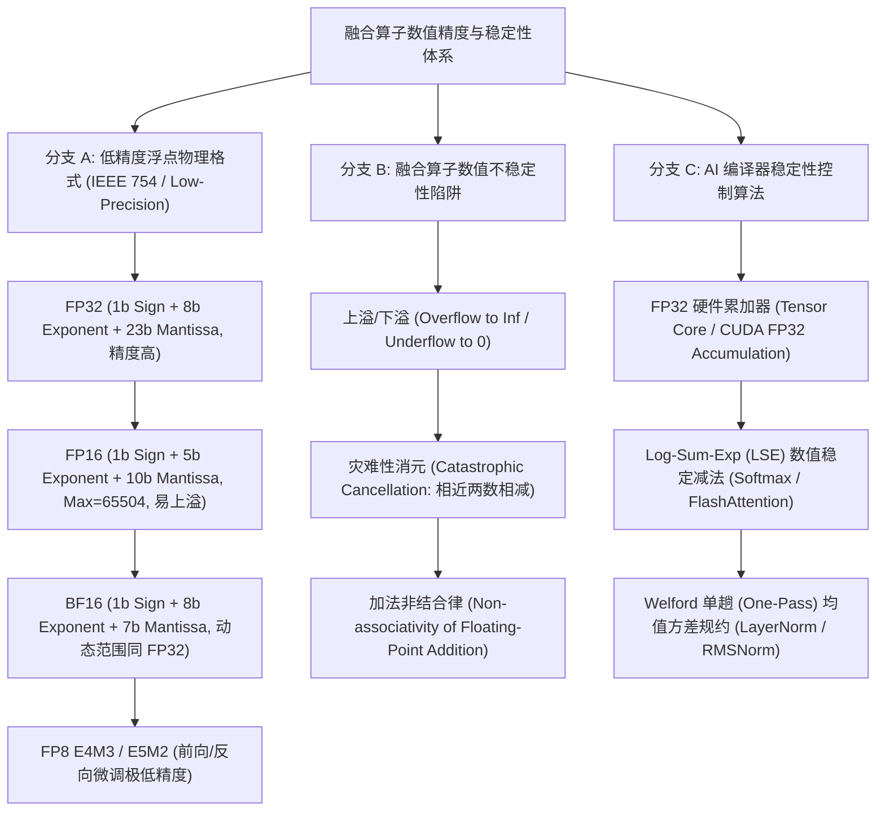
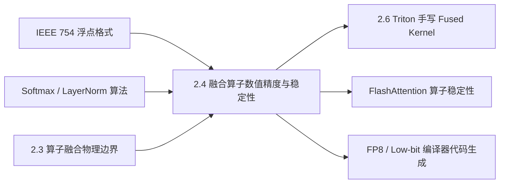

# 2.4 融合算子数值精度与稳定性控制

> **🎯 学习目标**
> - 深刻理解 IEEE 754 标准及 FP16、BF16、FP8 (E4M3/E5M2) 的尾数/阶码物理位宽分布与动态范围差异。
> - 掌握混合精度算子融合中硬件 FP32 累加器（Accumulator）对于防止点积累加下溢/溢出的核心作用。
> - 严密推导 Log-Sum-Exp (LSE) 算法在数值稳定版 Fused Softmax 与 LayerNorm/RMSNorm 算子中的数学变形过程。
> - 深刻理解灾难性消元（Catastrophic Cancellation）与数值下溢（Underflow）在算子融合过程中的产生机制与防御手段。
> - 编写生产级 Python `ULPPrecisionChecker` 精度漂移与末位单位误差（ULP）工具，精准量化融合算子对比 Native FP32 的数值偏差。
> - 掌握 6 层递进 Onion Q&A 知识网络，轻松解答低精度算子融合、数值溢出与 CUDA/Triton 数值调试考题。

---

## 📖 1. 导言与背景

在 AI 编译器追求极限性能的过程中，**低精度数据格式（FP16, BF16, FP8）** 与 **算子融合（Operator Fusion）** 是两大最核心的加速引擎。然而，将多个算子融合并在低精度下执行时，极易引发严重甚至隐蔽的**数值不稳定性（Numerical Instability）**。

在深度学习模型（尤其是 Transformer / LLM 训练与推理）中：
1. **FP16 的表示范围极窄**（最大值仅为 $65504$，动态范围约为 $10^{-5} \sim 6.5 \times 10^4$），在计算 $\exp(x)$ 或高维向量点积累加时极其容易发生数值上溢（Overflow, $\to +\infty$）或下溢（Underflow, $\to 0$）。
2. **算子融合改变了浮点数的求和与规约顺序**（例如在 Shared Memory 中采用并行 Tree Reduction 或 Warp Shuffle 规约），由于浮点数加法**不满足结合律**（$(a + b) + c \neq a + (b + c)$），融合算子与原生逐算子执行之间会产生不可忽视的数值漂移（Numerical Drift）。

因此，AI 编译器在实现算子融合时，必须在后端代码生成中严格引入**数值稳定性保证机制**（如 FP32 硬件累加、Log-Sum-Exp 变换、Online Standard Deviation 规约），确保融合算子既快又准。

---

## 🌳 2. 浮点表达与稳定性演进分支树

下图展示了不同浮点格式的物理结构以及融合算子数值稳定性控制的技术演进分支：



---

## 🕸️ 3. 知识网格与图谱依赖

### 知识依赖关系表

| 前置知识（入度 / In-Degree） | 核心技术概念 | 后续衍生应用（出度 / Out-Degree） |
| :--- | :--- | :--- |
| • IEEE 754 浮点标准<br>• Softmax & LayerNorm 算子定义<br>• 2.3 算子融合原理与策略<br>• NVIDIA Tensor Core ISA | **2.4 融合算子数值精度与稳定性控制**<br>(FP32 Accumulator, LSE Softmax, Catastrophic Cancellation, ULP Checker) | • 2.6 Triton 手写 Fused Softmax/RMSNorm<br>• FlashAttention 1/2/3 算法数值正确性<br>• FP8 / FP4 量化 Kernel 编译器优化 |

### 知识图谱依赖 network



---

## 🧮 4. 浮点物理格式与稳定算法数学推导

### 4.1 常见浮点格式物理位宽与数值范围比较

根据 IEEE 754 与 Deep Learning 规范，各浮点格式物理表示如下：

| 格式 (Format) | 总位数 (Bits) | 符号位 (Sign) | 指数位 (Exponent) | 尾数位 (Mantissa) | 动态范围 (Dynamic Range) | 最小正法线数 ($x_{\min}$) | 最大有限值 ($x_{\max}$) | ULP 相对精度 ($\epsilon$) |
| :--- | :--- | :--- | :--- | :--- | :--- | :--- | :--- | :--- |
| **FP32** | 32 | 1 | 8 | 23 | $\sim 10^{-38} \to 10^{38}$ | $1.17 \times 10^{-38}$ | $3.40 \times 10^{38}$ | $2^{-23} \approx 1.19 \times 10^{-7}$ |
| **FP16** | 16 | 1 | 5 | 10 | $\sim 10^{-5} \to 65504$ | $6.10 \times 10^{-5}$ | $65504$ | $2^{-10} \approx 9.77 \times 10^{-4}$ |
| **BF16** | 16 | 1 | 8 | 7 | $\sim 10^{-38} \to 10^{38}$ | $1.17 \times 10^{-38}$ | $3.39 \times 10^{38}$ | $2^{-7} \approx 7.81 \times 10^{-3}$ |
| **FP8 (E4M3)**| 8 | 1 | 4 | 3 | $\sim 10^{-6} \to 448$ | $0.0156$ | $448$ | $2^{-3} = 0.125$ |
| **FP8 (E5M2)**| 8 | 1 | 5 | 2 | $\sim 10^{-5} \to 57344$ | $6.10 \times 10^{-5}$ | $57344$ | $2^{-2} = 0.25$ |

> [!IMPORTANT]
> **FP16 与 BF16 的折衷权衡**：FP16 尾数位较多（10-bit），本地精度高，但指数位仅 5-bit，导致 $x > 65504$ 极易溢出；BF16 指数位与 FP32 一致（8-bit），彻底解决了上溢问题，但尾数位减少至 7-bit，数值精度稍粗糙。

### 4.2 数值稳定 Softmax：Log-Sum-Exp (LSE) 变形推导

原始 Softmax 计算公式为：
$$
S_i = \frac{e^{x_i}}{\sum_{j=1}^{N} e^{x_j}}
$$
在 FP16 模式下，若 $x_i = 12.0$，则 $e^{12.0} \approx 162754.79 > 65504$，直接触发 FP16 **上溢为 $+\infty$**，导致 $\frac{\infty}{\infty} = \text{NaN}$。

**数值稳定 Log-Sum-Exp 变换**：
令 $m = \max_{1 \le j \le N} x_j$。对分子分母同乘以 $e^{-m}$：
$$
S_i = \frac{e^{x_i} \cdot e^{-m}}{\sum_{j=1}^{N} e^{x_j} \cdot e^{-m}} = \frac{e^{x_i - m}}{\sum_{j=1}^{N} e^{x_j - m}}
$$
因为 $x_i - m \le 0$，故所有 $\exp(x_i - m) \in (0, 1]$，彻底杜绝了指数上溢为 $+\infty$ 的风险！

### 4.3 Fused LayerNorm: Welford 单趟 (One-Pass) 方差规约推导

传统 LayerNorm 需要两趟 (Two-Pass) 扫描：一趟求均值 $\mu$，二趟求方差 $\sigma^2$。若直接采用朴素公式 $\sigma^2 = \mathbb{E}[X^2] - (\mathbb{E}[X])^2$，当 $\mathbb{E}[X^2]$ 与 $(\mathbb{E}[X])^2$ 数值非常接近时，低精度下相减会产生严重的**灾难性消元（Catastrophic Cancellation）**。

**Welford 单趟算法**（在 Single-Pass 规约中维持数值稳定）：
对于数据流 $x_1, x_2, \dots, x_k$，在线递推更新均值 $M_k$ 与平方差累加和 $S_k$：
$$
M_k = M_{k-1} + \frac{x_k - M_{k-1}}{k}
$$
$$
S_k = S_{k-1} + (x_k - M_{k-1})(x_k - M_k)
$$
终点处方差 $\sigma^2 = \frac{S_N}{N}$。Welford 算法避免了大数相减，极大保障了 Fused LayerNorm 算子的数值稳定性。

---

## 💻 5. 代码实战：Python 精度漂移与 ULP 检查器

下述代码演示了如何编写生产级 `ULPPrecisionChecker` 工具，计算低精度融合算子对比高精度 Native 基准（FP64/FP32）的 **ULP (Unit in the Last Place, 末位单位误差)** 以及数值相对漂移：

```python
import torch
import numpy as np
from typing import Dict, Any, Tuple

class ULPPrecisionChecker:
    """
    算子数值精度与 ULP (Unit in the Last Place) 偏差分析器
    """
    @staticmethod
    def float_to_bits(x: np.ndarray, dtype=np.float32) -> np.ndarray:
        if dtype == np.float32:
            return x.view(np.uint32)
        elif dtype == np.float64:
            return x.view(np.uint64)
        else:
            raise ValueError("仅支持 float32/float64 位图转换")

    @classmethod
    def compute_ulp_diff(cls, ref: np.ndarray, test: np.ndarray) -> np.ndarray:
        """
        计算测试张量与参考张量逐元素的 ULP 差值
        """
        ref_f32 = ref.astype(np.float32)
        test_f32 = test.astype(np.float32)

        ref_bits = cls.float_to_bits(ref_f32, np.float32)
        test_bits = cls.float_to_bits(test_f32, np.float32)

        # 处理符号相同的 ULP 距离
        ulp_diff = np.abs(ref_bits.astype(np.int64) - test_bits.astype(np.int64))
        return ulp_diff

    @classmethod
    def analyze_accuracy(cls, ref_tensor: torch.Tensor, test_tensor: torch.Tensor, name: str = "Fused Kernel") -> Dict[str, Any]:
        ref_np = ref_tensor.detach().cpu().to(torch.float64).numpy()
        test_np = test_tensor.detach().cpu().to(torch.float32).numpy()

        # 绝对误差 & 相对误差
        abs_err = np.abs(ref_np - test_np)
        rel_err = abs_err / (np.abs(ref_np) + 1e-12)

        # ULP 差值
        ulp_diff = cls.compute_ulp_diff(ref_np, test_np)

        return {
            "kernel_name": name,
            "max_abs_error": float(np.max(abs_err)),
            "mean_abs_error": float(np.mean(abs_err)),
            "max_rel_error": float(np.max(rel_err)),
            "max_ulp_diff": int(np.max(ulp_diff)),
            "mean_ulp_diff": float(np.mean(ulp_diff)),
            "has_nan_or_inf": bool(np.isnan(test_np).any() or np.isinf(test_np).any())
        }


# 示例：验证朴素 FP16 Softmax vs 稳定版 LSE Softmax 的精度漂移
def naive_fp16_softmax(x: torch.Tensor) -> torch.Tensor:
    # 朴素模式：直接 exp(x) / sum(exp(x))，无 max 减法保护
    x_fp16 = x.to(torch.float16)
    exp_x = torch.exp(x_fp16)  # 易发生 FP16 上溢
    return exp_x / torch.sum(exp_x, dim=-1, keepdim=True)

def stable_lse_softmax(x: torch.Tensor) -> torch.Tensor:
    # 稳定模式：Log-Sum-Exp 减去 max
    x_fp16 = x.to(torch.float16)
    max_val = torch.max(x_fp16, dim=-1, keepdim=True).values
    exp_x = torch.exp(x_fp16 - max_val)
    return exp_x / torch.sum(exp_x, dim=-1, keepdim=True)


if __name__ == "__main__":
    torch.manual_seed(42)
    # 模拟 LLM 中 Attention Score 输入 (含较长 Token 导致的大数值 x)
    input_logits = torch.randn(4, 128, 4096) * 5.0 + 10.0  # 包含较大 Logits

    # 参考基准：FP64 纯高精度 Softmax
    ref_softmax = torch.softmax(input_logits.to(torch.float64), dim=-1)

    # 1. 测试朴素 FP16 Softmax
    naive_out = naive_fp16_softmax(input_logits)
    report_naive = ULPPrecisionChecker.analyze_accuracy(ref_softmax, naive_out, "Unstable Naive FP16 Softmax")

    # 2. 测试稳定 LSE FP16 Softmax
    stable_out = stable_lse_softmax(input_logits)
    report_stable = ULPPrecisionChecker.analyze_accuracy(ref_softmax, stable_out, "Stable LSE FP16 Softmax")

    print("=== 1. 朴素 FP16 Softmax 结果报告 ===")
    print(f"包含 NaN/Inf:     {report_naive['has_nan_or_inf']}")
    print(f"最大绝对误差:     {report_naive['max_abs_error']:.6e}")
    print(f"最大 ULP 差值:    {report_naive['max_ulp_diff']}\n")

    print("=== 2. 数值稳定 LSE FP16 Softmax 结果报告 ===")
    print(f"包含 NaN/Inf:     {report_stable['has_nan_or_inf']}")
    print(f"最大绝对误差:     {report_stable['max_abs_error']:.6e}")
    print(f"平均 ULP 差值:    {report_stable['mean_ulp_diff']:.2f}")
    print(f"最大 ULP 差值:    {report_stable['max_ulp_diff']}")

    assert not report_stable['has_nan_or_inf'], "稳定 Softmax 不应产生 NaN/Inf"
    print("\n✅ 精度分析完成：LSE 稳定算法成功杜绝了数值溢出。")
```

---

## 🔍 6. 6 层 Onion Q&A 知识网络

### L1 基础概念层
**问：在 NVIDIA Tensor Core 的 FP16 GEMM 算子中，什么是“FP32 硬件累加器（FP32 Accumulator）”？为何必须开启它？**
> **答**：Tensor Core 物理执行 $D = A \times B + C$ 矩阵乘加运算。当输入矩阵 $A, B$ 为 FP16 时，内部乘积结果在加法累加阶段可以被配置为在 **FP32 精度** 下累加，最终写回时再截断为 FP16。由于高维点积包含成百上千次连续加法，若累加过程也用 FP16，小数值会被大数吞没（下溢）；开启 FP32 累加器能以 0 额外延迟彻底消除点积累加的数值精度丢失。

### L2 原理机制层
**问：为什么在 FP16 模式下运行 GELU 或 Sigmoid 激活函数时，直接使用泰勒展开公式容易导致严重数值误差？编译器如何处理？**
> **答**：泰勒展开在自变量 $x$ 远离 0 处收敛极慢，且高阶多项式 $x^n$ 包含了极其巨大的指数计算，在 FP16 有限的动态范围下会迅速触发溢出或灾难性消元。现代 AI 编译器（如 PyTorch Inductor / Triton）在生成激活函数 Kernel 代码时，统一使用 **Fast Math 硬件近似指令**（如 CUDA `__expf()`）或 Minimax 多项式逼近（如 Remez 算法），在极窄区间内精细分段拟合。

### L3 物理/硬件层
**问：NVIDIA Blackwell / Hopper 架构引入了 FP8 格式（E4M3 与 E5M2）。编译器在生成 FP8 融合算子时，为什么必须为张量引入 Scale Factor（缩放因子）？**
> **答**：FP8 仅有 8 位（E4M3 动态范围 $< 448$，E5M2 仅 2 位尾数精度极粗）。张量的实际数值区间往往远大于或小于 FP8 的表示上限。编译器必须在算子融合中引入动态/静态 **Scale Factor $S$**，将原始张量映射为 $X_{\text{fp8}} = \text{clip}(\text{round}(X \times S))$。在融合 Kernel 内部进行 GEMM 计算后，再乘回 $\frac{1}{S_A \times S_B}$ 还原数值。

### L4 极值/边界层
**问：在多 Warp 并行规约（Cross-Warp Reduction）计算 Fused LayerNorm 时，Warp 间的规约顺序差异会导致结果出现 1~2 个 ULP 的不确定性，如何看待并控制这一现象？**
> **答**：由于浮点数加法不满足结合律，GPU 线程调度器每次执行 Warp 线程间 Shuffle 规约的组合顺序可能有微小差异，导致多次运行同一 Kernel 产生 $1 \sim 2$ 个 ULP 的极小数值不确定性（Non-deterministic behavior）。若业务需要严格可复现性（Bitwise Determinism），AI 编译器可强制约束规约树采用固定拓扑（如固定 Binary Reduction Tree 顺序），但代价是微小的性能牺牲。

### L5 故障诊断层
**问：训练大模型时发现 Loss 突然变为 `NaN`，使用 CUDA Inspector 发现崩溃点位于 Fused Attention Kernel 的 Softmax 阶段，可能的原因与排查步骤是什么？**
> **答**：
> 1. **可能根因**：Attention Logits $Q K^T / \sqrt{d}$ 中出现了极大值，且 Softmax 没有做减去最大值 $m$ 的 Log-Sum-Exp 保护；或者 Mask 矩阵中填充了 $-\infty$（在 FP16 下填了 $-65504$ 以外的超范围负数），导致 $\exp(x - m)$ 算出了全 0 分母，产生 $\frac{0}{0} = \text{NaN}$。
> 2. **排查步骤**：定位 Kernel 输入 $Q, K$ 是否有梯度爆炸；检查 Softmax 源码中是否在减去 $m$ 前就把 Mask 加到了 Logits 上；确认 Mask 是否将整行全部 Mask 掉导致 $\sum \exp = 0$。

### L6 架构设计层
**问：AI 编译器如何在“极致性能（使用 Fast-Math）”与“严格 IEEE 754 标准 compliance”之间做出架构设计权衡？**
> **答**：AI 编译器通常提供多级 Precision Optimization 编译选项（如 `torch.compile(options={"precision": "high"/"default"})` 或 GCC `-ffast-math`）：
> - **Strict 模式**：禁用可能改变算术语义的结合律律重排，强制保持标准 IEEE 754 规约，保证 100% 精度可比性。
> - **Fast-Math 模式**：允许编译器将 $\frac{x}{y} \to x \cdot \frac{1}{y}$、将 $\sin/\cos$ 替换为硬件近似指令、将连续 Add 重排为平行树状规约，并使用 FP32 硬件累加器。大模型 AI 编译器默认优先采用 Fast-Math 结合 FP32 累加器，在获得 2~5 倍加速的同时将数值漂移控制在安全阈值以内。

---

## 📚 7. 扩展资源与深度研读

1. **IEEE Standard for Floating-Point Arithmetic (IEEE 754-2019)**:
   - *IEEE 浮点数物理规范官方标准*.
2. **Numerical Stability of Log-Sum-Exp and Welford Algorithms**:
   - Higham, N. J. (2002). *Accuracy and Stability of Numerical Algorithms (2nd ed.)*.
3. **NVIDIA FP8 Formats for Deep Learning (E4M3 and E5M2 Specification)**:
   - [NVIDIA FP8 Primer & Hardware Architecture](https://docs.nvidia.com/deeplearning/transformer-engine/user-guide/examples/fp8_primer.html)
