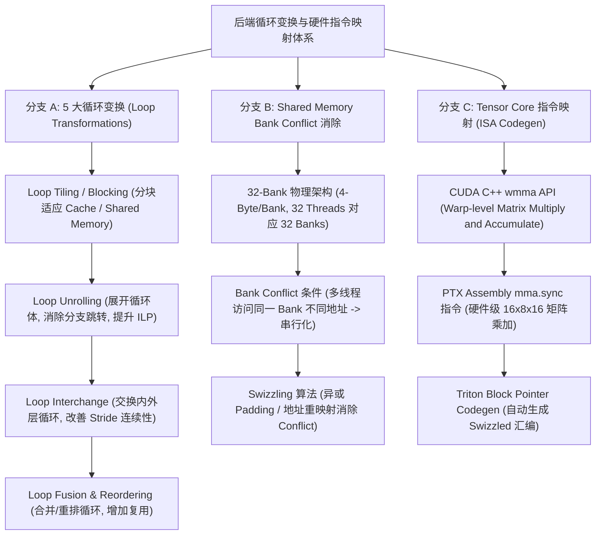
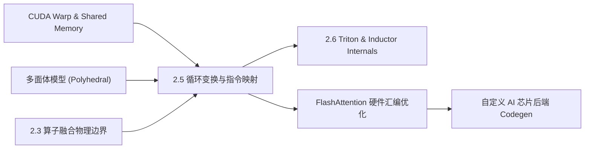

# 2.5 后端循环变换与硬件指令映射

> **🎯 学习目标**
> - 熟练掌握 AI 编译器后端 5 大经典循环变换（Loop Tiling, Unrolling, Interchange, Fusion, Reordering）的代数表示与依赖分析。
> - 深度拆解底层硬件 ISA 映射：NVIDIA Tensor Core `wmma` 与 `mma.sync` 矩阵乘加指令在 PTX 汇编级别的 Warp 协作机制。
> - 深刻理解 Shared Memory 32-Bank 物理架构、Bank Conflict 产生的几何条件以及 Swizzling（交叉交错）地址映射消除算法。
> - 编写生产级 Python `BankConflictSimulator` 模拟器，可视量化不同 Strides 与 Tile Layout 下的 Shared Memory 冲突惩罚。
> - 掌握 6 层 Onion Q&A 知识网络，轻松解答 AI 编译器后端优化、CUDA Tile 调度与 Bank Conflict 优化考题。

---

## 📖 1. 导言与背景

在 AI 编译器（如 TVM, MLIR, OpenAI Triton, TorchInductor）的前端将计算图转换为低层 Tile IR（如 `linalg` / `affine` / `TIR`）之后，编译的核心任务就转移到了**后端循环变换（Loop Transformations）**与**底层硬件指令映射（Hardware CodeGen）**。

通用 CPU/GPU 内存分层（L1/L2 Cache, Shared Memory, HBM）与硬件执行单元（SIMD/Tensor Core）决定了：朴素的多重嵌套循环（For Loop Nest）性能极低。编译器后端必须对循环嵌套进行复杂的代数重构（Tiling 分块提升 L1/L2 Cache 命中率、Unroll 循环展开提升指令级并行度 ILP、Interchange 重排改变访存 Stride），并将最内层的计算归约映射到特定硬件的专用 ISA 指令（如 NVIDIA GPU 的 Tensor Core `mma.sync` / `wmma` 指令）。

此外，GPU Shared Memory 的 32-Bank 物理冲突（Bank Conflict）是压垮 GPU Tile 访存吞吐的隐形杀手。本文将深入剖析 5 大循环变换、Tensor Core 指令映射以及 Bank Conflict 消除的全套底层机制。

---

## 🌳 2. 循环变换与指令映射演进分支树

下图展示了 AI 编译器后端循环变换、物理 Bank Conflict 消除以及 Tensor Core ISA 映射的架构分支：



---

## 🕸️ 3. 知识网格与图谱依赖

### 知识依赖关系表

| 前置知识（入度 / In-Degree） | 核心技术概念 | 后续衍生应用（出度 / Out-Degree） |
| :--- | :--- | :--- |
| • CUDA 编程模型 (Thread, Warp, Block)<br>• GPU 内存层级 (Shared Memory / Register)<br>• 2.3 算子融合与物理边界<br>• 编译原理的多面体模型 (Polyhedral Model) | **2.5 后端循环变换与硬件指令映射**<br>(Tiling, Unrolling, Tensor Core `mma.sync`, Bank Conflict Swizzling) | • 2.6 Triton 手写 Fused Kernel Codegen<br>• FlashAttention Tensor Core 极速实现<br>• 专用 NPU (TPU/Ascend) 后端 Codegen |

### 知识图谱依赖 network



---

## 🧮 4. 数理逻辑与循环变换/Bank 映射推导

### 4.1 5 大循环变换代数表达

考虑标准的 GEMM 3 重嵌套循环 $C[i, j] += A[i, k] \times B[k, j]$：

```cpp
// 原生 3 重嵌套循环
for (int i = 0; i < M; ++i)
  for (int j = 0; j < N; ++j)
    for (int k = 0; k < K; ++k)
      C[i][j] += A[i][k] * B[k][j];
```

AI 编译器依次应用 5 大循环变换：
1. **Loop Tiling (循环分块)**：引入 Tile 大小 $T_i, T_j, T_k$，将 3 重循环展开为 6 重嵌套循环，使数据能完整装入 SRAM/Cache：
   $$
   i = i_o \cdot T_i + i_i, \quad j = j_o \cdot T_j + j_i, \quad k = k_o \cdot T_k + k_i
   $$
2. **Loop Interchange (循环交换)**：交换 $k_o$ 与 $j_o$ 的顺序，使 $A[i][k]$ 的读取位于内层循环外部，最大化寄存器复用（Register Reuse）。
3. **Loop Reordering (循环重排)**：调整最内层 $i_i, j_i, k_i$ 执行顺序匹配向量化 SIMD/Tensor Core 指令。
4. **Loop Fusion (循环合并)**：将后续的 BiasAdd 循环与 GEMM 内层 Tile 循环合并，消除中间内存读写。
5. **Loop Unrolling (循环展开)**：将最内层固定大小（如 $T_k=16$）的循环全展开，消除循环跳转指令（Branch Instruction）开销。

### 4.2 Shared Memory Bank Conflict 物理原理

NVIDIA GPU Shared Memory 划分为 **32 个物理 Banks**，宽度为 32-bit (4 Bytes)。
对于包含 32 个线程的单 Warp（Threads $t \in [0, 31]$），若访问地址为 $\text{Addr}_t$（Bytes），其对应的物理 Bank 索引为：
$$
\text{Bank}(t) = \left( \frac{\text{Addr}_t}{4} \right) \bmod 32
$$

- **无冲突（No Conflict）**：32 个线程映射到 32 个互不相同的 Banks（$1 \to 1$），或多个线程访问**同一 Banks 的绝对相同地址**（触发 BroadCast 广播机制），访存延迟为 **1 Cycle**。
- **$k$-路冲突 ($k$-way Conflict)**：$k$ 个线程访问了同一个 Bank 的**不同地址**，硬件被迫将访存**串行化（Serialized）**拆分为 $k$ 次传输，延迟变为 **$k$ Cycles**。

### 4.3 Swizzling (地址交叉交错) 消除算法

为了消除二维 Tile 存储时的 2-way / 4-way Bank Conflict，编译器通常引入 **Swizzling 映射**（通过 XOR 异或进行位重排）。
设 Tile 矩阵逻辑列索引为 $c$，行索引为 $r$。原始映射 $\text{Bank}_{\text{raw}} = (r \times \text{Stride} + c) \bmod 32$。
引入基于 XOR 的 Swizzle 地址计算：
$$
c_{\text{swizzled}} = c \oplus \left( \frac{r}{\text{PER\_LINE}} \bmod 32 \right)
$$
通过使相邻行的物理地址产生交错位移，使 Warp 内线程在按列/按块访问 Shared Memory 时完美错开 32 个 Banks，将 Bank Conflict 降低为 0！

---

## 💻 5. 代码实战：Python Bank Conflict 模拟器与 Swizzling 验证

下述代码实现了一个生产级 `BankConflictSimulator` 模拟器，能够精准可视化不同 Tensor 布局（Stride）与 Swizzling 策略下 GPU 32-Bank 的冲突情况：

```python
import numpy as np
from typing import Dict, Any, List, Tuple

class BankConflictSimulator:
    """
    NVIDIA GPU Shared Memory 32-Bank 冲突模拟器
    """
    NUM_BANKS = 32
    BYTES_PER_BANK = 4  # 32-bit per bank

    def __init__(self, tile_rows: int = 32, tile_cols: int = 32, element_bytes: int = 4):
        self.rows = tile_rows
        self.cols = tile_cols
        self.elem_bytes = element_bytes

    def get_bank(self, address_bytes: int) -> int:
        word_idx = address_bytes // self.BYTES_PER_BANK
        return word_idx % self.NUM_BANKS

    def simulate_warp_access(self, stride: int, access_pattern: str = "column", use_swizzle: bool = False) -> Dict[str, Any]:
        """
        模拟单 Warp (32 线程) 访问 Tile 时的 Bank 冲突情况
        access_pattern: 'row' (按行访问) 或 'column' (按列转置访问)
        """
        warp_size = 32
        bank_accesses: Dict[int, List[Tuple[int, int]]] = {b: [] for b in range(self.NUM_BANKS)}

        for tid in range(warp_size):
            if access_pattern == "row":
                r, c = 0, tid
            elif access_pattern == "column":
                r, c = tid, 0
            else:
                raise ValueError("Unsupported access pattern")

            # 是否启用 Swizzle 映射
            if use_swizzle:
                c_effective = c ^ (r % self.NUM_BANKS)
            else:
                c_effective = c

            # 计算一维物理字节偏移
            byte_offset = (r * stride + c_effective) * self.elem_bytes
            bank_id = self.get_bank(byte_offset)
            bank_accesses[bank_id].append((tid, byte_offset))

        # 统计冲突
        bank_conflict_ways = {}
        max_conflict = 1
        for b, threads in bank_accesses.items():
            if len(threads) > 0:
                # 检查是否命中相同地址 (Broadcast)
                unique_addrs = set(addr for _, addr in threads)
                if len(unique_addrs) == 1 and len(threads) > 1:
                    conflict_way = 1  # 触发 Broadcast，无 Conflict
                else:
                    conflict_way = len(unique_addrs)
                bank_conflict_ways[b] = conflict_way
                max_conflict = max(max_conflict, conflict_way)

        return {
            "access_pattern": access_pattern,
            "stride": stride,
            "use_swizzle": use_swizzle,
            "max_bank_conflict_ways": max_conflict,
            "status": f"{max_conflict}-way Conflict" if max_conflict > 1 else "NO Conflict (1 Cycles)"
        }


if __name__ == "__main__":
    # 配置 Shared Memory Tile: 32x32 FP32 (4 Bytes)
    sim = BankConflictSimulator(tile_rows=32, tile_cols=32, element_bytes=4)

    print("=== 场景 1: 朴素按列转置读取 (Stride = 32, 无 Swizzle) ===")
    res1 = sim.simulate_warp_access(stride=32, access_pattern="column", use_swizzle=False)
    print(f"最大 Bank 冲突: {res1['max_bank_conflict_ways']}-way -> 导致 {res1['max_bank_conflict_ways']} 次串行化访存开销！")

    print("\n=== 场景 2: 传统 Padding 技巧 (Stride = 33, 额外浪费 1 列) ===")
    res2 = sim.simulate_warp_access(stride=33, access_pattern="column", use_swizzle=False)
    print(f"最大 Bank 冲突: {res2['max_bank_conflict_ways']}-way ({res2['status']})")

    print("\n=== 场景 3: 现代 Swizzling (Stride = 32, XOR 重映射, 0 内存浪费) ===")
    res3 = sim.simulate_warp_access(stride=32, access_pattern="column", use_swizzle=True)
    print(f"最大 Bank 冲突: {res3['max_bank_conflict_ways']}-way ({res3['status']})")

    assert res3['max_bank_conflict_ways'] == 1, "Swizzle 必须彻底消除 Bank Conflict!"
    print("\n✅ 模拟器校验通过：Swizzling 技术成功零开销消除 Bank Conflict。")
```

---

## 🔍 6. 6 层 Onion Q&A 知识网络

### L1 基础概念层
**问：循环变换中的 Loop Tiling（循环分块）的核心物理目的什么？Tile 大小（Block Size）如何确定？**
> **答**：Loop Tiling 的核心目的是**改善访存局部性（Locality）**，将超长大张量切割为能够完全装进 GPU SRAM (Shared Memory) 或 L1 Cache 的小 Block，使数据在被写回 HBM 前被重用数十次。Tile 大小的确定受限于 GPU 单 SM 的物理 SRAM 容量、寄存器数量以及硬件 SIMD/Tensor Core 的固化 Shape（如 $16 \times 16 \times 16$）。

### L2 原理机制层
**问：NVIDIA CUDA 的 `wmma` API 与 PTX 汇编级的 `mma.sync` 指令有何本质联系与区别？**
> **答**：
> - `wmma`（Warp Matrix Multiply and Accumulate）是 NVIDIA CUDA C++ 提供的高层 C++ API 抽象，封装了矩阵 Tile 的 Load、Compute 与 Store 操作。
> - `mma.sync` 是 PTX (Parallel Thread Execution) 汇编指令，直接对应 GPU 硬件 Tensor Core 的最底层 execution pipeline。`wmma` 在被 NVCC/AI 编译器下发时，最终会被 Lowering 编译为一系列 `mma.sync` 汇编指令。现代编译器（如 Triton）直接生成 `mma.sync` PTX 汇编以获取最极致的寄存器控制力。

### L3 物理/硬件层
**问：在 NVIDIA Ampere/Hopper 架构中，Async Copy 指令（`cp.async`）如何与 Loop Tiling 配合实现 Load-Compute 掩盖？**
> **答**：在传统架构中，将数据从 Global Memory (HBM) 搬运至 Shared Memory 必须经过 GPU 寄存器中转（`HBM -> Reg -> SRAM`），会占用 SM 的计算 Thread 资源。`cp.async` 硬件指令允许 **HBM 直接 DMA 异步传输至 Shared Memory**，彻底跳过寄存器中转。后端编译器通过构建 **Double-Buffering（双缓冲流水线）**，让当前 Tile 的 Tensor Core 计算与下一个 Tile 的 `cp.async` 异步搬运完全重叠，实现 100% 的访存延迟掩盖（Latency Hiding）。

### L4 极值/边界层
**问：当 Loop Unrolling（循环展开）展开因子（Unroll Factor）设置过大（例如 `#pragma unroll 64`）时，为何反而会导致性能下降？**
> **答**：
> 1. **指令 Cache（I-Cache）溢出**：过度的代码展开会导致生成的 GPU PTX/SAM 机器码体积暴增，超出 SM 的 Instruction Cache 容量，触发频繁的 I-Cache Miss。
> 2. **寄存器压力爆表**：展开后的循环体内包含了大量交叠的未结束生命周期变量，迫使编译器分配极高的寄存器数量，诱发 **Register Spilling**。

### L5 故障诊断层
**问：在 Nsight Compute (NCU) 中分析手写 GEMM Kernel 时，观察到 `L1/TEX Cache Hit Rate` 高达 99%，但 `Shared Memory Memory Throughput` 却达到了 Theoretical Limit 的 400%，这是什么异常现象？如何解决？**
> **答**：
> 1. **异常剖析**：Shared Memory 吞吐量超过 100%（如 400%）是典型的 **High Bank Conflict** 标志。400% 意味着平均发生了 4-way Bank Conflict，硬件为了完成一次逻辑访存被迫在物理上重复发射了 4 次串行传输。
> 2. **解决手段**：检查 Shared Memory 的 Stride 布局；引入行/列 Padding（如 `float smem[32][33]`）或改用 XOR-based **Swizzling** 重映射物理地址。

### L6 架构设计层
**问：多面体模型（Polyhedral Model, 如 Pluto, MLIR Affine Dialect）如何以数学严密性解决复杂多重循环的自动 Tiling 与 Loop Interchange？**
> **答**：多面体模型将 $n$ 重循环的迭代空间抽象为整数多面体（Integer Polyhedra $\mathcal{D} = \{ \vec{i} \in \mathbb{Z}^n \mid A \vec{i} + \vec{b} \ge \vec{0} \}$），将循环间的数据依赖建模为映射向量方程（Data Dependence Polyhedra）。通过求解基于 Farkas 导理的线性规划问题（ILP），能够在严密保证不破坏原始计算依赖拓扑的前提下，自动推导导出最优的 Tiling 向量与 Loop Interchange 仿射变换矩阵 $T$，将手写循环调优转化为纯数学求解。

---

## 📚 7. 扩展资源与深度研读

1. **NVIDIA PTX ISA Documentation (mma.sync & cp.async Instructions)**:
   - [NVIDIA PTX ISA Tensor Core Instructions](https://docs.nvidia.com/cuda/parallel-thread-execution/index.html)
2. **Dissecting the NVidia Volta/Ampere Tensor Core Architecture**:
   - Jia, Z., et al. (2020). *Tensor Core 硬件底层的 Microbenchmarking 与指令映射*.
3. **MLIR Affine Dialect and Polyhedral Transformations**:
   - [MLIR Affine Dialect Rationale](https://mlir.llvm.org/docs/Dialects/Affine/)
