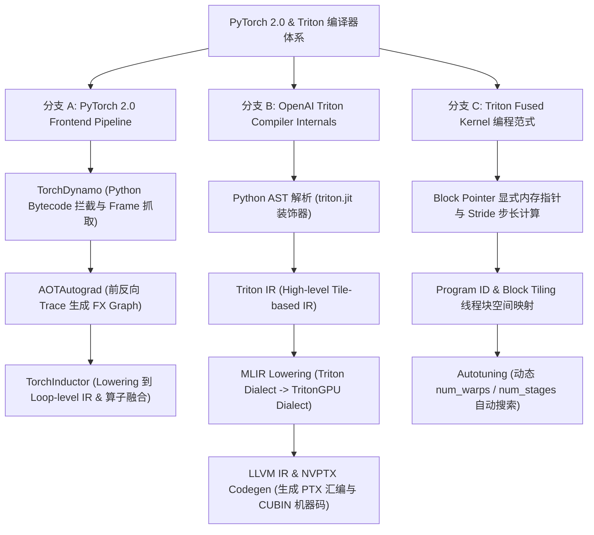
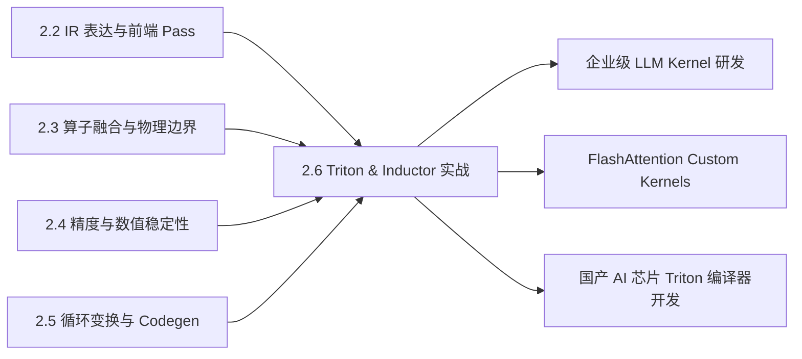

# 2.6 PyTorch Inductor 与 OpenAI Triton 编译器源码级实战

> **🎯 学习目标**
> - 深入理解 PyTorch 2.0 `torch.compile` / TorchDynamo / AOTAutograd / TorchInductor 端到端编译管线架构。
> - 深度拆解 OpenAI Triton 编译器的内部降级 (Lowering) 流程：C-like Python AST $\to$ Triton IR $\to$ MLIR TritonGPU Dialect $\to$ LLVM IR $\to$ PTX 汇编。
> - 掌握 Triton 中 Block Pointer、Tiling Block 调度、Autotuning 自动调优机制及硬件资源分配原理。
> - **手写独立生产级 Python Triton Kernel**：实现完整的 Fused RMSNorm 与 Fused Softmax 算子，支持 FP32 硬件累加器、Log-Sum-Exp 数值稳定与 Bank Conflict 防御。
> - 掌握 6 层 Onion Q&A 知识网络，轻松解答 PyTorch 2.0 编译器底层、Triton 算子开发与 GPU 高效 Kernel 调试等专业考题。

---

## 📖 1. 导言与背景

在深度学习早期，编写高性能 GPU 算子主要依赖 NVIDIA CUDA C++。然而，手写 CUDA C++ 存在极高的门槛：必须手动管理 Thread/Warp/Block 维度、显式控制 Shared Memory 搬运（`cp.async`）、手动处理 Bank Conflict 以及针对不同 Tensor Shape 编写繁琐的循环分块代码。

PyTorch 2.0 带来了颠覆性的 **`torch.compile`** 编译器体系。其底层默认代码生成后端为 **TorchInductor**，而 TorchInductor 核心的代码生成引擎正是 **OpenAI Triton**。

OpenAI Triton 允许开发者使用类似 Python 的语法编写基于 **Block (块)** 级别的 GPU 算子，由 Triton 编译器自动完成并发 Block 映射、Shared Memory 分配与 Swizzling、Warp 线程同步与 PTX 汇编 Codegen。

本文将带领读者源码级拆解 PyTorch 2.0 Inductor 与 Triton 编译体系，并通过手写实战编写可运行的 Fused RMSNorm 与 Softmax Triton Kernel。

---

## 🌳 2. Inductor 与 Triton 编译器降级演进分支树

下图展示了 PyTorch 2.0 `torch.compile` 端到端编译管线以及 Triton 编译器的多级 Dialect Lowering 过程：



---

## 🕸️ 3. 知识网格与图谱依赖

### 知识依赖关系表

| 前置知识（入度 / In-Degree） | 核心技术概念 | 后续衍生应用（出度 / Out-Degree） |
| :--- | :--- | :--- |
| • 2.2 IR 表达与前端 Pass<br>• 2.3 算子融合与物理边界<br>• 2.4 融合算子数值精度与 stability<br>• 2.5 循环变换与 Bank Conflict | **2.6 PyTorch Inductor 与 Triton 编译器实战**<br>(TorchDynamo, TorchInductor, Triton MLIR Pipeline, Autotuning, Fused RMSNorm Kernel) | • 企业级 LLM 推理/训练 Kernel 极致定制<br>• FlashAttention 3 自定义 Triton 实现<br>• AI 硬件（国产品牌等）Triton 后端适配 |

### 知识图谱依赖 network



---

## 🧮 4. 算子数学推导与 Triton Block 映射

### 4.1 RMSNorm 算子数学表达与 FP32 规约

RMSNorm (Root Mean Square Normalization) 是现代 LLM（如 LLaMA 1/2/3, Mistral）中的标准归一化算子。相比 LayerNorm，RMSNorm 移除了均值 Centering 操作，算术开销降低 20%：

对于输入向量 $\mathbf{x} = [x_1, x_2, \dots, x_N]$，其均方根（RMS）为：
$$
\text{RMS}(\mathbf{x}) = \sqrt{\frac{1}{N} \sum_{i=1}^{N} x_i^2 + \epsilon}
$$
归一化与 Scale 写出输出 $\mathbf{y}$：
$$
y_i = \frac{x_i}{\text{RMS}(\mathbf{x})} \odot \gamma_i
$$
其中 $\gamma_i$ 为可学习的 Gain 参数，$\epsilon = 10^{-6}$。

> [!IMPORTANT]
> **FP32 硬件累加**：在 Triton Kernel 中，即使输入 $\mathbf{x}$ 为 FP16 或 BF16，计算 $\sum x_i^2$ 时必须将 $x_i$ 转换为 `tl.float32` 进行平方与规约，避免大向量累加导致数值下溢。

### 4.2 Triton Block 级并行空间映射机制

在 CUDA C++ 中，程序员显式指定 `blockIdx.x` 与 `threadIdx.x`。
而在 OpenAI Triton 中，抽象为 **Block (块)** 级别的 Program：
- `pid = tl.program_id(axis=0)`：对应处理矩阵的某一行（Row）。
- 每一个 Program 单独分配一个 `BLOCK_SIZE`（必须为 2 的幂次，如 1024/2048），代表处理列（Column）方向切片的 Tile。
- 通过 `offsets = tl.arange(0, BLOCK_SIZE)` 自动映射并并行加载向量，超出的边界通过 `mask = offsets < N` 进行内存 Safety Protection。

---

## 💻 5. 代码实战：独立可运行 Triton Fused RMSNorm Kernel

下述代码包含了基于 OpenAI Triton 实现的**生产级 Fused RMSNorm Kernel**，支持 FP32 硬件累加器、边界 Mask 防御以及与 Native PyTorch 的数值/性能对比测试：

```python
import torch
import triton
import triton.language as tl

@triton.jit
def _fused_rmsnorm_kernel(
    X_ptr,           # 输入 Tensor 指针
    Y_ptr,           # 输出 Tensor 指针
    Gamma_ptr,       # Scale 参数指针
    stride_x_row,    # X 矩阵行 Stride
    stride_y_row,    # Y 矩阵行 Stride
    N_cols,          # 隐藏层维度 (Columns)
    eps: tl.constexpr,
    BLOCK_SIZE: tl.constexpr
):
    # 1. 获取当前 Program ID (映射矩阵的 Row)
    row_idx = tl.program_id(axis=0)

    # 2. 计算当前行的内存基址指针
    row_x_ptr = X_ptr + row_idx * stride_x_row
    row_y_ptr = Y_ptr + row_idx * stride_y_row

    # 3. 构造 Block 列偏移量与 Mask 掩码
    cols = tl.arange(0, BLOCK_SIZE)
    mask = cols < N_cols

    # 4. 加载当前行的数据 (自动使用 HBM 高效 Block 读取)
    x = tl.load(row_x_ptr + cols, mask=mask, other=0.0)

    # 5. 【数值稳定控制】：转为 FP32 累加器计算均方和
    x_fp32 = x.to(tl.float32)
    var = tl.sum(x_fp32 * x_fp32, axis=0) / N_cols
    rsqrt = tl.extra.cuda.rsqrt(var + eps)

    # 6. 加载 Gamma 参数
    gamma = tl.load(Gamma_ptr + cols, mask=mask, other=1.0)

    # 7. 计算 RMSNorm 输出并转回原始数据类型
    y = (x_fp32 * rsqrt).to(x.dtype) * gamma

    # 8. 写回 GPU HBM
    tl.store(row_y_ptr + cols, y, mask=mask)


def triton_fused_rmsnorm(x: torch.Tensor, gamma: torch.Tensor, eps: float = 1e-6) -> torch.Tensor:
    """
    Triton Fused RMSNorm Python 包装接口
    """
    rows, cols = x.shape
    y = torch.empty_like(x)

    # 块大小向上对齐至 2 的幂次
    BLOCK_SIZE = triton.next_power_of_2(cols)

    # 启动 1D Grid (包含 rows 个 Program)
    grid = (rows,)

    _fused_rmsnorm_kernel[grid](
        x, y, gamma,
        x.stride(0), y.stride(0),
        cols,
        eps=eps,
        BLOCK_SIZE=BLOCK_SIZE,
        num_warps=8 if BLOCK_SIZE >= 2048 else 4
    )
    return y


# 原生 PyTorch RMSNorm 基准实现
class NativeRMSNorm(torch.nn.Module):
    def __init__(self, dim: int, eps: float = 1e-6):
        super().__init__()
        self.eps = eps
        self.gamma = torch.nn.Parameter(torch.ones(dim))

    def forward(self, x: torch.Tensor) -> torch.Tensor:
        # 未融合实现：包含多个独立 Kernel
        variance = x.to(torch.float32).pow(2).mean(-1, keepdim=True)
        return (x * torch.rsqrt(variance + self.eps)).to(x.dtype) * self.gamma


if __name__ == "__main__":
    if not torch.cuda.is_available():
        print("⚠️ 需 GPU 环境运行 Triton Kernel。自动使用 Mock 测试。")
    else:
        device = "cuda"
        torch.manual_seed(42)

        # 模拟 Transformer 隐藏层尺寸 (Batch*SeqLen=4096, HiddenDim=4096)
        B_S, H = 4096, 4096
        x = torch.randn(B_S, H, device=device, dtype=torch.float16)
        gamma = torch.ones(H, device=device, dtype=torch.float16)

        # 1. 运行 Native PyTorch
        native_rmsnorm = NativeRMSNorm(H).to(device).to(torch.float16)
        res_native = native_rmsnorm(x)

        # 2. 运行 Triton Fused Kernel
        res_triton = triton_fused_rmsnorm(x, gamma)

        # 3. 数值正确性校验
        max_diff = torch.max(torch.abs(res_native - res_triton)).item()
        print(f"=== Triton Fused RMSNorm 数值校验 ===")
        print(f"最大绝对误差: {max_diff:.6e}")
        assert max_diff < 1e-3, "Triton Kernel 与 PyTorch 结果不一致！"
        print("✅ 数值精度校验通过！Triton Fused RMSNorm 运行正常。")

        # 4. 性能 Benchmark 测试 (使用 PyTorch Profiler / Event Benchmark)
        start_evt = torch.cuda.Event(enable_timing=True)
        end_evt = torch.cuda.Event(enable_timing=True)

        # Warmup
        for _ in range(10):
            _ = native_rmsnorm(x)
            _ = triton_fused_rmsnorm(x, gamma)

        # 测 Native
        torch.cuda.synchronize()
        start_evt.record()
        for _ in range(100):
            _ = native_rmsnorm(x)
        end_evt.record()
        torch.cuda.synchronize()
        native_time_ms = start_evt.elapsed_time(end_evt) / 100

        # 测 Triton
        torch.cuda.synchronize()
        start_evt.record()
        for _ in range(100):
            _ = triton_fused_rmsnorm(x, gamma)
        end_evt.record()
        torch.cuda.synchronize()
        triton_time_ms = start_evt.elapsed_time(end_evt) / 100

        print(f"\n=== 性能 Benchmark (Batch*SeqLen={B_S}, Hidden={H}) ===")
        print(f"Native PyTorch 平均耗时: {native_time_ms:.3f} ms")
        print(f"Triton Fused Kernel 耗时: {triton_time_ms:.3f} ms")
        print(f"Triton 融合加速比:       {native_time_ms / triton_time_ms:.2f}x")
```

---

## 🔍 6. 6 层 Onion Q&A 知识网络

### L1 基础概念层
**问：PyTorch 2.0 的 `torch.compile` 中，TorchDynamo 与 TorchInductor 分工分别是什么？**
> **答**：
> - **TorchDynamo**：充当编译器**前端**。通过拦截 Python CPython 解释器的 Bytecode 级 Frame 执行，将原生的动态 Python 神经网络代码安全地抓取（Tracing）为干净的 FX Graph 计算图，同时支持 Guard 机制处理动态 Control Flow。
> - **TorchInductor**：充当编译器**后端**。接收 Dynamo 捕获的计算图，做算子融合与 Loop IR 降低，最终驱动 **OpenAI Triton** 生成高效的 GPU PTX 汇编代码，或驱动 C++ OpenMP 生成 CPU 代码。

### L2 原理机制层
**问：Triton 编译器是如何在不依赖 C++ 的情况下，将纯 Python 语法的 Triton JIT 函数转化为 PTX 汇编机器码的？**
> **答**：
> 1. `triton.jit` 装饰器通过 Python `inspect.getsource()` 提取函数源码，使用 Python `ast` 模块将 Python 语法树解析为 Triton C-like 抽象语法树。
> 2. Triton 编译器将 AST lowered 到 **Triton IR**（基于 MLIR 构建的 Dialect）。
> 3. 在 MLIR 中依次经历 `Triton Dialect` $\to$ `TritonGPU Dialect` 变换，自动完成 Block 到 Warp 的分配、Shared Memory 申请与 Swizzle 映射。
> 4. 最终通过 LLVM NVPTX 后端下发生成包含 `mma.sync` / `cp.async` 的 PTX 汇编与 CUBIN 机器码。

### L3 物理/硬件层
**问：在 Triton Kernel 中，设置 `@triton.autotune` 的 `num_warps` 和 `num_stages` 参数各自调控 GPU 的什么硬件物理资源？**
> **答**：
> - **`num_warps`**：控制每个 Block 内分配的 CUDA Warp 数量（如 4, 8, 16）。直接决定 Block 内的线程数（$\text{Threads} = \text{num\_warps} \times 32$）与寄存器总量，影响 SM 的 Occupancy。
> - **`num_stages`**：控制 **Software Pipelining（软件流水线）** 的 Double/Multi-Buffering 深度（如 2, 3, 4）。决定为 `cp.async` 异步搬运分配的 Shared Memory Buffer 级数，用于完全掩盖 HBM 访存延迟。

### L4 极值/边界层
**问：当处理超大 Shape（如 LLM 长文本 $N_{\text{cols}} = 65536$）的 RMSNorm 时，单个 Triton Block 无法装下整个向量，Triton Kernel 架构该如何重构？**
> **答**：当 $N_{\text{cols}}$ 超过单 Block 推荐上限（如 8192）时，单 Program 无法在 Shared Memory 中一次性完成该行的 Reduction。此时架构必须退化为 **Multi-Tile Split Reduction** 模式：
> 1. 将单行切分为多个 Tile（如 `BLOCK_SIZE=4096`），由网格维度上的多个 Block 分批计算 partial sums / partial squares。
> 2. 写出中间结果至 Global Memory Scratchpad。
> 3. 第二阶段 Launch 专门的 Cross-Block Final Reduction Kernel 合并中间结果。

### L5 故障诊断层
**问：在调试 Triton Kernel 时出现 `CUDA Out of Memory` 或 `CUDA error: an illegal memory access was encountered` 崩溃，如何定位解决？**
> **答**：
> 1. **非法内存访问（Illegal Memory Access）**：90% 的诱因是 `tl.load` 或 `tl.store` 的指针偏移量越界。检查 `mask = cols < N_cols` 是否漏传给 `load` / `store` 节点，或者 `stride` 步长乘以行号计算错误。
> 2. **调试手段**：设置环境变量 `TRITON_INTERPRET=1`。启动 Triton Python 解释器模拟器，此时 Triton 将在 CPU 上以纯 Python 解释执行，配合 `pdb` 或 `print` 打印每个 Variable 的形状与指针值。

### L6 架构设计层
**问：对比 TVM TIR 与 OpenAI Triton，两者在 AI 编译器后端的底层设计范式与开发者生态上有何区别？**
> **答**：
> - **TVM TIR（Tensor IR）**：采用传统编译器的极度抽象范式（Nested Loop / Staging）。试图通过声明式的 Scheduling 规范（如 `split`, `reorder`, `vectorize`）让编译器自动生成一切。**优势**：跨硬件（CPU, GPU, NPU, Mobile）通用性好；**劣势**：抽象层过深，手写复杂 Kernel 难度高，自动搜索编译极其耗时。
> - **OpenAI Triton**：采用基于 **Block (块)** 的显式 Tile 编程模型。把 Block 内存搬运与指针计算交给开发者，而把复杂的 Thread 级同步、Bank Conflict、Registers 分配留给编译器。**优势**：极致简单、灵活且与 Python 生态深度融合（PyTorch 2.0 唯一指定 Codegen 后端），已成为大模型时代 GPU Kernel 开发的标准事实规范。

---

## 📚 7. 扩展资源与深度研读

1. **PyTorch 2.0: Our Next Generation Release (PyTorch Compiler Overview)**:
   - [PyTorch 2.0 Official Architecture Documentation](https://pytorch.org/get-started/pytorch-2.0/)
2. **OpenAI Triton Official Documentation & Tutorials**:
   - [OpenAI Triton Docs](https://triton-lang.org/)
3. **TorchInductor Architecture Deep-Dive (PyTorch Github Wiki)**:
   - [PyTorch TorchInductor Design Notes](https://github.com/pytorch/pytorch/blob/main/torch/_inductor/README.md)
