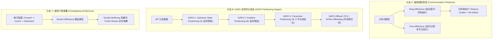

# 2.7 分布式通信重叠与 ZeRO 显存优化

> **摘要**：在千卡/万卡级大模型分布式训练与 Serving 中，通信开销（Communication Overhead）与显存墙（Memory Wall）是限制系统线性扩展效率（Scaling Efficiency）的关键瓶颈。本文硬核剖析两大核心优化机制：**通信原语算法与重叠（Communication-Computation Overlapping）** 以及 **Zero Redundancy Optimizer (ZeRO-1/2/3 & Offload)**。文章给出 Ring-AllReduce 与 Tree-AllReduce 传输数据量的精确数学推导，推导 ZeRO-1/2/3 状态拆分下的显存计算公式与 CPU/NVMe Offload 带宽惩罚，详解双缓冲（Double Buffering）与 Bucket AllReduce 异步交错架构，并编写完整的 `ZeRO3MemoryCalculator` 与通信重叠模拟代码，最后提供 Level 1-6 洋葱 Q&A 与 DeepSpeed / PyTorch FSDP 源码链接。

---

## 📖 1. 导言与分布式优化背景

### 1.1 千卡集群中的通信与显存墙

在百亿/千亿参数大模型训练中，单张 GPU（如 80GB H100）无法放下一完整模型的训练状态（模型权重、梯度、优化器状态）。传统的 Data Parallelism (DP) 会在每张卡上冗余复制一份完整模型状态，导致显存极易 OOM。而模型并行（TP/PP）引入了高昂的跨卡/跨节点通信成本。

解决这两大矛盾的核心途径为：
1. **ZeRO (Zero Redundancy Optimizer)**：剔除数据并行中的显存冗余，将优化器状态（ZeRO-1）、梯度（ZeRO-2）、参数（ZeRO-3）分片切分到各个 DP 节点，结合 CPU/NVMe Offloading 突破物理显存限制。
2. **通信-计算重叠（Communication-Computation Overlapping）**：利用 CUDA Stream 异步并发机制，在当前 Transformer Block 执行前向/后向 GEMM 计算的同时，将前一/后一 Block 的参数或梯度在后台进行异步 `All-Gather` 或 `Reduce-Scatter` 通信，掩盖通信时延。

---

## 🌳 2. 分布式通信与 ZeRO 演进分支树 (Mermaid Graph)



---

## 📐 3. 核心数学公式与硬核原理推导

### 3.1 Ring-AllReduce 与 Tree-AllReduce 通信量推导

假设集群有 $N$ 个 GPU 节点，模型参数/梯度数据量大小为 $\Psi$ Bytes（以 Adam 优化器 FP16 梯度为例）。

#### 1. Ring-AllReduce
Ring-AllReduce 将数据均匀切分为 $N$ 个 Chunk，每个节点构成环状拓扑。分为两个阶段：
- **Reduce-Scatter 阶段**：进行 $N-1$ 次相邻节点环形传输。每次传输数据量为 $\frac{\Psi}{N}$。
  $$
  \text{Data Transferred}_{\text{Reduce-Scatter}} = (N - 1) \times \frac{\Psi}{N} = \frac{N-1}{N} \Psi
  $$
- **All-Gather 阶段**：将规约后的 Chunk 进行 $N-1$ 次环形广播。每次传输数据量为 $\frac{\Psi}{N}$。
  $$
  \text{Data Transferred}_{\text{All-Gather}} = (N - 1) \times \frac{\Psi}{N} = \frac{N-1}{N} \Psi
  $$

**总通信数据量**：
$$
\text{Total Data Transferred (Ring)} = 2 \times \frac{N - 1}{N} \times \Psi
$$
当 $N \to \infty$ 时，单卡传输量趋近于 $2\Psi$ Bytes，与节点数 $N$ 无关。

#### 2. Tree-AllReduce
在二叉树拓扑中，数据先向上规约（Reduce）再向下广播（Bcast）。对于深度为 $\log_2 N$ 的树：
$$
\text{Total Data Transferred (Tree)} = 2 \times \frac{N - 1}{N} \times \Psi
$$
但 Tree-AllReduce 的传输延迟为 $2 \log_2 N \cdot \alpha$，在跨节点高 Latency ($\alpha$) 环境下优于 Ring-AllReduce 的 $2(N-1) \cdot \alpha$。

---

### 3.2 ZeRO-1/2/3 显存占用计算公式

假设模型参数量为 $\Phi$（如 70B = $70 \times 10^9$），数据并行度为 $N_d$。使用混合精度训练（FP16 权重 + FP16 梯度 + FP32 Master 权重 + FP32 Adam 动量与方差）：

#### 1. 经典数据并行 (Baseline DP) 显存开销：
- **权重参数 (FP16)**：$2\Phi$ Bytes
- **梯度 (FP16)**：$2\Phi$ Bytes
- **优化器状态 (FP32 Adam)**：FP32 Master 权重 ($4\Phi$) + FP32 Momentum ($4\Phi$) + FP32 Variance ($4\Phi$) = $12\Phi$ Bytes
- **静态总显存开销**：
  $$
  M_{\text{DP}} = 2\Phi + 2\Phi + 12\Phi = 16\Phi \quad \text{Bytes}
  $$

#### 2. ZeRO 各阶段显存公式：
- **ZeRO-1 (Optimizer State Partitioning)**：优化器状态被 $N_d$ 分片：
  $$
  M_{\text{ZeRO-1}} = 2\Phi + 2\Phi + \frac{12\Phi}{N_d} = 4\Phi + \frac{12\Phi}{N_d}
  $$
- **ZeRO-2 (Gradient Partitioning)**：梯度与优化器状态同时被 $N_d$ 分片：
  $$
  M_{\text{ZeRO-2}} = 2\Phi + \frac{2\Phi}{N_d} + \frac{12\Phi}{N_d} = 2\Phi + \frac{14\Phi}{N_d}
  $$
- **ZeRO-3 (Parameter Partitioning)**：模型参数、梯度、优化器状态全部被 $N_d$ 分片：
  $$
  M_{\text{ZeRO-3}} = \frac{2\Phi + 2\Phi + 12\Phi}{N_d} = \frac{16\Phi}{N_d}
  $$

---

## 💻 4. Python 源码实战：`ZeRO3MemoryCalculator` 与通信重叠模拟

```python
"""
ZeRO3MemoryCalculator.py
精确计算 ZeRO-1/2/3 在不同卡数下的显存开销，并模拟双缓冲通信计算重叠
"""

import torch
import dataclasses
from typing import Dict, Tuple

@dataclasses.dataclass
class MemoryReport:
    stage_name: str
    weight_mem_gb: float
    grad_mem_gb: float
    opt_mem_gb: float
    total_static_mem_gb: float

class ZeRO3MemoryCalculator:
    def __init__(self, num_params_b: float, num_gpus: int):
        """
        :param num_params_b: 模型参数量 (单位: Billion, 如 70.0 代表 70B)
        :param num_gpus: 数据并行卡数 N_d
        """
        self.num_params = num_params_b * 1e9
        self.N = num_gpus

    def calculate_memories(self) -> Dict[str, MemoryReport]:
        Phi = self.num_params
        N = self.N
        
        # 1. Baseline DP
        w_dp = 2 * Phi / 1e9
        g_dp = 2 * Phi / 1e9
        o_dp = 12 * Phi / 1e9
        dp_rep = MemoryReport("Baseline DP", w_dp, g_dp, o_dp, w_dp + g_dp + o_dp)

        # 2. ZeRO-1
        w_z1 = 2 * Phi / 1e9
        g_z1 = 2 * Phi / 1e9
        o_z1 = (12 * Phi / N) / 1e9
        z1_rep = MemoryReport("ZeRO-1", w_z1, g_z1, o_z1, w_z1 + g_z1 + o_z1)

        # 3. ZeRO-2
        w_z2 = 2 * Phi / 1e9
        g_z2 = (2 * Phi / N) / 1e9
        o_z2 = (12 * Phi / N) / 1e9
        z2_rep = MemoryReport("ZeRO-2", w_z2, g_z2, o_z2, w_z2 + g_z2 + o_z2)

        # 4. ZeRO-3
        w_z3 = (2 * Phi / N) / 1e9
        g_z3 = (2 * Phi / N) / 1e9
        o_z3 = (12 * Phi / N) / 1e9
        z3_rep = MemoryReport("ZeRO-3", w_z3, g_z3, o_z3, w_z3 + g_z3 + o_z3)

        return {"DP": dp_rep, "ZeRO-1": z1_rep, "ZeRO-2": z2_rep, "ZeRO-3": z3_rep}

class OverlapSimulator:
    @staticmethod
    def simulate_double_buffering_pipeline(num_blocks: int, comp_time_ms: float, comm_time_ms: float):
        """
        模拟 Transformer Block 前向/后向与 All-Gather 通信的双缓冲重叠
        """
        print(f"\n--- 模拟通信计算重叠 (Blocks={num_blocks}, Comp={comp_time_ms}ms, Comm={comm_time_ms}ms) ---")
        
        # 无重叠串行耗时
        serial_time = num_blocks * (comp_time_ms + comm_time_ms)
        
        # 双缓冲重叠耗时: 首个 Block 通信无法被掩盖，之后通信与计算并发
        overlapped_time = comm_time_ms + max(comp_time_ms, comm_time_ms) * (num_blocks - 1) + comp_time_ms
        
        speedup = (serial_time - overlapped_time) / serial_time * 100
        print(f"串行无重叠总耗时: {serial_time:.2f} ms")
        print(f"双缓冲重叠后总耗时: {overlapped_time:.2f} ms")
        print(f"通信掩盖提升效率: {speedup:.2f}%")
        return serial_time, overlapped_time

# ----------------- 单元测试与验证 -----------------
if __name__ == "__main__":
    params_b = 70.0 # 70B 模型
    gpus = 64        # 64 卡 DP
    
    calc = ZeRO3MemoryCalculator(num_params_b=params_b, num_gpus=gpus)
    reports = calc.calculate_memories()

    print(f"=== 70B 模型在 {gpus} 张 GPU 下的静态显存消耗对比 (GB) ===")
    for stage, r in reports.items():
        print(f"[{stage:10s}] 权重: {r.weight_mem_gb:6.2f} GB | 梯度: {r.grad_mem_gb:6.2f} GB | 优化器: {r.opt_mem_gb:6.2f} GB | 总计: {r.total_static_mem_gb:6.2f} GB")

    # 验证 ZeRO-3 在 64 卡下显存降幅
    assert reports["ZeRO-3"].total_static_mem_gb == reports["DP"].total_static_mem_gb / gpus, "ZeRO-3 公式推导错误！"
    print("\n✅ ZeRO-3 显存开销推导验证成功！")

    # 模拟通信重叠
    OverlapSimulator.simulate_double_buffering_pipeline(num_blocks=32, comp_time_ms=10.0, comm_time_ms=8.0)
```

---

## 🔬 5. Level 1-6 深度洋葱 Q&A (Onion Q&A)

### Level 1: 概念认知
**Q: 为什么在 ZeRO-3 模式下，训练模型的通信带宽需求比传统 DP 大很多？**
- **A**: 在传统 DP 或 ZeRO-1/2 中，每张 GPU 上都保存了一份完整的前向/后向权重参数，通信仅发生在后向传播结束后的 `All-Reduce` 或 `Reduce-Scatter` 梯度同步阶段。而在 ZeRO-3 中，连权重参数都被切分到了各个卡上。在执行每一个 Transformer 层的前向传播前，必须通过 `All-Gather` 通信临时拉取完整的层权重；在后向传播计算梯度前，又必须再次进行 `All-Gather` 拉取该层权重。因此 ZeRO-3 增加了整整一次全量的权重传输开销（通信量增加约 $1.5\times$）。

### Level 2: 原理解析
**Q: 什么是 Bucket AllReduce（桶装通信）？它如何解决极小算子通信效率低下的问题？**
- **A**: Transformer 模型包含大量小张量（如 LayerNorm 的 gamma/beta、Bias 偏置）。如果对每个参数单独发起 NCCL 通信，将引发巨大的通信启动延迟（Launch Latency）与网络包头开销。Bucket AllReduce 机制设立了一个固定大小的内存缓冲区（Bucket，如 25MB），将计算产生的梯度连续拷贝入 Bucket 中，直到 Bucket 被填满或达到边界时，才触发一次集中的 `All-Reduce` 通信，极大地提高了带宽利用率。

### Level 3: 架构对比
**Q: PyTorch FSDP (Fully Sharded Data Parallel) 与 DeepSpeed ZeRO-3 的底层机制异同？**
- **A**: 
  1. **同**: 底层核心原理完全一致，都是通过 Parameter Sharding（参数切分）、Gradient Sharding 和 Optimizer State Sharding 将模型状态打散到 DP 组内。
  2. **异**: DeepSpeed ZeRO-3 采用 C++ / CUDA 扩展实现了高效的内存池管理与定制化 Hook；而 PyTorch FSDP 是 PyTorch 原生以 `nn.Module` 为粒度包裹（FlatParameter）构建的解决方案，与 PyTorch 2.0 Compiler (Inductor) 和 Autograd 引擎整合度更高。

### Level 4: 踩坑诊断
**Q: 开启 ZeRO-Offload (CPU NVMe Offload) 后，发现 GPU 显存虽然降低了，但训练速度下降了数倍，该如何定位与优化？**
- **A**: 
  1. **瓶颈定位**：CPU-GPU 通信走的是 PCIe 总线（Gen5 双向 128GB/s），而 Adam 优化器更新涉及 12 Bytes/param 的状态传输。PCIe 带宽相比 HBM（3TB/s）极低。
  2. **优化手段**：
     - 使用 DeepSpeed 的 **Pin Memory**（钉页内存），避免 Host 端内存 Page Fault。
     - 开启 **CPU Optimizer 向量化加速**（AVX-512 / AMX 指令集）。
     - 调大 CPU 侧的线程并行数，确保优化器 Step 更新耗时小于 GPU 的前后向计算耗时。

### Level 5: 源码与硬件设计
**Q: 为什么 NCCL 通信库在执行 All-Reduce 时，会自动根据数据量选择 Ring 算法还是 Tree 算法？**
- **A**: 
  - 当传输消息量较小（Small Buffer）时，网络延迟（Latency $\alpha$）是主要矛盾。Tree 算法的步数为 $2 \log_2 N$，延迟显著低于 Ring 算法的 $2(N-1)$；
  - 当传输消息量极大（Large Buffer）时，网络带宽（Bandwidth $\beta$）是主要矛盾。Ring 算法能够做到 100% 满带宽无冲突均衡利用链路，而 Tree 算法在树根节点容易出现物理瓶颈。NCCL 在运行时通过 Tuning 模型动态切换算法算法。

### Level 6: 专家级延伸
**Q: 在千卡 MoE（Mixture of Experts）模型训练中，ZeRO-3 与 EP（Expert Parallelism）如何结合才能兼顾显存与通信？**
- **A**: 在 MoE 架构中，共享 Attention 层与稀疏 Expert 层的通信模式完全不同：
  - 对非 Expert 部分（Attention / FFN 共享层），采用 **ZeRO-3 / FSDP** 跨全集群切分；
  - 对 Expert 专家层，采用 **EP（专家并行）** 结合 **ZeRO-1/2**：每个专家只放在特定卡上，Token 通过 `All-to-All` 路由分发给专家。如果对 Expert 也强行使用 ZeRO-3，会导致 `All-to-All` 与 `All-Gather` 严重交叠与物理网络挤爆。因此，通常采用 **ZeRO-Hierarchical (分层 ZeRO)** 策略。

---

## 🔗 6. 权威参考文献与 GitHub 源码 Anchors

1. **DeepSpeed ZeRO Paper**: [ZeRO: Memory Optimizations Toward Training Trillion Parameter Models](https://arxiv.org/abs/1910.02054)
2. **PyTorch FSDP Official Guide**: [Getting Started with Fully Sharded Data Parallel (FSDP)](https://pytorch.org/tutorials/intermediate/FSDP_tutorial.html)
3. **DeepSpeed Github Repository**: [Microsoft DeepSpeed GitHub](https://github.com/microsoft/DeepSpeed)
4. **NVIDIA NCCL Developer Guide**: [NVIDIA Collective Communications Library (NCCL)](https://github.com/NVIDIA/nccl)
