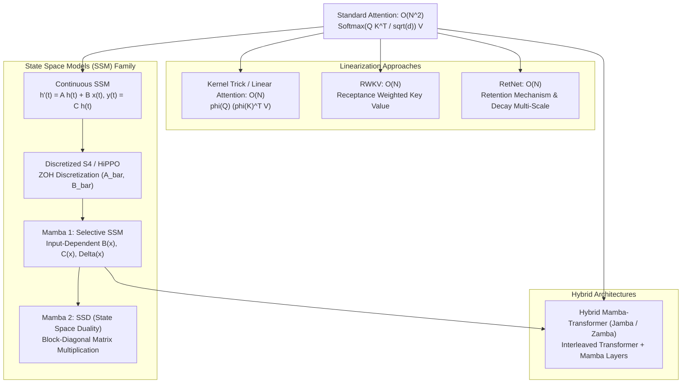

# 3.2 线性注意力与亚二次方架构: Mamba 1/2, SSM, RWKV

> **📌 本章导读**
> 标准 Transformer 的自注意力机制（Self-Attention）在序列长度为 $N$ 时，计算复杂度与显存开销呈现二次方增长 $O(N^2)$。随着长文本（100K ~ 1M+ Tokens）需求的爆发，**线性注意力（Linear Attention）**与**亚二次方架构（Sub-quadratic Architectures）**成为了 Layer 3 模型架构刷新的核心前沿。
> 
> 本文以**状态空间模型（State Space Model, SSM）**为主线，全面解构连续微分方程到离散状态更新的数学推导，深入剖析 **Mamba 1 (Selective SSM)**、**Mamba 2 (SSD: State Space Duality)**、**RWKV**、**RetNet** 及 **Hybrid Mamba-Transformer (Jamba)** 的底层设计逻辑与 PyTorch 算子实现。

---

## 🌳 1. 线性与亚二次方注意力演进树

从标准自注意力到亚二次方 SSM 架构的演进路线如下所示：



---

## 🧮 2. 数学推导与硬核机制

### 2.1 连续状态空间模型 (Continuous SSM) 的离散化

状态空间模型起源于控制理论，描述一个连续时间连续状态系统：

$$h'(t) = \mathbf{A} h(t) + \mathbf{B} x(t)$$
$$y(t) = \mathbf{C} h(t)$$

其中 $x(t) \in \mathbb{R}$ 为输入信号，$h(t) \in \mathbb{R}^N$ 为隐状态，$\mathbf{A} \in \mathbb{R}^{N \times N}, \mathbf{B} \in \mathbb{R}^{N \times 1}, \mathbf{C} \in \mathbb{R}^{1 \times N}$。

为了在离散数字计算机上处理 Sequence 数据，需要使用**零阶保持器 (Zero-Order Hold, ZOH)** 和时间步长区间 $\Delta$ 进行离散化：

$$\bar{\mathbf{A}} = \exp(\Delta \mathbf{A})$$
$$\bar{\mathbf{B}} = (\Delta \mathbf{A})^{-1} (\exp(\Delta \mathbf{A}) - \mathbf{I}) \cdot \Delta \mathbf{B} \approx \Delta \mathbf{B}$$

由此得到**离散化状态更新方程**：

$$h_k = \bar{\mathbf{A}} h_{k-1} + \bar{\mathbf{B}} x_k$$
$$y_k = \mathbf{C} h_k$$

#### 两种等价计算模式：
1. **循环模式 (Recurrent View, $O(1)$ 步推理开销)**：
   $$h_k = \bar{\mathbf{A}} h_{k-1} + \bar{\mathbf{B}} x_k \implies \text{用于 Decode 自回归生成}$$
2. **卷积模式 (Convolutional View, $O(N \log N)$ 训练并行)**：
   构造卷积核 $\overline{\mathbf{K}} = (\mathbf{C}\bar{\mathbf{B}}, \mathbf{C}\bar{\mathbf{A}}\bar{\mathbf{B}}, \dots, \mathbf{C}\bar{\mathbf{A}}^{L-1}\bar{\mathbf{B}})$，则：
   $$y = x * \overline{\mathbf{K}}$$

---

### 2.2 Mamba 1: 选择性机制 (Selective SSM)

在早期的 S4 等结构中，$\mathbf{A}, \mathbf{B}, \mathbf{C}, \Delta$ 都是全局固定的常数（LTI 系统，线性时不变系统）。这导致模型**无法根据输入上下文选择性过滤或记忆信息**（即无法解决“大海捞针”问题）。

**Mamba 1 的核心突破**：打破 LTI，让参数变为**输入驱动 (Input-dependent)**：

$$\mathbf{B}_k = s_B(x_k), \quad \mathbf{C}_k = s_C(x_k), \quad \Delta_k = \tau_{\Delta}(\text{Parameter} + s_\Delta(x_k))$$

```
Input x_k ---> Linear_B ---> B_k (Input-Dependent)
          ---> Linear_C ---> C_k (Input-Dependent)
          ---> Linear_Delta -> Delta_k (Input-Dependent)
```

#### Hardware-Aware Scan 硬件感知并行算法
由于 $\bar{\mathbf{A}}_k, \bar{\mathbf{B}}_k$ 随输入 $x_k$ 逐 Token 变化，全局卷积模式无法使用。Mamba 1 引入了 **Associative Scan（结合律并行扫描）**：
- 不写回 HBM：在 GPU 片上 **SRAM** 内完成递归计算与融合 Kernel。
- 梯度重算（Recomputation）：反向传播时不保存中间状态 $h_k$，而是在 SRAM 中现场重新计算，节约 80%+ 显存。

---

### 2.3 Mamba 2: 状态空间对偶性 (SSD, State Space Duality)

Mamba 1 依靠手写 CUDA / Triton Associative Scan 算子，但无法利用 Tensor Core 硬件极致的矩阵乘法（GEMM）吞吐。**Mamba 2 提出了 SSD 理论**，证明了 **SSM 与 Structured Attention 的数学等价性**。

定义因果掩码矩阵 $\mathbf{M} \in \mathbb{R}^{L \times L}$：

$$M_{i, j} = \begin{cases} \mathbf{C}_i \left( \prod_{k=j+1}^i \bar{\mathbf{A}}_k \right) \bar{\mathbf{B}}_j, & i \ge j \\ 0, & i < j \end{cases}$$

SSD 将序列拆分为块大小为 $B$ 的 Block。块内计算退化为 GEMM 矩阵乘法，充分榨干 **Tensor Cores** 的 Peak FLOPS；块间传递隐状态 $h$，保持 $O(N)$ 显存开销。这使得 Mamba 2 的训练速度比 Mamba 1 快 **2-8 倍**。

---

## 💻 3. PyTorch 算法实战：手写 Selective SSM

以下提供一份纯 PyTorch 实现的 Mamba 1 选择性 SSM 核心离散化与状态更新模块。

```python
import torch
import torch.nn as nn
import torch.nn.functional as F

class SelectiveSSM(nn.Module):
    """
    Mamba 1 核心 Selective SSM 模块 (Pure PyTorch 实现)
    包含 Dynamic Discretization 与 Associative Scan 伪逻辑
    """
    def __init__(self, d_model: int = 64, d_state: int = 16, dt_rank: int = 8):
        super().__init__()
        self.d_model = d_model
        self.d_state = d_state
        self.dt_rank = dt_rank

        # A 参数矩阵 (初始化为 S4 的 HiPPO 结构衰减参数)
        A = torch.arange(1, d_state + 1, dtype=torch.float32).repeat(d_model, 1)
        self.A_log = nn.Parameter(torch.log(A))  # 保持 A 为负值以保证稳定

        # 输入投影层 (生成 Input-dependent Delta, B, C)
        self.x_proj = nn.Linear(d_model, dt_rank + d_state * 2, bias=False)
        self.dt_proj = nn.Linear(dt_rank, d_model, bias=True)

        # D Skip connection
        self.D = nn.Parameter(torch.ones(d_model))

    def forward(self, u: torch.Tensor) -> torch.Tensor:
        """
        输入 u: [Batch, Seq_Len, d_model]
        输出 y: [Batch, Seq_Len, d_model]
        """
        batch_size, seq_len, d_model = u.shape
        A = -torch.exp(self.A_log)  # [d_model, d_state]

        # 1. 投影提取 Input-dependent 参数
        x_dbl = self.x_proj(u)  # [B, L, dt_rank + 2*d_state]
        delta_rank, B_raw, C_raw = torch.split(
            x_dbl, [self.dt_rank, self.d_state, self.d_state], dim=-1
        )

        delta = F.softplus(self.dt_proj(delta_rank))  # [B, L, d_model]
        # B_raw, C_raw: [B, L, d_state]

        # 2. 逐时间步离散化与循环累加 (Recurrent view 用于演示算法结构)
        y_list = []
        h = torch.zeros(batch_size, d_model, self.d_state, device=u.device)

        for t in range(seq_len):
            u_t = u[:, t, :]            # [B, d_model]
            delta_t = delta[:, t, :]    # [B, d_model]
            B_t = B_raw[:, t, :]        # [B, d_state]
            C_t = C_raw[:, t, :]        # [B, d_state]

            # 离散化: A_bar = exp(delta * A), B_bar = delta * B
            delta_A = torch.exp(delta_t.unsqueeze(-1) * A.unsqueeze(0))  # [B, d_model, d_state]
            delta_B = delta_t.unsqueeze(-1) * B_t.unsqueeze(1)            # [B, d_model, d_state]

            # 状态更新方程: h_t = A_bar * h_{t-1} + B_bar * u_t
            h = delta_A * h + delta_B * u_t.unsqueeze(-1)                 # [B, d_model, d_state]

            # 输出方程: y_t = sum(h_t * C_t, dim=-1)
            y_t = torch.sum(h * C_t.unsqueeze(1), dim=-1)                 # [B, d_model]
            y_list.append(y_t)

        y = torch.stack(y_list, dim=1)  # [B, L, d_model]
        # 加上 residual D * u
        y = y + u * self.D.unsqueeze(0).unsqueeze(0)
        return y

if __name__ == "__main__":
    ssm = SelectiveSSM(d_model=32, d_state=16, dt_rank=4)
    dummy_input = torch.randn(2, 8, 32)
    output = ssm(dummy_input)
    print("Mamba SelectiveSSM Output Shape:", output.shape)
```

---

## 🔥 4. 连环面试追问 (Level 1 ~ Level 6)

### Level 1: 概念阐释
> **问：为什么传统 Linear Attention 无法完全取代标准 Self-Attention？**
>
> **答**：传统 Linear Attention 将 $\text{Softmax}(QK^T)V$ 去掉 Softmax 改写为 $\phi(Q) (\phi(K)^T V)$，由于去除了 Softmax 的非线性数值归一化，注意力矩阵极易发生数值不稳定性。此外，固定 Kernel 函数缺乏长距离关联的选择性检索能力，在“大海捞针 (Needle in a Haystack)”测试中精准召回率远低于 Standard Attention。

---

### Level 2: 核心机制
> **问：Mamba 1 如何通过 Selective Mechanism（选择性机制）解决传统 SSM 无法处理 Copy & Associative Recall 的问题？**
>
> **答**：传统 SSM 的参数 $(\mathbf{A}, \mathbf{B}, \mathbf{C}, \Delta)$ 是全局固定常数，无论输入是噪音还是关键 Token，系统衰减率与记忆权重完全一致。Mamba 1 让 $\mathbf{B}, \mathbf{C}, \Delta$ 成为输入 $x_k$ 的函数：当遇到不重要的 Token 时，$\Delta_k \to 0$，隐状态 $h_k \approx h_{k-1}$ 选择性忽略该 Token；当遇到重要 Token 时，$\Delta_k$ 变大，系统迅速擦除旧状态并写入新信息。

---

### Level 3: 硬件工程
> **问：由于 Mamba 1 的参数取决于输入，导致无法在训练时使用 FFT 快速全局卷积。Mamba 是如何实现并行训练的？**
>
> **答**：Mamba 1 利用了**并行结合律扫描（Parallel Associative Scan）**算法。因为离散状态更新可表示为类似前缀和的形式 $h_k = a_k h_{k-1} + b_k$，满足结合律 $(h_i \cdot h_j) \cdot h_k = h_i \cdot (h_j \cdot h_k)$，在硬件上可以通过二叉树归并算法在 $O(\log N)$ 步骤内实现并行扫描。同时 Mamba 采用熔断 Kernel 避免将中间状态写回 HBM，大幅降低了显存访问开销。

---

### Level 4: 架构演进
> **问：Mamba 2 的 State Space Duality (SSD) 相比 Mamba 1 进行了哪些重大架构升级？**
>
> **答**：
> 1. **数学对偶**：Mamba 2 证明了 SSM 与 Structured Masked Attention 的对偶性。
> 2. **利用 Tensor Core**：Mamba 1 依赖 1D-Scan 算子，无法直接利用 GPU 矩阵乘法（GEMM）单元；Mamba 2 将序列拆分为 Chunk，块内转化为 GEMM 计算，充分发挥 Tensor Core 的 Peak FLOPS。
> 3. **多头结构 (Multi-Head SSM)**：统一了类似 MHA 的多头设计，使 Head Dimension 与 State Dimension 得到优雅拓展。

---

### Level 5: 混合架构
> **问：为什么像 Jamba (Hybrid Mamba-Transformer) 这种混合架构会在工业级大模型部署中兴起？**
>
> **答**：
> 纯 Mamba 架构虽然 Decoding 速度极快且 KV Cache 开销为 $O(1)$，但在极其严苛的复杂逻辑推理、代码生成与多轮长上下文精确 Query 检索上，表现略逊于 Transformer。
> **Jamba 混合架构**采用例如“每 1 个 Transformer Layer 搭配 7 个 Mamba Layer”的交错组合：既利用 Mamba 层压缩了 80%+ 的 KV Cache 显存，又保留了 Transformer 关键层的高精度注意力召回能力，取得了吞吐量与性能的最优平衡。

---

### Level 6: 极限设计
> **问：如果在边缘端设备（如手机/ NPU）部署一个 100K 序列长度的 Agent 系统，你会选择纯 Transformer、纯 Mamba 2 还是 RWKV-6？为什么？**
>
> **答**：
> 推荐选择 **Mamba 2 或 Hybrid Mamba-Transformer**：
> 1. **显存上限限制**：边缘设备内存极小（8GB~16GB DRAM）。在 100K 序列下，Transformer 的 KV Cache 将轻易爆显存（占用数十 GB）；而 Mamba 2 自回归生成的隐状态 $h$ 显存开销固定为 $O(1)$。
> 2. **硬件算力匹配**：端侧 NPU/GPU 具备极高计算密度但内存带宽严重受限。Mamba 2 的 SSD 块内 GEMM 模式能最大化利用端侧 NPU 的矩阵加速器，且 Decoding 阶段极低的 Memory Bound 特性大幅延长设备续航。

---

## 🔗 5. 扩展学习与资源

- **[Mamba 1 Paper](https://arxiv.org/abs/2312.00752)**：Mamba: Linear-Time Sequence Modeling with Selective State Spaces (Albert Gu & Tri Dao).
- **[Mamba 2 / SSD Paper](https://arxiv.org/abs/2405.15052)**：Transformers are SSMs: Generalized Models and Efficient Algorithms Through Structured State Space Duality.
- **[GitHub state-spaces/mamba](https://github.com/state-spaces/mamba)**：Mamba 官方 CUDA / Triton 硬件优化实现库.
- **[RWKV Project](https://github.com/BlinkDL/RWKV-LM)**：Parallelizable RNN with Transformer-level Performance.
- **[Jamba Paper (AI21 Labs)](https://arxiv.org/abs/2403.19887)**：Jamba: An Hybrid Transformer-Mamba Language Model.
