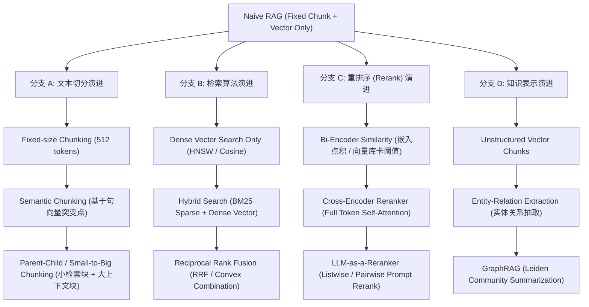
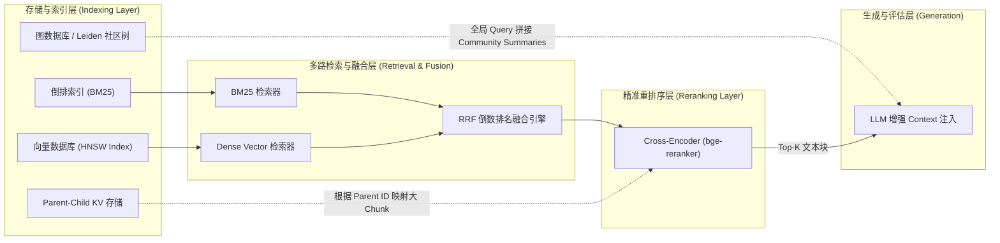

# 3.1 高级 RAG 架构实践：混合检索、重排序与 GraphRAG 全栈解析

> **🎯 学习目标**
> - 理解基础 RAG（Naive RAG）的三大致命瓶颈：检索召回率低、上下文噪音引发幻觉、缺乏全局宏观总结能力。
> - 掌握高级 RAG 的四大演进分支：从固定分块到 Parent-Child Chunking、从单模态检索到 Hybrid Search (BM25 + Dense Vector)、从 Bi-Encoder 到 Cross-Encoder Reranker，以及从 Chunk 到 GraphRAG。
> - 深入推导 Reciprocal Rank Fusion (RRF) 融合算法公式与 Bi-Encoder / Cross-Encoder 的计算复杂度对比。
> - 研读 6 层递进的“连环追问”面试链条，轻松应对业界高频考点（如 GraphRAG Leiden 社区发现算法与高并发 Top-N 级联重排序架构）。
> - 运行一套纯手写的生产级 Python 混合检索与 RRF 融合引擎。

---

## 📖 1. 导言与背景

在检索增强生成（Retrieval-Augmented Generation, RAG）技术的演进初期，基于“**文本切分 $\rightarrow$ Embedding 向量化 $\rightarrow$ 向量数据库相似度检索 $\rightarrow$ LLM 上下文注入**”的 **Naive RAG**（基础 RAG）成为了标准范式。然而，当该架构落地于企业级复杂知识库（如法律条文、医疗诊断记录、产品规格手册、跨部门财务报表）时，往往展现出不可调和的三大致命痛点：

### Naive RAG 的三大致命痛点

1. **检索召回率低（Low Recall / Keyword Mismatch）**：
   - 语义向量点积或余弦相似度擅长捕捉高维语义概念（如“苹果”与“水果”），但在面对**专有名词、精确型号、人名、股票代码或缩写**（如 `ERR-404-09A` 或 `ISO-27001`）时表现极差。Embedding 模型会将精确字符映射到密集的连续向量空间中，从而丢失了精确词项的精确匹配能力。
2. **上下文噪音引发幻觉（Context Noise & Lost in the Middle）**：
   - Naive RAG 通常将固定长度的文本块（如 512 Tokens）输入给 LLM。如果 Token 块过小，会丢失上下文的完整因果链条（语义断层）；若 Token 块过大或检索出的 Top-$K$ 包含大量无关干扰块，LLM 则面临注意力分散甚至触发“Lost in the Middle”现象，导致模型产生严重幻觉。
3. **缺乏全局宏观理解能力（Lack of Global Summarization）**：
   - 向量检索依赖于 Query 与各个 Chunk 之间的局域相似度（Local Semantic Similarity）。当用户提出全局提问（例如：“*本文档提到的三大核心研发风险是什么？*”或“*总结全书关于供应链危机的讨论*”）时，没有任何单个或 Top-$K$ 文本块能够涵盖完整答案，Naive RAG 在这种场景下几乎必然彻底失效。

为了解决以上失效模式，工业界 RAG 架构完成了从 **Naive RAG** 到 **Advanced RAG**，再到 **GraphRAG** 的全面升级。

---

## 🌳 2. RAG 架构演进分支树

下图展示了工业级 RAG 架构从最简单的单模向量检索，向文本切分、混合检索、重排序与知识图谱融合的四条并行演进分支：



---

## 🕸️ 3. 知识网格与图谱依赖

高级 RAG 并不是单一算法的简单叠加，而是由多种离散数据结构与计算范式协同构建的紧密知识网格。

### 依赖关系矩阵

| 技术模块 | 依赖的上游模块 (In-degree) | 驱动的下游模块 (Out-degree) |
| :--- | :--- | :--- |
| **BM25 / Sparse Index** | Tokenizer (分词器), Inverted Index (倒排索引) | Hybrid Search, RRF Fusion Engine |
| **Dense Vector Index** | Embedding Model (Bi-Encoder), Vector DB (HNSW/IVF-PQ) | Hybrid Search, Top-$K$ Candidates |
| **Cross-Encoder Reranker** | Top-$N$ Recalled Candidates (Hybrid Search Output) | Top-$K$ LLM Context Injector |
| **Parent-Child Indexing** | Document Splitter, Mapping Store (KV Storage) | High-Precision LLM Prompting |
| **GraphRAG (Graph Store)** | LLM Entity-Relation Extractor, Graph DB (Neo4j) | Community Summarization, Global Q&A |

### 模块关联结构拓扑



---

## 🧮 4. 融合算法与重排序推导

### 4.1 倒数排名融合算法 (Reciprocal Rank Fusion, RRF) 数学推导

在混合检索（Hybrid Search）中，稀疏检索（BM25）返回的分值通常是没有界限的连续实数 $\text{Score}_{\text{BM25}} \in [0, +\infty)$，而向量相似度返回的分值通常在 $[-1, 1]$ 或 $[0, 1]$ 之间。由于不同检索系统的得分分布（Distribution Scale）完全不一致，直接将原始分数线性相加或打折归一化极易受到极值打分的影响。

**RRF 倒数排名融合算法** 不依赖原始分数的具体数值，而是依赖文档在各个检索系统中的**相对排名（Rank Position）**。

#### RRF 数学公式

设 $M$ 为参与融合的检索系统集合（如 $M = \{\text{BM25}, \text{Dense Vector}\}$），$D$ 为所有被检索到的候选文档并集。对于任意文档 $d \in D$，其最终的 RRF 融合得分公式为：

$$ RRF\_Score(d \in D) = \sum_{m \in M} \frac{1}{k + r_m(d)} $$

其中：
- $r_m(d)$ 表示文档 $d$ 在检索系统 $m$ 返回结果中的** 1-based 排名**（即第一名为 1，第二名为 2...）。如果文档 $d$ 未出现在系统 $m$ 的列表内，则其 $r_m(d) \rightarrow \infty$，对应项项值为 $0$。
- $k$ 为平滑常数（Smoothing Factor），经验通常设定为 $k \approx 60$。

> **💡 常数 $k = 60$ 的直觉意义**：
> 当 $k=60$ 时，第 1 名的权值为 $\frac{1}{61} \approx 0.01639$，第 2 名的权值为 $\frac{1}{62} \approx 0.01612$，第 100 名的权值为 $\frac{1}{160} \approx 0.00625$。这保证了排名靠前的文档能获得更高的基础分，同时避免了第 1 名与第 2 名之间的权值落差过于剧烈，使多路检索的榜首结果能够获得平滑的优势叠加。

---

### 4.2 Bi-Encoder vs Cross-Encoder 计算复杂度与作用机制推导

在向量检索与重排序中，根据 Query $q$ 与 Document $d$ 在 Self-Attention 机制中的交互模式，分为 **Bi-Encoder** 与 **Cross-Encoder** 架构：

```
Bi-Encoder (双编码器):
  Query    ---> [ Transformer Layer ] ---> Vector v_q ──┐
                                                       ├─── 点积/余弦相似度 s(q,d)
  Document ---> [ Transformer Layer ] ---> Vector v_d ──┘

Cross-Encoder (交叉编码器):
  [ Query ; SEP ; Document ] ---> [ Single Shared Transformer Layer ] ---> Score s(q,d)
```

#### 理论推导与复杂度对比

设输入 Query 的 Token 长度为 $L_q$，候选 Document 的平均 Token 长度为 $L_d$，系统需要从 $N$ 个文档候选集中找出 Top-$K$ 个最佳相关结果。

1. **Bi-Encoder (双编码器，如 OpenAI `text-embedding-3`, BGE-Large)**：
   - **编码阶段**：Document 嵌入向量在离线索引建立期已提前计算完毕。在线查询时，仅需计算 Query 向量，复杂度为 $O(L_q^2)$。
   - **相似度计算阶段**：基于高维向量点积（或余弦相似度）：
     $$ s(q, d_i) = \langle \mathbf{v}_q, \mathbf{v}_{d_i} \rangle = \sum_{j=1}^{d_{\text{emb}}} v_{q,j} \cdot v_{d_i,j} $$
   - **总在线计算复杂度**：$O(L_q^2 + N \cdot d_{\text{emb}})$。因为向量点积具有可加性与距离保持特性，可以使用 HNSW 或 IVF-PQ 建立亚线性空间索引，使在线检索复杂度降低至 **$O(\log N)$**。
   - **致命缺陷**：Query 与 Document 在进入 Transformer 计算层时毫无互动（No Cross-Attention），只能通过压缩后的全局 Pooling 向量匹配，无法捕捉 Token 级别的微观相关性。

2. **Cross-Encoder (交叉编码器，如 `bge-reranker-large`, `ms-marco-MiniLM-L-6-v2`)**：
   - **计算机制**：将 Query 与 Document 拼接为单个序列 `[CLS] Query [SEP] Document [SEP]`，一并送入 Transformer：
     $$ \text{Attention}(Q, K, V) = \text{softmax}\left(\frac{Q K^T}{\sqrt{d_k}}\right) V $$
   - **总在线计算复杂度**：Query 中的每一个 Token 与 Document 中的每一个 Token 都会通过 Self-Attention 矩阵产生交叉注意力。序列总长度为 $L = L_q + L_d$。因此单次评估的复杂度为 $O((L_q + L_d)^2)$。
   - 对 $N$ 个候选文档在线评估的总复杂度为 **$O(N \cdot (L_q + L_d)^2)$**。
   - **优势与代价**：捕获相关性的能力极强，但**无法利用向量数据库预先索引**。若对百万人级文档库直接使用 Cross-Encoder，单次查询延迟将高达数十秒甚至分钟级。

---

## 🔥 5. 连环面试追问 (Level 1~6 Onion Chain)

> **💡 面试官视角**：RAG 提问往往从简单的“你用了什么向量库”开始，一步步深入到分词粒度、重排序算法复杂度、乃至 GraphRAG 的社区划分数学原理。

### 🧅 Level 1: 为什么专有名词/ID 场景下，BM25 检索效果远超 Dense Vector？

> **答**：
>  Dense Embedding 模型（如 BERT/BGE 架构）本质是将文本映射到低维连续向量空间（如 768 或 1536 维），依靠余弦相似度评估语义接近度。
> 对于具体型号（如 `NVDA-H100-SXM5`）、人名（如 `张三三`）或内部错误码（如 `ERR-9082`），Embedding 模型在 Tokenizer 阶段往往会将其拆碎为稀疏无意义的 Subwords（如 `NV`, `DA`, `-H`, `100`），且相似度距离拉近了所有型号。
> 而 BM25 基于 **TF-IDF（词频-逆文档频率）** 与严格的字符倒排索引（Inverted Index）：
> $$ \text{IDF}(q_i) = \ln \left( \frac{N - n(q_i) + 0.5}{n(q_i) + 0.5} + 1 \right) $$
> 低频稀疏词项（如 `ERR-9082`）会获得极高的 IDF 权重，从而确保含该精确 Token 的文档以 100% 概率精准打中。

---

### 🧅 Level 2: 什么是 Parent-Child (Small-to-Big) Chunking 策略？解决什么痛点？

> **答**：
> 传统的固定分块（Fixed Chunking，如 512 Tokens）在“检索粒度”与“生成上下文粒度”之间存在天然矛盾：
> - **切块太小（如 64 Tokens）**：精准度高，向量表示聚焦，但缺乏完整语义上下文，LLM 拿到后无法得出完整结论。
> - **切块太大（如 2048 Tokens）**：包含完整上下文，但 Embedding 向量信息过于稀释，导致检索点积匹配得分偏低。
> 
> **Parent-Child 策略解耦了检索与上下文注入**：
> 1. 将长文档拆分为大型的 **Parent Chunks**（如 1024 Tokens），每个 Parent 内部继续细分为多个小型的 **Child Chunks**（如 128 Tokens）。
> 2. 在向量数据库中只建立 **Child Chunks 的向量索引**，但存储其对应 Parent Chunk 的 `parent_id` 映射。
> 3. **检索时**：使用 User Query 去精准匹配 Child Chunks（高召回、高精准）；
> 4. **生成时**：命中 Child Chunk 后，根据 `parent_id` 提取其对应的完整 Parent Chunk 注入给 LLM 的 Prompt 中。

---

### 🧅 Level 3: 为什么 Cross-Encoder 能识别 Bi-Encoder 无法捕捉的深层相关性？

> **答**：
> 在 Bi-Encoder 中，Query 与 Document 独立经过 Transformer 编码，最终全句语义被压缩为一个单一向量（Pooled Vector）。这种模式下，Transformer 的深层 Self-Attention 仅仅发生于 Query 内部 Token 之间或 Document 内部 Token 之间。
> 
> 在 Cross-Encoder 中，Query 和 Document 的所有 Token 共享一个注意力矩阵：
> $$ \mathbf{A}_{i,j} = \text{softmax}\left(\frac{\mathbf{q}_i \mathbf{k}_j^T}{\sqrt{d}}\right) $$
> 其中 $\mathbf{q}_i$ 来自 Query 的第 $i$ 个 Token，$\mathbf{k}_j$ 来自 Document 的第 $j$ 个 Token。Cross-Encoder 能直接计算出：“Query 中的动词/否定词（如 'Not'）与 Document 中的特定条件从句”之间的逐 Token 交叉互动作用（Cross-Token Interaction），从而准确判断出否定、范围修饰或逻辑转折，避免了向量压缩造成的信息丢失。

---

### 🧅 Level 4: 微软 GraphRAG 的 Leiden 社区发现与 Community Summarization 是如何工作的？

> **答**：
> 针对传统 RAG 无法回答全局总结性问题（Global Queries，如“*文本的总体主题是什么？*”）的盲区，微软 GraphRAG 提出了三阶段图处理范式：
> 
> 1. **图提取 (Graph Extraction)**：使用 LLM 逐段提取文本中的实体（Entities）、关系（Triplets: Source $\rightarrow$ Relation $\rightarrow$ Target）与属性，构建异构知识图谱。
> 2. **层次化社区划分 (Hierarchical Community Detection)**：使用 **Leiden 算法** 优化图的模块度（Modularity $Q$），将相互紧密连接的实体节点聚类为不同的分层社区（Level 0 $\rightarrow$ Level 1 $\rightarrow$ Level 2 社区）。
> 3. **社区摘要生成 (Community Summarization)**：针对划分好的每个社区，由 LLM 为该社区生成一份结构化的全局摘要（Community Summary）。
> 
> **回答 Global Query 时**：不再检索单个小 Chunk，而是并行提取高层社区的 Community Summaries，由 LLM 进行 Map-Reduce 归纳总结输出。

---

### 🧅 Level 5: 高并发生产环境下，如何设计 Two-Stage 级联重排序架构？

> **答**：
> 针对百万级 QPS 与低延迟要求，不能在第一阶段就直接调用 Cross-Encoder。标准架构采用 **Two-Stage 级联管线 (Cascade Pipeline)**：
> 
> 1. **第一阶段：粗筛 (First-Stage Coarse Retrieval, 目标 $<20\text{ms}$)**
>    - **并行多路检索**：向量数据库 HNSW Top-100 + BM25 倒排索引 Top-100。
>    - **初级融合**：通过 RRF 或权重打分，融合为包含 $N=100$ 个候选文档的 Candidate Pool。
> 2. **第二阶段：精排 (Second-Stage Fine Reranking, 目标 $<80\text{ms}$)**
>    - 将这 100 个候选文档输入轻量级 Cross-Encoder 模组（如 `bge-reranker-large` 或蒸馏后的 `bge-reranker-base`），批处理计算交叉注意力得分。
>    - 截取最终的 Top-5 或 Top-10 最精准文本块喂给 LLM。
> 
> 这种级联设计将 $O(N \cdot L^2)$ 的 Cross-Encoder 复杂度限制在定值 $N=100$ 内，实现了精度与响应延迟的最佳平衡。

---

### 🧅 Level 6: GraphRAG 的 Build 成本极高，工业落地有哪些剪枝优化策略？

> **答**：
> 完整 GraphRAG 建图过程极度依赖 LLM 抽取实体与摘要，100 万 Token 的文档建图成本可能高达数十美元且耗时数小时。工业界主要通过以下手段进行性能与成本剪枝：
> 
> 1. **抽取模型降级 (LLM Offloading)**：建图提取 triplets 时使用开源小参数模型（如 Qwen2.5-14B / DeepSeek-V3 蒸馏版），仅在最终生成 Community Summaries 时使用 High-capability LLM。
> 2. **增量图更新 (Incremental Graph Updating)**：基于新文档局部生成 Entity/Relation，仅针对增量节点影响的 Leiden Sub-graph 进行局部重新聚类，而非重新建全图。
> 3. **混合 Graph-Vector 穿透**：对于特定 Factoid Query，优先走向量/BM25 检索；仅当 Query 被路由分类器判别为“全局总结性/高抽象问题”时，才触发 GraphRAG 社区摘要检索。

---

## 💻 6. Python 算法实战：混合检索与 RRF 引擎

本节提供一个完全自包含（Zero external vector DB dependency）、涵盖 **BM25 稀疏检索**、**Dense Vector 稠密检索** 以及 **Reciprocal Rank Fusion (RRF)** 的算法引擎实战代码。

```python
import math
import numpy as np
from typing import List, Dict, Any, Tuple
from collections import Counter

# ==========================================
# 1. BM25 稀疏检索引擎实现
# ==========================================
class SimpleBM25:
    def __init__(self, k1: float = 1.5, b: float = 0.75):
        self.k1 = k1
        self.b = b
        self.corpus_size = 0
        self.avgdl = 0.0
        self.doc_freqs: List[Dict[str, int]] = []
        self.idf: Dict[str, float] = {}
        self.doc_len: List[int] = []
        self.documents: List[str] = []

    def fit(self, corpus: List[str]):
        self.documents = corpus
        self.corpus_size = len(corpus)
        self.doc_len = [len(doc.split()) for doc in corpus]
        self.avgdl = sum(self.doc_len) / self.corpus_size if self.corpus_size > 0 else 0.0

        df = Counter()
        for doc in corpus:
            frequencies = Counter(doc.split())
            self.doc_freqs.append(frequencies)
            for word in frequencies.keys():
                df[word] += 1

        # 计算 IDF: ln( (N - n + 0.5) / (n + 0.5) + 1 )
        for word, freq in df.items():
            self.idf[word] = math.log((self.corpus_size - freq + 0.5) / (freq + 0.5) + 1.0)

    def search(self, query: str, top_k: int = 5) -> List[Tuple[int, float]]:
        query_words = query.split()
        scores = np.zeros(self.corpus_size)

        for word in query_words:
            if word not in self.idf:
                continue
            idf_val = self.idf[word]
            for idx, doc_freq in enumerate(self.doc_freqs):
                tf = doc_freq.get(word, 0)
                if tf == 0:
                    continue
                # BM25 公式分值
                numerator = tf * (self.k1 + 1)
                denominator = tf + self.k1 * (1 - self.b + self.b * (self.doc_len[idx] / self.avgdl))
                scores[idx] += idf_val * (numerator / denominator)

        # 排序取 Top-K
        top_indices = np.argsort(scores)[::-1][:top_k]
        return [(int(i), float(scores[i])) for i in top_indices if scores[i] > 0]


# ==========================================
# 2. Dense Vector 稠密检索模拟引擎
# ==========================================
class SimpleVectorSearch:
    def __init__(self, emb_dim: int = 16):
        self.emb_dim = emb_dim
        self.embeddings: np.ndarray = np.array([])
        
    def fit(self, corpus: List[str]):
        # 在实际生产中替换为 SentenceTransformers / OpenAI Embeddings
        # 此处使用基于 Hash 的模拟可预测 Embedding
        np.random.seed(42)
        vectors = []
        for doc in corpus:
            vec = np.zeros(self.emb_dim)
            words = doc.split()
            for w in words:
                vec[hash(w) % self.emb_dim] += 1.0
            norm = np.linalg.norm(vec)
            if norm > 0:
                vec = vec / norm
            vectors.append(vec)
        self.embeddings = np.array(vectors)

    def search(self, query: str, top_k: int = 5) -> List[Tuple[int, float]]:
        q_vec = np.zeros(self.emb_dim)
        for w in query.split():
            q_vec[hash(w) % self.emb_dim] += 1.0
        norm = np.linalg.norm(q_vec)
        if norm > 0:
            q_vec = q_vec / norm

        # 余弦相似度
        similarities = np.dot(self.embeddings, q_vec)
        top_indices = np.argsort(similarities)[::-1][:top_k]
        return [(int(i), float(similarities[i])) for i in top_indices]


# ==========================================
# 3. Reciprocal Rank Fusion (RRF) 引擎
# ==========================================
class ReciprocalRankFusion:
    @staticmethod
    def fuse(
        rankings: List[List[Tuple[int, float]]], 
        k: int = 60, 
        top_n: int = 5
    ) -> List[Tuple[int, float]]:
        """
        :param rankings: 多路检索器返回的 List[(doc_id, score)] 列表
        :param k: RRF 平滑常数
        :param top_n: 最终融合后返回的文档数量
        """
        rrf_scores: Dict[int, float] = {}

        for rank_list in rankings:
            for rank_0based, (doc_id, _) in enumerate(rank_list):
                rank_1based = rank_0based + 1
                score = 1.0 / (k + rank_1based)
                rrf_scores[doc_id] = rrf_scores.get(doc_id, 0.0) + score

        # 按 RRF 得分降序排列
        sorted_docs = sorted(rrf_scores.items(), key=lambda x: x[1], reverse=True)
        return sorted_docs[:top_n]


# ==========================================
# 4. 混合检索系统协同测试
# ==========================================
if __name__ == "__main__":
    docs = [
        "NVIDIA H100 GPU is designed for LLM training and high performance computing ERR-9082",
        "DeepSeek R1 model introduces reinforcement learning and GRPO algorithm",
        "Hybrid search combines BM25 sparse keyword retrieval with dense vector similarity",
        "GraphRAG utilizes Leiden algorithm for hierarchical community detection and summarization",
        "System error ERR-9082 occurs when GPU memory overflows in H100 clusters"
    ]

    query = "ERR-9082 H100 GPU error"

    # 初始化检索器
    bm25 = SimpleBM25()
    bm25.fit(docs)

    vector_search = SimpleVectorSearch()
    vector_search.fit(docs)

    # 执行两路独立检索
    bm25_results = bm25.search(query, top_k=4)
    vec_results = vector_search.search(query, top_k=4)

    print("=== BM25 检索结果 ===")
    for doc_id, score in bm25_results:
        print(f"Doc ID {doc_id} | Score: {score:.4f} | Content: {docs[doc_id]}")

    print("\n=== Vector 检索结果 ===")
    for doc_id, score in vec_results:
        print(f"Doc ID {doc_id} | Score: {score:.4f} | Content: {docs[doc_id]}")

    # 倒数排名融合 (RRF)
    final_fused = ReciprocalRankFusion.fuse([bm25_results, vec_results], k=60, top_n=3)

    print("\n=== RRF 融合最终检索结果 ===")
    for rank, (doc_id, rrf_score) in enumerate(final_fused, 1):
        print(f"Rank {rank} | Doc ID {doc_id} | RRF Score: {rrf_score:.6f} | Content: {docs[doc_id]}")
```

---

## 🔗 7. 扩展学习与多维资源

### 🎬 视频与技术讲座

- [Microsoft Research: GraphRAG Technical Overview](https://www.youtube.com/results?search_query=microsoft+graphrag) - 微软官方团队解析如何通过知识图谱与社区划分改进 RAG 全局问答。
- [LlamaIndex Webinar: Advanced RAG Strategies](https://www.youtube.com/results?search_query=llamaindex+advanced+rag+reranking) - 涵盖 Parent-Child Chunking 与 Hybrid Reranker 管线实战。

### 📄 经典学术论文

- **RAG 开山之作**: Lewis et al., 2020. *Retrieval-Augmented Generation for Knowledge-Intensive NLP Tasks*. [arXiv:2005.11401](https://arxiv.org/abs/2005.11401)
- **GraphRAG 论文**: Edge et al., 2024. *From Local to Global: A Graph RAG Approach to Query-Focused Summarization*. [arXiv:2404.16130](https://arxiv.org/abs/2404.16130)
- **RRF 融合算法**: Cormack et al., 2009. *Reciprocal Rank Fusion Outperforms Data Fusion Combinations*. SIGIR 2009.

### 🐙 GitHub 开源项目锚点

- [`microsoft/graphrag`](https://github.com/microsoft/graphrag) - 微软官方 GraphRAG 开源构建与查询引擎。
- [`run-llama/llama_index`](https://github.com/run-llama/llama_index) - 工业级数据连接与 Advanced RAG 管道组件库。
- [`BAAI/FlagEmbedding`](https://github.com/BAAI/FlagEmbedding) - 北京智源研究院开源的 BGE 向量与 Cross-Encoder `bge-reranker` 模型权重。
