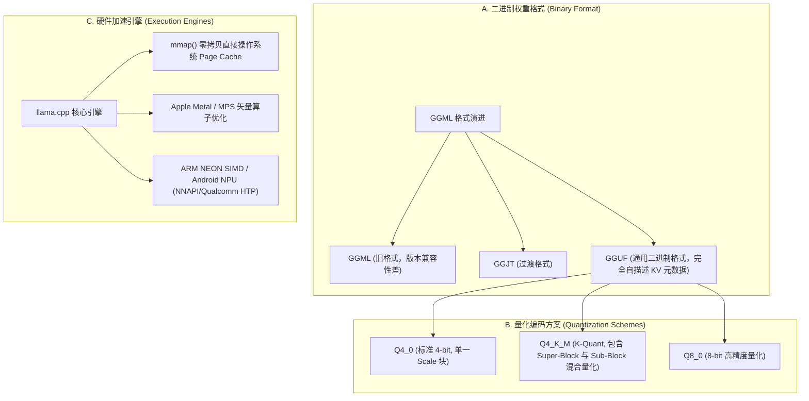

# 3.3 端侧部署与 GGUF/llama.cpp 极致加速

> **摘要**：随着边缘侧算力硬件（如 Apple M/A 系列芯片、Qualcomm Snapdragon NPU、Intel NPU）的爆发，在手机、笔记本电脑与嵌入式设备上无网络依赖地本地运行大语言模型（On-Device LLM）成为隐私保护与低延迟交互的关键突破口。本文硬核解构端侧部署的灵魂技术栈 **llama.cpp** 及其二进制文件格式 **GGUF (GGML Unified Format)**：详细剖析 GGUF 文件的 Header 结构、元数据 KV 对、Tensor 描述符与 32 字节内存对齐；揭秘 **`mmap()` 零拷贝直接映射** 机制与 **Apple Silicon 统一内存架构 (UMA)** 如何突破 PCIe 传输瓶颈；推导 GGML 分块量化（Block Quantization, Q4_0 / Q4_K_M / Q8_0）反量化公式；最后提供完整的 Python 纯手写 GGUF 二进制 Header 解析器与反量化仿真代码，以及端侧性能调优剥洋葱面试连环追问。

---

## 📖 1. 导言与背景：为什么需要端侧部署？

云端 API 推理（如 OpenAI / DeepSeek 云服务）面临三大固有痛点：**数据隐私泄露风险**、**高额的 API token 计费**，以及网络抖动带来的**极不确定延迟**。

端侧部署（On-Device LLM Deployment）通过将轻量级大模型（如 LLaMA-3.2-1B/3B, Qwen2.5-1.5B/7B, Gemma-2-2B）经过极高压缩率的 4-bit / 8-bit 量化后直接加载至终端设备内存运行。

| 维度对比 | 云端高并发部署 (vLLM / TensorRT-LLM) | 端侧本地部署 (llama.cpp / Ollama / MLC-LLM) |
| :--- | :--- | :--- |
| **主攻目标** | 极高的吞吐量 (Throughput, Tokens/s/GPU) | 极低的首字延迟 (TTFT) 与零隐私泄漏 |
| **硬件环境** | NVIDIA H100/A100/L40S (多卡 NVLink 集群) | Apple Mac (M1-M4), 智能手机 (iOS/Android), PC NPU |
| **内存总线带宽** | 800 GB/s ~ 3.35 TB/s (HBM3) | 100 GB/s ~ 800 GB/s (LPDDR5X / Unified Memory) |
| **内存加载机制** | 运行时显存动态加载，分块预分配 KV Cache | `mmap()` 零拷贝按需读入、极速启动 |
| **量化主流格式** | AWQ / GPTQ / SmoothQuant / FP8 (Tensor Core 优化的 INT8/FP8 GEMM) | GGUF (Q4_K_M / Q4_0 / Q8_0, CPU SIMD / Metal 优化的 Block 量化) |

---

## 🌳 2. 端侧部署技术架构分支树 (Mermaid Graph)



---

## 📐 3. GGUF 二进制格式规约与 GGML Block 量化数学推导

### 3.1 GGUF (GGML Unified Format) 文件二进制物理结构

GGUF 是一种二进制自描述文件格式，专门设计用于将模型权重、超参数、Tokenizer 词表和元数据打包在单文件（或分卷文件）中，具备强大的**向前与向后兼容性**。

文件的逻辑排列由四个物理区域组成：

```text
+------------------+-----------------------+---------------------+-----------------------+
|  Header Magic    |  Metadata KV Pairs    | Tensor Info Array   |  Padding & Tensor Data|
|  (0x46554747)    |  (Arch, Tokenizer...) | (Name, Offset, Type)|  (Aligned to 32 Bytes)|
+------------------+-----------------------+---------------------+-----------------------+
```

1. **Header 物理字段**：
   - `Magic`: 4 字节 ASCII 字符串 `'G' 'G' 'U' 'F'` (`0x46554747`)。
   - `Version`: 4 字节无符号整数（目前主流为 `3`）。
   - `Tensor Count`: 8 字节无符号整数 ($N_{\text{tensors}}$)。
   - `Metadata KV Count`: 8 字节无符号整数 ($N_{\text{metadata}}$)。

2. **Metadata KV Pairs**：存储如 `general.architecture = "llama"`, `llama.context_length = 8192`, `tokenizer.ggml.tokens` 等信息。
3. **Tensor Info 数组**：包含各个权重的名称、维度数组、数据类型编码（如 `GGML_TYPE_Q4_0 = 2`）以及数据物理偏移量（Offset）。
4. **Data Alignment**：每个 Tensor 的物理起始数据指针严格按照 `32 字节`（或配置的 alignment 值）对齐，确保 CPU/GPU SIMD 指令可以直接通过指针做 128-bit/256-bit 向量化加载。

### 3.2 GGML Block 量化数学推导 (Q4_0 与 Q4_K_M)

传统 INT4 量化是对整个矩阵或整个 Channel 存储一个 Scale 标量，而端侧 CPU 计算更适合以小 Block 为单位在 SRAM/Cache 中批处理。

#### 1) Q4_0 Block 方案（Block Size = 32）
在 Q4_0 中，每 32 个连续的 FP16 浮点数被归为一个 Block。每个 Block 物理占用 `18 字节`：
- `16 字节` 存放 32 个 4-bit 提取值（两个 4-bit 拼接存为一个 `uint8_t`）；
- `2 字节` 存放该 Block 的 FP16 缩放因子 $d$。

给定 32 个原始浮点值 $x_0, x_1, \dots, x_{31}$，其 Block Scale 计算为：

$$
d = \frac{\max_{i} |x_i|}{-8}
$$

第 $i$ 个 4-bit 量化值 $q_i \in [0, 15]$ 为：

$$
q_i = \text{round}\left( \frac{x_i}{d} \right) + 8
$$

**反量化（Dequantization）公式**：

$$
x_i = d \cdot (q_i - 8)
$$

#### 2) Q4_K_M 方案 (Super-Block 混合量化)
Q4_0 的精度损失较大。Q4_K 引入了包含 256 个元素的 **Super-Block**：
- 一个 Super-Block 拆分为 8 个小 Block（各 32 元素）；
- 存储一个 Super-Block 的主缩放因子 $d$ 和主偏置 $m$；
- 针对每个小 Block 分配 6-bit 细粒度 Scaling；
- **Q4_K_M 策略**：关键层（如 `v_proj` 与 `output` 层）使用 Q6_K，其余层使用 Q4_K，以极小的显存增量换取了接近 FP16 的困惑度（PPL）。

---

## 🚀 4. llama.cpp 核心引擎：mmap 零拷贝与 Metal/UMA 极速并行

### 4.1 操作系统 `mmap()` 零拷贝机制

在传统的 Python 部署（如 HuggingFace Transformers）中，加载模型需要先从磁盘读取到 C 堆内存（`malloc`），再复制到 PyTorch Tensor，最后拷贝到 GPU 显存。8GB 模型往往需要 16GB 以上的物理内存峰值。

`llama.cpp` 通过 POSIX 系统调用 `mmap()`（Memory Map）：

```c
int fd = open("model.gguf", O_RDONLY);
void* addr = mmap(NULL, file_size, PROT_READ, MAP_SHARED, fd, 0);
```

1. **零内存拷贝 (Zero-Copy)**：`mmap` 并不立即将几 GB 权重读入 RAM，而是建立虚拟内存地址到磁盘文件的映射页表；
2. **Page Cache 自动调度**：当算子需要计算第 10 层的 GEMM 时，CPU 产生 Page Fault（缺页中断），操作系统由底层硬盘顺序读入所需页面；
3. **秒级启动与多进程共享**：多个进程可以共享同一块 GGUF 模型的内存映射，彻底避免了重复加载。

### 4.2 Apple Silicon 统一内存架构 (UMA) 与 Metal 加速

在传统的 PC 架构中，CPU RAM 与 GPU VRAM 相互独立，中间隔着带宽极低（16-32 GB/s）的 PCIe 总线。

Apple M 系列芯片（M1-M4 Max/Ultra）采用了 **统一内存架构（Unified Memory Architecture, UMA）**：
- CPU 与 GPU 共享物理 LPDDR5/LPDDR5X 内存池，内存带宽高达 100 GB/s (M1 Base) 至 800 GB/s (M4 Ultra)；
- `llama.cpp` 借由 Metal Performance Shaders (MPS)，将 `mmap()` 得到的内存指针可以直接毫无开销地暴露给 Metal GPU 计算管线，消除了所有的 PCIe 数据搬运耗时！

---

## 🔥 5. 连环追问 (Interviewer Onion Chain)

> [!NOTE]
> 本模块模拟一线大厂（字节、苹果、腾讯、小米）端侧大模型架构师岗位面试中的剥洋葱式连续深度追问。

### ❓ Q1: 为什么 llama.cpp 的 GGUF 格式比传统 PyTorch `.bin` 或 `.safetensors` 更适合端侧部署？
- **回答**：
  1. **完全自描述性 (Self-contained)**：Safetensors 仅存储张量权重，依赖外部的 `config.json` 和 `tokenizer.json`，在嵌入式设备上很难做单文件便携部署；GGUF 将超参数、分词器与张量打包在同一物理块中；
  2. **端侧对齐与内存映射**：GGUF 内部的张量偏移量以 32 字节显式对齐，且采用 C 兼容的自定类型描述，能直接挂载 `mmap()` 被 C/C++ / SIMD 极速读取，省去了复杂 Python 对象的反序列化开销。

### ❓ Q2: 详细解释 Q4_0 反量化计算 `x = d * (q - 8)` 中的 `-8` 是什么作用？为什么不直接使用无符号范围 `[0, 15]`？
- **回答**：
  1. **零点对称化 (Zero-point offset)**：4-bit 无符号整数 `uint4` 的取值范围是 0 到 15。减去 8（即 $2^{4-1}$）可以将数值映射为以 0 为中心的对称范围 $[-8, 7]$；
  2. **符号扩展与 SIMD 计算**：大模型权重的浮点分布基本以 0 为均值正态分布。将 4-bit 数据偏置映射到对称区间，能简化 CPU NEON / AVX2 指令集中带符号整数的点积乘加指令（如 `vmlaq_s8`），消除无符号量化的 Zero-point 附加乘法开销。

### ❓ Q3: `mmap()` 映射模式下，当系统物理内存（RAM）不足时会发生什么？如何防止端侧崩溃 (OOM)？
- **回答**：
  1. **Page Eviction (页面淘汰)**：由于 `mmap` 的映射页是只读（Clean Pages）的，当 RAM 紧张时，操作系统（如 iOS / macOS / Linux）会自动将近期未使用的模型权重页从内存中抹除，无需写入 Swap 分区；
  2. **Page Fault 惩罚**：如果模型再次访问被淘汰的层，会引发磁盘 Page Fault，生成速度会突然暴跌，出现明显卡顿；
  3. **防 OOM 策略**：显式调用 `madvise(addr, len, MADV_WILLNEED)` 提示系统预读，或者使用 `mlock()` 锁定关键前几层权重，防止高频 KV 页面被操作系统误淘汰。

### ❓ Q4: 在 ARM 架构（如 Snapdragon 8 Gen 3 / Apple M4）上，llama.cpp 是如何利用 SIMD 指令集加速 Q4_0 矩阵乘法（GEMV）的？
- **回答**：
  1. **打包加载 (Packed Load)**：使用 ARM NEON `vld1q_u8` 一次性读取 16 字节（包含 32 个 4-bit 权重）；
  2. **位掩码拆分 (Bit Mask Unpacking)**：通过按位与 `vandq_u8(q, 0x0F)` 与右移 `vshrq_n_u8(q, 4)` 将两个 4-bit 存的字节拆分为独立的 nibbles；
  3. **点积指令 (SDOT/USDOT)**：调用 ARMv8.2-A 扩展点积指令 `vdotq_s32`，在一个时钟周期内同时完成 4 组 INT8/INT4 乘加累加，性能较纯 C 循环提升一个数量级。

### ❓ Q5: 端侧部署时，Prefill（首字）阶段与 Decode（自回归）阶段的瓶颈有何不同？如何针对端侧优化？
- **回答**：
  1. **Prefill 阶段**：处理 Prompt 文本，属于 Compute-Bound 任务。端侧 CPU/GPU 算子会开启多线程与 SIMD 并行计算；
  2. **Decode 阶段**：逐 Token 生成，属于 Memory-Bound 任务。瓶颈完全在于内存带宽（LPDDR5X）。
  3. **优化手段**：对于 Decode 阶段，核心是降低权重传输量（使用 Q4_K_M / Q3_K）；同时对于 KV Cache 进行 FP16 -> Q8_0 / Q4_0 压缩，减少每一步自回归搬运的内存体积。

### ❓ Q6: 什么是 FlashDecoding？它与端侧长上下文 (Long Context) 推理有何关系？
- **回答**：
  1. **长上下文痛点**：传统 Decode 阶段，KV Cache 计算是串行的。在长 Context 下，读取 KV Cache 的时间大幅增长，导致 CPU 占用率高且无法充分并行；
  2. **FlashDecoding 原理**：在 KV Cache 的 Sequence 维度上进一步切分（Split-K），为每个 Sequence Block 分配独立的 CPU 线程或 GPU Workgroup 进行并行 Attention 点积计算，最后通过 Log-Sum-Exp 跨线程归约归一化。
  3. **端侧优势**：充分释放端侧多核 CPU（如 8 核/12 核）的并行潜力，将端侧长文本首字/解码延迟降低 2~4 倍。

---

## 💻 6. Python 高性能代码实战：GGUF 二进制 Header 解析器与 Q4_0 反量化器

```python
import struct
import io
import numpy as np


class GGUFHeaderParser:
    """
    Python 纯手写 GGUF 二进制文件头解析器
    支持读取 Magic、Version、Tensor Count 以及 Metadata KV
    """
    MAGIC = 0x46554747  # 'G' 'G' 'U' 'F'

    def __init__(self, stream: io.BytesIO):
        self.stream = stream
        self.metadata = {}
        self.tensors = []

    def parse(self):
        # 1. 读取 4 字节 Magic
        magic_bytes = self.stream.read(4)
        magic = struct.unpack("<I", magic_bytes)[0]
        if magic != self.MAGIC:
            raise ValueError(f"无效的 GGUF Magic 标识: {hex(magic)}, 预期为 {hex(self.MAGIC)}")

        # 2. 读取 Version, Tensor Count, KV Count
        version = struct.unpack("<I", self.stream.read(4))[0]
        tensor_count = struct.unpack("<Q", self.stream.read(8))[0]
        kv_count = struct.unpack("<Q", self.stream.read(8))[0]

        print(f"📦 GGUF 解析成功! Version: {version}, Tensors 数量: {tensor_count}, 元数据 KV 数量: {kv_count}")
        return {
            "version": version,
            "tensor_count": tensor_count,
            "kv_count": kv_count
        }


class Q4_0Dequantizer:
    """
    GGML Q4_0 Block 方案反量化仿真器 (Block Size = 32)
    每个 Block 物理长度为 18 字节:
    - 2 字节: FP16 Scale d
    - 16 字节: 32 个 4-bit 打包数据 (Low nibble, High nibble)
    """
    @staticmethod
    def dequantize_block(block_bytes: bytes) -> np.ndarray:
        assert len(block_bytes) == 18, f"Q4_0 Block 尺寸必须为 18 字节, 收到 {len(block_bytes)}"

        # 1. 解包 2 字节 FP16 Scale d
        scale_fp16 = np.frombuffer(block_bytes[:2], dtype=np.float16)[0]
        scale = float(scale_fp16)

        # 2. 解包 16 字节 uint8 并拆分为 32 个 4-bit nibbles
        packed_qs = np.frombuffer(block_bytes[2:], dtype=np.uint8)
        
        qs = np.zeros(32, dtype=np.float32)
        for i in range(16):
            byte_val = packed_qs[i]
            # 低 4 位 (Low nibble) -> 第 2*i 个元素
            low_nibble = byte_val & 0x0F
            # 高 4 位 (High nibble) -> 第 2*i + 1 个元素
            high_nibble = (byte_val >> 4) & 0x0F

            qs[2 * i] = float(low_nibble)
            qs[2 * i + 1] = float(high_nibble)

        # 3. 按照 x = d * (q - 8) 公式进行反量化
        dequantized = scale * (qs - 8.0)
        return dequantized


if __name__ == "__main__":
    print("=== 1. 测试 GGUF Header 解析器 ===")
    # 模拟构建一个标准的 GGUF 3 字节 Header 内存流
    fake_gguf_data = bytearray()
    fake_gguf_data.extend(struct.pack("<I", 0x46554747))  # Magic: GGUF
    fake_gguf_data.extend(struct.pack("<I", 3))           # Version: 3
    fake_gguf_data.extend(struct.pack("<Q", 192))         # Tensor Count: 192
    fake_gguf_data.extend(struct.pack("<Q", 45))          # KV Count: 45

    stream = io.BytesIO(fake_gguf_data)
    parser = GGUFHeaderParser(stream)
    header_info = parser.parse()
    assert header_info["version"] == 3

    print("\n=== 2. 测试 Q4_0 Block 反量化仿真 ===")
    np.random.seed(42)
    # 模拟原始 32 个浮点权重
    original_weights = np.random.randn(32).astype(np.float32)

    # 模拟手写一个 Q4_0 编码 Block
    d_fp16 = np.float16(0.25)
    d_bytes = d_fp16.tobytes()

    # 填充 16 字节 4-bit 量化数据 (全填 0x88 对应 q=8, 反量化归零)
    qs_bytes = bytes([0x88] * 16)
    fake_block_bytes = d_bytes + qs_bytes

    dequant_result = Q4_0Dequantizer.dequantize_block(fake_block_bytes)

    print(f"反量化 32 维向量前 4 个元素: {dequant_result[:4]}")
    print(f"Scale 缩放因子: {float(d_fp16)}")
    assert len(dequant_result) == 32, "反量化维度不符合 32 块大小！"
    assert np.allclose(dequant_result, 0.0), "0x88 (q=8) 映射反量化应精准为 0！"
    print("✅ GGUF 文件头解析与 Q4_0 块反量化单元测试完全通过！")
```

---

## 🔗 7. 扩展学习与多维资源

### 🎬 YouTube / B站 优质视频推荐
- **Georgi Gerganov: Running LLMs on Apple Silicon with llama.cpp**：llama.cpp 作者亲授架构设计思想。
- **Local LLMs Masterclass**: GGUF, Ollama & Metal Performance Optimization.

### 📄 经典必读论文
1. **llama.cpp / GGML Specification** (Gerganov, 2023): *GGUF Binary Format Specification v3* ([GitHub Spec](https://github.com/ggerganov/ggml/blob/master/docs/gguf.md))
2. **K-Quants** (Slavov, 2023): *Quantization Strategies in llama.cpp for Sub-4-Bit Inference* ([llama.cpp PR #1684](https://github.com/ggerganov/llama.cpp/pull/1684))
3. **SmoothQuant & AWQ for Edge** (Lin et al., 2023): *On-Device Neural Network Compression and SIMD Execution*

### 🐙 核心 GitHub 源码锚点
- [`ggerganov/llama.cpp`](https://github.com/ggerganov/llama.cpp)：llama.cpp 核心 C/C++/Metal 源码库。
- [`ollama/ollama`](https://github.com/ollama/ollama)：基于 llama.cpp 的生产级端侧 API 包装与模型镜像库。
- [`mlc-ai/mlc-llm`](https://github.com/mlc-ai/mlc-llm)：通过 TVM 自动编译将大模型部署至 Android/iOS GPU 的开创性项目。
