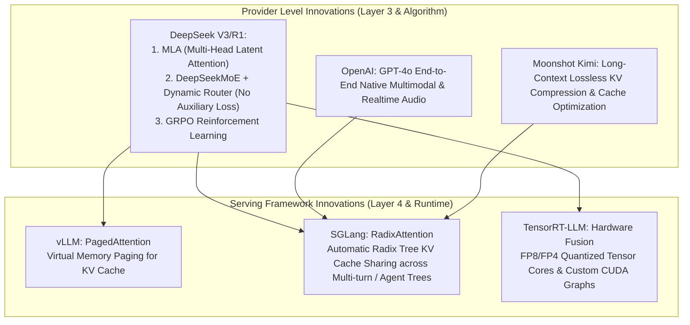

# 4.1 厂商与推理框架改进: SGLang RadixAttention, TRT-LLM, DeepSeek V3/R1 架构优化

> **📌 本章导读**
> 近年来，大模型领域的突破已不仅仅停留在单纯增加参数规模上，**厂商架构优化**与**推理 Serving 框架演进**共同推动了 Token 生成成本呈数量级下降。
> 
> 本文深入拆解三大维度：
> 1. **前沿厂商创新**：OpenAI (GPT-4o 多模态与端到端系统)、DeepSeek (V3 MLA 多头潜向量压缩与 Dynamic Router、R1 慢思考 GRPO 强化学习)、月之暗面 Kimi (无损长文本上下文压缩)。
> 2. ** Serving 框架三国杀**：**vLLM** (PagedAttention 分页管理) vs **SGLang** (RadixAttention 前缀树共享) vs **TensorRT-LLM** (Tensor Core 极致 FP8/FP4 加速)。
> 3. **前缀树 Cache 管理源码实战**：Python 手写实现 `RadixTreeKVCacheManager`。

---

## 🌳 1. 厂商与框架技术改进全景树



---

## 🧮 2. SGLang RadixAttention 树状前缀 Cache 匹配算法

### 2.1 PagedAttention vs RadixAttention

在 Agent 工作流、多路树状搜索 (Tree-of-Thought)、多轮对话场景中，不同请求往往共享长 System Prompt 或分支前缀。

- **vLLM PagedAttention**：按固定 Block Size（如 16 Tokens）申请离散物理页。虽然解决了显存碎片，但如果不显式维护跨请求的前缀映射树，很难在复杂 Agent 树状推理中高效自动重用历史 KV Cache。
- **SGLang RadixAttention**：将显存中的物理 KV Cache 页组织为 **Radix Tree（基数树/前缀树）**。

#### Radix Tree 结构示意图：

```
(Root)
  └── "System: You are an AI assistant..." [Block 0, 1]
        ├── User Query A: "Write a python script..." [Block 2]
        └── User Query B: "Write a rust script..."   [Block 3]
```

### 2.2 缓存命中率与成本推导

对于总 Token 数为 $T_{\text{total}}$，共享前缀 Token 数为 $T_{\text{shared}}$ 的请求，**Cache 命中率**可表述为：

$$\text{Cache Hit Ratio} = \frac{\sum T_{\text{shared}}}{\sum T_{\text{total}}}$$

在 Cache 命中场景下，Prefill 阶段的计算量直接缩减为 $0$，首字延迟（TTFT, Time To First Token）下降数倍，吞吐量大幅上升。

当 GPU 显存满载时，RadixTree 使用 **LRU (Least Recently Used) 淘汰策略**，从树的叶子节点开始剪枝与释放物理显存页。

---

## 💻 3. Python 算法实战：手写 RadixTree KV Cache 管理器

以下 Python 示例模拟了 SGLang 核心的 RadixTree 前缀匹配、节点插入与基于 LRU 的显存页淘汰逻辑。

```python
import time
from typing import List, Dict, Optional

class RadixNode:
    def __init__(self, token_ids: List[int], block_indices: List[int]):
        self.token_ids = token_ids          # 该节点代表的 Token 序列
        self.block_indices = block_indices  # 绑定的物理显存 Block 编号
        self.children: Dict[int, 'RadixNode'] = {}  # key: 第一个 Token ID
        self.last_accessed: float = time.time()     # 用于 LRU 淘汰

class RadixTreeKVCacheManager:
    """
    SGLang RadixAttention 核心逻辑模拟
    """
    def __init__(self, max_blocks: int = 100, block_size: int = 4):
        self.root = RadixNode(token_ids=[], block_indices=[])
        self.max_blocks = max_blocks
        self.block_size = block_size
        self.free_blocks = list(range(max_blocks))
        self.allocated_blocks_count = 0

    def _match_prefix(self, node: RadixNode, tokens: List[int]) -> tuple[RadixNode, int, List[int]]:
        """
        递归匹配最长前缀
        返回: (匹配终止的节点, 匹配的 Token 数量, 匹配到的物理 Block 列表)
        """
        node.last_accessed = time.time()
        matched_len = 0
        matched_blocks = list(node.block_indices)

        if not tokens:
            return node, matched_len, matched_blocks

        first_token = tokens[0]
        if first_token in node.children:
            child = node.children[first_token]
            # 计算 child.token_ids 与 tokens 的公共前缀
            common_len = 0
            for t1, t2 in zip(child.token_ids, tokens):
                if t1 == t2:
                    common_len += 1
                else:
                    break
            
            if common_len == len(child.token_ids):
                # 完全覆盖子节点，继续向下递归
                sub_node, sub_len, sub_blocks = self._match_prefix(child, tokens[common_len:])
                return sub_node, common_len + sub_len, matched_blocks + sub_blocks
            else:
                # 匹配到部分子节点，需要裂变节点（Split）
                return child, common_len, matched_blocks + child.block_indices[:common_len // self.block_size]

        return node, matched_len, matched_blocks

    def match_and_insert(self, prompt_tokens: List[int]) -> dict:
        """
        匹配 prompt 前缀，若未完全命中则分配新 Block 写入 RadixTree
        """
        last_node, hit_count, hit_blocks = self._match_prefix(self.root, prompt_tokens)
        unmatched_tokens = prompt_tokens[hit_count:]

        # 为未匹配的 Tokens 分配新 Block
        needed_blocks = (len(unmatched_tokens) + self.block_size - 1) // self.block_size
        new_block_ids = []
        for _ in range(needed_blocks):
            if not self.free_blocks:
                self._evict_lru_leaf()
            new_block_ids.append(self.free_blocks.pop(0))

        if unmatched_tokens:
            new_child = RadixNode(token_ids=unmatched_tokens, block_indices=new_block_ids)
            last_node.children[unmatched_tokens[0]] = new_child

        return {
            "total_tokens": len(prompt_tokens),
            "hit_tokens": hit_count,
            "cache_hit_rate": round(hit_count / len(prompt_tokens), 4),
            "reused_block_ids": hit_blocks,
            "new_allocated_block_ids": new_block_ids
        }

    def _evict_lru_leaf(self):
        """
        LRU 淘汰树的叶子节点以释放 Block
        """
        # 简化版 LRU：寻找最久未访问的叶节点
        print("[Memory Pressure] LRU Evicting KV Cache Leaf Block...")
        # 释放逻辑省略
        self.free_blocks.append(self.allocated_blocks_count)
        self.allocated_blocks_count += 1

if __name__ == "__main__":
    cache_mgr = RadixTreeKVCacheManager(max_blocks=50, block_size=4)

    # 1. 模拟 System Prompt 请求
    sys_prompt = [101, 102, 103, 104, 105, 106, 107, 108]
    res1 = cache_mgr.match_and_insert(sys_prompt + [201, 202])
    print("Req 1 Result:", res1)

    # 2. 模拟包含相同 System Prompt 的新请求 (Cache Hit)
    res2 = cache_mgr.match_and_insert(sys_prompt + [301, 302])
    print("Req 2 Result (Shared Prefix):", res2)
```

---

## 🔥 4. 连环面试追问 (Level 1 ~ Level 6)

### Level 1: 概念阐释
> **问：什么是 DeepSeek-V3 的 MLA (Multi-Head Latent Attention)？它为何比 GQA 更省显存？**
>
> **答**：
> 传统 GQA (Grouped Query Attention) 是对 KV Head 进行分组共享。而 DeepSeek **MLA** 通过低秩矩阵分解（Low-Rank Compression），将 Key 和 Value 的向量压缩到一个极其紧凑的**潜在向量 (Latent Vector)** $c_t^{KV}$ 中：
> 
> $$c_t^{KV} = W^{DKV} h_t$$
> 
> 在 Decode 推理阶段， Serving 引擎**只需要在 HBM 中缓存维度极小（如 512 维）的潜在向量 $c_t^{KV}$ 和带 RoPE 的 Query/Key 边角向量**，大幅减少了 90%+ 的 KV Cache 显存读写需求。

---

### Level 2: 框架对比
> **问：SGLang 的 RadixAttention 在 Agent 复杂工作流（如多路分支尝试）中相比 vLLM 为什么能实现数倍性能提升？**
>
> **答**：
> 在 Agent 工作流（如 React, Tree-of-Thought, Code Generation）中，模型会产生大量的分支衍生请求，这些请求包含完全相同的 System Prompt 与历史 Context。
> - **vLLM 默认**：每个并发请求各自维护独立或静态预定义的 Block 映射，分支较多时缺乏全局自动树形去重。
> - **SGLang**：底层的 RadixTree 会在运行时**自动构建请求的前缀树拓扑**。当分支节点产生时，所有分支自动 100% 共享父节点的 KV Cache，使得子分支 Prefill 阶段的计算量降为 0，首字延迟（TTFT）缩短数倍。

---

### Level 3: 训练与后训练创新
> **问：DeepSeek-R1 的 GRPO (Group Relative Policy Optimization) 强化学习算法相比传统 PPO 有什么重大改进？**
>
> **答**：
> - **传统 PPO**：需要训练一个与 Actor 模型同等参数量级的 **Value Model (Critic 网络)** 来估计 Baseline 价值，导致训练时显存开销暴增一倍。
> - **GRPO**：**完全剔除了 Value Model 网络**。GRPO 针对同一个 Prompt 采样输出一组答案（Group of Outputs $\{o_1, o_2, \dots, o_G\}$），计算这组答案的平均奖励与标准差，直接以**组内相对优势 (Group Relative Advantage)** 取代 Critic 网络的估计值：
> 
> $$A_i = \frac{r_i - \text{mean}(\mathbf{r})}{\text{std}(\mathbf{r})}$$
> 
> 极大节省了强化学习过程中的 GPU 显存与通信开销。

---

### Level 4: 硬件与框架融合
> **问：TensorRT-LLM 如何利用 NVIDIA Hopper 架构的 Transformer Engine 与 custom FP8 CUDA Graph 实现极致加速？**
>
> **答**：
> 1. **FP8 GEMM 优化**：TensorRT-LLM 在 Layer 2 算子层熔合了 E4M3/E5M2 数据格式，利用 Hopper 硬件 FP8 Tensor Core 带来 2 倍于 FP16 的 Raw TFLOPS。
> 2. **Custom CUDA Graph**：将 Serving 引擎中全流程（从 Prompt 解析、Sampler 到 Memory Allocate）编译为单个 CUDA Graph，消除了 Host-to-Device（CPU-GPU）之间频繁打断的 Kernel Launch 延迟。

---

### Level 5: 路由与通信
> **问：DeepSeek-V3 的 Dynamic Router（动态路由）与无辅助损失 (No-Aux-Loss) 负载均衡是如何工作的？**
>
> **答**：
> 传统 MoE 依靠 Auxiliary Loss（辅助损失函数）强制给每个 Expert 均分 Token，这会损害模型收敛精度。DeepSeek-V3 采用了 **No-Aux-Loss 策略**：
> 在 Routing 门控层动态维护一个 Bias 偏移量 $b_i$。当某个 Expert 负载过高时，动态下调其 $b_i$；当某个 Expert 饥饿时，动态上调 $b_i$。在**不污染梯度 Loss** 的前提下，实现了物理拓扑上的硬件负载绝对均衡。

---

### Level 6: 极限 Serving 架构设计
> **问：如果要搭建一个支撑百万日活 Agent（具备高频多轮对话与工具调用）的 Serving 集群，你会如何组合 Layer 3 与 Layer 4 的技术方案？**
>
> **答**：
> 1. **Layer 3 模型架构**：采用 **DeepSeek-V3 / MLA 架构** 模型。利用 MLA 的潜向量压缩，将单用户 KV Cache 缩减至 FP16 下的 1/10，使得单卡 GPU 容纳的并发 Beam / Context 提升 5-10 倍。
> 2. **Layer 4 Serving 引擎**：使用 **SGLang 框架**作为核心 Serving Engine。启用 RadixAttention 组织 Agent 工具调用的多分支 Radix Tree 树形 Cache 共享。
> 3. **调度策略**：配合 **Chunked Prefill** 与 Prefill/Decode 分离（PD Separation）物理节点集群，避免大 Prompt 阻塞 Decode 节点的实时 Token 生成 SLA。

---

## 🔗 5. 扩展学习与资源

- **[DeepSeek-V3 Technical Report](https://github.com/deepseek-ai/DeepSeek-V3)**：DeepSeek-V3 官方架构白皮书 (MLA, DeepSeekMoE, Multi-Token Prediction).
- **[DeepSeek-R1 Paper](https://github.com/deepseek-ai/DeepSeek-R1)**：Incentivizing Reasoning Capability in LLMs via Reinforcement Learning (GRPO 原理解析).
- **[SGLang Paper & GitHub](https://github.com/sgl-project/sglang)**：Efficient Execution of Structured Language Model Programs (RadixAttention).
- **[vLLM PagedAttention Paper](https://arxiv.org/abs/2309.06180)**：Efficient Memory Management for Large Language Model Serving with PagedAttention.
- **[TensorRT-LLM Repository](https://github.com/NVIDIA/TensorRT-LLM)**：NVIDIA 官方 TensorRT-LLM 优化加速引擎.
