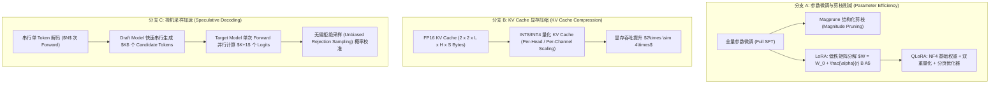

# 3.9 架构级计算与显存传输削减：模型剪枝、LoRA 与 投机解码

> **摘要**：在大语言模型（LLM）serving 与微调落地中，如何在不损失输出逻辑质量与生成概率分布的前提下，成倍削减计算量与 KV Cache 显存带宽消耗？本文硬核探讨架构级三大优化：**结构化剪枝（Magprune / Magnitude Pruning）**、**低秩适配（LoRA / QLoRA）**、以及 **投机解码（Speculative Decoding）与无偏拒绝采样（Unbiased Rejection Sampling）**。文章给出 LoRA 低秩梯度推导，推导 INT8/INT4 KV Cache 显存削减公式，完成投机解码目标分布 $P(x)$ 与草稿分布 $Q(x)$ 无偏接受/拒绝采样的完整数学证明，并提供 Python `SpeculativeDecodingUnbiasedProof` 代码与 Level 1-6 洋葱 Q&A。

---

## 📖 1. 导言与架构级优化背景

### 1.1 大模型推理与微调的计算显存矛盾

在 LLM Serving 的 Decoding 阶段，每次生成 1 个 Token 都需要加载全部模型参数与膨胀的 KV Cache，导致极低的算术强度（Operational Intensity）。而在下游微调（SFT）中，为全量参数更新梯度与优化器状态需要极其昂贵的硬件成本。

解决这两大瓶颈的架构级技术包括：
1. **参数与显存削减 (LoRA & KV Cache Quantization)**：LoRA 冻结预训练权重 $W_0$，通过低秩矩阵 $A, B$ 将微调显存与参数量降低几个数量级；KV Cache 量化将 Key/Value 状态压缩至 INT8/INT4，突破 Decoding 阶段显存带宽瓶颈。
2. **生成吞吐削减 (Speculative Decoding)**：利用小参数草稿模型（Draft Model）并行预测 $K$ 个 Token，再由大目标模型（Target Model）在一次 Forward pass 中并行验证。结合无偏拒绝采样，保证生成的 Token 分布与仅使用大模型完全一致。

---

## 🌳 2. 架构级计算与显存优化演进分支树 (Mermaid Graph)



---

## 📐 3. 核心数学公式与硬核原理推导

### 3.1 LoRA 与 QLoRA 前向与梯度推导

#### 1. 前向传播公式
对于原始权重矩阵 $W_0 \in \mathbb{R}^{d \times k}$，LoRA 引入低秩分解矩阵 $B \in \mathbb{R}^{d \times r}$ 与 $A \in \mathbb{R}^{r \times k}$（其中 $r \ll \min(d, k)$）：
$$
h = W_0 x + \Delta W x = W_0 x + \frac{\alpha}{r} B A x
$$
其中 $\alpha$ 为恒定 Scaling 常数。初始时 $A \sim \mathcal{N}(0, \sigma^2)$，$B = 0$，保证初始状态 $\Delta W = 0$。

#### 2. 梯度反向传播推导
设损失函数为 $\mathcal{L}$，梯度传回 $h$ 的偏导数为 $\frac{\partial \mathcal{L}}{\partial h}$：
$$
\frac{\partial \mathcal{L}}{\partial A} = \frac{\alpha}{r} B^T \left( \frac{\partial \mathcal{L}}{\partial h} \right) x^T
$$
$$
\frac{\partial \mathcal{L}}{\partial B} = \frac{\alpha}{r} \left( \frac{\partial \mathcal{L}}{\partial h} \right) (A x)^T
$$
梯度计算仅需对秩为 $r$ 的中间激活值 $A x \in \mathbb{R}^{r \times 1}$ 操作，极大地节省了梯度显存。

---

### 3.2 投机解码无偏拒绝采样 (Unbiased Rejection Sampling) 概率证明

#### 1. 采样法则
设 Draft Model 的概率分布为 $Q(x)$，Target Model 的概率分布为 $P(x)$。
对于 Draft Model 采样的候选 Token $x$:
1. 计算接受概率 $\beta(x)$:
   $$
   \beta(x) = \min\left(1, \frac{P(x)}{Q(x)}\right)
   $$
2. 生成随机数 $u \sim \text{Uniform}(0, 1)$：
   - 若 $u \le \beta(x)$，**接受**候选 Token $x$；
   - 若 $u > \beta(x)$，**拒绝**候选 Token $x$，并停止后续草稿 Token 验证，从调整后的分布 $P'(x)$ 中重新采样一个 Token：
     $$
     P'(x) = \frac{\max(0, P(x) - Q(x))}{\sum_{y} \max(0, P(y) - Q(y))}
     $$

#### 2. 无偏性（Unbiasedness）严格数学证明
我们需要证明：经过上述接受/拒绝法则后，最终采样的 Token 概率分布 $\mathbb{P}(\text{final} = x)$ 精确等于目标分布 $P(x)$。

**证明**：
最终采样的 Token $x$ 来源于两种互斥事件：
- **事件 A**：Draft 采样出了 $x$ 且被接受。
- **事件 B**：Draft 采样的 Token 被拒绝，且从残差分布 $P'$ 中采样出了 $x$。

**计算事件 A 的概率**：
$$
\mathbb{P}(A) = Q(x) \cdot \beta(x) = Q(x) \cdot \min\left(1, \frac{P(x)}{Q(x)}\right) = \min(Q(x), P(x))
$$

**计算事件 B 的概率**：
全局拒绝的总概率 $R$ 为：
$$
R = \sum_{y} Q(y) (1 - \beta(y)) = \sum_{y} Q(y) \left(1 - \min\left(1, \frac{P(y)}{Q(y)}\right)\right)
$$
由于 $1 - \min(1, a/b) = \max(0, 1 - a/b) = \frac{\max(0, b - a)}{b}$，代入得：
$$
R = \sum_{y} Q(y) \frac{\max(0, Q(y) - P(y))}{Q(y)} = \sum_{y} \max(0, Q(y) - P(y))
$$
又因为 $\sum_{y} P(y) = \sum_{y} Q(y) = 1$，有公式 $\sum_{y} \max(0, P(y) - Q(y)) = \sum_{y} \max(0, Q(y) - P(y)) = R$。

因此从 $P'(x)$ 中采样 $x$ 的联合概率为：
$$
\mathbb{P}(B) = R \cdot P'(x) = R \cdot \frac{\max(0, P(x) - Q(x))}{R} = \max(0, P(x) - Q(x))
$$

**总概率叠加**：
$$
\mathbb{P}(\text{final} = x) = \mathbb{P}(A) + \mathbb{P}(B) = \min(Q(x), P(x)) + \max(0, P(x) - Q(x))
$$
- 若 $P(x) \ge Q(x)$：$\min(Q(x), P(x)) = Q(x)$，$\max(0, P(x) - Q(x)) = P(x) - Q(x)$。
  $$
  \mathbb{P}(\text{final} = x) = Q(x) + P(x) - Q(x) = P(x)
  $$
- 若 $P(x) < Q(x)$：$\min(Q(x), P(x)) = P(x)$，$\max(0, P(x) - Q(x)) = 0$。
  $$
  \mathbb{P}(\text{final} = x) = P(x) + 0 = P(x)
  $$

**证毕**！产出的分布与 Target Model 完全绝对一致，无偏差。

---

## 💻 4. Python 源码实战：`SpeculativeDecodingUnbiasedProof`

下面的代码实现了完整的草稿-目标分布采样验证，并用蒙特卡洛统计验证上述概率推导。

```python
"""
SpeculativeDecodingUnbiasedProof.py
验证 Speculative Decoding 无偏拒绝采样 (Unbiased Rejection Sampling) 数学等价性
"""

import torch
import torch.nn.functional as F
import numpy as np

class SpeculativeDecodingUnbiasedProof:
    def __init__(self, vocab_size: int = 10):
        self.vocab_size = vocab_size

    def sample_unbiased(self, p_logits: torch.Tensor, q_logits: torch.Tensor) -> int:
        """
        根据 Target Logits P 和 Draft Logits Q 执行一次无偏拒绝采样
        """
        P = F.softmax(p_logits, dim=-1)
        Q = F.softmax(q_logits, dim=-1)

        # 1. 从 Draft 分布 Q 中采样一个 Token x
        x = torch.multinomial(Q, num_samples=1).item()

        # 2. 计算接受概率 beta(x)
        p_x = P[x].item()
        q_x = Q[x].item()
        beta_x = min(1.0, p_x / q_x)

        # 3. 掷骰子决定是否接受
        u = torch.rand(1).item()
        if u <= beta_x:
            # 接受候选 Token x
            return x
        else:
            # 拒绝候选 Token x，从调整后的分布 P' 中重新采样
            p_prime = torch.clamp(P - Q, min=0.0)
            sum_p_prime = torch.sum(p_prime)
            if sum_p_prime > 0:
                p_prime = p_prime / sum_p_prime
                x_new = torch.multinomial(p_prime, num_samples=1).item()
                return x_new
            else:
                # 极少数值异常兜底
                return torch.multinomial(P, num_samples=1).item()

    def run_monte_carlo_verification(self, num_samples: int = 100000):
        torch.manual_seed(42)
        # 随机设定 P 和 Q 分布的 Logits
        p_logits = torch.randn(self.vocab_size) * 2.0
        q_logits = torch.randn(self.vocab_size) * 1.5

        P_true = F.softmax(p_logits, dim=-1).numpy()
        
        counts = np.zeros(self.vocab_size)
        for _ in range(num_samples):
            token = self.sample_unbiased(p_logits, q_logits)
            counts[token] += 1
            
        P_empirical = counts / num_samples

        print(f"=== 蒙特卡洛采样验证 (N={num_samples}) ===")
        print("Token | 目标理论分布 P(x) | 投机无偏采样统计 P_emp(x) | 绝对偏差")
        print("-" * 65)
        max_diff = 0.0
        for i in range(self.vocab_size):
            diff = abs(P_true[i] - P_empirical[i])
            max_diff = max(max_diff, diff)
            print(f"  {i}   |       {P_true[i]:.5f}      |         {P_empirical[i]:.5f}        |  {diff:.5f}")

        print("-" * 65)
        print(f"最大概率偏差: {max_diff:.5f}")
        assert max_diff < 0.005, "投机无偏采样概率证明验证未通过！"
        print("✅ 投机解码无偏拒绝采样概率等价性验证成功！")

if __name__ == "__main__":
    verifier = SpeculativeDecodingUnbiasedProof(vocab_size=8)
    verifier.run_monte_carlo_verification(num_samples=100000)
```

---

## 🔬 5. Level 1-6 深度洋葱 Q&A (Onion Q&A)

### Level 1: 概念认知
**Q: 投机解码（Speculative Decoding）为什么能够在不改变大模型输出的情况下提升推理速度？**
- **A**: 因为 LLM 解码的主要瓶颈是 Memory-Bound（显存带宽瓶颈），单次 Forward 耗时大部分花在从显存加载权重上。草稿小模型（Draft Model）体积极小，生成速度极快；而大目标模型（Target Model）校验 $K$ 个草稿 Token 只需要执行一次 Batch Size=$K$ 的 Forward 乘法。如果草稿模型被接受了 $M$ 个 Token，目标模型就用一次 Forward 得到了 $M+1$ 个 Token，从而极大地提升了 Decode 阶段的算术强度与吞吐。

### Level 2: 原理解析
**Q: KV Cache 量化为 INT8/INT4 时，为什么 Key Cache 和 Value Cache 的量化策略通常不同？**
- **A**: Key Cache 和 Value Cache 在 Softmax Attention 中的数学作用不同。Key 用于与 Query 矩阵做内积计算 Attention Score（对数值范围极其敏感，容易出现通道激活异常值 Channel Outliers），因此 Key Cache 通常采用 Per-Head 或 Per-Channel 的 Dynamic Quantization；而 Value Cache 参与加权求和，分布较为平缓，可以采用粒度较粗的 Per-Token 量化。

### Level 3: 架构对比
**Q: QLoRA 中的 NF4 (NormalFloat4) 数据类型相较于传统 INT4 量化有何本质突破？**
- **A**: 深度神经网络的权重参数通常呈现均值为 0 的正态分布（Gaussian Distribution），而非均匀分布。传统的 INT4 采用均匀网格划分，在分布密集的中心区域（[-1, 1]）量化分辨率不足。NF4 是一种信息熵最优（Information-Theoretically Optimal）的分位数数据类型，其划分点使得正态分布落在每个量化区间内的概率完全相等，从而用 4 个 bits 实现了极低的量化残差。

### Level 4: 踩坑诊断
**Q: 在部署 Speculative Decoding 时，发现实际推理加速比小于 1.0x（即变慢了），该如何排查？**
- **A**: 
  1. **Draft 与 Target 模型分布偏差过大（接受率低于 50%）**：草稿模型过于偏离目标模型分布，导致经常在第 1 或第 2 个 Token 就被拒绝，多出了额外的 Draft Forward 耗时。
  2. **草稿 Token 验证长度 $K$ 设置不合理**：$K$ 过大导致 Target Model 单次 Forward 延时显著增加。
  3. **Batch Size 过高**：在 Batch Size 很大时，Target Model 本身已经变为 Compute-Bound，此时 Speculative Decoding 引入的额外校验计算会导致硬件过载。

### Level 5: 源码与硬件设计
**Q: vLLM 和 SGLang 是如何在 GPU 上高效实现 KV Cache INT4 算子解量化的？**
- **A**: 在 CUDA 内核中，INT4 数据被打包为 8-bit / 32-bit 整数（如 `uint32_t` 包含 8 个 INT4 元素）一次性从 HBM 加载到 Local Register。在 Tensor Core 计算前，利用 Bit Manipulation（位移与掩码与运算 `(val >> 4) & 0x0F`）快速将 INT4 还原为 FP16，并乘以 Shared Memory 中的 Scale 参数，避免频繁读写全局显存。

### Level 6: 专家级延伸
**Q: 能否将 Speculative Decoding 扩展为 Tree-based Speculative Decoding（如 Medusa / EAGLE）？其优势与挑战是什么？**
- **A**: 可以。Medusa / EAGLE 不再使用独立的草稿小模型，而是在主模型顶层挂载多个轻量级预测头（Medusa Heads），或者根据 Candidate Tree 生成多条路径的 Token Tree。
  - **优势**：消除了维持两个模型的显存与调度开销，且采用 Tree Attention 可以同时校验多条可能的生成分支，显著提高了整体接受率（Acceptance Rate）。
  - **挑战**：Tree Attention 的 Mask 构建极其复杂，且在大 Batch 场景下会导致 CUDA Block 资源竞争加剧。

---

## 🔗 6. 权威参考文献与 GitHub 源码 Anchors

1. **Speculative Decoding Original Paper**: [Fast Inference from Transformers via Speculative Decoding](https://arxiv.org/abs/2211.17192)
2. **QLoRA Paper**: [QLoRA: Efficient Finetuning of Quantized LLMs](https://arxiv.org/abs/2305.14314)
3. **vLLM Speculative Decoding Implementation**: [vLLM GitHub Repo](https://github.com/vllm-project/vllm)
4. **EAGLE Speculative Sampling**: [EAGLE: Speculative Sampling with Draft Trees](https://github.com/SafeRL-Lab/EAGLE)
