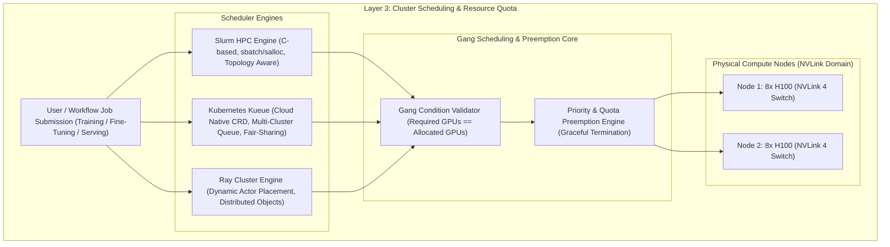

# 4.1 GPU 集群资源调度与配额管理 (Slurm, Kueue, Ray, Gang Scheduling)

> **📌 本章导读**
> 在万卡级大模型分布式训练与高并发 Agent 推理中，传统的 CPU 调度器（如 K8s Default Scheduler）面临致命瓶颈：缺乏 GPU 异构拓扑感知（NVLink Domain）、无法保证分布式 Job 的“全齐（All-or-Nothing）”拉起、以及缺少多租户动态抢占（Preemption）。
> 
> 本文深入剖析三大主流 GPU 调度范式：**Slurm**（HPC 传统批处理）、**Kubernetes Kueue / Volcano**（云原生 ML 工作负载配额）、**Ray Cluster**（分布式 Agent 与 Python 原生调度），硬核推导 **Gang Scheduling（全员协同调度）算法**，并手写 Python 版 `RayClusterGangScheduler`。

---

## 🌳 1. GPU 集群调度架构全景图



---

## ⚙️ 2. 三大主流 GPU 调度范式深度对比

| 维度 | Slurm (HPC Batch) | K8s Kueue / Volcano (Cloud Native) | Ray Cluster (Distributed Agent) |
| :--- | :--- | :--- | :--- |
| **应用场景** | 传统超算、大规模 LLM 预训练 | 容器化 SFT、批量 Batch 推理 | 分布式 RLHF (GRPO/PPO)、Agent 树形并行 |
| **拓扑感知** | 极其原生，完美感知 NVLink / Infiniband Clos 拓扑 | 需配合 Node Feature Discovery & Topology Plugin | 基于 Actor custom resources 进行逻辑拓扑贴近 |
| **Gang Scheduling** | 原生 `sbatch --nodes=N --gpus-per-node=8` 严格全拉起 | 依赖 Volcano / Kueue PodGroup CRD | 依赖 Dynamic Actor Group 与 Placement Groups |
| **抢占机制** | 强行 SIGKILL / SIGTERM 重新排队 | 声明式 Reclaim 与 Preemption Policy | Actor/Task 级别的 Graceful Cancellation |

---

## 📐 3. Gang Scheduling 全员协同调度算法原理

在 3D 分布式并行（如 TP=8, PP=4, DP=2，共需 64 卡）中，部分卡拉起而其余卡因资源不足挂起会导致致命问题：**Deadlock（死锁）与资源浪费**。因为流水线与张量并行需要所有 Worker 同时建立 NCCL Socket 连接。

Gang Scheduling 的核心原理遵循**全有或全无 (All-or-Nothing)** 定律：

$$\text{Can\_Allocate}(\text{Job}_i) = \begin{cases} \text{True}, & \text{if } \text{Available\_GPUs} \ge N_{\text{required\_gpus}} \land \text{Satisfy\_NVLink\_Topology} \\ \text{False}, & \text{otherwise (Enqueue in JobQueue)} \end{cases}$$

若低优先级 Job 正在占用资源而高优先级 Gang Job 无法全量分配，调度器将触发**加权动态抢占（Priority Preemption）**：

$$\text{Preempt\_Set} = \arg\min_{\mathcal{S} \subset \text{RunningJobs}} \sum_{j \in \mathcal{S}} \text{Priority}(j) \quad \text{s.t. } \text{GPUs}(\mathcal{S}) + \text{Available\_GPUs} \ge N_{\text{req}}$$

---

## 💻 4. Python 实战：手写 `RayClusterGangScheduler`

以下 Python 代码基于 Ray 模拟构建了一个具拓扑感知、Multi-tenant 配额管理与 Gang 抢占机制的集群调度器：

```python
import time
import dataclasses
from typing import List, Dict, Optional

@dataclasses.dataclass
class GPUWorkerNode:
    node_id: str
    total_gpus: int
    available_gpus: int
    nvlink_domain_id: int

@dataclasses.dataclass
class GangJobRequest:
    job_id: str
    tenant_id: str
    priority: int
    required_gpus: int
    status: str = "PENDING"  # PENDING, RUNNING, PREEMPTED

class RayClusterGangScheduler:
    """
    Ray 风格的生产级 Gang 调度器实现
    """
    def __init__(self, nodes: List[GPUWorkerNode], tenant_quotas: Dict[str, int]):
        self.nodes = nodes
        self.tenant_quotas = tenant_quotas  # Tenant -> Max Allowed GPUs
        self.running_jobs: Dict[str, GangJobRequest] = {}
        self.job_allocations: Dict[str, List[str]] = {}  # JobID -> List of NodeIDs

    def _get_total_available_gpus(self) -> int:
        return sum(n.available_gpus for n in self.nodes)

    def _get_tenant_used_gpus(self, tenant_id: str) -> int:
        return sum(j.required_gpus for j in self.running_jobs.values() if j.tenant_id == tenant_id)

    def submit_gang_job(self, job: GangJobRequest) -> bool:
        # 1. 检查租户配额 Quota
        used = self._get_tenant_used_gpus(job.tenant_id)
        max_allowed = self.tenant_quotas.get(job.tenant_id, 0)
        if used + job.required_gpus > max_allowed:
            print(f"❌ [Quota Exceeded] Job {job.job_id} (Tenant {job.tenant_id}) requires {job.required_gpus} GPUs, but limit is {max_allowed} (Used: {used})")
            return False

        # 2. 检查 Gang 条件 (All-or-Nothing)
        if self._get_total_available_gpus() < job.required_gpus:
            # 尝试触发抢占 (Preemption)
            if not self._try_preempt_lower_priority_jobs(job):
                print(f"⏳ [Gang Enqueued] Job {job.job_id} waiting for {job.required_gpus} GPUs (Available: {self._get_total_available_gpus()})")
                return False

        # 3. 物理节点分配 (满足 NVLink 拓扑优先)
        allocated_nodes = []
        needed = job.required_gpus
        for node in sorted(self.nodes, key=lambda x: x.available_gpus, reverse=True):
            if node.available_gpus >= needed:
                node.available_gpus -= needed
                allocated_nodes.append(f"{node.node_id}:{needed}_gpus")
                needed = 0
                break
            elif node.available_gpus > 0:
                allocated_nodes.append(f"{node.node_id}:{node.available_gpus}_gpus")
                needed -= node.available_gpus
                node.available_gpus = 0

        job.status = "RUNNING"
        self.running_jobs[job.job_id] = job
        self.job_allocations[job.job_id] = allocated_nodes
        print(f"🚀 [Gang Scheduled] Job {job.job_id} successfully allocated on: {allocated_nodes}")
        return True

    def _try_preempt_lower_priority_jobs(self, target_job: GangJobRequest) -> bool:
        lower_jobs = sorted(
            [j for j in self.running_jobs.values() if j.priority < target_job.priority],
            key=lambda x: x.priority
        )
        preempted_gpus = 0
        jobs_to_cancel = []

        for lj in lower_jobs:
            jobs_to_cancel.append(lj)
            preempted_gpus += lj.required_gpus
            if self._get_total_available_gpus() + preempted_gpus >= target_job.required_gpus:
                break

        if self._get_total_available_gpus() + preempted_gpus < target_job.required_gpus:
            return False

        # 执行抢占
        for cj in jobs_to_cancel:
            print(f"⚠️ [Preempting] Evicting lower priority Job {cj.job_id} (Priority {cj.priority}) for Job {target_job.job_id} (Priority {target_job.priority})")
            self.release_job(cj.job_id)
        return True

    def release_job(self, job_id: str):
        if job_id not in self.running_jobs:
            return
        job = self.running_jobs.pop(job_id)
        allocs = self.job_allocations.pop(job_id)
        for alloc in allocs:
            node_id, gpu_str = alloc.split(":")
            gpus = int(gpu_str.replace("_gpus", ""))
            for node in self.nodes:
                if node.node_id == node_id:
                    node.available_gpus += gpus
        print(f"🧹 [Job Released] Job {job_id} released {job.required_gpus} GPUs")

if __name__ == "__main__":
    cluster_nodes = [
        GPUWorkerNode("node-1", 8, 8, nvlink_domain_id=1),
        GPUWorkerNode("node-2", 8, 8, nvlink_domain_id=1),
    ]
    quotas = {"team-infra": 16, "team-agent": 8}
    scheduler = RayClusterGangScheduler(cluster_nodes, quotas)

    job1 = GangJobRequest("job-pretrain", "team-infra", priority=10, required_gpus=12)
    job2 = GangJobRequest("job-rlhf", "team-agent", priority=5, required_gpus=4)
    job3 = GangJobRequest("job-urgent-eval", "team-infra", priority=20, required_gpus=8)

    scheduler.submit_gang_job(job1)
    scheduler.submit_gang_job(job2)
    scheduler.submit_gang_job(job3)  # 触发抢占 job2
```

---

## 🔥 5. 连环面试追问 (Level 1 ~ Level 6)

### Level 1: 概念阐释
> **问：什么是 Gang Scheduling？为什么大模型分布式训练不能使用普通的 Pod 逐个调度策略？**
>
> **答**：Gang Scheduling（协同/全员调度）要求在一个作业的所有 Task/Worker 所需资源全部满足时，才一次性无原子地拉起所有 Pod。如果采用普通逐个调度，先被拉起的 Worker 会占用部分 GPU 保持等待，后启动的 Worker 因资源不足而排队，从而导致死锁（Deadlock）与资源空转。

---

### Level 2: 机制对比
> **问：Kubernetes Kueue 与 传统 K8s Default Scheduler 在配额管理上有什么本质区别？**
>
> **答**：Default Scheduler 是基于单个 Pod 进行 Best-Effort 竞争；而 Kueue 引入了声明式的队列（LocalQueue/ClusterQueue）与 Multi-tenant Quota，支持全集群工作负载的 Fair-Sharing 资源借用（Borrowing）与基于 PodGroup 的 Gang 抢占。

---

### Level 3: 架构传导
> **问：Ray Cluster 的 Placement Groups 是如何传导并影响下层 NCCL 通信性能的？**
>
> **答**：Ray 的 `PlacementGroup` 允许用户指定 `STRICT_SPREAD` 或 `STRICT_PACK` 策略。指定 `STRICT_PACK` 可强制将同一 TP 组内的 8 个 Ray Actor 绑定在同一台 NVLink 节点内，从而避免通信降级为跨节点 InfiniBand/PCIe 网络。

---

### Level 4: 抢占与故障恢复
> **问：在强制抢占（Preemption）低优先级 GPU 任务时，如何保证分布式训练的 Task 能够安全优雅退场？**
>
> **答**：调度器发出 SIGTERM 信号给 Task 进程后，启动 Graceful Timeout 定时器（如 60 秒）；控制面拦截信号并调用异步 Checkpoint 算子，将内存中的 Optimizer State 迅速 Dump 到共享存储（S3/Alluxio）中，完成后再回复 SIGKILL 杀掉节点。

---

### Level 5: 系统瓶颈
> **问：在万卡集群中，Kueue 调度器面对上万个微型 Agent 任务时会出现什么性能瓶颈？如何解决？**
>
> **答**：K8s API Server 的 ETCD 写入吞吐量会成为致命瓶颈。解决方案是实施**分层调度（Hierarchical Scheduling）**：Kueue/K8s 仅调度粗粒度的 Ray Cluster / PodGroup，而细粒度的 Agent Task 由 Ray Cluster 内部的 Light-weight Python Micro-Scheduler 处理。

---

### Level 6: 极限设计
> **问：设计一个能够支持 10 万卡 scale、毫秒级响应、训练/推理兼顾的 GPU 统一调度系统，你会如何设计？**
>
> **答**：
> 1. **控制面**：解耦 ETCD，采用 Rust 手写分布式 In-Memory State Graph 调度引擎。
> 2. **拓扑感知**：构建硬件 Topology Tree，根据 NVLink/InfiniBand 拓扑自动计算最优 Placement 拓扑路径。
> 3. **Gang 抢占**：基于树形拓扑匹配 All-or-Nothing 资源，抢占时优先释放碎片率最高、优先级最低的逻辑块。
> 4. **混部调度**：将推理 Prefill/Decode 任务与 Elastic Training 弹性任务统一放入虚拟资源池，在空闲时切分 MIG 供推理使用。

---

## 🔗 6. 扩展学习资源与论文/Repo

- **[Kubernetes Kueue GitHub Repository](https://github.com/kubernetes-sigs/kueue)**：Cloud native queueing for ML workloads.
- **[Slurm Workload Manager Docs](https://slurm.schedmd.com/documentation.html)**：HPC standard job scheduler.
- **[Ray Core Placement Groups Guide](https://docs.ray.io/en/latest/ray-core/scheduling/placement-groups.html)**：Explicit actor placements for distributed systems.
