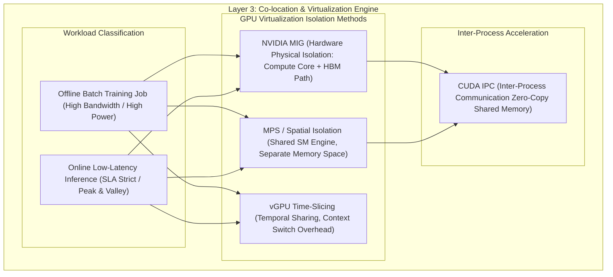

# 4.2 训练/推理混部与 GPU 虚拟化隔离 (Co-location, MIG, vGPU, CUDA IPC)

> **📌 本章导读**
> 在企业级 GPU 数据中心中，单一业务独自占用 GPU 往往会导致极高的 TCO（总体拥有成本）与严重的算力浪费。例如，离线大模型训练在 Checkpoint 导出或 Data Loader 瓶颈时 GPU 出现空转；而在线推理在夜间低峰期利用率不足 10%。
> 
> 本文深入剖析 **训练与推理混部（Co-location）** 的核心架构，硬核拆解 **NVIDIA MIG（Multi-Instance GPU）硬件物理级隔离**、**vGPU 时间分片（Time-Slicing）与空间隔离（Spatial Isolation）** 的权衡，以及基于 **CUDA IPC 跨进程零拷贝共享显存** 的高性能通信，并手写 `GPUMIGResourceAllocator` 验证实例。

---

## 🌳 1. GPU 混部与虚拟化隔离全景架构



---

## ⚙️ 2. 虚拟化隔离技术硬核对比：MIG vs vGPU Time-Slicing vs MPS

| 维度 | NVIDIA MIG (Multi-Instance GPU) | vGPU Time-Slicing (时间分片) | CUDA MPS (Multi-Process Service / 空间隔离) |
| :--- | :--- | :--- | :--- |
| **隔离级别** | **硬件物理级** (SM/Crossbar/HBM 独立) | 逻辑时间级 (共享所有硬件) | 逻辑空间级 (共享 SM，硬件 Address Space 隔离) |
| **故障隔离** | 完美隔离 (单实例 Crash 不影响其他) | 无隔离 (单进程 OOM / Reset 挂掉全局) | 部分隔离 (共享 SM 引擎) |
| **SLA 延迟保障** | 100% 硬件硬保障，零抖动 | 差，上下文切换开销大，延迟易抖动 | 良好，SM 算力可按百分比配额 |
| **内存/带宽隔离** | HBM 显存容量与带宽完全硬切割 | 仅限制内存分配容量，HBM 带宽严重抢占 | 共享 HBM 带宽 |
| **支持 GPU** | A100 / H100 / B200 等 Data Center GPU | 所有 NVIDIA GPU | Pascal 架构及以上专业卡/数据中心卡 |

---

## 📐 3. CUDA IPC (Inter-Process Communication) 零拷贝机制

在混部或同节点多容器 Serving 中，如果两个进程（如 Client 进程与 vLLM Inference Engine）需要共享张量，传统的 Host DRAM 拷贝流程如下：

$$\text{GPU Process A (Device)} \xrightarrow{\text{cudaMemcpy}} \text{CPU Host DRAM} \xrightarrow{\text{IPC Transfer}} \text{CPU Host DRAM} \xrightarrow{\text{cudaMemcpy}} \text{GPU Process B (Device)}$$

该流程引入两次 PCIe 传输与内存带宽浪费。**CUDA IPC 原理**允许进程 B 直接挂载进程 A 的 Device Pointer 虚拟地址：

$$\text{Process A: } \text{cudaIpcGetMemHandle}(\&handle, ptr) \xrightarrow{\text{Send Handle via OS Unix Socket}} \text{Process B: } \text{cudaIpcOpenMemHandle}(\&ptr\_b, handle)$$

数据访问无需离开 GPU VRAM，带宽可提升一个数量级（达 $900\text{ GB/s}$ NVLink 速度）。

---

## 💻 4. Python 实战：手写 `GPUMIGResourceAllocator`

以下 Python 代码模拟了包含 MIG 实例硬切割、MPS 空间配额计算与动态混部降级的策略管理器：

```python
import dataclasses
from typing import List, Dict, Optional

@dataclasses.dataclass
class MIGProfile:
    profile_id: str
    name: str          # e.g., "1g.10gb", "3g.40gb", "7g.80gb"
    gpc_count: int     # Graphics Processing Clusters
    memory_gb: float   # Dedicated HBM Memory
    is_allocated: bool = False

class GPUMIGResourceAllocator:
    """
    NVIDIA MIG (Multi-Instance GPU) 物理资源切割与混部分配器
    """
    # A100-80GB 标准 MIG 规格定义
    AVAILABLE_PROFILES = {
        "1g.10gb": {"gpc": 1, "memory": 10.0},
        "2g.20gb": {"gpc": 2, "memory": 20.0},
        "3g.40gb": {"gpc": 3, "memory": 40.0},
        "7g.80gb": {"gpc": 7, "memory": 80.0},  # 独占全卡
    }

    def __init__(self, gpu_id: int, total_gpc: int = 7, total_memory_gb: float = 80.0):
        self.gpu_id = gpu_id
        self.total_gpc = total_gpc
        self.total_memory_gb = total_memory_gb
        self.active_mig_instances: List[MIGProfile] = []

    def current_used_gpc(self) -> int:
        return sum(inst.gpc_count for inst in self.active_mig_instances)

    def current_used_memory(self) -> float:
        return sum(inst.memory_gb for inst in self.active_mig_instances)

    def allocate_mig_instance(self, profile_name: str, instance_label: str) -> Optional[MIGProfile]:
        if profile_name not in self.AVAILABLE_PROFILES:
            raise ValueError(f"Unknown MIG Profile: {profile_name}")

        spec = self.AVAILABLE_PROFILES[profile_name]
        needed_gpc = spec["gpc"]
        needed_mem = spec["memory"]

        # 检查物理 GPC 与 HBM 约束
        if self.current_used_gpc() + needed_gpc > self.total_gpc:
            print(f"❌ [MIG Allocation Failed] Cannot allocate {profile_name}. GPC Overflow ({self.current_used_gpc()} + {needed_gpc} > {self.total_gpc})")
            return None

        instance = MIGProfile(
            profile_id=f"mig-{self.gpu_id}-{instance_label}",
            name=profile_name,
            gpc_count=needed_gpc,
            memory_gb=needed_mem,
            is_allocated=True
        )
        self.active_mig_instances.append(instance)
        print(f"✅ [MIG Partitioned] Created Instance '{instance.profile_id}' ({profile_name}) on GPU {self.gpu_id}")
        return instance

    def destroy_mig_instance(self, profile_id: str):
        self.active_mig_instances = [inst for inst in self.active_mig_instances if inst.profile_id != profile_id]
        print(f"🧹 [MIG Reclaimed] Destroyed Instance '{profile_id}' on GPU {self.gpu_id}")

if __name__ == "__main__":
    allocator = GPUMIGResourceAllocator(gpu_id=0, total_gpc=7, total_memory_gb=80.0)

    # 1. 混部场景：分配 1 个 3g.40gb 运行离线 Batch 训练
    train_inst = allocator.allocate_mig_instance("3g.40gb", "offline-train")

    # 2. 分配 3 个 1g.10gb 运行在线低延迟推理
    inf1 = allocator.allocate_mig_instance("1g.10gb", "online-serving-1")
    inf2 = allocator.allocate_mig_instance("1g.10gb", "online-serving-2")
    inf3 = allocator.allocate_mig_instance("1g.10gb", "online-serving-3")

    # 3. 再次分配将超界超算
    inf4 = allocator.allocate_mig_instance("1g.10gb", "online-serving-4")

    # 4. 训练结束，回收 3g.40gb 资源
    if train_inst:
        allocator.destroy_mig_instance(train_inst.profile_id)
```

---

## 🔥 5. 连环面试追问 (Level 1 ~ Level 6)

### Level 1: 概念阐释
> **问：为什么简单的 vGPU 时间分片（Time-Slicing）无法直接用于大模型在线推理 SLA 保障？**
>
> **答**：时间分片在不同容器/进程交替使用 GPU 时需要强行刷新 CUDA 上下文（Context Switch）。在 Decode 阶段，频繁的 Context Switch 导致首字延迟（TTFT）与 Token 间延迟（ITL）产生剧烈抖动（Tail Latency），严重破坏生产 SLA。

---

### Level 2: 机制对比
> **问：NVIDIA MIG 硬件分割与 CUDA MPS 空间隔离在显存带宽（HBM Bandwidth）隔离上有何不同？**
>
> **答**：MIG 从硬件 Crossbar 和 Memory Controller 层面进行了物理硬切割，每个 MIG 实例独占专用的 HBM 通道和显存带宽；而 CUDA MPS 仅在 Address Space 层面做逻辑隔离，多个进程依然共享物理 Memory Controller，当进程 A 发生高密集 Prefill 读写时，仍会严重抢占进程 B 的 HBM 带宽。

---

### Level 3: 架构传导
> **问：在混部架构中，如果训练任务引发了 GPU OOM，虚拟化隔离机制如何防止推理服务崩盘？**
>
> **答**：在 MIG 模式下，GPU 硬件内部隔离了 Fault Domain，训练 MIG 实例发生 OOM 仅导致该 MIG 实例的 MMU 抛出 Exception，其他 MIG 实例的 Context 与 VRAM 完全不受影响；若在 MPS 模式下，则必须在 Cgroup 层面配置严格的 Virtual Memory Limit。

---

### Level 4: 通信加速
> **问：CUDA IPC 原理是什么？它在多进程 Serving（如 Router 与 Worker 进程）中起到了什么作用？**
>
> **答**：CUDA IPC 通过 OS 传递 GPU Device Pointer 的 File Descriptor / Handle，使进程 B 能够直接在 GPU 显存内映射并读取进程 A 的地址空间。这消除了跨进程的 CPU Host 内存中转，把传输延迟从毫秒级降至微秒级。

---

### Level 5: 系统瓶颈
> **问：在夜间低峰期与白天高峰期切换时，混部平台如何动态无缝调整 MIG 配置而不破坏 Serving 连接？**
>
> **答**：MIG 配置的重构（Destroy & Create）要求 GPU 无活动 CUDA Context。平台需采用**双机 Rolling Update 模式**：通过网关 Router 将流量优雅切走（Draining），待旧 MIG 实例上的推理连接清零后销毁实例并重新切割给训练集群，全程由 Gateway 保持 SLA 零中断。

---

### Level 6: 极限设计
> **问：请设计一个结合 MIG、MPS 与 Dynamic Priority Preemption 的万卡 GPU 异构混部平台架构。**
>
> **答**：
> 1. **白天高峰期**：调度器使用 MIG 将 H100 切割为 7x 1g.10gb 物理实例，运行高并发 Inference Decode。
> 2. **夜间低峰期**：合并 MIG 实例为全卡 7g.80gb，开启 MPS 挂载离线 SFT 训练任务与 Agent Evaluation 评估任务。
> 3. **通信加速**：引入基于 CUDA IPC 的零拷贝共享 Buffer Pool，加速 Prefill Router 与 Worker 间的 Token 传递。
> 4. **兜底控制**：Layer 4 监控实时指标，当延迟超标时，通过 MPS Dynamic Control Pipe 在 10ms 内调低离线训练任务的 Active Thread Percentage。

---

## 🔗 6. 扩展学习资源与论文/Repo

- **[NVIDIA MIG User Guide](https://docs.nvidia.com/datacenter/tesla/mig-user-guide/)**：Official Hardware Partitioning Architecture.
- **[CUDA MPS Documentation](https://docs.nvidia.com/deploy/mps/index.html)**：Multi-Process Service for Shared GPUs.
- **[CUDA IPC API Reference](https://docs.nvidia.com/cuda/cuda-runtime-api/group__CUDART__DEVICE.html)**：Inter-Process Communication API specifications.
