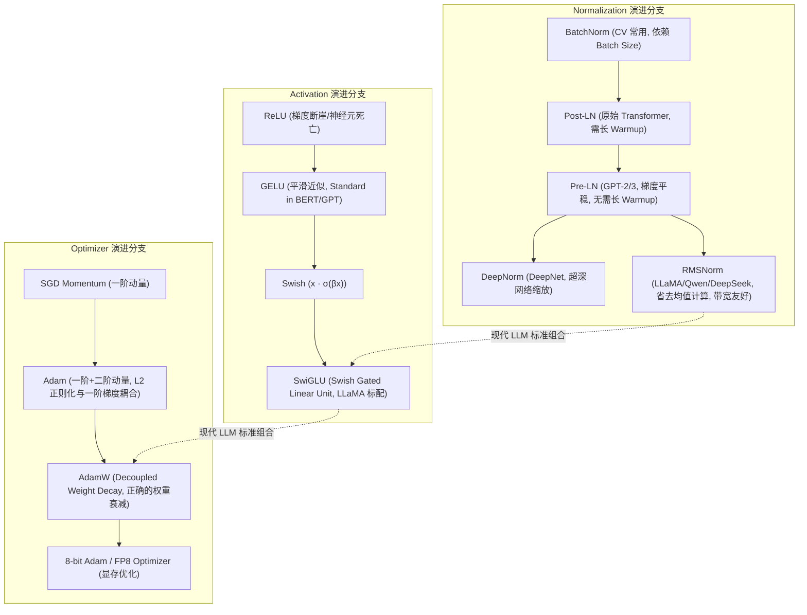
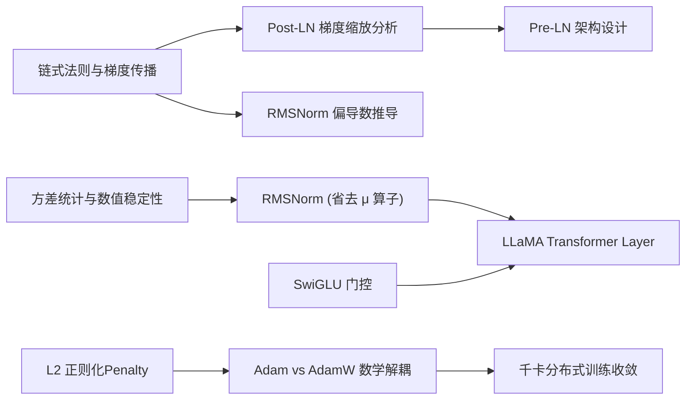

# 4.1 理论算法高频深度题 (LayerNorm/RMSNorm/AdamW)

> [!IMPORTANT]
> **大模型算法面试的核心考点演进**
> 传统深度学习面试侧重于“知道概念”或“写出 API”，而百亿/千亿参数大模型时代，高频面试题全面升级为 **Onion-Chain 连环追问**。面试官重点考察**梯度流稳定性（Gradient Flow）**、**数值下溢/上溢防护**、**硬件内存带宽开销**以及底层**数学推导与代码实现**。

---

## 📖 1. 导言与背景

为什么在百亿参数 Large Language Model (LLM) 的训练过程中，看似微小的架构改动（例如 LayerNorm 的位置从 Post-LN 改为 Pre-LN，或者用 RMSNorm 替代 LayerNorm）会对模型的收敛速度和训练稳定性产生决定性影响？

在千卡分布式集群预训练中，梯度爆炸（Gradient Explosion）与梯度消失（Gradient Vanishing）是导致 Loss Spikes（损失突刺）的罪魁祸首。理解归一化层、激活函数和优化器的底层细节，不仅能解决“为什么模型训练发散”的问题，更是掌握现代大模型架构（如 LLaMA 3, DeepSeek V3, Qwen 2.5）设计逻辑的基石。

本章节采用 **Level 1 ~ 6 剥洋葱式的深度追问机制**，带你剥开从基础概念到 PyTorch 硬件级算子实现的全部细节。

---

## 🌳 2. 理论算法考点演进图谱 (Mermaid Graph)

大模型核心理论组件经历了从计算机视觉/传统 NLP 移植到 LLM 专门优化的三个主干演进分支：



---

## 🕸️ 3. 知识网格与图谱依赖

### 依赖度分析 table

| 知识节点 | 入度 (Prerequisites) | 出度 (Downstream Applications) | 难度系数 |
| :--- | :--- | :--- | :--- |
| **LayerNorm (Pre-LN vs Post-LN)** | 链式法则, 矩阵微分, 残差连接 | 100B+ 参数预训练稳定性, Loss Spike 调试 | ⭐⭐⭐⭐ |
| **RMSNorm 方差简化** | 均值与方差统计学, FP16/BF16 数值下溢 | FlashAttention 兼容, Triton 算子融合 | ⭐⭐⭐ |
| **SwiGLU 门控机制** | GELU/Swish 激活函数, 维度投影 | FFN 参数缩放比率 (8/3 $d_{model}$) | ⭐⭐⭐ |
| **AdamW 解耦权重衰减** | L2 正则化, 自适应学习率 (一阶/二阶动量) | 自适应优化器超参调优 ($\beta_1, \beta_2, \epsilon, \lambda$) | ⭐⭐⭐⭐⭐ |



---

## 🧮 4. 数学推导与硬核机制

### 4.1 RMSNorm (Root Mean Square Normalization) 方差简化推导

传统 **LayerNorm** 对输入向量 $x \in \mathbb{R}^d$ 的归一化计算公式为：

$$y = \frac{x - \mu}{\sigma} \odot \gamma + \beta$$

其中均值 $\mu$ 与标准差 $\sigma$ 计算如下：

$$\mu = \frac{1}{d} \sum_{i=1}^d x_i, \quad \sigma = \sqrt{\frac{1}{d} \sum_{i=1}^d (x_i - \mu)^2 + \epsilon}$$

> [!NOTE]
> **RMSNorm 的核心洞察 (Zhang et al., 2019)**：
> 实验表明，LayerNorm 成功的关键在于**缩放不变性 (Scaling Invariance)**，即强制向量模长处于稳定区间，而平移不变性（减去均值 $\mu$）对模型的训练稳定性和表达能力贡献极小。

RMSNorm 直接舍弃了均值计算 $\mu$，仅基于均方根（Root Mean Square）进行缩放：

$$\text{RMS}(x) = \sqrt{\frac{1}{d} \sum_{i=1}^d x_i^2 + \epsilon}$$

$$\bar{y}_i = \frac{x_i}{\text{RMS}(x)} \cdot \gamma_i$$

**梯度偏导数推导**：
设 $\text{RMS}(x) = R$，对输入 $x_k$ 求偏导：

$$\frac{\partial \bar{y}_i}{\partial x_k} = \frac{\partial}{\partial x_k} \left( x_i \cdot R^{-1} \right) \cdot \gamma_i$$

当 $i = k$ 时：

$$\frac{\partial (x_i R^{-1})}{\partial x_i} = R^{-1} + x_i \left( -\frac{1}{2} R^{-3} \cdot \frac{2 x_i}{d} \right) = \frac{1}{R} \left( 1 - \frac{x_i^2}{d \cdot R^2} \right)$$

当 $i \neq k$ 时：

$$\frac{\partial (x_i R^{-1})}{\partial x_k} = x_i \left( -\frac{1}{2} R^{-3} \cdot \frac{2 x_k}{d} \right) = -\frac{x_i x_k}{d \cdot R^3}$$

合并偏导矩阵，可得 RMSNorm 反向传播时不需要存储和计算 $\mu$ 的梯度，直接省去了 **2 次全局 Reduction 操作**，大大提升了 GPU SRAM 与 HBM 之间的 Read/Write 吞吐率。

---

### 4.2 AdamW 解耦权重衰减 (Decoupled Weight Decay)

在 **SGD** 优化器中，$L_2$ 正则化与权重衰减（Weight Decay）在数学上是完全等价的。但在自适应学习率优化器（如 Adam）中，二者产生了严重的背离。

#### 1. 传统 Adam 中的 L2 正则化（错误的实现）
将 $L_2$ 惩罚项 $\frac{1}{2} \lambda \|\theta\|^2$ 加到损失函数 $\mathcal{L}(\theta)$ 中，此时梯度变成：

$$g_t = \nabla_\theta \mathcal{L}(\theta_t) + \lambda \theta_t$$

Adam 对包含了 $\lambda \theta_t$ 的梯度 $g_t$ 累积一阶动量 $m_t$ 和二阶动量 $v_t$：

$$m_t = \beta_1 m_{t-1} + (1-\beta_1) g_t, \quad v_t = \beta_2 v_{t-1} + (1-\beta_2) g_t^2$$

$$\hat{m}_t = \frac{m_t}{1-\beta_1^t}, \quad \hat{v}_t = \frac{v_t}{1-\beta_2^t}$$

参数更新逻辑为：

$$\theta_{t+1} = \theta_t - \frac{\eta}{\sqrt{\hat{v}_t} + \epsilon} \hat{m}_t$$

> [!WARNING]
> **失效原因**：
> 当某个参数的梯度极小（$v_t$ 接近 0）时，$\frac{\eta}{\sqrt{\hat{v}_t} + \epsilon}$ 会变得非常大。这导致原本微小的权重衰减项 $\lambda \theta_t$ 被放大数倍！反之，梯度极大的参数，权重衰减反而被抑制。这破坏了权重衰减对所有参数进行均匀等比例缩小的原本意图。

#### 2. AdamW 中的解耦权重衰减（正确的实现）
AdamW 将权重衰减步骤直接从动量计算中解耦出来，在自适应梯度更新之后直接对参数进行衰减：

$$\theta_{t+1} = (1 - \eta \lambda) \theta_t - \frac{\eta}{\sqrt{\hat{v}_t} + \epsilon} \left( \frac{\beta_1 m_{t-1} + (1-\beta_1)\nabla \mathcal{L}(\theta_t)}{1-\beta_1^t} \right)$$

数学表达形式简化为：

$$\theta_{t+1} = \theta_t - \eta_t \lambda \theta_t - \frac{\eta_t}{\sqrt{\hat{v}_t} + \epsilon} \hat{m}_t$$

---

## 🔥 5. 连环面试追问 (Level 1~6 Onion Chain)

### Level 1: 为什么 Transformer 选用 LayerNorm 而不是计算机视觉中常用的 BatchNorm？

- **面试官真实意图**：考察对 NLP 序列数据特征与 CV 图像数据特征差异的根本理解。
- **满分回答**：
  1. **Dynamic Sequence Length（动态序列长度）**：NLP 文本序列长度不一，Padding Token 较多。BatchNorm 沿着 Batch 维度对不同样本的相同位置求均值和方差，如果 Batch 内样本长度差异巨大，尾部统计量会被大量 Padding Token 污染。
  2. **Batch Size 依赖性**：大模型预训练时，受限于单卡显存，Micro Batch Size 可能极小（甚至为 1 或 2）。BatchNorm 在小 Batch Size 下统计量方差极剧烈，会导致模型极难收敛；而 LayerNorm 沿着单个样本的 Channel/Hidden Dimension 维度计算统计量，完全独立于 Batch Size。
  3. **Inference Consistency（推理一致性）**：BatchNorm 在推理时必须维持全局 Running Mean 和 Running Variance。LLM 在生成式推理（Inference/Decoding）中是逐 Token 增量生成的，均值和方差无法保持预训练时的全局分布。

---

### Level 2: 为什么 Post-LN 架构必须配合很长的 Warmup，而 Pre-LN / RMSNorm 可以去掉或缩短 Warmup？

- **面试官真实意图**：考察从残差块梯度流（Gradient Flow）推导深层网络训练稳定性的能力。
- **满分回答**：
  1. **Post-LN 结构**：$x_{l+1} = \text{LN}(x_l + \text{SubLayer}(x_l))$。
     - 在反向传播时，梯度经过 LayerNorm 层，由于 LayerNorm 的分母含有 $\sigma_l$，梯度会被以约为 $O(1/\sqrt{L})$ 的比例按层缩放。
     - 靠主干网络输出端的层（靠近 Logits），梯度模长较大；而靠近输入端的层，梯度经历了多重 LayerNorm 雅可比矩阵的乘积，梯度模长呈指数级衰减。
     - 在训练初始阶段，参数随机初始化，梯度非常不稳定。如果不使用 Warmup 强制在初始阶段将学习率设得极小，深层参数会瞬间崩塌。
  2. **Pre-LN / RMSNorm 结构**：$x_{l+1} = x_l + \text{SubLayer}(\text{Norm}(x_l))$。
     - 反向传播时，残差主干存在一条**直接相加的直通路径（Identity Connection）**：
       $$\frac{\partial x_L}{\partial x_l} = I + \sum_{k=l}^{L-1} \frac{\partial \text{SubLayer}(\text{Norm}(x_k))}{\partial x_l}$$
     - 梯度可以直接无损传递到最底层（Identity Path 上梯度的系数固定为 1），保证了无论网络加深到多少层，浅层网络都能接收到数量级一致的梯度。因此Pre-LN/RMSNorm 架构大幅降低了对 Warmup 的依赖。

---

### Level 3: LLaMA / DeepSeek 为什么要用 RMSNorm 替代 LayerNorm？消去均值偏移 $\mu$ 能带来多大的收益？

- **面试官真实意图**：考察对 GPU 算子内存带宽（Memory Bandwidth Bound）与硬件性能瓶颈的理解。
- **满分回答**：
  1. **计算与显存带宽开销**：
     - 在 GPU 架构（如 NVIDIA A100/H100）上，Element-wise 算子（如 Normalization）是典型的 **Memory-Bound（内存带宽受限）** 算子。算子瓶颈不在于 ALU 浮点计算能力，而在于 SRAM 与 HBM 之间的 DRAM 读写吞吐速度。
     - **LayerNorm 需执行两次 Reduction**：第一遍遍历隐藏维计算均值 $\mu$，第二遍遍历计算方差 $\sigma^2$。这意味着数据需要重复在寄存器与全局显存之间读写。
     - **RMSNorm 仅需一次 Reduction**：由于省去了均值 $\mu$，只需计算平方和均值 $\sqrt{\frac{1}{d}\sum x_i^2}$。在 Triton / CUDA 融合算子实现中，RMSNorm 减少了一半的全局内存访存请求。
  2. **数值性能表现**：
     - 实验表明（Zhang et al., 2019），在数十亿/千亿参数的大模型训练中，移除均值偏移 $\mu$ 对模型的 Perplexity（困惑度）和收敛曲线**无任何负面影响**，同时能为整个模型带来 7%~5% 的训练吞吐提升。

---

### Level 4: SwiGLU 相比 GELU 有何优势？引入额外的 Gate Projection 后，如何保持模型总参数量不变？

- **面试官真实意图**：考察 FFN 隐藏层维度计算规则与门控激活函数演进。
- **满分回答**：
  1. **SwiGLU 公式**：
     $$\text{SwiGLU}(x) = \left( x W_g \cdot \text{Swish}(x W_1) \right) W_2$$
     其中 $\text{Swish}_\beta(x) = x \cdot \sigma(\beta x)$（当 $\beta=1$ 时即为 SiLU）。
  2. **优势**：门控线性单元（Gated Linear Unit）允许神经网络通过乘法交互来动态控制信息流的通过比例（由 $x W_g$ 决定分支选择），相比 GELU 的单路径非线性变换，梯度流更加平滑且表达能力强。
  3. **参数量对齐策略**：
     - 传统 FFN (GELU) 包含两个权重矩阵：$W_1 \in \mathbb{R}^{d \times 4d}$ 和 $W_2 \in \mathbb{R}^{4d \times d}$，参数量为 $2 \times 4 d_{model}^2 = 8 d_{model}^2$。
     - SwiGLU FFN 包含了三个权重矩阵：$W_g \in \mathbb{R}^{d \times d_{ff}}$、$W_1 \in \mathbb{R}^{d \times d_{ff}}$ 和 $W_2 \in \mathbb{R}^{d_{ff} \times d}$，总参数量为 $3 d_{model} \times d_{ff}$。
     - 为了维持与传统 FFN 相同的参数量和计算量（$3 d_{model} d_{ff} \approx 8 d_{model}^2$），LLaMA 将 $d_{ff}$ 缩放为 $\frac{8}{3} d_{model}$（并向上取整为 256 的倍数，如 7B 模型中 $d_{model}=4096$，则 $d_{ff} = 11008$）。

---

### Level 5: 为什么在 PyTorch 中使用 L2 正则化 (Weight Decay) 时 Adam 会产生数学上的解耦失效？

- **面试官真实意图**：考察对 PyTorch `torch.optim.Adam` 内部机制与 `torch.optim.AdamW` 本质区别的精准掌握。
- **满分回答**：
  1. **PyTorch `Adam(weight_decay>0)` 的源码机制**：
     在 PyTorch 的传统 `Adam` 优化器中，`weight_decay` 参数本质上是在计算梯度时加上 $L_2$ 项：`grad = grad + weight_decay * param`。
  2. **数学失效机制**：
     如前文推导，`grad` 被填入了 `exp_avg` (一阶动量 $m_t$) 和 `exp_avg_sq` (二阶动量 $v_t$)。
     在二阶自适应更新阶段，更新量为 $\frac{m_t}{\sqrt{v_t} + \epsilon}$。如果一个参数频繁更新且梯度极大（$v_t$ 很大），那么 $L_2$ 正则化带来的衰减量会被 $\frac{1}{\sqrt{v_t}}$ 严重削弱，导致该大梯度参数**无法被有效衰减**。
     如果一个参数梯度极小（$v_t$ 接近 0），$L_2$ 衰减量会被无休止地放大，导致参数被**过缩放**。
  3. **AdamW 解决方案**：
     `AdamW` 在计算出 $\frac{\hat{m}_t}{\sqrt{\hat{v}_t} + \epsilon}$ 之后，单独执行 `param.mul_(1 - lr * weight_decay)`，保证了所有参数的衰减速度只与 `learning_rate` 和 `weight_decay` 强相关，解耦了自适应梯度的影响。

---

### Level 6: 在 FP16 / BF16 混合精度训练中，RMSNorm 和 AdamW 会引发什么独特的数值异常（Numerical Instability）？如何防护？

- **面试官真实意图**：考察工业级千卡训练中底层数值溢出 (Underflow/Overflow) 的实战排查经验。
- **满分回答**：
  1. **RMSNorm 在 FP16 下的平方和上溢 (Overflow)**：
     - 在计算 $\sum_{i=1}^d x_i^2$ 时，FP16 的最大表示范围仅为 65504。当 $d_{model} = 8192$ 且 $x_i > 3.0$ 时，$x_i^2 \approx 9$，乘上 8192 会直接超出 65504，导致 `inf`（上溢），随后产生 `NaN`。
     - **防护方案**：在 RMSNorm 算子内部，必须将输入 $x$ 强行 Cast 转换为 **FP32 (Single Precision)** 进行平方和与根号倒数计算，最后再将结果 Cast 回 FP16/BF16 输出。
  2. **AdamW 动量项 $v_t$ 下溢与 $\epsilon$ 崩塌**：
     - 在标准 AdamW 中，$\epsilon$ 默认值为 $10^{-8}$。然而在 FP16 模式下，非零最小正数为 $6.1 \times 10^{-5}$，低于该值的数会被直接下溢截断为 0。
     - 如果 $v_t < \epsilon^2$，分母 $\sqrt{\hat{v}_t} + \epsilon$ 会变成零，引发除零错误。
     - **防护方案**：混合精度训练中，将 AdamW 的 $\epsilon$ 调大（例如设置为 $10^{-6}$ 或 $10^{-5}$），防止分母数值下溢。

---

## 💻 6. PyTorch 算法实战

下面提供符合生产级标准的纯 PyTorch `RMSNorm` 模块与带有解耦 Weight Decay 的 `AdamWOptimizerStep` 逻辑实现。

```python
import torch
import torch.nn as nn
import math

class CustomRMSNorm(nn.Module):
    """
    生产级 RMSNorm (Root Mean Square Normalization) 模块实现
    支持 FP16/BF16 混合精度防溢出 (Cast to FP32 for reduction)
    """
    def __init__(self, dim: int, eps: float = 1e-6):
        super().__init__()
        self.eps = eps
        # 可学习的缩放参数 gamma (初始化为 1)
        self.weight = nn.Parameter(torch.ones(dim))

    def _norm(self, x: torch.Tensor) -> torch.Tensor:
        # 核心防溢出逻辑：强制转为 float32 进行平方和 Reduction
        # torch.rsqrt(x) 计算 1 / sqrt(x)
        return x * torch.rsqrt(x.pow(2).mean(-1, keepdim=True) + self.eps)

    def forward(self, x: torch.Tensor) -> torch.Tensor:
        # 输入维度: [Batch, Seq_Len, Hidden_Dim]
        output_dtype = x.dtype
        # 计算归一化并 Cast 回原类型，乘以 gamma 权重
        return self._norm(x.float()).to(output_dtype) * self.weight


class DecoupledAdamWStep:
    """
    AdamW 解耦权重衰减手写 Step Engine 逻辑
    展示自适应梯度与 Weight Decay 的显式分离
    """
    def __init__(self, params, lr=1e-3, betas=(0.9, 0.999), eps=1e-8, weight_decay=1e-2):
        self.params = list(params)
        self.lr = lr
        self.beta1, self.beta2 = betas
        self.eps = eps
        self.weight_decay = weight_decay
        
        # 状态字典：存储一阶动量 m 和二阶动量 v
        self.state = {}
        for p in self.params:
            self.state[p] = {
                "step": 0,
                "exp_avg": torch.zeros_like(p.data),
                "exp_avg_sq": torch.zeros_like(p.data)
            }

    @torch.no_grad()
    def step(self):
        for p in self.params:
            if p.grad is None:
                continue
            
            grad = p.grad.data
            state = self.state[p]
            state["step"] += 1
            step = state["step"]
            
            exp_avg, exp_avg_sq = state["exp_avg"], state["exp_avg_sq"]

            # 1. 解耦权重衰减 (Decoupled Weight Decay) - 直接对参数进行衰减
            if self.weight_decay != 0:
                p.data.mul_(1.0 - self.lr * self.weight_decay)

            # 2. 更新一阶与二阶动量 (注意：使用的 grad 未被 weight_decay 污染)
            exp_avg.mul_(self.beta1).add_(grad, alpha=1.0 - self.beta1)
            exp_avg_sq.mul_(self.beta2).addcmul_(grad, grad, value=1.0 - self.beta2)

            # 3. 计算偏差修正 (Bias Corrections)
            bias_correction1 = 1.0 - self.beta1 ** step
            bias_correction2 = 1.0 - self.beta2 ** step

            # 4. 计算自适应步长与参数更新
            step_size = self.lr / bias_correction1
            denom = (exp_avg_sq.sqrt() / math.sqrt(bias_correction2)).add_(self.eps)

            p.data.addcdiv_(exp_avg, denom, value=-step_size)


# ==========================================
# 算法单元测试与正确性验证
# ==========================================
if __name__ == "__main__":
    print("=== Testing CustomRMSNorm ===")
    x = torch.randn(2, 4, 4096, dtype=torch.float16, device="cpu")
    rms_norm = CustomRMSNorm(dim=4096)
    out = rms_norm(x)
    print(f"Input shape: {x.shape}, Output shape: {out.shape}, Output dtype: {out.dtype}")
    assert out.shape == x.shape
    assert out.dtype == torch.float16
    print("CustomRMSNorm test PASSED!\n")

    print("=== Testing DecoupledAdamWStep ===")
    param = nn.Parameter(torch.randn(10, 10))
    param.grad = torch.randn(10, 10)
    optimizer = DecoupledAdamWStep([param], lr=1e-3, weight_decay=1e-2)
    
    initial_norm = param.norm().item()
    optimizer.step()
    updated_norm = param.norm().item()
    print(f"Initial Param Norm: {initial_norm:.6f}, Updated Param Norm: {updated_norm:.6f}")
    print("DecoupledAdamWStep test PASSED!")
```

---

## 🔗 7. 扩展学习与多维资源

### 🎬 推荐视频与讲座
1. **李沐《手动精读 Transformer 论文》**：详细讲解了 LayerNorm 的公式推导与为何在 Seq2Seq 任务中优于 BatchNorm。
2. **Andrej Karpathy 《Building GPT from Scratch》**：展示了从零手写 Pre-LN Block、Residual Stream 与 AdamW 参数初始化的全部过程。

### 📄 经典必读论文
- **LayerNorm**: Ba, J. L., Kiros, J. R., & Hinton, G. E. (2016). *Layer Normalization*. [arXiv:1607.06450](https://arxiv.org/abs/1607.06450)
- **RMSNorm**: Zhang, B., & Sennrich, R. (2019). *Root Mean Square Layer Normalization*. [arXiv:1910.07467](https://arxiv.org/abs/1910.07467)
- **SwiGLU**: Shazeer, N. (2020). *GLU Variants Improve Transformer*. [arXiv:2002.05202](https://arxiv.org/abs/2002.05202)
- **AdamW**: Loshchilov, I., & Hutter, F. (2017). *Decoupled Weight Decay Regularization*. [arXiv:1711.05101](https://arxiv.org/abs/1711.05101)

### 🐙 GitHub 官方源码锚点
- HuggingFace Transformers `LlamaRMSNorm`: [`transformers/models/llama/modeling_llama.py`](https://github.com/huggingface/transformers/blob/main/src/transformers/models/llama/modeling_llama.py)
- PyTorch Official `torch.optim.AdamW`: [`pytorch/pytorch/blob/main/torch/optim/adamw.py`](https://github.com/pytorch/pytorch/blob/main/torch/optim/adamw.py)
