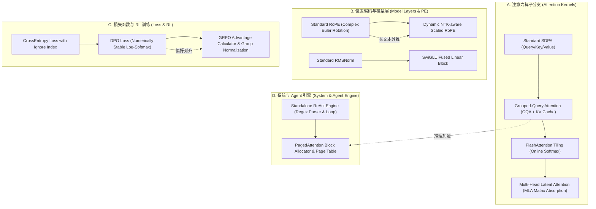

# 4.3 手撕代码与算子实现 (GQA/PagedAttn/ReAct/DPO)

> [!IMPORTANT]
> **手撕代码（Handwritten Coding）关卡核心生存法则**
> 在大模型与 AI Agent 岗位面试中，“手撕代码”不仅考察 Python 基础与 API 熟练度，更考察面试者对 **张量维度广播 (Broadcasting)**、**内存连续性 (Contiguous & Strides)**、**数值稳定性 (Log-Sum-Exp & Numerically Stable Softmax)** 以及 **算法时空复杂度** 的精确掌控能力。写出能正确处理 Batch、Multi-Head 且完全无 Bug 的 PyTorch / Python 原生代码是 Pass 关键。

---

## 📖 1. 导言与背景

为什么绝大多数候选人在大模型手撕代码面试中卡壳？答案通常不是由于算法思想不理解，而是遇到了以下底层技术坑点：

1. **张量维度精度错乱 (Shape & Precision Discrepancy)**：无法精准推导多头注意力机制（MHA/GQA）在经过 `reshape` / `permute` / `repeat_interleave` 前后的维度变换路径，导致梯度反向传播时 shape 无法对齐。
2. **内存连续性坑点 (Stride Alignment & Contiguous)**：转置（`transpose` / `permute`）操作仅改变了 Tensor 头信息中的 `stride`，而没有移动显存中的物理数据。直接调用 `view()` 会引发致命的 `RuntimeError: input is not contiguous`。
3. **数值溢出与不稳定 (Numerical Instability & Overflow/Underflow)**：在大规模概率比值（如 DPO Loss）或 Softmax 计算中，直接调用 `torch.exp()` 会导致 `Inf` 或 `NaN`。必须熟练应用 Log-Sum-Exp 技巧与 Max Shift 偏移归一化。
4. **系统级分块与调度 (System Tiling & Block Management)**：无法在白板上用纯数据结构描述 PagedAttention 物理页表索引与动态分配逻辑，或者无法递推写出 FlashAttention 的 Online Softmax 分块更新公式。

本章节全面覆盖 **5 大高频核心手撕题型**，并提供可直接运行的工业级 PyTorch / Python 纯手撕代码实现与 Onion-Chain 面试追问链。

---

## 🌳 2. 手撕代码核心题型分支树 (Mermaid Graph)

大模型手撕代码题型可划分为四大核心演进分支，涵盖从注意力底层算子到上层 Agent 系统引擎：



---

## 🕸️ 3. 知识网格与图谱依赖

### 入度与出度拓扑分析

| 知识节点 | 入度依赖 (Prerequisites) | 出度应用 (Downstream Applications) | 核心考点占比 |
| :--- | :--- | :--- | :--- |
| **GQA with KV Cache** | PyTorch Broadcasting, `repeat_interleave`, Causal Masking | LLaMA 3 / DeepSeek V3 架构实现, KV 显存优化 | 25% |
| **FlashAttention Online Softmax** | Incremental Softmax Numerator/Denominator Tiling, Max Shift Algebra | Triton / CUDA 自定义算子开发, Block Tiling | 25% |
| **Dynamic NTK RoPE** | Base Scaling Ratio $\alpha$, Complex Matrix Multiplications, Outer Product | 长文本上下文扩展 (Long-Context Scaling) | 15% |
| **DPO Loss Calculator** | Implicit Reward $\hat{r}$, Log-Softmax Numerically Stable Formulation | RLHF/DPO 偏好对齐算法训练, Actor-Reference Loss | 15% |
| **ReAct Loop & Block Allocator** | Python Decorators, Regex State Machine, Block Allocator/Free Lists | Custom Agent Frameworks, vLLM Paged Memory Engine | 20% |

---

## 🧮 4. 维度变化与数值稳定性推导

### 4.1 GQA 张量维度转换推导

在 Grouped-Query Attention (GQA) 中，假设 Query 头数为 $H_q$，Key/Value 头数为 $H_{kv}$，其中 $H_q$ 是 $H_{kv}$ 的整数倍，记组比率 $G = H_q / H_{kv}$。

输入张量维度变化路径推导如下：

1. **输入张量形状**：
   $$\text{Query}: (B, S, H_q, D), \quad \text{Key}: (B, S, H_{kv}, D), \quad \text{Value}: (B, S, H_{kv}, D)$$
2. **KV 维度扩展 (Group Expansion)**：
   对 $H_{kv}$ 维度沿组大小 $G$ 进行展开或重复：
   $$\text{Key}_{\text{expanded}} = \text{repeat\_interleave}(\text{Key}, \text{repeats}=G, \text{dim}=2) \implies (B, S, H_q, D)$$
3. **多头注意力转置 (Head Transpose)**：
   交换 Sequence 长度维度 $S$ 与 Heads 维度 $H_q$，使得 Attention 可以在头部维度并行运算：
   $$\text{Q}, \text{K}, \text{V} \xrightarrow{\text{transpose}(1, 2)} (B, H_q, S, D)$$
4. **Scores 点积计算与 Scaling**：
   $$\text{Scores} = \frac{Q K^T}{\sqrt{D}} \in (B, H_q, S, S)$$
5. **Causal Mask 上三角遮蔽与 Softmax**：
   $$\text{Attn\_Weights} = \text{softmax}(\text{Scores} + \text{Mask}, \text{dim}=-1) \in (B, H_q, S, S)$$
6. **加权求和与输出输出维度复原**：
   $$\text{Output}_{\text{head}} = \text{Attn\_Weights} \cdot V \in (B, H_q, S, D)$$
   $$\text{Output}_{\text{head}} \xrightarrow{\text{transpose}(1, 2)} (B, S, H_q, D) \xrightarrow{\text{reshape}} (B, S, H_q \cdot D)$$

---

### 4.2 Online Softmax 分块结合律代数推导

为了在内存有限的 SRAM 中计算巨型 Attention，FlashAttention 采用了 **Online Softmax 分块递推**。

假设某向量 $X$ 被拆分为前后两块 $X^{(1)}$ 和 $X^{(2)}$，其局部局部最大值与分母项（Exp Sum）分别为：
$$m_1 = \max(X^{(1)}), \quad d_1 = \sum e^{X^{(1)} - m_1}$$
$$m_2 = \max(X^{(2)}), \quad d_2 = \sum e^{X^{(2)} - m_2}$$

当合并两块数据时，全局最大值 $m$ 与全局归一化分母 $d$ 的**无损增量更新公式**推导如下：

1. **全局最大值**：
   $$m = \max(m_1, m_2)$$
2. **全局归一化分母**：
   $$d = d_1 \cdot e^{m_1 - m} + d_2 \cdot e^{m_2 - m}$$
3. **局部分子/加权输出合并更新**：
   若上一块的累加输出结果为 $O^{(1)}$，则融合 $X^{(2)}$ 后的新输出 $O$ 为：
   $$O = \frac{d_1 e^{m_1 - m} \cdot O^{(1)} + e^{X^{(2)} - m} V^{(2)}}{d}$$

> [!TIP]
> **Online Softmax 的本质**
> 通过引入指数缩放因子 $e^{m_1 - m}$，在无需一次性将完整 $S \times S$ 注意力矩阵加载到显存的情况下，实现了与 Standard Softmax **完全按位等价 (Bitwise Identical)** 的结果。

---

## 🔥 5. 连环面试追问 (Level 1~6 Onion Chain)

### Level 1: PyTorch 中 `view()` 与 `reshape()` 的底层机制有什么区别？为什么在 `transpose()` 之后必须调用 `contiguous()`？

> [!NOTE]
> **底层内存物理布局剖析**
> - `view()` 要求原 Tensor 在内存中物理存储是**连续的 (Contiguous)**。它只改变 Tensor 的元信息（`shape` 和 `stride`），不产生任何物理内存拷贝。若 Tensor 不连续，调用 `view()` 会报错 `RuntimeError`。
> - `reshape()` 更加健壮。如果 Tensor 已经是物理连续的，它等价于 `view()`；如果 Tensor 不连续，它会自动隐式调用 `contiguous()` 复制一份物理连续的内存副本空间。
> - 当执行 `x.transpose(1, 2)` 时，PyTorch 并没有改变数据在显存中的真实物理排列，而只是交换了 `x.stride(1)` 与 `x.stride(2)` 的步长值，此时 Tensor 的 `is_contiguous()` 变为 `False`。如果不调用 `contiguous()` 重新做显存物理对齐，后续依赖连续内存指令集（如 CUDA Coalesced Memory Access）的操作就会失效。

---

### Level 2: 手写 Attention 时，如果忘记给 Softmax 上游施加 Mask（如 Causal Mask），会有什么严重后果？

> [!WARNING]
> **信息泄露与训练/推理不一致**
> 1. **训练阶段信息泄露 (Data Leakage)**：自回归 Language Model 依赖下文掩码（Causal Mask / Lower Triangular Mask）。如果丢失掩码，$t$ 时刻的 Token 能够直接“窥探”到 $t+1, \dots, S$ 时刻的未来真实 Target Token。导致训练 Loss 迅速降至接近 0，但模型根本没有学会真正的序列生成能力。
> 2. **Prompt / Generation 不对齐**：Prompt Prefill 阶段没有掩码会导致注意力权重分配到非法 Token 位置，生成完全混乱的内容。

---

### Level 3: 手写 DPO Loss 时，如果直接用 `torch.exp` 计算概率比值，为什么容易触发 `Inf` 或 `NaN`？如何解决？

> [!CAUTION]
> **数值溢出与梯度崩溃**
> DPO Loss 的原始数学公式包含 Policy 模型与 Reference 模型对 Log-Likelihood 差值的指数项：
> $$\mathcal{L}_{\text{DPO}} = -\log \sigma \left( \beta \log \frac{\pi_\theta(y_w|x)}{\pi_{\text{ref}}(y_w|x)} - \beta \log \frac{\pi_\theta(y_l|x)}{\pi_{\text{ref}}(y_l|x)} \right)$$
> 如果写成 `torch.exp(policy_logps - ref_logps)`，当模型对回答的 Log 概率较小（如 $-200$ 与 $-50$）时，`log_ratio` 会达到 $150$，`torch.exp(150)` 会直接爆显存上限变成 `Inf`，进一步计算 Sigmoid 导致 `NaN`。
> 
> **标准数值稳定解法**：
> 永远不要显式计算 `torch.exp` 的概率比值，而是直接利用 `torch.nn.functional.logsigmoid` 算子：
> $$\log \sigma(z) = \text{logsigmoid}(z) = -\log(1 + e^{-z})$$
> 内部封装了数值稳定的边界分支裁切，彻底消除 `Inf` 和 `NaN`。

---

### Level 4: 如何在不用任何第三方库的前提下，手写一个包含工具注册与正则提取的 `ReAct` 智能体执行循环？

> [!TIP]
> **ReAct 引擎的核心三要素**
> 1. **工具注册器 (Tool Registry)**：利用 Python 装饰器（Decorator）将底层 Python 函数注册为 Agent 可识别的 JSON / Schema 格式字典。
> 2. **正则解析状态机 (Regex State Machine)**：解析 LLM 输出中的 `Thought:`, `Action:`, `Action Input:` 关键字。
> 3. **死循环熔断与 Context 递增**：维护 `messages` 列表，当捕获到 `Final Answer:` 时主动退出循环；设定 `max_steps` 防范无限死循环。

---

### Level 5: 如何在白板上手写 PagedAttention 的物理块分配器（Block Allocator）？如何处理 Page Fault？

> [!NOTE]
> **PagedAttention 分配器设计思想**
> PagedAttention 将连续的 KV Cache 离散化存储在定长的物理页（Physical Blocks）中。
> - **Block Table**：记录逻辑页（Logical Block）到物理页（Physical Block）的映射关系。
> - **Free List / Stack**：管理当前未被使用的空闲物理块索引。
> - **Page Fault / Out of Memory 挂起机制**：当 `free_blocks` 队列为空，且某个请求需要申请新 Block 时，触发抢占（Preemption）或交换（Swapping），将低优先级的 Sequence KV Cache 抢占换出到 CPU DRAM。

---

## 💻 6. 5 大经典手撕代码完整实现

### 6.1 题目一：手写 `GroupedQueryAttention`（支持 KV Cache 与 Causal Mask）

```python
import torch
import torch.nn as nn
import torch.nn.functional as F

class GroupedQueryAttention(nn.Module):
    """
    Grouped-Query Attention (GQA) 工业级完整手写实现
    支持: 
    1. KV Cache 增量解码
    2. Causal Attention Mask 自动生成
    3. 自定义 Head 维度与 Group 展开
    """
    def __init__(self, embed_dim: int, num_heads: int, num_kv_heads: int):
        super().__init__()
        self.embed_dim = embed_dim
        self.num_heads = num_heads
        self.num_kv_heads = num_kv_heads
        assert num_heads % num_kv_heads == 0, "num_heads 必须能被 num_kv_heads 整除"
        self.num_queries_per_kv = num_heads // num_kv_heads
        self.head_dim = embed_dim // num_heads

        self.q_proj = nn.Linear(embed_dim, num_heads * self.head_dim, bias=False)
        self.k_proj = nn.Linear(embed_dim, num_kv_heads * self.head_dim, bias=False)
        self.v_proj = nn.Linear(embed_dim, num_kv_heads * self.head_dim, bias=False)
        self.out_proj = nn.Linear(num_heads * self.head_dim, embed_dim, bias=False)

    def forward(
        self, 
        x: torch.Tensor, 
        kv_cache: tuple[torch.Tensor, torch.Tensor] | None = None
    ) -> tuple[torch.Tensor, tuple[torch.Tensor, torch.Tensor]]:
        # x shape: (B, S, D)
        B, S, _ = x.shape

        # 1. 线性投影与 Reshape 拆头
        q = self.q_proj(x).view(B, S, self.num_heads, self.head_dim).transpose(1, 2)  # (B, H_q, S, D_h)
        k = self.k_proj(x).view(B, S, self.num_kv_heads, self.head_dim).transpose(1, 2) # (B, H_kv, S, D_h)
        v = self.v_proj(x).view(B, S, self.num_kv_heads, self.head_dim).transpose(1, 2) # (B, H_kv, S, D_h)

        # 2. KV Cache 拼接处理
        if kv_cache is not None:
            past_k, past_v = kv_cache
            k = torch.cat([past_k, k], dim=2)
            v = torch.cat([past_v, v], dim=2)
        new_kv_cache = (k, v)

        total_s = k.shape[2]

        # 3. GQA Key/Value repeat_interleave 展开匹配 Query 头数
        # k shape: (B, H_kv, S_total, D_h) -> (B, H_q, S_total, D_h)
        k_expanded = k.repeat_interleave(self.num_queries_per_kv, dim=1)
        v_expanded = v.repeat_interleave(self.num_queries_per_kv, dim=1)

        # 4. 计算 Scaled Dot-Product Attention Scores
        scores = torch.matmul(q, k_expanded.transpose(-2, -1)) / (self.head_dim ** 0.5) # (B, H_q, S, S_total)

        # 5. Causal Mask (当 S > 1 且处于 Prefill 阶段时应用)
        if S > 1:
            mask = torch.full((S, total_s), float("-inf"), device=x.device)
            mask = torch.triu(mask, diagonal=total_s - S + 1)
            scores = scores + mask.unsqueeze(0).unsqueeze(0)

        # 6. Softmax & 加权求和
        attn_weights = F.softmax(scores, dim=-1)
        output = torch.matmul(attn_weights, v_expanded) # (B, H_q, S, D_h)

        # 7. 转置与 Reshape 恢复原始维度
        output = output.transpose(1, 2).contiguous().view(B, S, self.embed_dim)
        return self.out_proj(output), new_kv_cache

# 单元测试代码
if __name__ == "__main__":
    gqa = GroupedQueryAttention(embed_dim=64, num_heads=8, num_kv_heads=2)
    dummy_input = torch.randn(2, 5, 64) # Batch=2, SeqLen=5, Dim=64
    out, cache = gqa(dummy_input)
    print("Prefill Output Shape:", out.shape) # 应为 (2, 5, 64)
    print("Cache K Shape:", cache[0].shape)    # 应为 (2, 2, 5, 8)

    # 模拟 Decode 阶段单 Step 推理
    next_token = torch.randn(2, 1, 64)
    out_decode, cache_decode = gqa(next_token, kv_cache=cache)
    print("Decode Output Shape:", out_decode.shape) # 应为 (2, 1, 64)
    print("Decode Cache K Shape:", cache_decode[0].shape) # 应为 (2, 2, 6, 8)
```

---

### 6.2 题目二：手写 `FlashAttention Online Softmax Tiling`（分块递推增量更新）

```python
import torch

def flash_attention_online_softmax_tiling(
    Q: torch.Tensor, 
    K: torch.Tensor, 
    V: torch.Tensor, 
    block_size: int = 16
) -> torch.Tensor:
    """
    纯 Python/PyTorch 实现 FlashAttention 核心机制：Online Softmax Block Tiling
    输入 Q, K, V 形状: (S, D)
    """
    S, D = Q.shape
    scale = 1.0 / (D ** 0.5)

    # 初始化全局输出矩阵 O, 局部 Max 记录向量 m, 局部 Exp Sum 记录向量 d
    O = torch.zeros((S, D), device=Q.device)
    m = torch.full((S, 1), float("-inf"), device=Q.device)
    d = torch.zeros((S, 1), device=Q.device)

    # 按照 block_size 沿 Sequence 维度分割 Key 和 Value
    num_blocks = (S + block_size - 1) // block_size

    for j in range(num_blocks):
        k_start = j * block_size
        k_end = min((j + 1) * block_size, S)

        K_block = K[k_start:k_end, :] # (BlockSize, D)
        V_block = V[k_start:k_end, :] # (BlockSize, D)

        # 1. 计算局部分块点积 Scores: (S, BlockSize)
        S_block = torch.matmul(Q, K_block.T) * scale

        # 2. 计算当前分块的局部 Max
        m_block, _ = torch.max(S_block, dim=-1, keepdim=True) # (S, 1)

        # 3. 更新全局 Max: m_new = max(m_old, m_block)
        m_new = torch.maximum(m, m_block)

        # 4. 计算指数项与局部归一化分母
        P_block = torch.exp(S_block - m_new) # (S, BlockSize)
        d_block = torch.sum(P_block, dim=-1, keepdim=True) # (S, 1)

        # 5. 更新全局分母 d_new = d_old * exp(m_old - m_new) + d_block
        rescale_factor = torch.exp(m - m_new)
        d_new = d * rescale_factor + d_block

        # 6. 增量更新输出矩阵 O_new
        # O_new = (O_old * d_old * exp(m_old - m_new) + P_block * V_block) / d_new
        O = (O * d * rescale_factor + torch.matmul(P_block, V_block)) / d_new

        # 7. 更新迭代状态
        m = m_new
        d = d_new

    return O

# 验证按位等价性
if __name__ == "__main__":
    S, D = 64, 32
    torch.manual_seed(42)
    Q = torch.randn(S, D)
    K = torch.randn(S, D)
    V = torch.randn(S, D)

    # 标准 Attention 参考实现
    scores = torch.matmul(Q, K.T) / (D ** 0.5)
    attn_ref = torch.matmul(torch.softmax(scores, dim=-1), V)

    # Online Softmax Tiling 实现
    attn_flash = flash_attention_online_softmax_tiling(Q, K, V, block_size=16)

    max_diff = torch.max(torch.abs(attn_ref - attn_flash)).item()
    print(f"Online Softmax 与标准 Softmax 最大绝对误差: {max_diff:.8f}")
    assert max_diff < 1e-6, "Online Softmax 结果不匹配！"
```

---

### 6.3 题目三：手写 `DynamicNTKRotaryEmbedding`（复数旋转矩阵与动态 Base 调整）

```python
import torch
import torch.nn as nn

class DynamicNTKRotaryEmbedding(nn.Module):
    """
    Dynamic NTK-aware Rotary Position Embedding (RoPE)
    根据推理序列长度动态调整 Base 频率，实现无损长文本外推
    """
    def __init__(self, dim: int, max_position_embeddings: int = 2048, base: float = 10000.0):
        super().__init__()
        self.dim = dim
        self.max_position_embeddings = max_position_embeddings
        self.base = base

    def _compute_inv_freq(self, seq_len: int, device: torch.device) -> torch.Tensor:
        # 当输入序列超出预训练窗口时，动态调整 Base 值
        if seq_len > self.max_position_embeddings:
            scale = seq_len / self.max_position_embeddings
            # Dynamic NTK 核心公式: base_new = base * scale^(dim / (dim - 2))
            base_new = self.base * (scale ** (self.dim / (self.dim - 2)))
        else:
            base_new = self.base

        # 计算频率向量: \theta_i = base_new^(-2i / dim)
        inv_freq = 1.0 / (base_new ** (torch.arange(0, self.dim, 2, device=device).float() / self.dim))
        return inv_freq

    def forward(self, x: torch.Tensor, seq_len: int) -> tuple[torch.Tensor, torch.Tensor]:
        # x shape: (B, H, S, D)
        inv_freq = self._compute_inv_freq(seq_len, x.device)
        t = torch.arange(seq_len, device=x.device, dtype=inv_freq.dtype)
        
        # 计算外积得到角度矩阵 \theta * t: shape (S, D/2)
        freqs = torch.outer(t, inv_freq)
        
        # 构造 cos 与 sin 拼接向量: shape (S, D)
        emb = torch.cat((freqs, freqs), dim=-1)
        cos = emb.cos().unsqueeze(0).unsqueeze(0) # (1, 1, S, D)
        sin = emb.sin().unsqueeze(0).unsqueeze(0) # (1, 1, S, D)
        return cos, sin

def rotate_half(x: torch.Tensor) -> torch.Tensor:
    """旋转张量后半部分维度: [-x2, x1]"""
    x1 = x[..., : x.shape[-1] // 2]
    x2 = x[..., x.shape[-1] // 2 :]
    return torch.cat((-x2, x1), dim=-1)

def apply_rotary_pos_emb(q: torch.Tensor, k: torch.Tensor, cos: torch.Tensor, sin: torch.Tensor):
    """应用二维旋转公式: q_embed = (q * cos) + (rotate_half(q) * sin)"""
    q_embed = (q * cos) + (rotate_half(q) * sin)
    k_embed = (k * cos) + (rotate_half(k) * sin)
    return q_embed, k_embed

# 验证 Dynamic NTK 外推效果
if __name__ == "__main__":
    rope = DynamicNTKRotaryEmbedding(dim=64, max_position_embeddings=2048)
    q = torch.randn(1, 4, 4096, 64) # 传入 4096 长度 (超出了 2048 预训练上限)
    cos, sin = rope(q, seq_len=4096)
    q_rot, _ = apply_rotary_pos_emb(q, q, cos, sin)
    print("Rotated Query Shape:", q_rot.shape) # 应为 (1, 4, 4096, 64)
```

---

### 6.4 题目四：手写 `DPOLossCalculator`（Log-Softmax 数值稳定版）

```python
import torch
import torch.nn as nn
import torch.nn.functional as F

class DPOLossCalculator(nn.Module):
    """
    Direct Preference Optimization (DPO) Loss 手写实现
    具备高数值稳定性，防止 log-ratio 导致的 NaN/Inf 溢出
    """
    def __init__(self, beta: float = 0.1, label_smoothing: float = 0.0):
        super().__init__()
        self.beta = beta
        self.label_smoothing = label_smoothing

    def forward(
        self, 
        policy_chosen_logps: torch.Tensor, 
        policy_rejected_logps: torch.Tensor, 
        reference_chosen_logps: torch.Tensor, 
        reference_rejected_logps: torch.Tensor
    ) -> tuple[torch.Tensor, torch.Tensor, torch.Tensor]:
        """
        输入均为各回答在自回归生成的 Log 概率之和, Shape: (BatchSize,)
        """
        # 1. 计算 Policy 模型与 Reference 模型的 Log 概率差值
        pi_logratios = policy_chosen_logps - policy_rejected_logps
        ref_logratios = reference_chosen_logps - reference_rejected_logps

        # 2. 计算 DPO 偏好隐式 Reward margin
        logits = pi_logratios - ref_logratios

        # 3. 使用 F.logsigmoid 保证数值稳定的 DPO Loss 计算
        # Loss = - log \sigma ( \beta * logits )
        losses = (
            -F.logsigmoid(self.beta * logits) * (1.0 - self.label_smoothing)
            - F.logsigmoid(-self.beta * logits) * self.label_smoothing
        )

        # 4. 隐式 Reward 计算 (用于监控打印)
        chosen_rewards = self.beta * (policy_chosen_logps - reference_chosen_logps).detach()
        rejected_rewards = self.beta * (policy_rejected_logps - reference_rejected_logps).detach()

        return losses.mean(), chosen_rewards.mean(), rejected_rewards.mean()

# 验证 DPO Loss 数值稳定性
if __name__ == "__main__":
    dpo_loss = DPOLossCalculator(beta=0.1)

    # 极小 Log 概率输入测试 (测试数值下溢/上溢)
    pol_chosen = torch.tensor([-150.5, -230.0])
    pol_rejected = torch.tensor([-450.2, -500.1])
    ref_chosen = torch.tensor([-152.0, -232.0])
    ref_rejected = torch.tensor([-440.0, -490.0])

    loss, reward_w, reward_l = dpo_loss(pol_chosen, pol_rejected, ref_chosen, ref_rejected)
    print(f"DPO Loss: {loss.item():.6f}")
    print(f"Chosen Reward Margin: {reward_w.item():.4f}, Rejected Reward Margin: {reward_l.item():.4f}")
    assert not torch.isnan(loss), "DPO Loss 触发了 NaN！"
```

---

### 6.5 题目五：手写 `ReActAgentLoopEngine`（纯 Python 自主循环）与 `Whiteboard PagedAttention Allocator`

#### 5.1 Standalone ReAct Agent Loop

```python
import re
from typing import Callable, Any

class ReActAgent:
    """
    纯 Python 手写 ReAct (Reason + Act) 引擎
    无需任何外部 LangChain / LlamaIndex 依赖
    """
    def __init__(self, system_prompt: str, llm_fn: Callable[[str], str]):
        self.system_prompt = system_prompt
        self.llm_fn = llm_fn
        self.tools: dict[str, Callable[[str], str]] = {}

    def register_tool(self, name: str, func: Callable[[str], str]):
        """注册工具函数"""
        self.tools[name] = func

    def run(self, user_query: str, max_steps: int = 5) -> str:
        prompt_history = f"{self.system_prompt}\n\nUser Question: {user_query}\n"

        for step in range(max_steps):
            print(f"\n--- [Step {step + 1}] ---")
            llm_response = self.llm_fn(prompt_history)
            print(f"LLM Output:\n{llm_response}")
            prompt_history += llm_response + "\n"

            # 1. 判断是否生成了最终答案
            if "Final Answer:" in llm_response:
                final_answer = llm_response.split("Final Answer:")[-1].strip()
                return final_answer

            # 2. 解析 Action 与 Action Input
            action_match = re.search(r"Action:\s*([a-zA-Z0-9_]+)", llm_response)
            action_input_match = re.search(r"Action Input:\s*(.*)", llm_response)

            if action_match and action_input_match:
                action_name = action_match.group(1).strip()
                action_input = action_input_match.group(1).strip()

                if action_name in self.tools:
                    # 执行工具调用
                    tool_result = self.tools[action_name](action_input)
                    observation = f"Observation: {tool_result}"
                else:
                    observation = f"Observation: Tool '{action_name}' is not registered."
            else:
                observation = "Observation: Format error. You must specify Action and Action Input."

            print(f"Engine Executed: {observation}")
            prompt_history += observation + "\n"

        return "Error: Exceeded max steps without reaching Final Answer."

# 模拟 Mock LLM 函数与单元测试
def mock_llm(prompt: str) -> str:
    if "Observation:" not in prompt:
        return "Thought: I need to query the database for user score.\nAction: get_user_score\nAction Input: Alice"
    else:
        return "Thought: I now have the user score.\nFinal Answer: Alice's score is 95."

def dummy_score_tool(user_name: str) -> str:
    return "95" if user_name == "Alice" else "User Not Found"

if __name__ == "__main__":
    agent = ReActAgent(system_prompt="You are a ReAct AI Assistant.", llm_fn=mock_llm)
    agent.register_tool("get_user_score", dummy_score_tool)
    result = agent.run("What is Alice's score?")
    print(f"\nAgent Run Success! Final Result: {result}")
```

---

#### 5.2 Whiteboard PagedAttention Page Block Allocator

```python
class BlockAllocator:
    """
    PagedAttention 物理块动态分配器 (Page Allocator)
    管理物理内存页 (Physical Blocks) 的分配、释放与页表映射
    """
    def __init__(self, num_blocks: int, block_size: int):
        self.num_blocks = num_blocks
        self.block_size = block_size
        self.free_blocks: list[int] = list(range(num_blocks))
        # block_table: seq_id -> list of physical block ids
        self.block_table: dict[str, list[int]] = {}

    def allocate(self, seq_id: str, num_tokens: int) -> list[int]:
        """为 Sequence 计算所需 Block 数量并分配"""
        blocks_needed = (num_tokens + self.block_size - 1) // self.block_size
        
        if len(self.free_blocks) < blocks_needed:
            raise MemoryError(f"Page Fault: Out of Physical Memory Blocks. Free: {len(self.free_blocks)}, Needed: {blocks_needed}")

        allocated = []
        for _ in range(blocks_needed):
            block_id = self.free_blocks.pop(0)
            allocated.append(block_id)

        if seq_id not in self.block_table:
            self.block_table[seq_id] = []
        self.block_table[seq_id].extend(allocated)
        return allocated

    def free(self, seq_id: str):
        """释放指定 Sequence 占用的物理块"""
        if seq_id in self.block_table:
            blocks_to_free = self.block_table.pop(seq_id)
            self.free_blocks.extend(blocks_to_free)

    def get_physical_offset(self, seq_id: str, token_idx: int) -> tuple[int, int]:
        """将逻辑 Token 索引转换为 (Physical Block ID, Offset)"""
        logical_block_idx = token_idx // self.block_size
        offset = token_idx % self.block_size
        physical_block_id = self.block_table[seq_id][logical_block_idx]
        return physical_block_id, offset

# 分配器测试
if __name__ == "__main__":
    allocator = BlockAllocator(num_blocks=10, block_size=16)
    # 为 request_1 (20 tokens -> 需要 2 个 block) 分配内存
    assigned = allocator.allocate("req_1", num_tokens=20)
    print("Req 1 Assigned Blocks:", assigned) # 应分配 [0, 1]
    
    p_id, offset = allocator.get_physical_offset("req_1", token_idx=18)
    print(f"Token 18 物理地址映射: Physical Block ID={p_id}, Offset={offset}") # 应为 Block 1, Offset 2

    # 释放内存
    allocator.free("req_1")
    print("Req 1 释放后剩余 Block 数量:", len(allocator.free_blocks)) # 应恢复为 10
```

---

## 🔗 7. 扩展学习与多维资源

### 🎬 视频与理论教学
- [Andrej Karpathy: Let's build GPT: from scratch, in code](https://www.youtube.com/watch?v=kCc8FmEb18Y) - 必备手撕 Transformer 基石指南。
- [Umar Jamil: FlashAttention Detailed Math & Python Walkthrough](https://www.youtube.com/watch?v=gMOAud7hZg4) - 详解 Online Softmax 与 GPU Tiling。

### 📄 官方文档与理论规范
- [PyTorch Tensor Mechanics & Memory Layout Docs](https://pytorch.org/docs/stable/tensor_attributes.html) - 理解 Strides、Contiguous 与 Memory Format。
- [HuggingFace Modeling LLaMA Source Code](https://github.com/huggingface/transformers/blob/main/src/transformers/models/llama/modeling_llama.py) - 工业级 GQA & RoPE 实现源码。

### 🐙 推荐开源仓库
- [`karpathy/nanoGPT`](https://github.com/karpathy/nanoGPT) - 极简高质量 GPT 模型代码库。
- [`flash-attention/flash-attention`](https://github.com/Dao-AILab/flash-attention) - Tri Dao 官方 FlashAttention CUDA / Triton 源码。
