# 5.1 GitHub 开源项目盘点与代码走读指南

> **导读**：在 LLM 与 Agent 快速演进的生态中，仅掌握理论是远远不够的。深入顶级开源项目的源码设计，理解其核心模块划分与工程落地细节，是提升大模型系统架构能力的必经之路。本文梳理了工业界与学术界最值得 Star 与深入代码走读的顶级 GitHub 开源项目，并给出了精准的代码文件锚点（File Anchors）。

---

## 🌳 1. GitHub 开源项目分类全景树

```mermaid
graph TD
    Root["LLM & Agent 顶级开源项目生态"] --> Inf["A. 大模型推理加速引擎"]
    Root --> Train["B. 训练与微调框架"]
    Root --> Agent["C. Agent 与多智能体工作流"]
    Root --> RAG["D. RAG 与企业级知识库"]
    Root --> Interview["E. 面试与大模型系统设计"]

    Inf --> vLLM["vLLM (vllm-project/vllm)<br/>PagedAttention / Block Space"]
    Inf --> SGLang["SGLang (sgl-project/sglang)<br/>RadixAttention / Compiler"]
    Inf --> Ollama["Ollama (ollama/ollama)<br/>Go + llama.cpp 本地部署"]
    Inf --> LlamaCPP["llama.cpp (ggml-org/llama.cpp)<br/>C/C++ GGUF CPU/GPU 端侧"]

    Train --> TRL["TRL (huggingface/trl)<br/>SFT / PPO / DPO / GRPO"]
    Train --> DeepSpeed["DeepSpeed (microsoft/DeepSpeed)<br/>ZeRO-1/2/3 / Offload"]
    Train --> LLaMAFactory["LLaMA-Factory (hiyouga/LLaMA-Factory)<br/>全流程可视一键微调"]
    Train --> Unsloth["Unsloth (unslothai/unsloth)<br/>极致 Triton 算子加速微调"]

    Agent --> LangGraph["LangGraph (langchain-ai/langgraph)<br/>有向有环图 / Persistent State"]
    Agent --> CrewAI["CrewAI (crewAIInc/crewAI)<br/>角色扮演多 Agent 协作"]
    Agent --> MemGPT["MemGPT / Letta (coda-ai/memgpt)<br/>OS 级分层内存管理"]

    RAG --> GraphRAG["GraphRAG (microsoft/graphrag)<br/>知识图谱 + 全局/局部社区检索"]
    RAG --> LlamaIndex["LlamaIndex (run-llama/llama_index)<br/>数据连接器与高级 Vector/Index 索引"]
    RAG --> RAGFlow["RAGFlow (infiniflow/ragflow)<br/>基于 DeepDoc 的精准文档解析与 RAG"]

    Interview --> AwesomeInterview["Awesome-LLM-Interview<br/>大模型高频理论与算法题"]
    Interview --> SystemDesign["LLM System Design<br/>海量并发与高可用系统设计"]
```



---

## 📦 2. 推理加速引擎 (Inference Engines)

### 2.1 vLLM (`vllm-project/vllm`)

* **核心亮点**：首创 **PagedAttention** 机制，将虚拟内存分页思想引入 KV Cache 管理，极大地解决了内存碎片化问题，使 Batch Size 提效 2~4 倍。支持 Tensor Parallelism (TP)、Pipeline Parallelism (PP)、Chunked Prefill 与 Prefix Caching。
* **适用场景**：高并发在线 API 检索服务、企业大模型推理网关。
* **关键代码文件锚点 (File Anchors)**：
  - `vllm/engine/llm_engine.py`：`LLMEngine` 核心调度器，处理请求到达、Token 生成循环与 Async LLM 入口。
  - `vllm/core/block_manager_v1.py` / `block_manager_v2.py`：管理物理 Page Block 与逻辑 Sequence 的分配与释放。
  - `csrc/attention/attention_kernels.cu`：PagedAttention 的 CUDA 算子核心实现，包含 `paged_attention_v1` 和 `paged_attention_v2` 内核。
  - `vllm/model_executor/models/llama.py`：LLaMA 系列模型的分布式 TensorParallel 权重要映射与前向传播。

> [!TIP]
> 走读 vLLM 源码时，建议从 `LLMEngine.step()` 方法开始，跟踪请求如何从前端 HTTP 转化为逻辑 `SequenceGroup`，再由 `BlockSpaceManager` 分配 Page Index，最后传给 CUDA Kernel。

---

### 2.2 SGLang (`sgl-project/sglang`)

* **核心亮点**：由 UC Berkeley 团队开发，引入 **RadixAttention**（基于 Trie 树自动复用多轮对话及 System Prompt 的 KV Cache），同时提供专用的 DSL 编程语言优化复杂 Agent Workflow 的并行解码。
* **适用场景**：多轮长上下文 Agent 对话、复杂 Chain-of-Thought (CoT) 树状并行搜索。
* **关键代码文件锚点 (File Anchors)**：
  - `python/sglang/srt/managers/radix_cache.py`：`RadixCache` 核心节点类与 LRU 淘汰策略实现。
  - `python/sglang/srt/managers/tp_worker.py`：Tensor Parallelism Worker，接收 Engine 调度逻辑并运行模型的前向 Kernel。
  - `python/sglang/srt/models/llama2.py`：结合 RadixAttention 匹配结果的 Model Forward 逻辑。

---

### 2.3 Ollama (`ollama/ollama`)

* **核心亮点**：基于 Go 语言封装底层 `llama.cpp` C++ 引擎，提供轻量级 Docker-like 的 CLI 工具（如 `ollama run llama3`）与 REST API。开箱即用，极低门槛。
* **适用场景**：开发者本地调试、私有桌面端 LLM 辅助工具。
* **关键代码文件锚点 (File Anchors)**：
  - `cmd/cmd.go`：CLI 命令行参数解析与 Server 进程拉起。
  - `llm/llama.go`：Go 语言通过 CGO 调用底层 C/C++ `llama.cpp` 动态链接库的绑定逻辑。
  - `server/routes.go`：与 OpenAI 兼容的 API 路由端点定义。

---

## 🛠️ 3. 训练与微调框架 (Training & Fine-tuning)

### 3.1 HuggingFace TRL (`huggingface/trl`)

* **核心亮点**：HuggingFace 官方大模型后训练 (Post-Training) 极简库。原生支持 SFTTrainer、DPOTrainer、PPOTrainer、CPOTrainer 以及最新 DeepSeek R1 采用的 **GRPOTrainer**。
* **适用场景**：从指令微调 (SFT) 到人类偏好对齐 (RLHF/DPO/GRPO) 的完整实验研究。
* **关键代码文件锚点 (File Anchors)**：
  - `trl/trainer/sft_trainer.py`：继承自 HuggingFace `Trainer`，支持 Packing 序列打包与 Constant Length Dataset。
  - `trl/trainer/dpo_trainer.py`：Direct Preference Optimization 核心损失函数实现（隐式 Policy 与 Reference 模型 Log-Probability 计算）。
  - `trl/trainer/grpo_trainer.py`：Group Relative Policy Optimization 算法逻辑，包含 Reward Model 分组打分与 Advantage 标准化归一。

```python
# TRL 中 DPO Loss 计算核心逻辑参考 (trl/trainer/dpo_trainer.py)
def dpo_loss(
    policy_chosen_logps: torch.FloatTensor,
    policy_rejected_logps: torch.FloatTensor,
    reference_chosen_logps: torch.FloatTensor,
    reference_rejected_logps: torch.FloatTensor,
    beta: float = 0.1,
) -> Tuple[torch.FloatTensor, torch.FloatTensor, torch.FloatTensor]:
    pi_logratios = policy_chosen_logps - policy_rejected_logps
    ref_logratios = reference_chosen_logps - reference_rejected_logps
    logits = pi_logratios - ref_logratios
    
    # \mathcal{L}_{DPO} = - \mathbb{E} \left[ \log \sigma \left( \beta \log \frac{\pi_\theta(y_w|x)}{\pi_{ref}(y_w|x)} - \beta \log \frac{\pi_\theta(y_l|x)}{\pi_{ref}(y_l|x)} \right) \right]
    losses = -F.logsigmoid(beta * logits)
    chosen_rewards = beta * (policy_chosen_logps - reference_chosen_logps).detach()
    rejected_rewards = beta * (policy_rejected_logps - reference_rejected_logps).detach()
    return losses, chosen_rewards, rejected_rewards
```

---

### 3.2 LLaMA-Factory (`hiyouga/LLaMA-Factory`)

* **核心亮点**：国内最火爆的全功能大模型微调 WebUI / CLI 框架。集成 100+ 模型架构（LLaMA, Qwen, DeepSeek, GLM），支持 LoRA/QLoRA/Full Fine-tuning，一键配置算子与对齐算法。
* **关键代码文件锚点 (File Anchors)**：
  - `src/llamafactory/train/sft/workflow.py`：SFT 训练流程流水线编排。
  - `src/llamafactory/hparams/finetuning_args.py`：参数解析与类型校验。
  - `src/llamafactory/webui/interface.py`：Gradio 前端交互逻辑与参数绑定。

---

### 3.3 Unsloth (`unslothai/unsloth`)

* **核心亮点**：通过手写 **Triton GPU 算子** 替换 PyTorch 原生算子（特别是 RoPE、Cross Entropy Loss、RMSNorm 与 FlashAttention），将微调速度提升 2~5 倍，GPU 显存占用减少 80%。
* **关键代码文件锚点 (File Anchors)**：
  - `unsloth/kernels/rope_embedding.py`：基于 OpenAI Triton 实现的极速旋转位置编码前向/反向 Kernel。
  - `unsloth/kernels/cross_entropy_loss.py`：避免高显存占用开销的融合交叉熵算子。
  - `unsloth/models/llama.py`：针对 LLaMA 模型的 Fast Llama Model 补丁注入。

---

## 🤖 4. Agent 与多智能体工作流 (Agent Frameworks)

### 4.1 LangGraph (`langchain-ai/langgraph`)

* **核心亮点**：打破经典 LangChain 的线性链限制，采用 **状态机 (StateGraph) 与有向有环图** 设计。原生支持 Persistent Checkpointer（持久化记忆与断点恢复）、Human-in-the-loop 人工干预与节点并行分支。
* **适用场景**：复杂生产级 Agent 工作流、多步规划与自纠错系统。
* **关键代码文件锚点 (File Anchors)**：
  - `langgraph/graph/state.py`：`StateGraph` 定义与状态节点转换逻辑。
  - `langgraph/checkpoint/base.py`：`BaseCheckpointSaver` 持久化存储规范。
  - `langgraph/pregel/index.py`：Pregel 图计算引擎，控制超步 (Superstep) 的并行调度与消息传递。

> [!IMPORTANT]
> 工业级 Agent 开发优先选择 LangGraph 而非单纯的 Prompt 拼接，其本质在于 LangGraph 将 Agent 状态显式化为图数据流，大幅提升了系统的可测试性与稳健性。

---

### 4.2 CrewAI (`crewAIInc/crewAI`)

* **核心亮点**：基于 **角色扮演 (Role-Playing)** 的多 Agent 协作框架。定义 Agent（角色、目标、背景故事）、Task（任务）与 Crew（团队调度器），支持 Sequential（顺序）与 Hierarchical（层级）任务调度。
* **关键代码文件锚点 (File Anchors)**：
  - `src/crewai/agent.py`：`Agent` 类定义，内置 ReAct 思考循环与工具执行。
  - `src/crewai/crew.py`：`Crew` 流程控制器，负责多 Agent 间的信息透传与成果汇总。

---

## 🔍 5. RAG 与知识库系统 (RAG & Knowledge Base)

### 5.1 GraphRAG (`microsoft/graphrag`)

* **核心亮点**：微软开源基于 **LLM 构建知识图谱** 的 Graph RAG 方案。利用 LLM 抽取 Entity & Relationship，通过 Leidens 算法划分社区 (Communities)，并生成 Community Summary。在全库问答（Global Query）场景表现极佳。
* **关键代码文件锚点 (File Anchors)**：
  - `graphrag/index/workflows/build_communities.py`：社区发现与分层图结构创建。
  - `graphrag/query/structured_search/global_search/search.py`：Map-Reduce 风格的全局 Community Summaries 检索与最终回答合成。
  - `graphrag/query/structured_search/local_search/search.py`：结合实体邻域图的局部精准检索。

---

### 5.2 LlamaIndex (`run-llama/llama_index`)

* **核心亮点**：数据密集型 LLM 应用的核心基础设施。提供 100+ LlamaHub 数据连接器、层次化 Vector Store 索引与复杂的 Query Engine。
* **关键代码文件锚点 (File Anchors)**：
  - `llama_index/core/indices/vector_store/base.py`：向量索引核心数据结构。
  - `llama_index/core/query_engine/retriever_query_engine.py`：检索与回答合成流。

---

### 5.3 RAGFlow (`infiniflow/ragflow`)

* **核心亮点**：强调 **DeepDoc（基于视觉与布局分析的文档解析）**，精准处理复杂 PDF、表格、扫描件与 OCR，彻底解决传统文本切块 (Chunking) 破坏表格语义的痛点。
* **关键代码文件锚点 (File Anchors)**：
  - `deepdoc/vision/layout_recognizer.py`：文档版面分析模型前向推理。
  - `rag/app/qa.py`：问答与多路召回重排 (Reranking) 流程。

---

## 🎯 6. 面试与大模型系统设计 (Awesome Repos)

### 6.1 Awesome-LLM-Interview (`Awesome-LLM-Interview`)

* **核心亮点**：汇总全球顶级科技公司大模型算法岗位高频面试题。涵盖 Attention 原理、Quantization (AWQ/GPTQ)、FlashAttention-1/2/3 推导、Deepspeed ZeRO 显存计算与手撕算子。
* **关键价值**：最权威的大模型八股文与系统设计自测题库。

---

## 📌 Summary: 项目选型推荐指南

| 业务场景 | 推荐开源项目 | 推荐理由 |
| :--- | :--- | :--- |
| **高并发在线服务** | `vLLM` / `SGLang` | PagedAttention / RadixAttention 极大节省 GPU 显存，吞吐量极致 |
| **私有部署与边缘端** | `Ollama` / `llama.cpp` | C/C++ GGML/GGUF 支持 CPU/Apple Silicon/GPU 零门槛运行 |
| **模型轻量化微调** | `Unsloth` / `LLaMA-Factory` | Triton 算子极致加速 / 多模型 WebUI 可视化开箱即用 |
| **复杂 Agent 系统** | `LangGraph` | 状态机有向图架构，支持 Memory Checkpoint & 循环修正 |
| **非结构化文档 RAG** | `GraphRAG` / `RAGFlow` | 图谱社区检索 / DeepDoc 视觉解析表格无损切分 |
