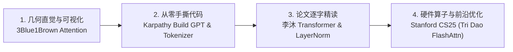

# 5.2 视频解析与时间戳指南

> **导读**：大模型领域的经典视频教程（如 Andrej Karpathy 的 *Zero to Hero*、李沐的论文精读、3Blue1Brown 几何直观讲解以及 Stanford 硬件优化课程）包含了大量代码实现细节与数学物理直觉。本文为这些优质视频整理了硬核笔记与**秒级精准时间戳 (Timestamp Anchors)**，方便开发者高效快速定位关键章节。

---

## 🗺️ 1. 顶级 AI 视频学习路线图



---

## 🎬 2. 视频硬核笔记与精准时间戳

### 📺 2.1 Andrej Karpathy: *Let's build GPT: from scratch, in code, spelled out*

> **视频核心**：从零搭建 Bigram 模型，逐步演化至全功能的 Mini-GPT 模型，手写 PyTorch 缩放点积注意力与 Transformer Decoder Block。

#### ⏱️ 精准时间戳与代码笔记

* **`[00:00]` 架构全局预览与准备工作**
  * 使用 TinyShakespeare 数据集，进行 Token 映射与数据切分。
* **`[15:30]` Bigram 模型建立与 Baseline 训练**
  * 引入 `nn.Embedding` 表，以当前 Token 预测下一个 Token 的概率分布。
* **`[22:30]` Self-Attention 矩阵与因果掩码 (Causal Mask)**
  * **硬核原理**：当前位置 $t$ 只能关注到比它早的位置 $\le t$。通过 `tril` 下三角掩码矩阵将未发生的未来 Token 注意力权重置为 $-\infty$。
  * **数学表达**：
    $$\text{MaskedAttention}(Q, K, V) = \text{Softmax}\left(\frac{QK^T}{\sqrt{d_k}} + M\right) V, \quad M_{ij} = \begin{cases} 0 & i \ge j \\ -\infty & i < j \end{cases}$$

```python
# [22:30] Karpathy 手写 Single Head Self-Attention
import torch
import torch.nn as nn
import torch.nn.functional as F

class Head(nn.Module):
    def __init__(self, head_size, n_embd, block_size):
        super().__init__()
        self.key = nn.Linear(n_embd, head_size, bias=False)
        self.query = nn.Linear(n_embd, head_size, bias=False)
        self.value = nn.Linear(n_embd, head_size, bias=False)
        self.register_buffer('tril', torch.tril(torch.ones(block_size, block_size)))

    def forward(self, x):
        B, T, C = x.shape
        k = self.key(x)   # (B, T, head_size)
        q = self.query(x) # (B, T, head_size)
        # 计算 Attention Scores ("affinities")
        wei = q @ k.transpose(-2, -1) * (C ** -0.5) # (B, T, T)
        wei = wei.masked_fill(self.tril[:T, :T] == 0, float('-inf'))
        wei = F.softmax(wei, dim=-1) # (B, T, T)
        v = self.value(x) # (B, T, head_size)
        out = wei @ v # (B, T, head_size)
        return out
```

* **`[42:15]` Softmax 缩放与 Residual 梯度流**
  * **缩放因子 $\sqrt{d_k}$ 的必要性**：当 $d_k$ 很大时，$Q K^T$ 的方差飙升至 $d_k$，会导致 Softmax 输出趋近于 One-hot 编码，梯度极小（梯度消失）。除以 $\sqrt{d_k}$ 使方差保持为 $1$。
  * **残差连接 (Residual Connection)**：主干通路作为“梯度高速公路”（Gradient Highway），保证数百层网络训练时不发生梯度消失。
* **`[56:45]` Multi-Head Attention 与 Feed-Forward Block 合流**
  * 多头并行捕获多维表意空间，FFN（$4 \times d_{model}$ 维度展开）完成特征非线性变换。

---

### 📺 2.2 Andrej Karpathy: *Let's build the GPT Tokenizer*

> **视频核心**：深度剖析 Byte-Pair Encoding (BPE) 词表构建过程、GPT-2/GPT-4 tiktoken 机制与 Special Tokens 安全防线。

#### ⏱️ 精准时间戳与代码笔记

* **`[05:20]` Unicode、UTF-8 字节编码与 Token 爆炸**
  * 为何不能直接使用 UTF-8 字节序列：序列长度过长（膨胀 3~4 倍），严重消耗 Context Window。
* **`[15:10]` Byte-Pair Encoding (BPE) 算法数学推导**
  * **统计合并策略**：连续扫描字节/字符序列，找出出现频次最高的相邻字节对 $(p_1, p_2)$，将其合并为一个全新的 Token ID。

```python
# [15:10] BPE 合并核心函数 (Karpathy 逻辑)
def get_stats(ids):
    counts = {}
    for pair in zip(ids, ids[1:]):
        counts[pair] = counts.get(pair, 0) + 1
    return counts

def merge(ids, pair, idx):
    newids = []
    i = 0
    while i < len(ids):
        if i < len(ids) - 1 and ids[i] == pair[0] and ids[i+1] == pair[1]:
            newids.append(idx)
            i += 2
        else:
            newids.append(ids[i])
            i += 1
    return newids
```

* **`[45:20]` Special Tokens (如 `<|endoftext|>`) 与正则切割安全机制**
  * GPT-4 使用 `tiktoken` 正则切分 `cl100k_base`，防止不同词性的符号（如数字与标点）被意外合并。

> [!WARNING]
> 未妥善处理 Special Token 解析可能会导致 Token 注入攻击（Prompt Injection）。在部署 API 时，务必显式设置 `allowed_special` 匹配规则。

---

### 📺 2.3 李沐《动手学深度学习》: *Transformer 论文逐字逐句精读*

> **视频核心**：针对经典论文 *Attention Is All You Need* 进行逐段剖析，厘清 Transformer 架构的设计原理。

#### ⏱️ 精准时间戳与代码笔记

* **`[12:00]` Positional Encoding (绝对位置编码) 深入数学理解**
  * **公式推导**：
    $$PE_{(pos, 2i)} = \sin\left(\frac{pos}{10000^{2i/d}}\right), \quad PE_{(pos, 2i+1)} = \cos\left(\frac{pos}{10000^{2i/d}}\right)$$
  * **李沐点评**：正弦/余弦设计使得 $PE_{pos+k}$ 可以表示为 $PE_{pos}$ 的线性变换，具备天生的相对位置外推潜能。
* **`[35:40]` LayerNorm vs BatchNorm 统计维度对比**
  * **BatchNorm**：跨 Batch 维度在单个 Feature 通道上计算均值与方差。受限于 Batch Size 和 Padding 干扰，对变长序列极不友好。
  * **LayerNorm**：在单个 Sample 维度的所有 Feature / Channel 上计算均值与方差，与 Sequence 长度无关，适合 NLP。

$$\text{LN}(x) = \frac{x - \mu_L}{\sqrt{\sigma_L^2 + \epsilon}} \odot \gamma + \beta, \quad \mu_L = \frac{1}{d} \sum_{i=1}^d x_i$$

---

### 📺 2.4 3Blue1Brown: *Visualizing Attention Mechanism*

> **视频核心**：以极其优美的 3D 几何视角呈现 Query, Key, Value 在高维向量空间中的变换过程。

#### ⏱️ 精准时间戳与代码笔记

* **`[04:15]` 词向量空间中的上下文概念融合**
  * 一个词（如 "bank"）的初始 Embedding 是静止的。Attention 的作用就是根据周围上下文（"river" 或 "money"），将其向量在语义空间中拉近对应的偏向。
* **`[09:30]` Q & K 投影：点积即“问答匹配度”**
  * $Q \cdot K^T$ 的本质：$Q$ 是 Token 发出的“寻找某种信息”的向量方向，$K$ 是 Token 声明的“自身所拥有的特征”向量方向。二者方向越接近（点积越大），注意力权重越高。

---

### 📺 2.5 Stanford CS25 / CS330: Tri Dao 主讲 *FlashAttention-1/2/3 原理*

> **视频核心**：发明者 Tri Dao 亲身讲解如何打破 GPU HBM（显存）瓶颈，通过 IO-Aware Tiling 与 SRAM 计算复用实现 2~4 倍 Attention 加速。

#### ⏱️ 精准时间戳与代码笔记

* **`[08:20]` GPU 存储层级架构 (HBM vs SRAM)**
  * HBM（高带宽显存，数十 GB，带宽 ~2TB/s）与 SRAM（片上高速缓存，几十 MB，带宽 ~19TB/s）。传统 Attention 的 Softmax 算子多次对 HBM 进行大矩阵读写，受限于 **Memory Bound**。
* **`[20:45]` FlashAttention-1: Tiling 与 Online Softmax 规约**
  * 将 $Q, K, V$ 拆分为小 Block 加载入 SRAM。在 SRAM 中分块更新 Softmax 统计量（最大值 $m$ 与累加和 $l$），实现 $O(N^2)$ 存储复杂度降至 $O(N)$。

$$\tilde{m}_{new} = \max(\tilde{m}_{old}, m_{block}), \quad l_{new} = e^{\tilde{m}_{old} - \tilde{m}_{new}} l_{old} + e^{m_{block} - \tilde{m}_{new}} l_{block}$$

* **`[41:10]` FlashAttention-2 & 3: Warp 级并行优化与 Hopper 架构 FP8 张量核心**
  * FA-2 优化了 Q 维度的并行调度，减少 Warp 间通信；FA-3 配合 H100 异步 TMA (Tensor Memory Accelerator) 与 FP8 低精度加速。

---

## 📌 Summary: 核心资源对比速查

| 教程名称 | 讲解侧重点 | 推荐学习优先级 | 核心收获 |
| :--- | :--- | :--- | :--- |
| **Karpathy Build GPT** | 代码手撕与梯度调试 | ⭐⭐⭐⭐⭐ (必看) | 深刻理解 Tokenizer、Masked Attention 与 Residual 权重 |
| **李沐 Transformer 精读** | 论文逐字研读与架构设计 | ⭐⭐⭐⭐⭐ | 掌握 Positional Encoding、LayerNorm 异同与模型工程细节 |
| **3Blue1Brown Attention** | 空间几何直观与语义拉近 | ⭐⭐⭐⭐ | 建立向量空间点积与 $Q/K/V$ 投影的几何图景 |
| **Stanford Tri Dao FA** | GPU 存储硬件与算子优化 | ⭐⭐⭐⭐⭐ | 理解 IO-Bound 优化、SRAM Tiling 与 Online Softmax 算法 |
