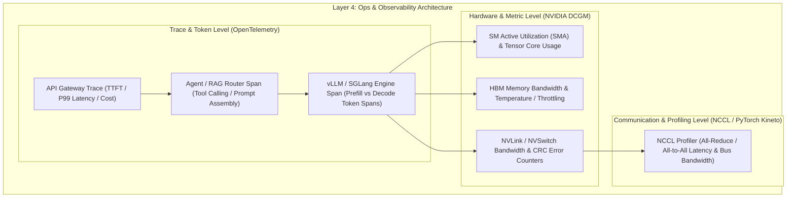

# 5.1 全链路可观测性与 Token 追踪 (OpenTelemetry, DCGM, NCCL Profiling)

> **📌 本章导读**
> 在生产环境中，大模型系统与 Agent 应用的故障排查极其困难。一个极高 TTFT（首字延迟）的异常，可能是物理机 RoCE 丢包导致的 NCCL 通信超时、GPU 降频温度过高、或者上层 SGLang/vLLM 引擎的 KV Cache 内存碎片暴涨。
> 
> 本文硬核搭建 **全栈 AI Infra 可观测性体系**：涵盖基于 **OpenTelemetry 的全链路 Token 分布式追踪**（Context Context Propagation），**NVIDIA DCGM（Data Center GPU Manager）硬件与 NVLink 监控**，以及 **NCCL 跨节点通信瓶颈 Profiling**，并手写 `OpenTelemetryTokenTracer`。

---

## 🌳 1. 全链路可观测性三层拓扑



---

## ⚙️ 2. 关键监控维度与指标规范

### 2.1 OpenTelemetry Token 链路追踪指标

| 指标名称 | 类型 | 单位 | 生产 SLA 阈值与含义 |
| :--- | :--- | :--- | :--- |
| `llm.ttft` | Histogram | ms | **Time-To-First-Token (首字延迟)**：Prefill 阶段总耗时 |
| `llm.tbt` / `itl` | Histogram | ms | **Inter-Token Latency (字间延迟)**：Decode 单 Token 耗时 |
| `llm.token_count` | Counter | Tokens | 包含 Prompt Tokens 与 Completion Tokens（用于计费） |
| `llm.cache_hit_ratio` | Gauge | % | RadixTree / Prefix Cache 命中率 (SGLang) |

### 2.2 NVIDIA DCGM 硬件与 NVLink 监控指标

| DCGM Field ID | 指标名称 | 含义与故障排查导向 |
| :--- | :--- | :--- |
| `DCGM_FI_DEV_GPU_UTIL` | GPU SM Utilization | SM 活跃利用率（低于 30% 说明 CPU/网络存瓶颈） |
| `DCGM_FI_DEV_MEM_COPY_UTIL` | Memory Controller Util | HBM 读写带宽百分比（Decode 阶段应接近 100%） |
| `DCGM_FI_DEV_THERMAL_VIOLATION` | Thermal Throttling | 是否因温度过高触发降频（Hardware Failure） |
| `DCGM_FI_DEV_NVLINK_CRC_FLIT_ERROR` | NVLink Flit CRC Error | NVLink 物理层重传错误数（非零预示 NVLink 硬件损坏） |

---

## 📐 3. NCCL 通信 Profiling 与总线带宽推导

在分布式 3D 并行中，NCCL 通信效率直接决定集群的 MFU。**有效总线带宽（Algorithm Bandwidth vs Bus Bandwidth）** 推导公式如下：

对于 `All-Reduce`（数据量 $M$ Bytes，卡数 $N$）：

$$\text{Algorithm Bandwidth } B_{\text{algo}} = \frac{M}{\text{Time}}$$

$$\text{Bus Bandwidth } B_{\text{bus}} = \frac{2(N-1)}{N} \times B_{\text{algo}}$$

通过 PyTorch Profiler / PyTorch Kineto 结合 NCCL Trace，当 $B_{\text{bus}}$ 显著低于理论物理上限（如 NVLink 4 理论上限 $900\text{ GB/s}$）时，即可精确定位跨机房网络拥塞或慢卡（Straggler）。

---

## 💻 4. Python 实战：手写 `OpenTelemetryTokenTracer`

以下 Python 代码基于分布式 Span 上下文传递模拟了完整的 Request $\rightarrow$ Router $\rightarrow$ Prefill $\rightarrow$ Decode 追踪器：

```python
import time
import uuid
import dataclasses
from typing import Dict, List, Optional

@dataclasses.dataclass
class TraceSpan:
    trace_id: str
    span_id: str
    parent_span_id: Optional[str]
    name: str
    start_time: float
    end_time: float = 0.0
    attributes: Dict[str, str] = dataclasses.field(default_factory=dict)

class OpenTelemetryTokenTracer:
    """
    轻量级 OpenTelemetry 大模型 Token 链路追踪器
    """
    def __init__(self):
        self.active_spans: Dict[str, TraceSpan] = {}
        self.completed_spans: List[TraceSpan] = []

    def start_span(self, trace_id: str, name: str, parent_span_id: Optional[str] = None) -> TraceSpan:
        span_id = f"span-{uuid.uuid4().hex[:8]}"
        span = TraceSpan(
            trace_id=trace_id,
            span_id=span_id,
            parent_span_id=parent_span_id,
            name=name,
            start_time=time.time()
        )
        self.active_spans[span_id] = span
        return span

    def end_span(self, span_id: str, attributes: Optional[Dict[str, str]] = None):
        if span_id not in self.active_spans:
            return
        span = self.active_spans.pop(span_id)
        span.end_time = time.time()
        if attributes:
            span.attributes.update(attributes)
        self.completed_spans.append(span)

    def print_trace_summary(self, trace_id: str):
        spans = [s for s in self.completed_spans if s.trace_id == trace_id]
        print(f"\n================ Distributed Trace Summary [{trace_id}] ================")
        for span in sorted(spans, key=lambda x: x.start_time):
            duration_ms = (span.end_time - span.start_time) * 1000
            parent_str = f" (Parent: {span.parent_span_id})" if span.parent_span_id else " [ROOT]"
            print(f"📍 Span: {span.name:<25} | Duration: {duration_ms:6.2f} ms | Attributes: {span.attributes}{parent_str}")

if __name__ == "__main__":
    tracer = OpenTelemetryTokenTracer()
    trace_id = f"trace-{uuid.uuid4().hex[:12]}"

    # 1. API Gateway Span
    root_span = tracer.start_span(trace_id, "api_gateway_request")

    # 2. Agent Router Span
    router_span = tracer.start_span(trace_id, "agent_router_process", parent_span_id=root_span.span_id)
    time.sleep(0.02)  # 20ms Router Overhead
    tracer.end_span(router_span.span_id, {"prompt.tokens": "512", "model": "deepseek-v3"})

    # 3. Engine Prefill Span (TTFT)
    prefill_span = tracer.start_span(trace_id, "vllm_prefill_phase", parent_span_id=root_span.span_id)
    time.sleep(0.08)  # 80ms TTFT
    tracer.end_span(prefill_span.span_id, {"ttft_ms": "80.0", "prefix_cache_hit": "true"})

    # 4. Engine Decode Span
    decode_span = tracer.start_span(trace_id, "vllm_decode_phase", parent_span_id=root_span.span_id)
    time.sleep(0.15)  # 150ms for 10 tokens
    tracer.end_span(decode_span.span_id, {"generated_tokens": "10", "avg_itl_ms": "15.0"})

    # 5. Complete Root Span
    tracer.end_span(root_span.span_id, {"status_code": "200"})

    tracer.print_trace_summary(trace_id)
```

---

## 🔥 5. 连环面试追问 (Level 1 ~ Level 6)

### Level 1: 概念阐释
> **问：在 OpenTelemetry 追踪中，TTFT（首字延迟）与 ITL（字间延迟）的观测采样点分别在哪里？**
>
> **答**：TTFT 采样点在从 API Gateway 接收请求到 Serving Engine 完成 Prefill 阶段并输出第 1 个 Token 的 Span 间隔；ITL（Inter-Token Latency）采样点在 Decode 阶段自回归生成循环中，连续两个 Token 被 Emit 输出的微观 Span 间隔。

---

### Level 2: 机制对比
> **问：为什么仅仅监控 GPU 的 SM Utilization（利用率）无法准确诊断 LLM Decode 阶段的性能瓶颈？**
>
> **答**：Decode 阶段是典型的 Memory-Bound。在 Decode 时，SM 利用率可能仅为 20%~40%，因为 CUDA Cores 大部分时间在等待 HBM 权重数据载入。此时真正决定性能的是 DCGM 的 `MEM_COPY_UTIL`（显存带宽利用率）。如果只看 SM 利用率，会误判系统算力充足。

---

### Level 3: 架构传导
> **问：DCGM 指报中的 NVLink CRC Error 数值增长，会如何一路传导影响上层的 Agent 推理服务？**
>
> **答**：NVLink CRC Error 非零说明物理层在频繁重传 Flit 数据包 $\rightarrow$ 导致张量并行（TP）中的 `All-Reduce` 通信延迟飙升 $\rightarrow$ 导致 vLLM / SGLang Engine 的 Decode ITL 抖动 $\rightarrow$ 最终导致 Layer 5 Agent 的 Function Calling 发生 HTTP Timeout 超时中断。

---

### Level 4: 瓶颈 Profiling
> **问：如何通过 NCCL Profiler 区分集群瓶颈究竟是“慢卡（Straggler）”还是“网络物理拥塞（RoCE PFC Pause Frame）”？**
>
> **答**：查看 `All-Reduce` 通信 Trace 耗时。若某一特定卡在计算完成后立即等待，而其他卡延迟响应，说明该卡对应的 GPU 或 CPU 存在计算慢卡；若所有卡的计算完成时间一致，但通信原语本身耗时呈阶梯状飙升并伴随 DCGM 网卡 PFC 帧计数增加，说明是跨节点 RoCE 交换机产生了网络拥塞。

---

### Level 5: 系统瓶颈
> **问：高并发场景下，OpenTelemetry 产生的大量 Trace 日志本身成为 CPU 瓶颈，如何设计采样策略（Sampling Strategy）？**
>
> **答**：使用 **Tail-based Sampling（基于尾部的采样）**。在 OTel Collector 端内存暂存 Trace 链，正常低延迟请求按 1% 概率稀疏采样；一旦检测到 `llm.ttft > 2000ms` 或包含 `status_code >= 500` 的异常链路，则 100% 强制全量持久化。

---

### Level 6: 极限设计
> **问：设计一个万卡集群毫秒级故障可观测与实时 Trace 定位平台，你会如何架构？**
>
> **答**：
> 1. **数据采集**：在每台 GPU 节点部署 eBPF + DCGM Exporter，以 100ms 粒度无损提取 GPU 与 NVLink 指标。
> 2. **Trace 关联**：将 OpenTelemetry `trace_id` 注入 NCCL 通信 Group ID，实现上层 Prompt 与底层 NVLink 数据包的硬核映射。
> 3. **实时分析**：基于 Flink / ClickHouse 构建流式分析引擎，毫秒级检测 Straggler 并向 Layer 3 调度器抛出节点隔离事件。

---

## 🔗 6. 扩展学习资源与论文/Repo

- **[OpenTelemetry Semantic Conventions for LLM](https://opentelemetry.io/docs/specs/semconv/gen-ai/)**：Official specification for AI LLM spans.
- **[NVIDIA DCGM Exporter Documentation](https://github.com/NVIDIA/dcgm-exporter)**：Prometheus metrics exporter for GPU clusters.
- **[PyTorch Kineto / Profiler Architecture](https://github.com/pytorch/kineto)**：Performance profiling engine for PyTorch.
