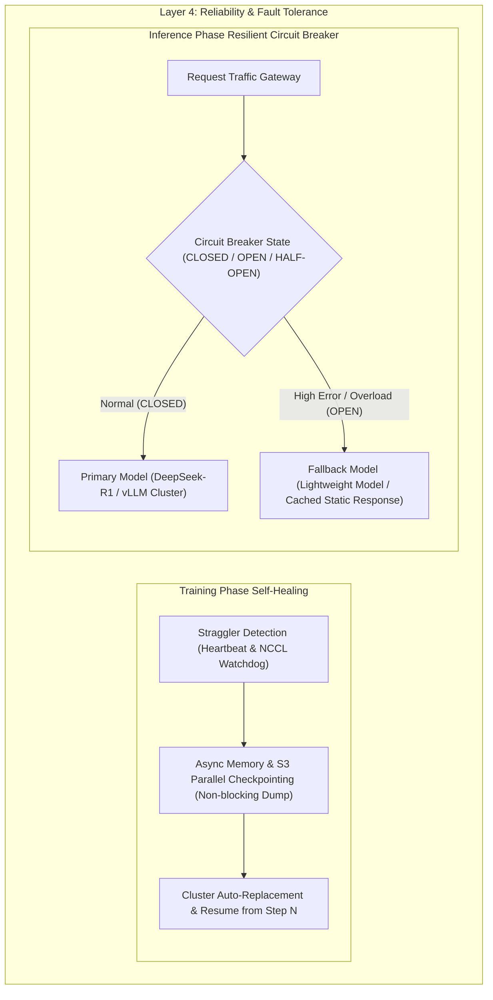

# 5.2 千卡故障自动恢复与推理熔断降级 (Fault Tolerance, Circuit Breaking, Fallback)

> **📌 本章导读**
> 在万卡大模型训练集群中，硬件故障是常态而非异常。根据统计，万卡集群平均每 4~8 小时就会发生一次 GPU 硬件宕机、ECC 显存错误或 NVLink 掉卡；而在高并发推理端，突发流量会导致推理引擎队列爆满，产生严重级联失效。
> 
> 本文深入拆解大模型 **全生命周期容错与高可用架构**：分为 **训练端千卡自愈**（Straggler 慢节点检测、NCCL 超时自动剔除、内存/S3 异步非阻塞 Checkpointing）与 **推理端弹性容错**（基于 Leaky Bucket/Token Bucket 的 Circuit Breaking 熔断器、带 Jitter 的指数退避重试、以及模型降级 Fallback 策略），并手写 `ResilientInferenceCircuitBreaker`。

---

## 🌳 1. 训练与推理双端故障容错全景图



---

## ⚙️ 2. 训练端千卡自愈与 Fast Checkpointing

### 2.1 Straggler（拖后腿节点）检测与 NCCL Watchdog

在 TP/PP/DP 混合并行中，任何一个卡如果变慢（如 PCIe 降频或散热不良导致算力下降 20%），整个集群的所有卡都会在 `All-Reduce` 阶段同步等待，导致整体 MFU 严重暴跌。
- **NCCL Watchdog**：配置 `NCCL_ASYNC_ERROR_HANDLING=1` 与 `NCCL_IB_TIMEOUT=22`，监控 NCCL Socket 心跳。
- **自动隔离**：当检测到 Worker 响应延迟超过均值 $3\sigma$ 时，控制器立即发送 SIGKILL 终止该 Rank，触发 Cluster Node Removal。

### 2.2 异步非阻塞 Checkpointing 架构对比

传统的同步 Checkpoint 写入共享文件系统会导致训练暂停（Downtime 达 10~30 分钟），严重降低集群有效利用率：

| Checkpoint 模式 | 导出原理 | 训练暂停时间 | 优点 | 缺点 |
| :--- | :--- | :--- | :--- | :--- |
| **同步 S3 Dump** | 挂起 CUDA 内核，写入 POSIX/S3 | 10min ~ 30min | 实现简单，绝对数据一致 | 致命的算力时间浪费 |
| **异步 Memory-to-Host** | 将 GPU 显存异步 Copy 到 CPU Host DRAM 后立即恢复训练 | 仅数秒 (Host Copy 耗时) | 训练几乎零停顿 | 占用大量 Host DRAM |
| **双层 Async S3 Dump** | GPU $\rightarrow$ Host DRAM $\rightarrow$ 后台线程 Stream 到 S3 | **< 1 秒** (CUDA Stream 零阻塞) | 工业级最佳实践 | 架构复杂度极高 |

---

## 📐 3. 推理端 Circuit Breaking 熔断器与 Fallback 数学原理

在推理端，为了防止级联雪崩（Cascading Failures），熔断器具备三个状态：`CLOSED`（正常 pass）、`OPEN`（熔断降级）、`HALF-OPEN`（试探恢复）。

状态转移触发条件基于**窗口错误率（Error Rate Threshold）**与**指数退避（Exponential Backoff with Jitter）**：

$$\text{Backoff\_Delay} = \min(\text{Max\_Delay}, \text{Base\_Delay} \times 2^{\text{attempt}}) + \text{Uniform}(0, \text{Jitter})$$

其中引入 **Jitter（随机抖动）** 的关键目的是打破多客户端同时重试导致的“惊群效应（Thundering Herd Problem）”。

---

## 💻 4. Python 实战：手写 `ResilientInferenceCircuitBreaker`

以下 Python 代码手写实现了一个生产级推理熔断器，支持状态机转换、指数退避重试与自动 Fallback 降级：

```python
import time
import random
import dataclasses
from typing import Callable, Any, Optional

class CircuitState:
    CLOSED = "CLOSED"      # 正常工作
    OPEN = "OPEN"          # 熔断开启（直接走 Fallback）
    HALF_OPEN = "HALF_OPEN"# 半开试探

class ResilientInferenceCircuitBreaker:
    """
    生产级推理服务熔断与降级保护器
    """
    def __init__(self, failure_threshold: int = 3, recovery_time_sec: float = 5.0):
        self.failure_threshold = failure_threshold
        self.recovery_time_sec = recovery_time_sec
        self.state = CircuitState.CLOSED
        self.failure_count = 0
        self.last_state_change = time.time()

    def execute(self, primary_fn: Callable[[], Any], fallback_fn: Callable[[], Any]) -> Any:
        now = time.time()

        # 1. 检查熔断器状态重置 (OPEN -> HALF_OPEN)
        if self.state == CircuitState.OPEN:
            if now - self.last_state_change >= self.recovery_time_sec:
                print("🔄 [Circuit Breaker] Entering HALF-OPEN state, testing primary service...")
                self.state = CircuitState.HALF_OPEN
                self.last_state_change = now
            else:
                print("⚠️ [Circuit Breaker OPEN] Routing traffic immediately to Fallback model.")
                return fallback_fn()

        # 2. 执行主服务调用
        try:
            result = primary_fn()
            # 若半开试探成功，重置为 CLOSED
            if self.state == CircuitState.HALF_OPEN:
                print("✅ [Circuit Breaker] Primary service recovered! Switching to CLOSED.")
                self.state = CircuitState.CLOSED
                self.failure_count = 0
            return result
        except Exception as e:
            self.failure_count += 1
            print(f"❌ [Primary Failure] Exception count: {self.failure_count}/{self.failure_threshold}. Error: {e}")
            
            if self.failure_count >= self.failure_threshold:
                print("💥 [Circuit Breaker TRIGGERED] Tripping circuit to OPEN state!")
                self.state = CircuitState.OPEN
                self.last_state_change = time.time()
            
            return fallback_fn()

def execute_with_exponential_backoff(fn: Callable[[], Any], max_retries: int = 3) -> Any:
    """
    带 Jitter 随机抖动的指数退避重试
    """
    base_delay = 0.1
    for attempt in range(max_retries):
        try:
            return fn()
        except Exception as e:
            if attempt == max_retries - 1:
                raise e
            jitter = random.uniform(0, 0.05)
            delay = (base_delay * (2 ** attempt)) + jitter
            print(f"⏳ Retry attempt {attempt + 1}/{max_retries} after {delay:.3f}s due to error: {e}")
            time.sleep(delay)

if __name__ == "__main__":
    cb = ResilientInferenceCircuitBreaker(failure_threshold=2, recovery_time_sec=2.0)

    # 模拟主推理模型 (DeepSeek-R1) 与降级模型 (Llama-3-8B)
    def primary_model():
        if random.random() > 0.3:  # 70% 概率挂掉
            raise RuntimeError("vLLM Worker CUDA Out-Of-Memory!")
        return "Response from DeepSeek-R1 (Primary)"

    def fallback_model():
        return "Response from Llama-3-8B (Fallback Degraded)"

    print("=== Testing Resilient Inference Circuit Breaker ===")
    for i in range(6):
        res = cb.execute(primary_model, fallback_model)
        print(f"Call {i+1} Result => {res}\n")
        time.sleep(0.8)
```

---

## 🔥 5. 连环面试追问 (Level 1 ~ Level 6)

### Level 1: 概念阐释
> **问：在 LLM 推理端，熔断器（Circuit Breaker）的 CLOSED、OPEN 与 HALF-OPEN 三种状态是如何转换的？**
>
> **答**：
> 1. `CLOSED`（闭合）：正常状态，所有请求送达主推理服务；若连续错误数达到阈值，触发转换为 `OPEN`。
> 2. `OPEN`（断开）：主服务彻底隔离，所有请求直接降级路由至 Fallback 模型；经过 Recovery Timeout 后转换为 `HALF-OPEN`。
> 3. `HALF-OPEN`（半开）：放行少量试探流量给主服务，若成功则重置为 `CLOSED`，若再次失败则重新切回 `OPEN`。

---

### Level 2: 机制对比
> **问：异步 Checkpoint（Memory-to-Host）与传统同步写 Checkpoint 在原理上有何不同？**
>
> **答**：传统同步 Checkpoint 会在写磁盘（S3/POSIX）期间彻底阻塞 GPU 算子；而异步 Checkpoint 通过在 GPU 显存内部先将权重/优化器状态做一次极速 `cudaMemcpyAsync` 复制到 Host DRAM（耗时仅几秒），然后立即解除 CUDA 阻塞恢复训练，最后由 CPU 后台异步线程将 Host DRAM 中的数据 Stream 写入 S3。

---

### Level 3: 架构传导
> **问：为什么重试机制必须加上 Jitter（随机抖动）？缺乏 Jitter 会导致系统发生什么连锁反应？**
>
> **答**：缺乏 Jitter 时，所有因为网络短时波动而失败的客户端会依照完全固定的时间间隔（如 $1\text{s}, 2\text{s}, 4\text{s}$）在同一时刻同时发起重试，从而形成“惊群效应（Thundering Herd）”，瞬间将刚恢复的推理 Gateway 或 SGLang Engine 再次冲垮。加上 Jitter 可以让重试流量在时间轴上均匀分散。

---

### Level 4: 容错与状态一致性
> **问：在 3D 并行训练中，如果 PP（流水线并行）的第 2 个 Stage 突然掉卡宕机，恢复时 Optimizer State 如何保证全局步数一致？**
>
> **答**：调度器拦截挂起后，根据全局统一的 `checkpoint_step`（如 Step 1000）重新加载所有 Rank 的 Checkpoint 文件；由于每个 Rank 导出的 Checkpoint 都保存了对应 Stage/TP 块的参数以及全局统一的 Step Index 和 RNG Random Seeds，恢复后全局各 Rank 仍然保持精确的步数与随机种子一致性。

---

### Level 5: 系统瓶颈
> **问：大模型异步 Checkpoint 方案中，如果 Host DRAM 内存不足以装下整个模型的权重与 Optimizer State，如何设计优化？**
>
> **答**：引入 **Zero-Copy Double Buffering** 或者是 **Rank-Wise Pipelined Sharded Dump**。在 Zero-3 下，优化器状态本身已经被切分到各个 DP 节点，利用这个特性，让各个 Rank 轮流（Staggered）向 Host 内存拷贝，避免所有 Rank 在同一时刻爆发争抢 Host DRAM。

---

### Level 6: 极限设计
> **问：请设计一个具备“秒级故障剔除 + 零数据丢失 Checkpoint + 自动 Fallback”的万卡级 AI 全栈高可用系统。**
>
> **答**：
> 1. **控制面检测**：部署基于 eBPF 的 10ms 物理网卡与 NCCL Watchdog，一旦检测到硬件掉卡，微秒级通知 Layer 3 调度器。
> 2. **异步存储**：训练算子内嵌双层 CPU DRAM + NVMe SSD 热备 Memory Checkpoint，将 Downtime 降至 1 秒内。
> 3. **推理容错**：网关层集成多级 Circuit Breaker 熔断与 Token-Bucket 流控，主集群异常时秒级优雅 Fallback 至端侧/小模型降级服务。

---

## 🔗 6. 扩展学习资源与论文/Repo

- **[PyTorch Distributed Checkpoint (DCP)](https://pytorch.org/docs/stable/distributed.checkpoint.html)**：Asynchronous sharded checkpointing.
- **[Netflix Hystrix Circuit Breaker Architecture](https://github.com/Netflix/Hystrix/wiki/How-it-Works)**：Classic resilience and fallback patterns.
- **[NCCL Async Error Handling Docs](https://docs.nvidia.com/deeplearning/nccl/user-guide/docs/usage/faulttolerance.html)**：NVIDIA NCCL fault tolerance configuration.
