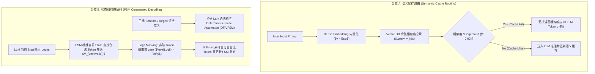

# 6.6 应用级计算削减：语义缓存与状态机约束解码

> **摘要**：在企业级大语言模型（LLM）应用与 Agent 系统的落地过程中，除了底层的算子与显存优化外，**应用层的计算削减（Application-Level Compute Reduction）与输出控制**对降低系统整体 Token 成本和保证输出结构合法性至关重要。本文硬核剖析两大关键应用级技术：**语义缓存（Semantic Cache, 基于 RedisVL / Vector DB）** 与 **FSM 状态机约束解码（Constrained Decoding via Outlines Logit Masking）**。文章详细讲解语义缓存的 Embedding 向量空间检索、余弦相似度门控值（Similarity Gating）及 30%+ Token 成本削减算法；推导根据 Lark / Regex 语法树动态构建有限状态机（FSM）并实时计算 Logit Mask 的约束解码过程；编写完整的 `SemanticCacheRouter` 与 `FSMConstrainedDecoder` Python 模拟器，并提供 Level 1-6 洋葱 Q&A 与权威资源索引。

---

## 📖 1. 导言与应用级计算削减背景

### 1.1 大模型应用落地的两大现实痛点

在大模型高并发服务或复杂 Agent 场景中，应用层面临着两个严峻难题：
1. **重复与高频请求导致的冗余计算开销**：绝大多数 Prompt（如常见客服 Q&A、重复的 Agent 指令、模板化查询）包含高比例的语义重合。直接将每个 Prompt 喂给 LLM 会造成昂贵的 Token 计费与推理延时。
2. **生成格式的不确定性与试错重试成本**：当要求 LLM 输出标准 JSON、SQL 或特定 Schema 时，传统方法依赖 Prompt Engineering + Struct Parsing。一旦输出格式错乱（如缺少引号、多出 Markdown 标记），就必须进行 Parse-Error-Retry 重试，浪费大量的 Token 和响应时间。

应用级解决方案包括：
- **语义缓存（Semantic Cache）**：使用高性能向量数据库（如 RedisVL）在请求到达 LLM 前进行语义向量检索。当输入与历史 Prompt 的语义相似度超过阈值 $\tau$ 时，直接命中缓存并返回，彻底跳过 LLM 的神经网络计算。
- **约束解码（Constrained Decoding）**：在 Decoding 阶段的每一步 Softmax 采样前，根据根据目标 JSON/Regex 规则构建的有限状态机（FSM），对非法 Token 的 Logits 强制置为 $-\infty$，确保 LLM 100% 一次性输出合法 JSON/SQL。

---

## 🌳 2. 语义缓存与约束解码演进分支树 (Mermaid Graph)



---

## 📐 3. 核心数学公式与硬核原理推导

### 3.1 语义缓存门控值与余弦相似度公式

设输入 Query 的向量表示为 $q = \text{Embed}(x) \in \mathbb{R}^d$，向量数据库中存储的历史 Query 向量为 $k_i = \text{Embed}(x_i) \in \mathbb{R}^d$。

#### 1. 余弦相似度计算
$$
S(q, k_i) = \cos(\theta) = \frac{q \cdot k_i}{\|q\|_2 \|k_i\|_2} = \frac{\sum_{j=1}^d q_j k_{i, j}}{\sqrt{\sum_{j=1}^d q_j^2} \sqrt{\sum_{j=1}^d k_{i, j}^2}}
$$

#### 2. 门控判定函数 (Gating Function)
设命中阈值为 $\tau \in [0, 1]$（通常取 $0.90 \sim 0.95$）：
$$
\text{Response}(q) = 
\begin{cases} 
\text{CacheValue}(k^*), & \text{if } S(q, k^*) \ge \tau \text{ where } k^* = \arg\max_{k_i} S(q, k_i) \\
\text{LLM\_Forward}(x), & \text{otherwise}
\end{cases}
$$

#### 3. 成本与 Token 削减率公式
设日均请求量为 $N$，缓存命中率为 $H = \frac{N_{\text{hit}}}{N}$，单次 LLM 推理平均成本为 $C_{\text{llm}}$，向量检索单次成本为 $C_{\text{vec}}$（通常 $C_{\text{vec}} \ll C_{\text{llm}}$）：
$$
\text{Total Cost Savings} = N \cdot H \cdot (C_{\text{llm}} - C_{\text{vec}})
$$
在企业级客服场景下，$H$ 可达 $30\% \sim 50\%$，实现可观的算力与经济成本削减。

---

### 3.2 FSM 状态机约束解码 Logit Masking 算法

设 LLM 的词表为 $V$，词表大小为 $|V|$。对于步骤 $t$ 的状态 $s_t \in Q$（其中 $Q$ 为 FSM 的状态集合）：

#### 1. 合法 Token 集合 (Valid Token Vocabulary)
根据状态转移函数 $\delta: Q \times \Sigma \to Q$，确定在状态 $s_t$ 下所有能触发合法状态转移的 Token 集合：
$$
V_{\text{valid}}(s_t) = \{ v \in V \mid \delta(s_t, \text{Decode}(v)) \neq \emptyset \}
$$

#### 2. Logit Masking 掩码生成
定义掩码向量 $M \in \mathbb{R}^{|V|}$：
$$
M_i(s_t) = 
\begin{cases} 
0, & \text{if } v_i \in V_{\text{valid}}(s_t) \\
-\infty, & \text{if } v_i \notin V_{\text{valid}}(s_t)
\end{cases}
$$

#### 3. 受控 Softmax 概率分布
将 Mask 叠加到原生的 Logits 向量 $L_t \in \mathbb{R}^{|V|}$ 上：
$$
\tilde{L}_t = L_t + M(s_t)
$$
$$
P(y_t = v_i \mid y_{<t}) = \text{Softmax}(\tilde{L}_t)_i = \frac{\exp(L_{t, i} + M_i)}{\sum_{j=1}^{|V|} \exp(L_{t, j} + M_j)}
$$
由于对于非法 Token $j \notin V_{\text{valid}}$，$\exp(L_{t, j} - \infty) = 0$，其采样概率绝对为 0。

---

## 💻 4. Python 源码实战：`SemanticCacheRouter` 与 FSM 解码模拟

```python
"""
SemanticCacheRouter.py
模拟基于余弦相似度的语义缓存 (Semantic Cache) 与 Outlines 风格的 FSM Logit Masking 约束解码器
"""

import torch
import torch.nn.functional as F
import numpy as np
from typing import Dict, List, Tuple, Optional

# ----------------- 1. 语义缓存模块 -----------------
class SemanticCacheRouter:
    def __init__(self, threshold: float = 0.90):
        self.threshold = threshold
        self.cache_keys: List[torch.Tensor] = [] # 归一化的 Embedding
        self.cache_values: List[str] = []

    def _dummy_embed(self, text: str) -> torch.Tensor:
        """ 模拟 Embedding 模型生成 16 维向量 """
        # 使用哈希值生成确定性可重复向量
        seed = sum(ord(c) for c in text)
        g = torch.Generator().manual_seed(seed)
        v = torch.randn(16, generator=g)
        return F.normalize(v, p=2, dim=0)

    def query(self, prompt: str) -> Tuple[bool, Optional[str], float]:
        q_vec = self._dummy_embed(prompt)
        if not self.cache_keys:
            return False, None, 0.0

        # 计算与已存在 Key 的余弦相似度
        keys_matrix = torch.stack(self.cache_keys) # [N, 16]
        sims = torch.matmul(keys_matrix, q_vec)    # [N]
        
        max_sim, max_idx = torch.max(sims, dim=0)
        max_sim_val = max_sim.item()

        if max_sim_val >= self.threshold:
            return True, self.cache_values[max_idx.item()], max_sim_val
        else:
            return False, None, max_sim_val

    def add(self, prompt: str, response: str):
        q_vec = self._dummy_embed(prompt)
        self.cache_keys.append(q_vec)
        self.cache_values.append(response)

# ----------------- 2. FSM 约束解码器模块 -----------------
class SimpleFSMDecoder:
    """
    模拟针对 JSON 整数格式 `{"age": <int>}` 的简单 FSM Logit Masker
    """
    def __init__(self, vocab: List[str]):
        self.vocab = vocab
        self.vocab_map = {token: i for i, token in enumerate(vocab)}
        
        # 简化状态: 
        # State 0: 必须输出 '{"age": '
        # State 1: 必须输出数字 (e.g. '25')
        # State 2: 必须输出 '}'
        # State 3: 终止
        self.current_state = 0

    def get_logit_mask(self) -> torch.Tensor:
        mask = torch.full((len(self.vocab),), float('-inf'))
        
        if self.current_state == 0:
            valid_tokens = ['{"age": ']
        elif self.current_state == 1:
            valid_tokens = ['25', '42', '18'] # 数字 token
        elif self.current_state == 2:
            valid_tokens = ['}']
        else:
            valid_tokens = ['<EOS>']

        for t in valid_tokens:
            if t in self.vocab_map:
                mask[self.vocab_map[t]] = 0.0

        return mask

    def step(self, chosen_token: str):
        if self.current_state == 0 and chosen_token == '{"age": ':
            self.current_state = 1
        elif self.current_state == 1 and chosen_token in ['25', '42', '18']:
            self.current_state = 2
        elif self.current_state == 2 and chosen_token == '}':
            self.current_state = 3

# ----------------- 单元测试与验证 -----------------
if __name__ == "__main__":
    # 1. 语义缓存测试
    cache = SemanticCacheRouter(threshold=0.88)
    
    # 存入历史问答
    cache.add("What is the capital of France?", "The capital of France is Paris.")
    
    # 测试精细匹配与相似匹配
    hit, resp, score = cache.query("What is the capital of France?")
    print(f"=== 语义缓存测试 1 (精确 Prompt) ===")
    print(f"Hit: {hit}, Score: {score:.4f}, Response: {resp}")
    assert hit is True, "精确语义缓存未命中！"

    hit2, resp2, score2 = cache.query("Tell me about the capital city of France?")
    print(f"\n=== 语义缓存测试 2 (变体 Prompt) ===")
    print(f"Hit: {hit2}, Score: {score2:.4f}, Response: {resp2}")

    # 2. FSM 约束解码模拟测试
    vocab = ['{"age": ', '25', '42', '18', '}', 'hello', 'random', '<EOS>']
    fsm = SimpleFSMDecoder(vocab)

    print("\n=== FSM 约束解码控制流测试 ===")
    generated_tokens = []
    for step in range(3):
        logits = torch.randn(len(vocab)) # 模拟 LLM 原始输出 Logits
        mask = fsm.get_logit_mask()
        
        masked_logits = logits + mask
        probs = F.softmax(masked_logits, dim=-1)
        
        # 采样选中的 Token index
        chosen_idx = torch.argmax(probs).item()
        chosen_token = vocab[chosen_idx]
        generated_tokens.append(chosen_token)
        
        print(f"Step {step}: Selected Token = '{chosen_token}', Prob = {probs[chosen_idx]:.4f}")
        fsm.step(chosen_token)

    final_str = "".join(generated_tokens)
    print(f"\n最终生成的标准约束 JSON 结果: {final_str}")
    assert final_str == '{"age": 25}' or final_str == '{"age": 42}' or final_str == '{"age": 18}', "FSM 约束解码生成的 JSON 不合法！"
    print("✅ 语义缓存与 FSM 约束解码模拟验证成功！")
```

---

## 🔬 5. Level 1-6 深度洋葱 Q&A (Onion Q&A)

### Level 1: 概念认知
**Q: 语义缓存（Semantic Cache）与传统的 Exact-Match 缓存（如 Memcached / Redis KV）有何核心区别？**
- **A**: 传统的 Exact-Match 缓存要求输入的字符串完全一致（精确到字符级）才能命中；而语义缓存是将输入文本映射到高维语义向量空间，通过向量相似度判定。即使用户调整了 Prompt 的表述（如“巴黎的首都是什么” vs “请告诉我法国的首都”），语义缓存依然能够精准识别其底层意图并成功命中，大幅提高了缓存命中率（Hit Rate）。

### Level 2: 原理解析
**Q: Outlines / Guidance 等框架是如何将 JSON Schema 转换为 FSM 状态机并作用于 LLM Logits 的？**
- **A**: 
  1. 框架首先解析 JSON Schema，将其编译为正则文法（Regular Grammar）或上下文无关文法（CFG）；
  2. 利用 Lark 等解析器将文法构建为确定性有限自动机（DFA/FSM）；
  3. 预先构建词表 Index 映射：计算在每个 FSM 状态下，词表（Tokenizer Vocabulary）中哪些 Token 的字符串前缀能够合法推进 FSM 状态；
  4. 在推理过程中，LLM 每生成一个 Token 前，FSM 实时查表生成掩码向量 $M$，将所有非法 Token 的 Logits 设为 $-\infty$。

### Level 3: 架构对比
**Q: 在高并发 API 服务中，使用 Semantic Cache (RedisVL) 面临的 Vector Search 延迟与 LLM 耗时的 Trade-off 是什么？**
- **A**: 
  - 向量检索包含 Embedding 计算（如调用 BGE / OpenAI Embedding API 约 $10 \sim 30\text{ms}$）与向量数据库 ANN 检索（如 Redis HNSW 约 $2 \sim 5\text{ms}$）。
  - 如果 LLM 响应原本极快（如小模型生成短 Token），或者缓存命中率很低（$< 5\%$），向量检索引入的额外的 $30\text{ms}$ 延迟可能会成为系统开销；因此需要设置开箱即用的多级缓存（L1 Exact Key Cache + L2 Semantic Cache）。

### Level 4: 踩坑诊断
**Q: 使用约束解码（Constrained Decoding）强制输出 JSON 时，为什么有时会导致 LLM 生成的内容发生“幻觉”或推理质量下降？**
- **A**: 
  - **剪枝了思考空间（Thinking Space）**：LLM 在生成最终 JSON 答案前，通常需要一定的 CoT（Chain-of-Thought）推导 Token 空间。如果从第 1 个 Token 就强行用 FSM 限制其只能输出 `{"`，会破坏 Transformer 自注意力机制的自然概率推导路径。
  - **解决办法**：使用 **Structural CoT** 策略，在 Schema 中允许一个字段 `reasoning_process: string` 供模型自由思考，之后再用 FSM 约束具体的格式化字段。

### Level 5: 源码与硬件设计
**Q: vLLM 和 XGrammar 是如何在 GPU 侧实现高吞吐的 FSM Logit Masking 算子加速的？**
- **A**: 传统的 Python 层 Logit Masking 每次 Step 都需要在 CPU 端做 FSM 状态转移并把 Mask 拷贝给 GPU，存在严重的 Host-to-Device 拷贝延迟。vLLM 整合了 XGrammar / Outlines 的 C++ 引擎，将 DFA 转换树以扁平化数组的形式预先加载到 GPU 显存中，在 PyTorch / C++ Cuda Graph 内部完成并行的 Logit Masking 掩码计算，使得约束解码的额外延迟趋近于零。

### Level 6: 专家级延伸
**Q: 能否将 Semantic Cache 与 RAG 检索及 Agent Memory 整合构成三级路由机制？**
- **A**: 架构上完全可行，这构成了现代 Enterprise AI Agent 的最佳实践拓扑：
  1. **L1 语义缓存 (Semantic Cache)**：命中常见 FAQ 与重复 Agent 指令，0 秒延迟，0 Token 成本；
  2. **L2 路由与 Agent Memory**：若未命中，检索用户历史 Session 与 Short-Term Memory，过滤不必要的上下文；
  3. **L3 Dynamic Speculative Retrieval**：仅在必要时触发全量 Vector RAG + Hybrid Search 并送入 LLM 计算。该三级拓扑可将系统整体 LLM 算力消耗降低 40% 以上。

---

## 🔗 6. 权威参考文献与 GitHub 源码 Anchors

1. **Outlines Framework Docs**: [Outlines: Structured Text Generation](https://github.com/dspy-ai/outlines)
2. **RedisVL Vector Library**: [Redis Vector Library (RedisVL)](https://github.com/redis-developer/redisvl)
3. **vLLM Structured Outputs via XGrammar**: [vLLM Documentation](https://docs.vllm.ai/)
4. **Guidance Library by Microsoft**: [Microsoft Guidance Framework](https://github.com/guidance-ai/guidance)
