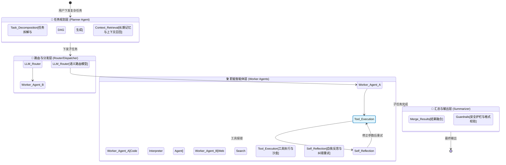

# 7.7 智能体系统设计题 (Agentic Workflow System Design)

> [!IMPORTANT]
> **考察核心 (Core Competency)**
> 相比于纯底层 Infra 岗，目前大量的 AI 应用工程师面试集中在 **Agent 架构设计** 上。面试官往往会要求你设计一个能够执行复杂长程任务（Long-horizon tasks）、具备记忆（Memory）、能够从工具错误中恢复（Self-Correction），并支持多 Agent 协作的生产级系统。

---

## 🌳 1. 多智能体系统架构与状态机流转 (Interactive Agent Topology)

以下是一个生产级 Multi-Agent 协作系统的核心状态机流转图。图中的关键组件可以点击跳转至前置的理论章节。

---

## 🔥 2. 高频面试真题与满分回答

### ❓ 真题 1：如何解决 Agent 在调用外部 API 工具时，因为参数格式错误或网络超时导致的任务中断？(Robustness)
**[面试官意图]** 考察候选人对 Agent Self-Correction (自我纠错) 机制以及系统重试策略的掌握。

**💡 满分回答：**
在生产环境中，大模型幻觉导致的参数错误或外部 API 异常是常态。我的设计方案包含三层防御：
1. **语法级约束 (Constrained Decoding)**：在底层推理引擎侧，使用 Outlines 或 JSON Schema 强制大模型的输出必须符合工具 API 所需的 JSON 格式，从根源消除 JSON 格式错误（*可引导面试官探讨 FSM 状态机解码*）。
2. **ReAct/Reflexion 纠错循环**：将 API 的报错信息（Error Message / Stack Trace）原样注入到下一次 LLM 的 Prompt 中，并配以 System Prompt `"The previous tool call failed with the following error... Please fix the parameters and try again."`，允许 LLM 最多进行 3 次自我修正。
3. **熔断与人工介入 (Human-in-the-loop)**：当重试超过 3 次依然失败时，触发状态机的 Fallback 机制，挂起该任务，将上下文抛给人工客服队列，人工介入提供正确参数后，Agent 从断点继续执行。

### ❓ 真题 2：如何设计一个能管理用户长达半年聊天历史，并且不会爆显存上下文的 Agent 记忆系统？(Long-term Memory)
**[面试官意图]** 考察对于 KV Cache 瓶颈的认知，以及长短期记忆 (MemGPT 理念) 结合 RAG 的架构设计。

**💡 满分回答：**
长上下文如果全部塞入 Prompt，不仅会遇到 LLM 的 Context Window 限制，还会导致每一次生成的 Prefill 延迟极高，且 KV Cache 显存爆炸。我会参考 OS 内存分页的思想 (如 MemGPT) 进行设计：
1. **Working Memory (短期工作记忆)**：只保留最近 5-10 轮的对话上下文，直接放入 Prompt。这部分通过 vLLM 的 RadixAttention 或 PagedAttention 在显存中常驻。
2. **Long-term Memory (长期记忆向量化)**：
   - 将半年前的对话切分为 Chunk，结合时间戳和主题 Metadata，存入 Vector DB (如 Milvus)。
   - 使用定时任务，或者通过大模型定期对历史对话生成 **Summary (摘要)**，将长文本浓缩。
3. **Recall 机制 (记忆召回)**：当用户提及“上次我们讨论的那个旅游计划”时，Agent 通过语义相似度搜索从 Vector DB 召回相关的 Chunk，将其作为 Context 动态挂载到当前的 Working Memory 中，从而实现无限记忆的错觉。

### ❓ 真题 3：如果需要协同 5 种不同职能的 Agent 完成一个复杂项目，你会选择哪种调度拓扑（网络/总线/层级）？
**[面试官意图]** 考察对 Multi-Agent 协作模式（Supervisor / Hierarchical / Swarm）的架构选型能力。

**💡 满分回答：**
我会选择 **Hierarchical (层级式 Supervisor 模式)** 或者基于 **StateGraph (如 LangGraph)** 的有向无环图调度：
1. 为什么不用网状 (Swarm/全连接)？因为不受控。5个 Agent 两两对话极易陷入死循环或话题发散。
2. **Supervisor 架构**：设计一个主干 LLM 作为 **Planner/Router**。它不负责具体执行，只负责两件事：(1) 把大目标拆成小任务；(2) 决定下一步调用哪个职能 Agent。
3. **状态机编排**：底层使用 DAG 或状态机（State Machine）框架。每个职能 Agent 只是状态图上的一个 Node。它们不直接交流，所有中间结果都写入一个公共的 `State/Context Object`。Supervisor 读取 State 来决定下一个执行的 Node。这样保证了极高的确定性、可调试性与容错能力。

