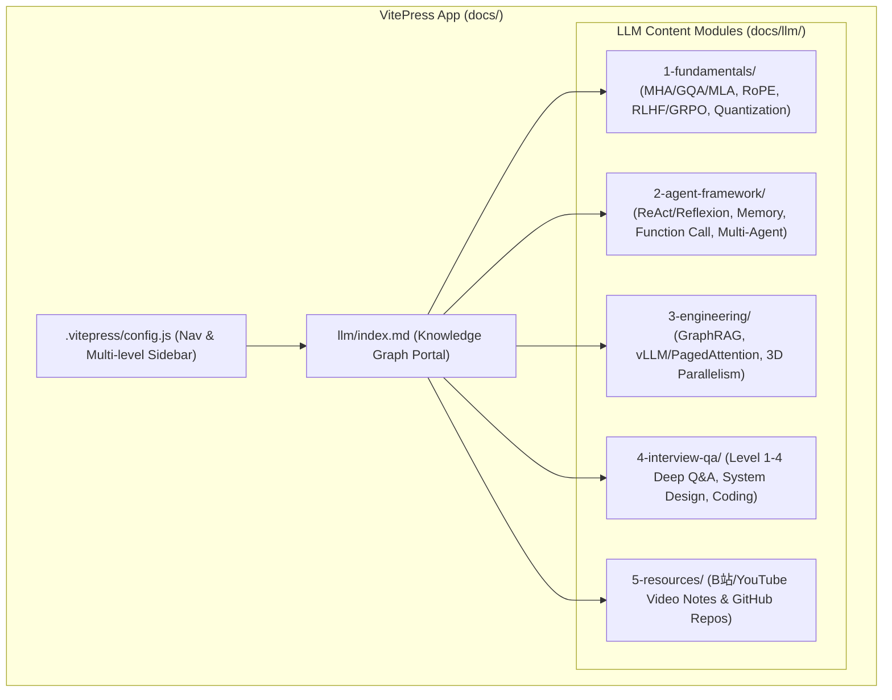

# LLM & Agent Knowledge Base Implementation Plan (Deep Version)

> **For agentic workers:** REQUIRED SUB-SKILL: Use superpowers:subagent-driven-development to implement this plan task-by-task. Steps use checkbox (`- [ ]`) syntax for tracking.

**Goal:** Integrate an expanded, multi-layer `LLM` tab into VitePress with comprehensive coverage of LLM principles (Transformer, RLHF/GRPO, Quantization), Agent Architectures (ReAct, Reflexion, Multi-Agent), Engineering (PagedAttention, 3D Parallelism, GraphRAG), Deep Q&A Interview Chains, and Resource Indexes (Bilibili/YouTube timestamps & GitHub code walk-throughs).

**Architecture Diagram:**

---

### Task 1: Create Directory Structure & Index Portal Page

**Files:**
- Create: `docs/llm/index.md`
- Create: `docs/llm/1-fundamentals/1.1-attention-deep-dive.md`
- Create: `docs/llm/1-fundamentals/1.4-rlhf-dpo-grpo.md`
- Create: `docs/llm/2-agent-framework/2.1-agent-architectures.md`
- Create: `docs/llm/3-engineering/3.2-llm-inference-vllm.md`
- Create: `docs/llm/4-interview-qa/4.1-theory-deep-qa.md`
- Create: `docs/llm/4-interview-qa/4.3-coding-handwritten.md`
- Create: `docs/llm/5-resources/5.1-awesome-github-repos.md`
- Create: `docs/llm/5-resources/5.2-video-lecture-notes.md`

- [ ] **Step 1: Write `docs/llm/index.md` with full knowledge tree mapping**
- [ ] **Step 2: Add initial deep markdown files following the Level 1-4 Spec**

---

### Task 2: Configure VitePress Nav and Multi-level Sidebar

**Files:**
- Modify: `docs/.vitepress/config.js`

- [ ] **Step 1: Register `/llm/` navigation and nested sidebar grouping in `config.js`**
- [ ] **Step 2: Run `npm run build` in `personal-website` to ensure no broken links**

---

### Task 3: Build Verification & Final Commit

- [ ] **Step 1: Run full static build check**
- [ ] **Step 2: Commit all newly added documentation and config changes**
