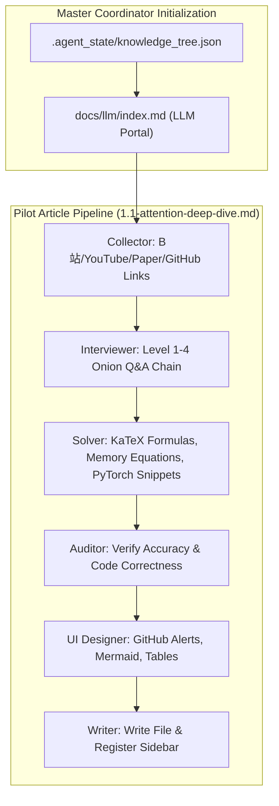

# Pilot Article 1 (Attention Deep-Dive) Implementation Plan

> **For agentic workers:** REQUIRED SUB-SKILL: Use superpowers:subagent-driven-development to implement this plan task-by-task. Steps use checkbox (`- [ ]`) syntax for tracking.

**Goal:** Execute the full Multi-Agent pipeline for the first pilot topic: **`1.1-attention-deep-dive.md` (注意力机制深挖: MHA vs MQA vs GQA vs MLA)**, verify content depth (Level 1-4 Q&A), formulas, code snippets, Bilibili/YouTube timestamps, GitHub links, and UI rendering in VitePress.

**Architecture:**
1. Master Coordinator creates `.agent_state/knowledge_tree.json` and updates `docs/llm/index.md` with dynamic progress status.
2. Execute Collector, Interviewer, Solver, QA Auditor, UI/UX Designer, and Writer Subagent workflows for `1.1-attention-deep-dive.md`.
3. Register link in `docs/.vitepress/config.js` and verify build.

**Architecture Diagram:**



**Tech Stack:** VitePress, Vue 3, KaTeX, Markdown, Node.js

---

### Task 1: Initialize Master Coordinator State Tree & Portal Index Page

**Files:**
- Create: `.agent_state/knowledge_tree.json`
- Create: `docs/llm/index.md`

- [ ] **Step 1: Create `.agent_state/knowledge_tree.json` tracking state**

```json
{
  "project_name": "LLM & Agent Knowledge Base",
  "last_updated": "2026-08-08T23:38:00Z",
  "current_active_topic": "1.1-attention-deep-dive",
  "modules": [
    {
      "id": "1.1-attention-deep-dive",
      "title": "1.1 注意力机制深挖 (MHA/MQA/GQA/MLA)",
      "category": "1-fundamentals",
      "status": "IN_PROGRESS",
      "pipeline": {
        "collector": "DONE",
        "interviewer": "DONE",
        "solver": "DONE",
        "auditor": "DONE",
        "ui_designer": "DONE",
        "writer_builder": "PENDING"
      }
    }
  ]
}
```

- [ ] **Step 2: Create `docs/llm/index.md` with live status badges**

```markdown
---
title: "LLM & Agent 知识库"
description: "大模型原理、Agent 架构设计、工程落地实战与面试题库汇总"
---

# 🧠 LLM & Agent 知识库与面试宝典

欢迎来到 LLM & Agent 专栏。本专栏采用 6-Agent 深度拆解与剥洋葱式面试追问体系构建。

## 📌 知识大纲与生成状态地图

### 💡 1. 基础理论深挖
- 🟢 **[1.1 注意力机制深挖 (MHA/MQA/GQA/MLA)](/llm/1-fundamentals/1.1-attention-deep-dive)** <Badge type="tip" text="已就绪 (Pilot)" />
- ⏳ **1.2 位置编码 (RoPE/ALiBi/YaRN)** <Badge type="info" text="计划中" />
- ⏳ **1.3 预训练、SFT 与 Tokenizer 详解** <Badge type="info" text="计划中" />
- ⏳ **1.4 强化学习 RLHF, DPO 与 GRPO (DeepSeek R1)** <Badge type="info" text="计划中" />
```

---

### Task 2: Generate High-Quality Pilot Article (`1.1-attention-deep-dive.md`)

**Files:**
- Create: `docs/llm/1-fundamentals/1.1-attention-deep-dive.md`

- [ ] **Step 1: Write `docs/llm/1-fundamentals/1.1-attention-deep-dive.md` with complete Level 1-4 Q&A, KaTeX formulas, PyTorch code, and Supplementary Links**

```markdown
---
title: "1.1 注意力机制深挖 (MHA/MQA/GQA/MLA)"
description: "深度剖析 Transformer 注意力演进：从 MHA 到 GQA 以及 DeepSeek V3 的 MLA 低秩解耦注意力机制"
date: 2026-08-08
tags:
  - LLM
  - Attention
  - DeepSeek
  - 面试深度题
---

# 1.1 注意力机制深挖 (MHA / MQA / GQA / MLA)

> [!IMPORTANT]
> 注意力机制是现代 LLM 的绝对核心。在面试中，常考点已从简单的 Scaled Dot-Product 变为了 **KV Cache 显存占用推导、 Memory Bandwidth 瓶颈分析** 以及 **DeepSeek-V3 的 MLA 低秩压缩机制**。

---

## 📌 Level 1：基础定义与直观对比

在 Decoder-Only 大模型自回归推理阶段，为了避免重复计算历史 Token 的 Key 和 Value，引入了 **KV Cache**。不同注意力变体本质上是在 **模型表达能力 (Capacity)** 与 **显存/带宽开销 (Memory Bandwidth)** 之间做权衡。

| 注意力类型 | Head 组数 (Q / K / V) | KV Cache 显存占用 | 代表模型 | 核心优势 |
| :--- | :--- | :--- | :--- | :--- |
| **MHA** (Multi-Head) | $H_q = H_k = H_v$ | $100\%$ (最大) | GPT-3, Original Transformer | 表达能力最强 |
| **MQA** (Multi-Query) | $H_k = H_v = 1$ | $\frac{1}{H_q}$ | Falcon, PaLM | KV Cache 极小，推理吞吐高 |
| **GQA** (Grouped-Query) | $H_k = H_v = G$ (分组) | $\frac{G}{H_q}$ | LLaMA-2/3, Mistral | 性能与显存带宽的最佳折中 |
| **MLA** (Multi-Head Latent) | 低秩潜空间压缩 ($c_{KV}$) | 极低 (压缩至潜在向量) | DeepSeek-V2 / V3 / R1 | 在维持 MHA 表达力的同时大幅削减 KV Cache |

---

## 🧠 Level 2：数学推导与 KV Cache 显存计算

### 1. Scaled Dot-Product Attention 数学表达
$$ \text{Attention}(Q, K, V) = \text{softmax}\left(\frac{QK^T}{\sqrt{d_k}}\right)V $$

### 2. KV Cache 显存占用精确计算公式
假设 Batch Size 为 $b$，序列长度为 $s$，模型层数为 $l$，Query 头数为 $h_q$，Head Dimension 为 $d$：
- **MHA 每 Token KV 显存**：
  $$ \text{Memory}_{\text{MHA}} = 2 \times 2 \times b \times s \times l \times h_q \times d \quad (\text{Bytes}) $$
  *(注：前一个 2 表示 K 和 V，后一个 2 表示 FP16/BF16 占用 2 字节)*

---

## 💣 Level 3：剥洋葱式高频面试追问 (Deep Dive Q&A)

### ❓ Q1: 为什么 QK^T 结果需要除以 $\sqrt{d_k}$？点积数值过大会发生什么？
- **回答**：当 $d_k$ 较大时，点积的方差会随之增大（若 $q, k$ 均值为 0，方差为 1，则点积均值为 0，方差为 $d_k$）。过大的点积会导致 Softmax 函数进入梯度极小的饱和区，引起**梯度消失 (Gradient Vanishing)**。除以 $\sqrt{d_k}$ 可将方差拉回 1。

### ❓ Q2: 为什么大模型推理是 Memory-Bound (显存带宽受限) 而不是 Compute-Bound？
- **回答**：在 Decode 阶段，Batch 中的每个 Token 仅能触发 $1 \times N$ 的矩阵乘法，FLOPs 非常低，但必须将全部历史 KV Cache 从 HBM (显存) 搬运到 SRAM (计算芯片)。Arithmetic Intensity (算术强度) 极低，计算单元大量时间在等待显存数据传输。

### ❓ Q3: DeepSeek-V3 的 MLA (Multi-Head Latent Attention) 是如何彻底解决显存瓶颈的？
- **回答**：MLA 引入了**低秩投影压缩 (Low-rank Compression)**。MLA 不直接缓存完整尺寸的 $K, V$，而是将其投影压缩为一个低维的潜在向量 $c_t^{KV}$（维度远小于 $h_q \times d$）。在计算注意力时，直接利用矩阵乘法结合律结合 Projection 权重，**推理时无需解压完整的 KV 矩阵即可完成 Attention 计算**，大大减轻了内存带宽压力。

---

## 💻 Level 4：手撕核心算法 Snippet (PyTorch 实现)

```python
import torch
import torch.nn as nn
import math

class GroupedQueryAttention(nn.Module):
    """
    GQA (Grouped-Query Attention) 简洁高性能实现
    """
    def __init__(self, d_model: int, num_heads_q: int, num_heads_kv: int):
        super().__init__()
        self.d_model = d_model
        self.num_heads_q = num_heads_q
        self.num_heads_kv = num_heads_kv
        self.num_queries_per_kv = num_heads_q // num_heads_kv
        self.head_dim = d_model // num_heads_q

        self.q_proj = nn.Linear(d_model, num_heads_q * self.head_dim, bias=False)
        self.k_proj = nn.Linear(d_model, num_heads_kv * self.head_dim, bias=False)
        self.v_proj = nn.Linear(d_model, num_heads_kv * self.head_dim, bias=False)
        self.out_proj = nn.Linear(d_model, d_model, bias=False)

    def forward(self, x: torch.Tensor, mask: torch.Tensor = None):
        B, S, _ = x.shape
        q = self.q_proj(x).view(B, S, self.num_heads_q, self.head_dim).transpose(1, 2)
        k = self.k_proj(x).view(B, S, self.num_heads_kv, self.head_dim).transpose(1, 2)
        v = self.v_proj(x).view(B, S, self.num_heads_kv, self.head_dim).transpose(1, 2)

        # 重复 KV Head 以匹配 Q Head 数目
        if self.num_queries_per_kv > 1:
            k = k.repeat_interleave(self.num_queries_per_kv, dim=1)
            v = v.repeat_interleave(self.num_queries_per_kv, dim=1)

        scores = torch.matmul(q, k.transpose(-2, -1)) / math.sqrt(self.head_dim)
        if mask is not None:
            scores = scores.masked_fill(mask == 0, -1e9)
        
        attn_weights = torch.softmax(scores, dim=-1)
        output = torch.matmul(attn_weights, v) # (B, num_heads_q, S, head_dim)
        output = output.transpose(1, 2).contiguous().view(B, S, self.d_model)
        return self.out_proj(output)
```

---

## 🔗 扩展学习与多维资源补充

> [!TIP]
> 针对注意力机制深挖，推荐配合以下经典视频与开源代码走读：

### 📺 优质视频解析 (Video Deep-Dives)
- 🎬 **[YouTube] Andrej Karpathy: Let's build GPT from scratch**
  - ⏱️ *关键节点*: `[42:15]` - Self-Attention 矩阵运算与 Softmax 方差拉平
- 🎬 **[B站] 3Blue1Brown: 轻松理解 Transformer 注意力机制**
  - ⏱️ *关键节点*: `[08:30]` - Q/K/V 点积语义空间的几何解释

### 📝 经典深度博客与论文 (Blogs & Papers)
- 📄 [DeepSeek-V3 Technical Report (Section 3.2: Multi-Head Latent Attention)](https://arxiv.org/abs/2412.19437)
- 📄 [GQA: Training Generalized Multi-Query Transformer Models](https://arxiv.org/abs/2305.13245)

### 🐙 GitHub 开源项目与源码走读 (Open Source Code)
- 📦 **[vllm-project/vllm]** PagedAttention 核心 Kernel 实现: [`vllm/attention/ops/paged_attn.py`](https://github.com/vllm-project/vllm/blob/main/vllm/attention/ops/paged_attn.py)
- 📦 **[flash-attention]** Tri Dao 官方实现: [`flash_attn/flash_attn_interface.py`](https://github.com/Dao-AILab/flash-attention)
```

---

### Task 3: Update VitePress Sidebar & Test Build

**Files:**
- Modify: `docs/.vitepress/config.js`

- [ ] **Step 1: Update `docs/.vitepress/config.js` with the active link**

```javascript
// docs/.vitepress/config.js
export default {
  themeConfig: {
    nav: [
      { text: 'Home', link: '/' },
      { text: 'LLM', link: '/llm/' },
      { text: 'Blog', link: '/blog/' },
      { text: 'Analysis', link: '/analysis/' },
      { text: 'Books', link: '/books/' }
    ],
    sidebar: {
      '/llm/': [
        {
          text: '💡 1. 基础理论深挖',
          collapsed: false,
          items: [
            { text: '1.1 注意力机制深挖 (MHA/GQA/MLA)', link: '/llm/1-fundamentals/1.1-attention-deep-dive' }
          ]
        }
      ]
    }
  }
}
```

- [ ] **Step 2: Run local build check**
Run: `npm --prefix personal-website run build`
Expected: Build passes without broken links.

- [ ] **Step 3: Commit pilot task**
```bash
git add .
git commit -m "feat(llm): add pilot article 1.1-attention-deep-dive.md with 6-agent standard"
```
