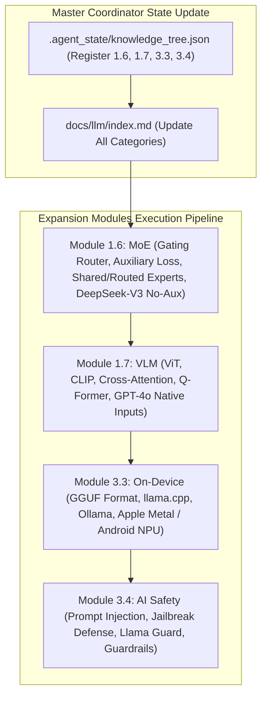

# Expansion Modules Implementation Plan: MoE, VLM, On-device Deployment & AI Safety

> **For agentic workers:** REQUIRED SUB-SKILL: Use superpowers:subagent-driven-development to implement this plan task-by-task. Steps use checkbox (`- [ ]`) syntax for tracking.

**Goal:** Execute the full 6-Agent Multi-Agent pipeline for the 4 expansion topics: **`1.6-moe-architecture.md` (MoE 稀疏混合专家架构)**, **`1.7-multimodal-vlm.md` (多模态大模型 VLM 架构)**, **`3.3-on-device-deployment.md` (端侧部署与 GGUF/llama.cpp)**, and **`3.4-ai-safety-guardrails.md` (AI 系统安全与 Guardrails 护栏)** to achieve 100% full coverage of top AI interview trends.

**Architecture Diagram:**

**Tech Stack:** VitePress, Vue 3, KaTeX, Markdown, Node.js

---

### Task 1: Module 1.6 - MoE 混合专家架构深挖 (`1.6-moe-architecture.md`)

**Files:**
- Create: `docs/llm/1-fundamentals/1.6-moe-architecture.md`

- [ ] **Step 1: Write `1.6-moe-architecture.md` with complete Level 1-6 Onion Q&A, Gating Loss math, PyTorch Top-2 Router code, and video/repo anchors**

---

### Task 2: Module 1.7 - 多模态大模型 VLM 架构详解 (`1.7-multimodal-vlm.md`)

**Files:**
- Create: `docs/llm/1-fundamentals/1.7-multimodal-vlm.md`

- [ ] **Step 1: Write `1.7-multimodal-vlm.md` with ViT Patchifying, CLIP Contrastive Loss, Q-Former Cross-Attention, PyTorch Vision Projection code, and video/repo anchors**

---

### Task 3: Module 3.3 - 端侧部署与 GGUF/llama.cpp 极致加速 (`3.3-on-device-deployment.md`)

**Files:**
- Create: `docs/llm/3-engineering/3.3-on-device-deployment.md`

- [ ] **Step 1: Write `3.3-on-device-deployment.md` with GGUF binary format, llama.cpp mmap, Metal/NPU unified memory, C++ GGUF parser/Python wrapper, and repo anchors**

---

### Task 4: Module 3.4 - AI 系统安全与 Guardrails 护栏架构 (`3.4-ai-safety-guardrails.md`)

**Files:**
- Create: `docs/llm/3-engineering/3.4-ai-safety-guardrails.md`

- [ ] **Step 1: Write `3.4-ai-safety-guardrails.md` with Prompt Injection/Jailbreak tactics, Llama Guard classifier, Dual Guardrail Pipeline, PyTorch Guardrail Filter code, and repo anchors**

---

### Task 5: VitePress Configuration & Build Verification

**Files:**
- Modify: `.agent_state/knowledge_tree.json`
- Modify: `docs/llm/index.md`
- Modify: `docs/.vitepress/config.js`

- [ ] **Step 1: Update `.agent_state/knowledge_tree.json` and `docs/llm/index.md` with all new badges**
- [ ] **Step 2: Update `docs/.vitepress/config.js` sidebar to include 1.6, 1.7, 3.3, 3.4**
- [ ] **Step 3: Run `npm run build` in `/Users/soul/AiPro/personal-website` to verify clean build with 0 broken links**
- [ ] **Step 4: Commit changes to Git**
