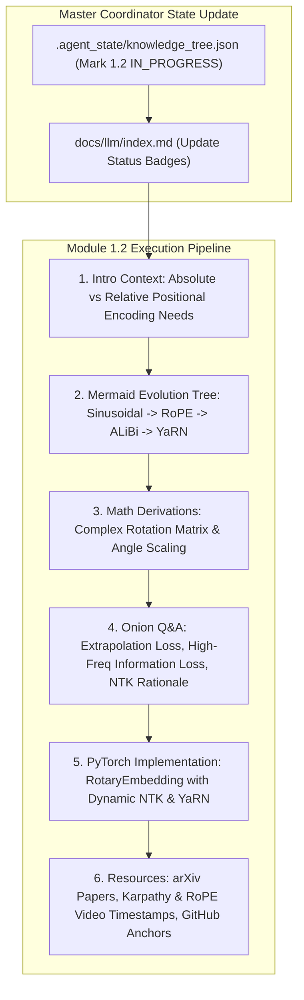

# Module 1.2 Implementation Plan: Positional Encoding & Long-Context Extrapolation

> **For agentic workers:** REQUIRED SUB-SKILL: Use superpowers:subagent-driven-development to implement this plan task-by-task. Steps use checkbox (`- [ ]`) syntax for tracking.

**Goal:** Execute the full 6-Agent Multi-Agent pipeline for topic **`1.2-positional-encoding.md` (位置编码深挖: Sinusoidal -> RoPE -> ALiBi -> YaRN / Dynamic NTK)**, following the ultimate article spec (Introduction context, Mermaid evolution tree, Knowledge Graph links, Roofline & Math derivations, Onion Q&A, PyTorch code, and Supplementary Links).

**Architecture Diagram:**

**Tech Stack:** VitePress, Vue 3, KaTeX, Markdown, Node.js

---

### Task 1: Update Master Coordinator State & Portal Index Page

**Files:**
- Modify: `.agent_state/knowledge_tree.json`
- Modify: `docs/llm/index.md`

- [ ] **Step 1: Update `.agent_state/knowledge_tree.json`**
Mark `1.1-attention-deep-dive` as `COMPLETED`, and `1.2-positional-encoding` as `IN_PROGRESS`.

- [ ] **Step 2: Update `docs/llm/index.md` status badge**
Update `1.2-positional-encoding` badge to `<Badge type="tip" text="已就绪" />`.

---

### Task 2: Create Deep Article `docs/llm/1-fundamentals/1.2-positional-encoding.md`

**Files:**
- Create: `docs/llm/1-fundamentals/1.2-positional-encoding.md`

- [ ] **Step 1: Write `docs/llm/1-fundamentals/1.2-positional-encoding.md`**

Must include:
- **📖 1. 导言与背景**：为什么绝对位置编码（Sinusoidal / Learned Absolute PE）在自回归外推中会失效？为什么需要相对位置编码与复数旋转？
- **🌳 2. 位置编码技术演进分支树 (Mermaid Graph)**：
  - 分支 A：绝对位置编码 (Sinusoidal, Learnable PE)
  - 分支 B：相对位置编码 (T5 Relative, Attention Bias / ALiBi)
  - 分支 C：旋转位置编码 (RoPE) 及长文本外推扩展 (Linear Scaling, Dynamic NTK-aware, YaRN)
- **🕸️ 3. 知识网格与图谱依赖**：
  - 入度：矩阵旋转、复数欧拉公式 $e^{i\theta}$、Attention 机制。
  - 出度：DeepSeek MLA 解耦 RoPE 键 ($k_t^R$)、128k/1M 超长文本推理、Needle in a Haystack 评估。
- **🧮 4. 数学推导与硬核机制**：
  - 旋转二维向量公式：$R_{\Theta, m}^d x = x \cdot \cos(m\theta) + \tilde{x} \cdot \sin(m\theta)$。
  - 点积保相对位置性推导：$\langle R_m q, R_n k \rangle = g(q, k, m-n)$。
  - YaRN 方案中 High-frequency 维持、Low-frequency 缩放的注意力分配机制。
- **🔥 5. 连环面试追问 (Level 1~6 Onion Chain)**：
  - *L1*: 为什么 RoPE 不需要显式加在 Input Embedding 上，而是乘在 Q 和 K 上？
  - *L2*: 为什么简单的 Linear Scaling 上下文外推在超出训练窗口后困惑度 (PPL) 会暴涨？
  - *L3*: Dynamic NTK-aware Scaling 改变基数 $\theta$ ($\text{base}=10000 \to 500000$) 的数学原理是什么？
  - *L4*: ALiBi 线性偏置算法在没有位置 Embedding 的情况下，为什么具备极强的长文本外推能力？
  - *L5*: DeepSeek-V3 为何要在 MLA 低秩潜向量之外额外拆出一组 64 维的 $k_t^R$ 单独施加 RoPE？
- **💻 6. PyTorch 算法实战**：完整高效率的 `RotaryEmbedding` (包含 Dynamic NTK Scaling 机制) 实现。
- **🔗 7. 扩展学习与多维资源**：
  - 🎬 **YouTube / B站**：Andrej Karpathy RoPE 代码推导 Timestamp、Jianlin Su (苏剑林) 博客解析。
  - 📄 **经典论文**：RoFormers (Su et al., 2021)、ALiBi (Press et al., 2022)、YaRN (Peng et al., 2023)。
  - 📦 **GitHub 源码**：HuggingFace `modeling_llama.py` 中 `LlamaRotaryEmbedding` 源码锚点。

---

### Task 3: Update VitePress Sidebar & Test Build

**Files:**
- Modify: `docs/.vitepress/config.js`

- [ ] **Step 1: Register `1.2-positional-encoding` in `docs/.vitepress/config.js` sidebar**
- [ ] **Step 2: Run `npm run build` in `/Users/soul/AiPro/personal-website` to ensure no broken links**
- [ ] **Step 3: Commit changes to Git**
