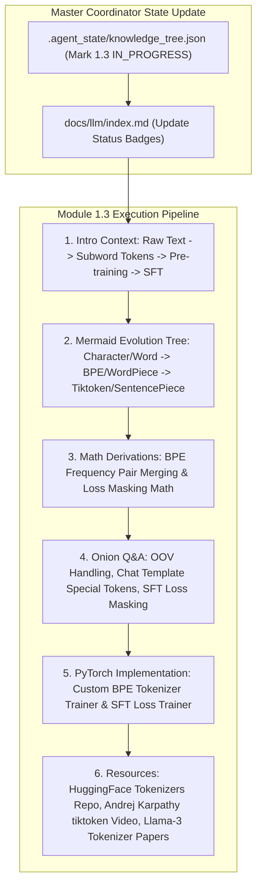

# Module 1.3 Implementation Plan: Pre-training, SFT & Tokenizer Deep-Dive

> **For agentic workers:** REQUIRED SUB-SKILL: Use superpowers:subagent-driven-development to implement this plan task-by-task. Steps use checkbox (`- [ ]`) syntax for tracking.

**Goal:** Execute the full 6-Agent Multi-Agent pipeline for topic **`1.3-pretraining-sft.md` (预训练、SFT 与 Tokenizer 详解)**, following our standard article specification (Introductory background, Mermaid evolution tree, Knowledge Graph links, Roofline & Math derivations, Onion Q&A, PyTorch code, and Supplementary Links).

**Architecture Diagram:**

**Tech Stack:** VitePress, Vue 3, KaTeX, Markdown, Node.js

---

### Task 1: Update Master Coordinator State & Portal Index Page

**Files:**
- Modify: `.agent_state/knowledge_tree.json`
- Modify: `docs/llm/index.md`

- [ ] **Step 1: Update `.agent_state/knowledge_tree.json`**
Mark `1.2-positional-encoding` as `COMPLETED`, and `1.3-pretraining-sft` as `IN_PROGRESS`.

- [ ] **Step 2: Update `docs/llm/index.md` status badge**
Update `1.3 预训练、SFT 与 Tokenizer 详解` badge to `<Badge type="tip" text="已就绪" />`.

---

### Task 2: Create Deep Article `docs/llm/1-fundamentals/1.3-pretraining-sft.md`

**Files:**
- Create: `docs/llm/1-fundamentals/1.3-pretraining-sft.md`

- [ ] **Step 1: Write `docs/llm/1-fundamentals/1.3-pretraining-sft.md`**

Must include:
- **📖 1. 导言与背景**：大模型是如何学会人类语言的？从最初的词袋模型/One-Hot，到 Word2Vec，再到大模型时代的 Tokenizer 预处理、大规模无监督预训练（Causal Language Modeling, CLM）与有监督微调（SFT）。
- **🌳 2. 分词与微调技术演进分支树 (Mermaid Graph)**：
  - 分支 A：分词算法演进 (Character/Word-level $\rightarrow$ Byte-Pair Encoding BPE $\rightarrow$ WordPiece $\rightarrow$ Unigram / SentencePiece $\rightarrow$ Tiktoken / Byte-fallback BPE).
  - 分支 B：模型训练阶段演进 (Unsupervised Pre-training $\rightarrow$ Instruction SFT $\rightarrow$ Full Parameter vs PEFT / LoRA).
- **🕸️ 3. 知识网格与图谱依赖**：
  - 入度：文本清洗、正则切分、字符编码 (UTF-8/Bytes)、Cross-Entropy Loss。
  - 出度：RLHF/DPO 人类偏好对齐、Agent 结构化输出 (JSON/Tool-Call special tokens)、上下文长度控制。
- **🧮 4. 数学推导与硬核机制**：
  - BPE 词表合并（Frequency Pair Merging）过程推导。
  - SFT 阶段**仅对 Response 部分计算损失（Prompt Loss Masking）**的 Masked Cross-Entropy 数学公式：
    $$ \mathcal{L}_{\text{SFT}}(\theta) = -\sum_{t \in \text{Response}} \log P_\theta(y_t \mid y_{<t}, X) $$
- **🔥 5. 连环面试追问 (Level 1~6 Onion Chain)**：
  - *L1*: 为什么大模型不直接用字符（Character）或单词（Word）作为输入，而要用 Subword (BPE)？
  - *L2*: 为什么中英文混合训练时，中文往往比英文消耗更多 Token？（Byte 编码碎片化问题与词表压缩率对比）。
  - *L3*: 在 SFT 训练时，如果不加 Prompt Loss Masking 会产生什么后果？（模型倾向于背诵 User 问题而非学习回答结构）。
  - *L4*: Chat Template（如 `<|im_start|>user...<|im_end|><|im_start|>assistant...`）Special Tokens 的底层作用机制是什么？
  - *L5*: LLaMA 3 为什么将词表从 LLaMA 2 的 32k 扩大到 128k？对吞吐量、显存和嵌入层参数（Embedding Matrix）产生了什么影响？
- **💻 6. PyTorch & Python 算法实战**：
  - 纯 Python 手写 BPE 分词训练与 Encode/Decode 核心逻辑。
  - 带 Prompt Loss Masking 的 PyTorch SFT Data Collator 逻辑。
- **🔗 7. 扩展学习与多维资源**：
  - 🎬 **YouTube / B站**：Andrej Karpathy *Let's build the GPT Tokenizer* 视频与 Timestamp。
  - 📄 **经典论文**：BPE (Sennrich et al., 2015)、SentencePiece (Kudo & Richardson, 2018)、Llama 3 Technical Report。
  - 🐙 **GitHub 源码**：`openai/tiktoken`、`huggingface/tokenizers`。

---

### Task 3: Update VitePress Sidebar & Test Build

**Files:**
- Modify: `docs/.vitepress/config.js`

- [ ] **Step 1: Register `1.3 预训练、SFT 与 Tokenizer` in `docs/.vitepress/config.js` sidebar**
- [ ] **Step 2: Run `npm run build` in `/Users/soul/AiPro/personal-website` to ensure clean build with 0 broken links**
- [ ] **Step 3: Commit changes to Git**
