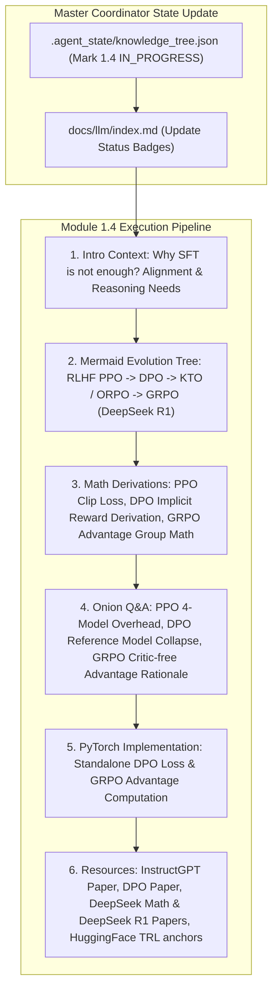

# Module 1.4 Implementation Plan: RLHF, DPO & GRPO (DeepSeek R1/Math) Deep-Dive

> **For agentic workers:** REQUIRED SUB-SKILL: Use superpowers:subagent-driven-development to implement this plan task-by-task. Steps use checkbox (`- [ ]`) syntax for tracking.

**Goal:** Execute the full 6-Agent Multi-Agent pipeline for topic **`1.4-rlhf-dpo-grpo.md` (强化学习 RLHF, DPO 与 GRPO 详解)**, following our standard article specification (Introductory background, Mermaid evolution tree, Knowledge Graph links, Math derivations, Onion Q&A, PyTorch code, and Supplementary Links).

**Architecture Diagram:**

**Tech Stack:** VitePress, Vue 3, KaTeX, Markdown, Node.js

---

### Task 1: Update Master Coordinator State & Portal Index Page

**Files:**
- Modify: `.agent_state/knowledge_tree.json`
- Modify: `docs/llm/index.md`

- [ ] **Step 1: Update `.agent_state/knowledge_tree.json`**
Mark `1.3-pretraining-sft` as `COMPLETED`, and `1.4-rlhf-dpo-grpo` as `IN_PROGRESS`.

- [ ] **Step 2: Update `docs/llm/index.md` status badge**
Update `1.4 强化学习 RLHF, DPO 与 GRPO (DeepSeek R1)` badge to `<Badge type="tip" text="已就绪" />`.

---

### Task 2: Create Deep Article `docs/llm/1-fundamentals/1.4-rlhf-dpo-grpo.md`

**Files:**
- Create: `docs/llm/1-fundamentals/1.4-rlhf-dpo-grpo.md`

- [ ] **Step 1: Write `docs/llm/1-fundamentals/1.4-rlhf-dpo-grpo.md`**

Must include:
- **📖 1. 导言与背景**：为什么 SFT 训练的模型容易产生幻觉或盲目迎合？人类偏好对齐（Alignment）与推理能力突破（Reasoning Emergence）为什么需要强化学习？
- **🌳 2. 大模型强化学习演进分支树 (Mermaid Graph)**：
  - 分支 A：显式 Reward Model + 经典 RL (InstructGPT / PPO).
  - 分支 B：隐式 Reward Model / 无 Reward Model 直优化 (DPO $\rightarrow$ IPO $\rightarrow$ KTO $\rightarrow$ ORPO).
  - 分支 C：Group Relative Policy Optimization (GRPO, DeepSeek Math / DeepSeek R1 / R1-Zero) 弃用 Critic 网络的原理.
- **🕸️ 3. 知识网格与图谱依赖**：
  - 入度：SFT Model、Policy Model $\pi_\theta$、Reward Model $r_\psi$、Bradley-Terry 对偶模型、KL 散度约束.
  - 出度：DeepSeek R1 慢思考 (Thinking / Reasoning Chain)、Self-Correction 自我纠错、Agent 自主规划能力.
- **🧮 4. 数学推导与硬核机制**：
  - PPO 阶段 **KL 散度惩罚与 Clip Objective**：
    $$ \mathcal{L}_{\text{PPO}}(\theta) = \hat{\mathbb{E}}_t \left[ \min(r_t(\theta)\hat{A}_t, \text{clip}(r_t(\theta), 1-\epsilon, 1+\epsilon)\hat{A}_t) \right] - \beta D_{\text{KL}}(\pi_\theta || \pi_{\text{ref}}) $$
  - DPO **推导过程**：从 Bradley-Terry 模型 $P(y_w \succ y_l) = \sigma(r(x, y_w) - r(x, y_l))$ 到无需 Reward Model 的隐式目标：
    $$ \mathcal{L}_{\text{DPO}}(\theta; \pi_{\text{ref}}) = -\mathbb{E}_{(x, y_w, y_l)} \left[ \log \sigma \left( \beta \log \frac{\pi_\theta(y_w|x)}{\pi_{\text{ref}}(y_w|x)} - \beta \log \frac{\pi_\theta(y_l|x)}{\pi_{\text{ref}}(y_l|x)} \right) \right] $$
  - GRPO **组内相对优势计算 (Group Relative Advantage)**：
    $$ A_i = \frac{r_i - \text{mean}(\{r_1, \dots, r_G\})}{\text{std}(\{r_1, \dots, r_G\})} $$
- **🔥 5. 连环面试追问 (Level 1~6 Onion Chain)**：
  - *L1*: PPO 算法中为什么要引入 Reference Model $\pi_{\text{ref}}$ 并加上 KL 散度惩罚？（防止 Reward Hacking / 模型坍缩）。
  - *L2*: 为什么 PPO 训练需要同时维护 4 个模型（Policy, Value/Critic, Reference, Reward）？对显存与计算通信提出了什么挑战？
  - *L3*: DPO 是如何通过数学推导把 Reward Model 直接消掉的？DPO 有什么潜在缺陷？（容易在 Length Bias 或概率概率崩塌时失效）。
  - *L4*: DeepSeek R1 采用的 GRPO 是如何做到彻底去掉 Critic 网络的？为什么在数学推理场景下效果极佳？
  - *L5*: DeepSeek R1-Zero 为什么能纯靠强化学习（Rule-based Reward）涌现出 `<think>` 慢思考与 Self-Correction 能力？
- **💻 6. PyTorch 算法实战**：
  - 手写 DPO Loss 函数实现（支持 Log-Softmax 计算与 Reference Model 对比）。
  - 手写 GRPO 组内优势计算与 Advantage Normalization 模块。
- **🔗 7. 扩展学习与多维资源**：
  - 🎬 **YouTube / B站**：DeepSeek R1 论文深度拆解视频。
  - 📄 **经典论文**：InstructGPT (Ouyang et al., 2022), DPO (Rafailov et al., 2023), DeepSeekMath (Shao et al., 2024), DeepSeek-R1 (2025)。
  - 🐙 **GitHub 源码**：`huggingface/trl` (`DPOTrainer`, `GRPOTrainer`)。

---

### Task 3: Update VitePress Sidebar & Test Build

**Files:**
- Modify: `docs/.vitepress/config.js`

- [ ] **Step 1: Register `1.4 强化学习 RLHF, DPO 与 GRPO` in `docs/.vitepress/config.js` sidebar**
- [ ] **Step 2: Run `npm run build` in `/Users/soul/AiPro/personal-website` to ensure clean build with 0 broken links**
- [ ] **Step 3: Commit changes to Git**
