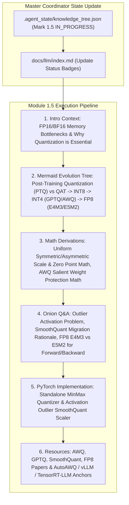

# Module 1.5 Implementation Plan: Model Quantization & Inference Acceleration Deep-Dive

> **For agentic workers:** REQUIRED SUB-SKILL: Use superpowers:subagent-driven-development to implement this plan task-by-task. Steps use checkbox (`- [ ]`) syntax for tracking.

**Goal:** Execute the full 6-Agent Multi-Agent pipeline for topic **`1.5-quantization-infer.md` (模型量化与推理加速机制)**, following our standard article specification (Introductory background, Mermaid evolution tree, Knowledge Graph links, Math derivations, Onion Q&A, PyTorch code, and Supplementary Links).

**Architecture Diagram:**

**Tech Stack:** VitePress, Vue 3, KaTeX, Markdown, Node.js

---

### Task 1: Update Master Coordinator State & Portal Index Page

**Files:**
- Modify: `.agent_state/knowledge_tree.json`
- Modify: `docs/llm/index.md`

- [ ] **Step 1: Update `.agent_state/knowledge_tree.json`**
Mark `1.4-rlhf-dpo-grpo` as `COMPLETED`, and `1.5-quantization-infer` as `IN_PROGRESS`.

- [ ] **Step 2: Update `docs/llm/index.md` status badge**
Update `1.5 模型量化与推理加速` badge to `<Badge type="tip" text="已就绪" />`.

---

### Task 2: Create Deep Article `docs/llm/1-fundamentals/1.5-quantization-infer.md`

**Files:**
- Create: `docs/llm/1-fundamentals/1.5-quantization-infer.md`

- [ ] **Step 1: Write `docs/llm/1-fundamentals/1.5-quantization-infer.md`**

Must include:
- **📖 1. 导言与背景**：大模型推理为什么是 Memory-Bound？显存占用与带宽瓶颈如何限制了 Batch Size？从 FP32 到 FP16/BF16，再到 INT8/INT4/FP8 的量化演进背景。
- **🌳 2. 大模型量化技术演进分支树 (Mermaid Graph)**：
  - 分支 A：Quantization-Aware Training (QAT) vs Post-Training Quantization (PTQ).
  - 分支 B：权重量化 (Weight-Only: GPTQ, AWQ) vs 权重-激活同时量化 (W8A8: SmoothQuant, W4A4).
  - 分支 C：FP8 数据格式演进 (E4M3FN 适合 Forward vs E5M2 适合 Backward/Gradients).
- **🕸️ 3. 知识网格与图谱依赖**：
  - 入度：FP16/BF16 数据表示、Roofline Model、SRAM/HBM 显存架构、GEMM 矩阵乘法.
  - 出度：vLLM INT4/FP8 KV Cache 压缩、TensorRT-LLM 算子融合、端侧/消费级显卡部署 (Ollama / GGUF).
- **🧮 4. 数学推导与硬核机制**：
  - **均匀对称/非对称量化公式**：
    $$ q = \text{clip}\left(\left\lfloor \frac{x}{S} \right\rceil + Z, q_{\text{min}}, q_{\text{max}}\right), \quad S = \frac{x_{\text{max}} - x_{\text{min}}}{q_{\text{max}} - q_{\text{min}}}, \quad Z = \left\lfloor \frac{-x_{\text{min}}}{S} \right\rceil $$
  - **SmoothQuant 异构激活平滑原理**：将激活异常值 (Outliers) 的数学难度搬移到权重的数学缩放矩阵 $S$ 中：
    $$ Y = (X \cdot \text{diag}(s)^{-1}) \cdot (\text{diag}(s) \cdot W) $$
  - **AWQ (Activation-aware Weight Quantization) 保护前 1% 显著权重** 的显存误差优化。
- **🔥 5. 连环面试追问 (Level 1~6 Onion Chain)**：
  - *L1*: 什么是对称量化与非对称量化？Zero Point ($Z$) 在计算 GEMM 时会带来什么额外指令开销？
  - *L2*: 为什么 LLM 参数量变大后 (13B+)，W8A8 量化反而会出现困惑度 (PPL) 陡增？（激活异常值 Outliers 现象）。
  - *L3*: SmoothQuant 是如何通过等价数学转换把激活值的 Spike 迁移给权重的？平滑因子 $s_j$ 怎么求？
  - *L4*: GPTQ (Second-order Hessian) 与 AWQ (Salient Weight Protection) 的核心区别是什么？为什么 AWQ 更适合通用推理？
  - *L5*: NVIDIA Hopper (H100/H200) 提出的 FP8 (E4M3 vs E5M2) 在 LLM 预训练与推理中是如何配合使用的？
- **💻 6. PyTorch 算法实战**：
  - 纯 PyTorch 实现简单的 `SymmetricQuantizer` 与 `AsymmetricQuantizer`。
  - 手写 `SmoothQuantLinear` 平滑层算法模块及测试。
- **🔗 7. 扩展学习与多维资源**：
  - 🎬 **YouTube / B站**：vLLM / TensorRT-LLM 量化原理讲解视频。
  - 📄 **经典论文**：GPTQ (Frantar et al., 2022), AWQ (Lin et al., 2023), SmoothQuant (Xiao et al., 2022), FP8 Formats (NVIDIA, 2022)。
  - 🐙 **GitHub 源码**：`mit-han-lab/llm-awq`、`mit-han-lab/smoothquant`、`vllm/model_executor/layers/quantization/`。

---

### Task 3: Update VitePress Sidebar & Test Build

**Files:**
- Modify: `docs/.vitepress/config.js`

- [ ] **Step 1: Register `1.5 模型量化与推理加速` in `docs/.vitepress/config.js` sidebar**
- [ ] **Step 2: Run `npm run build` in `/Users/soul/AiPro/personal-website` to ensure clean build with 0 broken links**
- [ ] **Step 3: Commit changes to Git**
