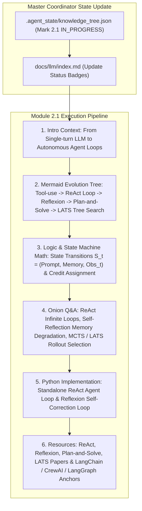

# Module 2.1 Implementation Plan: Agent Architectures & Core Patterns Deep-Dive

> **For agentic workers:** REQUIRED SUB-SKILL: Use superpowers:subagent-driven-development to implement this plan task-by-task. Steps use checkbox (`- [ ]`) syntax for tracking.

**Goal:** Execute the full 6-Agent Multi-Agent pipeline for topic **`2.1-agent-architectures.md` (Agent 核心设计模式与架构)**, entering Section 2 (Agent Frameworks) and following our standard article specification (Introductory background, Mermaid evolution tree, Knowledge Graph links, Math/Logic derivations, Onion Q&A, PyTorch/Python code, and Supplementary Links).

**Architecture Diagram:**

**Tech Stack:** VitePress, Vue 3, KaTeX, Markdown, Node.js

---

### Task 1: Update Master Coordinator State & Portal Index Page

**Files:**
- Modify: `.agent_state/knowledge_tree.json`
- Modify: `docs/llm/index.md`

- [ ] **Step 1: Update `.agent_state/knowledge_tree.json`**
Mark `1.5-quantization-infer` as `COMPLETED`, and `2.1-agent-architectures` as `IN_PROGRESS`.

- [ ] **Step 2: Update `docs/llm/index.md` status badge**
Update `2.1 Agent 核心设计模式` badge to `<Badge type="tip" text="已就绪" />`.

---

### Task 3: Create Deep Article `docs/llm/2-agent-framework/2.1-agent-architectures.md`

**Files:**
- Create: `docs/llm/2-agent-framework/2.1-agent-architectures.md`

- [ ] **Step 1: Write `docs/llm/2-agent-framework/2.1-agent-architectures.md`**

Must include:
- **📖 1. 导言与背景**：为什么静态的单次 LLM 无法完成复杂的现实世界多步任务？Agent 大脑（LLM）是如何通过 **感知 (Perception) $\rightarrow$ 决策 (Decision) $\rightarrow$ 行动 (Action) $\rightarrow$ 反馈 (Observation)** 闭环实现自主进化的？
- **🌳 2. Agent 设计模式演进分支树 (Mermaid Graph)**：
  - 分支 A：单步骤工具调用 (Function Calling / Direct Tool Use).
  - 分支 B：交替循环推理与行动 (ReAct: Reason + Act).
  - 分支 C：显式规划与分拆 (Plan-and-Solve / Decomposed Prompting).
  - 分支 D：自我反思与评估 (Reflexion / Self-Refine).
  - 分支 E：树状决策搜索 (LATS: Language Agent Tree Search / Monte Carlo Tree Search).
- **🕸️ 3. 知识网格与图谱依赖**：
  - 入度：LLM 上下文窗口、Prompt Engineering、Structured Output / JSON Schema 触发、Memory System.
  - 出度：Multi-Agent 协作网络 (AutoGen/CrewAI)、工具链自动化、复杂系统调试代理 (Coding / Debug Agent).
- **🧮 4. 状态机推导与归因逻辑**：
  - **ReAct 状态转移公式**：
    $$ S_0 = (\text{Task}), \quad (A_t, \text{Thought}_t) = \pi_\theta(S_t), \quad O_t = \text{Env}(A_t), \quad S_{t+1} = S_t \oplus (\text{Thought}_t, A_t, O_t) $$
  - **Reflexion 归因评估 (Credit Assignment)** 与 Memory 演进：
    $$ M_{\text{long\_term}} \leftarrow M_{\text{long\_term}} \cup \text{Evaluate}(O_{\text{final}}, \text{Expected}) $$
- **🔥 5. 连环面试追问 (Level 1~6 Onion Chain)**：
  - *L1*: ReAct 模式中的 Thought 节点如果省略会发生什么？（从零归纳 Tool Call 很容易进入无脑死循环）。
  - *L2*: 如何防止 Agent 在 ReAct 循环中发生**无限死循环或无效重试 (Infinite Loop)**？（状态哈希去重 + Max Iteration 防护 + Error Exception Handler）。
  - *L3*: Reflexion 与简单 Retry 有什么本质不同？（Reflexion 显式生成反思文本存入 Long-term Memory，指导下一次尝试）。
  - *L4*: Plan-and-Solve 相较于 ReAct 在处理超长长路径任务时的优势与缺陷是什么？（优势：全局视角防止迷失；缺陷：缺乏动态环境变化的敏捷修正）。
  - *L5*: LATS (Language Agent Tree Search) 是如何结合 MCTS (蒙特卡洛树搜索) 的 UCT 上限置信区间公式进行 Agent 状态搜索的？
- **💻 6. Python 算法实战**：
  - 纯 Python 手写完整的 `ReActAgentLoop` 交互引擎（支持 Tool Registry, ReAct Parser, Iteration Limit）。
  - 手写 `ReflexionAgent` 包含 Evaluator 与 Self-Reflection Memory 模块。
- **🔗 7. 扩展学习与多维资源**：
  - 🎬 **YouTube / B站**：Andrew Ng (吴恩达) *Agentic Reasoning Patterns* 演讲解析。
  - 📄 **经典论文**：ReAct (Yao et al., 2022), Reflexion (Shinn et al., 2023), Plan-and-Solve (Wang et al., 2023), LATS (Zhou et al., 2023)。
  - 🐙 **GitHub 源码**：`langchain-ai/langgraph`、`crewAIInc/crewAI`。

---

### Task 4: Update VitePress Sidebar & Test Build

**Files:**
- Modify: `docs/.vitepress/config.js`

- [ ] **Step 1: Register `2.1 Agent 核心设计模式` under Section 2 in `docs/.vitepress/config.js` sidebar**
- [ ] **Step 2: Run `npm run build` in `/Users/soul/AiPro/personal-website` to ensure clean build with 0 broken links**
- [ ] **Step 3: Commit changes to Git**
