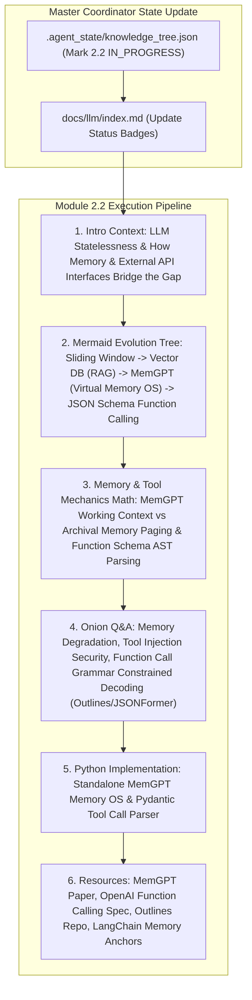

# Module 2.2 Implementation Plan: Memory Systems & Function Calling Deep-Dive

> **For agentic workers:** REQUIRED SUB-SKILL: Use superpowers:subagent-driven-development to implement this plan task-by-task. Steps use checkbox (`- [ ]`) syntax for tracking.

**Goal:** Execute the full 6-Agent Multi-Agent pipeline for topic **`2.2-memory-tools.md` (记忆机制与工具调用详解)**, following our standard article specification (Introductory background, Mermaid evolution tree, Knowledge Graph links, Math/Logic derivations, Onion Q&A, PyTorch/Python code, and Supplementary Links).

**Architecture Diagram:**

**Tech Stack:** VitePress, Vue 3, KaTeX, Markdown, Node.js

---

### Task 1: Update Master Coordinator State & Portal Index Page

**Files:**
- Modify: `.agent_state/knowledge_tree.json`
- Modify: `docs/llm/index.md`

- [ ] **Step 1: Update `.agent_state/knowledge_tree.json`**
Mark `2.1-agent-architectures` as `COMPLETED`, and `2.2-memory-tools` as `IN_PROGRESS`.

- [ ] **Step 2: Update `docs/llm/index.md` status badge**
Update `2.2 记忆机制与工具调用` badge to `<Badge type="tip" text="已就绪" />`.

---

### Task 2: Create Deep Article `docs/llm/2-agent-framework/2.2-memory-tools.md`

**Files:**
- Create: `docs/llm/2-agent-framework/2.2-memory-tools.md`

- [ ] **Step 1: Write `docs/llm/2-agent-framework/2.2-memory-tools.md`**

Must include:
- **📖 1. 导言与背景**：大模型本质是无状态的（Stateless），为什么 Agent 需要记忆系统？如何通过工作上下文（Working Memory）、长期向量记忆（Archival Memory）与外部工具接口（Function Calling）赋予 Agent 操作系统级别的持久化扩展能力？
- **🌳 2. 记忆与工具调用演进分支树 (Mermaid Graph)**：
  - 分支 A：记忆系统演进 (Sliding Window $\rightarrow$ Summary Buffer $\rightarrow$ Vector DB / RAG Memory $\rightarrow$ MemGPT 操作系统级虚拟页内存).
  - 分支 B：工具调用演进 (Regex Prompting $\rightarrow$ ReAct Tool Triggers $\rightarrow$ OpenAI Native Function Calling $\rightarrow$ Constrained Decoding / JSON Schema 语法树强约束).
- **🕸️ 3. 知识网格与图谱依赖**：
  - 入度：Vector DB (Cosine Similarity / HNSW), JSON Schema, Token Limit, Grammar Constrained Sampling.
  - 出度：Multi-Agent 跨智能体共享存储、Autonomous Software Engineer (Devin 类 Agent)、企业 API 自动集成.
- **🧮 4. 内存分页与语法树约束推导**：
  - **MemGPT 虚拟内存层次转换**：
    $$\text{Context Window} = \text{System Prompt} + \text{Working Memory} (FIFO) + \text{Recall Memory} (\text{Paging Query})$$
  - **Grammar Constrained Decoding (语法树限制采样)**：
    利用 FSM (有限状态机) 在计算 Softmax 时，硬性将违反 JSON 规则的 Token Logits 填为 $-\infty$：
    $$\text{Masked Logits}_i = \begin{cases} \text{Logits}_i & \text{if } \text{Token}_i \in \text{ValidTokens}(FSM\_State) \\ -\infty & \text{otherwise} \end{cases}$$
- **🔥 5. 连环面试追问 (Level 1~6 Onion Chain)**：
  - *L1*: 为什么简单的上下文拼接 (Context Appending) 无法解决超长对话系统的记忆问题？（Lost in the Middle 现象与 Token 成本暴涨）。
  - *L2*: MemGPT 是如何借鉴操作系统 (OS) 的中断 (Interrupt)、页表 (Page Table) 与换页 (Swapping) 机制设计 Agent 内存系统的？
  - *L3*: 大模型在进行 Function Calling 时，如果 API 参数格式要求极其严格，如何通过 **Constrained Decoding (如 Outlines / JSONFormer)** 保证 100% 格式合法？
  - *L4*: 如何防范 **Prompt Injection / Tool Injection (工具注入攻击)**？（例如：工具返回的数据中隐藏了针对大模型的恶意指令）。
  - *L5*: 面对多达上百个工具的复杂系统，如何解决工具选择衰减（Tool Selection Degradation）？（RAG-based Tool Retrieval + Hierarchical Tool Selection）。
- **💻 6. Python 算法实战**：
  - 手写一个包含 `WorkingMemory` 与 `ArchivalMemory` 的 `MemGPTMemoryManager` 引擎。
  - 手写一个支持 Pydantic 自动转换为 OpenAI Function Call JSON Schema 的注册解析器与 Mock 执行器。
- **🔗 7. 扩展学习与多维资源**：
  - 🎬 **YouTube / B站**：MemGPT 论文作者讲座与 Open-MemGPT 代码解析。
  - 📄 **经典论文**：MemGPT (Packer et al., 2023), Gorilla: Large Language Model Connected with APIs (Patil et al., 2023), Outlines (Willard et al., 2023)。
  - 🐙 **GitHub 源码**：`coda-ai/memgpt` (`letta-ai`), `dottxt-ai/outlines`。

---

### Task 3: Update VitePress Sidebar & Test Build

**Files:**
- Modify: `docs/.vitepress/config.js`

- [ ] **Step 1: Register `2.2 记忆机制与工具调用` under Section 2 in `docs/.vitepress/config.js` sidebar**
- [ ] **Step 2: Run `npm run build` in `/Users/soul/AiPro/personal-website` to ensure clean build with 0 broken links**
- [ ] **Step 3: Commit changes to Git**
