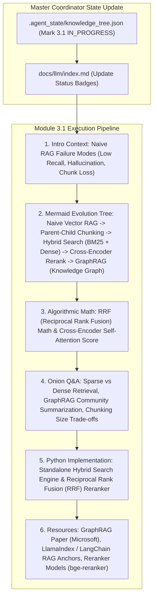

# Module 3.1 Implementation Plan: Advanced RAG Architecture Deep-Dive

> **For agentic workers:** REQUIRED SUB-SKILL: Use superpowers:subagent-driven-development to implement this plan task-by-task. Steps use checkbox (`- [ ]`) syntax for tracking.

**Goal:** Execute the full 6-Agent Multi-Agent pipeline for topic **`3.1-advanced-rag.md` (高级 RAG 架构实践)**, entering Section 3 (Engineering & Systems) and following our standard article specification (Introductory background, Mermaid evolution tree, Knowledge Graph links, Math/Algorithmic derivations, Onion Q&A, PyTorch/Python code, and Supplementary Links).

**Architecture Diagram:**

**Tech Stack:** VitePress, Vue 3, KaTeX, Markdown, Node.js

---

### Task 1: Update Master Coordinator State & Portal Index Page

**Files:**
- Modify: `.agent_state/knowledge_tree.json`
- Modify: `docs/llm/index.md`

- [ ] **Step 1: Update `.agent_state/knowledge_tree.json`**
Mark `2.2-memory-tools` as `COMPLETED`, and `3.1-advanced-rag` as `IN_PROGRESS`.

- [ ] **Step 2: Update `docs/llm/index.md` status badge**
Update `3.1 高级 RAG 架构实践` badge to `<Badge type="tip" text="已就绪" />`.

---

### Task 2: Create Deep Article `docs/llm/3-engineering/3.1-advanced-rag.md`

**Files:**
- Create: `docs/llm/3-engineering/3.1-advanced-rag.md`

- [ ] **Step 1: Write `docs/llm/3-engineering/3.1-advanced-rag.md`**

Must include:
- **📖 1. 导言与背景**：基础 RAG（Naive RAG）存在三大致命痛点：检索召回率低（Low Recall）、上下文噪音造成幻觉（Hallucination）、以及缺乏全局宏观理解。为什么高可用生产级 RAG 必须从单纯的向量检索走向 **混合检索（Hybrid Search）、重排序（Rerank）与图增强 RAG（GraphRAG）**？
- **🌳 2. RAG 架构演进分支树 (Mermaid Graph)**：
  - 分支 A：文本切分演进 (Fixed Chunking $\rightarrow$ Semantic Chunking $\rightarrow$ Parent-Child / Multi-Vector Store).
  - 分支 B：检索算法演进 (Dense Vector Only $\rightarrow$ Hybrid Search: BM25 Sparse + Dense Vector $\rightarrow$ RRF Fusion).
  - 分支 C：重排序演进 (Bi-Encoder Cosine $\rightarrow$ Cross-Encoder Reranker $\rightarrow$ LLM LLM-as-a-Reranker).
  - 分支 D：知识表示演进 (Unstructured Vector Chunks $\rightarrow$ Entity-Relation Extraction $\rightarrow$ GraphRAG Community Summarization).
- **🕸️ 3. 知识网格与图谱依赖**：
  - 入度：Vector DB (HNSW/IVF-PQ), BM25 / TF-IDF, Cross-Encoder Attention, Knowledge Graph (Neo4j).
  - Out-degree: RAG-based Agent Memory, Enterprise Knowledge Base Q&A, Hallucination Evaluation (Ragas / TruLens).
- **🧮 4. 融合算法与重排序推导**：
  - **倒数排名融合 (Reciprocal Rank Fusion, RRF) 数学公式**：
    $$ RRF\_Score(d \in D) = \sum_{m \in M} \frac{1}{k + r_m(d)} $$
    *(其中 $M$ 为检索系统集合（如 BM25 和 Dense），$r_m(d)$ 为文档 $d$ 在系统 $m$ 中的排名，常数 $k \approx 60$)*
  - **Bi-Encoder vs Cross-Encoder 计算复杂度推导**：
    Bi-Encoder 为 $O(N \cdot d)$ 向量点积；Cross-Encoder 为 $O(N \cdot L^2)$ 全自注意力拼接计算。
- **🔥 5. 连环面试追问 (Level 1~6 Onion Chain)**：
  - *L1*: 为什么在很多专有名词（如型号 ID、人名、缩写）场景下，单纯的 Dense Vector 检索效果反而不如传统的 BM25 稀疏检索？
  - *L2*: 什么是 Parent-Child / Small-to-Big Chunking 策略？为什么“小 Chunk 用于检索，大 Parent Chunk 用于喂给 LLM”能显著提升效果？
  - *L3*: 为什么需要 Cross-Encoder Reranker？Bi-Encoder（如 `text-embedding-3`）点积相似度无法捕捉复杂的 Query-Document Token 级交互的原因是什么？
  - *L4*: 微软 GraphRAG 解决传统 RAG 无法回答“这本文档的核心主题是什么？”（Global Query）的数学与架构逻辑是什么？（Leiden 社区发现算法 + 社区摘要 Community Summaries）。
  - *L5*: 生产环境高并发场景下，如何兼顾 Cross-Encoder Rerank 的延迟与精确度？（Two-stage Pipeline: Top-100 Bi-Encoder/BM25 -> Top-10 Cross-Encoder）。
- **💻 6. Python 算法实战**：
  - 手写包含 BM25 稀疏检索与 Vector 稠密检索的 `HybridSearchEngine`。
  - 手写倒数排名融合算法 `ReciprocalRankFusion` 与 Cross-Encoder 重排序评分逻辑。
- **🔗 7. 扩展学习与多维资源**：
  - 🎬 **YouTube / B站**：GraphRAG 官方技术讲解与 LlamaIndex 高级 RAG 架构视频。
  - 📄 **经典论文**：RAG (Lewis et al., 2020), GraphRAG (Edge et al., 2024), RRF (Cormack et al., 2009)。
  - 🐙 **GitHub 源码**：`microsoft/graphrag`、`run-llama/llama_index`、`BAAI/FlagEmbedding` (bge-reranker)。

---

### Task 3: Update VitePress Sidebar & Test Build

**Files:**
- Modify: `docs/.vitepress/config.js`

- [ ] **Step 1: Register `3.1 高级 RAG 架构实践` under Section 3 in `docs/.vitepress/config.js` sidebar**
- [ ] **Step 2: Run `npm run build` in `/Users/soul/AiPro/personal-website` to ensure clean build with 0 broken links**
- [ ] **Step 3: Commit changes to Git**
