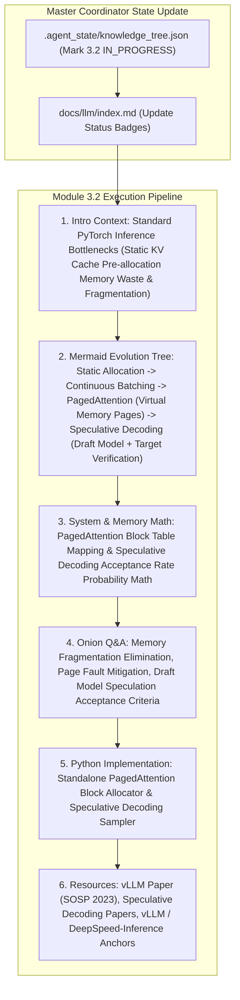

# Module 3.2 Implementation Plan: vLLM & Distributed Inference Acceleration Deep-Dive

> **For agentic workers:** REQUIRED SUB-SKILL: Use superpowers:subagent-driven-development to implement this plan task-by-task. Steps use checkbox (`- [ ]`) syntax for tracking.

**Goal:** Execute the full 6-Agent Multi-Agent pipeline for topic **`3.2-vllm-deepspeed.md` (vLLM 与分布式推理加速)**, following our standard article specification (Introductory background, Mermaid evolution tree, Knowledge Graph links, Math/System derivations, Onion Q&A, PyTorch/Python code, and Supplementary Links).

**Architecture Diagram:**

**Tech Stack:** VitePress, Vue 3, KaTeX, Markdown, Node.js

---

### Task 1: Update Master Coordinator State & Portal Index Page

**Files:**
- Modify: `.agent_state/knowledge_tree.json`
- Modify: `docs/llm/index.md`

- [ ] **Step 1: Update `.agent_state/knowledge_tree.json`**
Mark `3.1-advanced-rag` as `COMPLETED`, and `3.2-vllm-deepspeed` as `IN_PROGRESS`.

- [ ] **Step 2: Update `docs/llm/index.md` status badge**
Update `3.2 vLLM 与分布式推理加速` badge to `<Badge type="tip" text="已就绪" />`.

---

### Task 2: Create Deep Article `docs/llm/3-engineering/3.2-vllm-deepspeed.md`

**Files:**
- Create: `docs/llm/3-engineering/3.2-vllm-deepspeed.md`

- [ ] **Step 1: Write `docs/llm/3-engineering/3.2-vllm-deepspeed.md`**

Must include:
- **📖 1. 导言与背景**：传统的 HuggingFace / PyTorch 原生推理框架为什么无法支撑百人高并发访问？预先静态分配最大序列长度的 KV Cache 会造成高达 60%-80% 的显存碎片化与浪费。为什么 vLLM 的 PagedAttention 与 Continuous Batching 彻底改变了大模型高并发服务生态？
- **🌳 2. 大模型推理加速技术演进分支树 (Mermaid Graph)**：
  - 分支 A：批处理调度演进 (Static Batching $\rightarrow$ Dynamic Batching $\rightarrow$ Continuous Batching / Iteration-level scheduling).
  - 分支 B：显存管理演进 (Static Pre-allocation $\rightarrow$ Virtual Memory Paging: PagedAttention / Block Tables).
  - 分支 C：解码加速演进 (Autoregressive Greedy Decoding $\rightarrow$ Speculative Decoding / Speculative Sampling (Draft Model + Target Model)).
  - 分支 D：多卡分布式推理 (Tensor Parallelism TP $\rightarrow$ Pipeline Parallelism PP $\rightarrow$ DeepSpeed-Inference / vLLM Distributed Engine).
- **🕸️ 3. 知识网格与图谱依赖**：
  - 入度：KV Cache 显存公式、Attention 算子、OS 虚拟内存与页表 (Page Table)、NVIDIA CUDA Memory Allocator.
  - 出度：企业级 LLM API 网关、高并发 Agent 部署、Cost-per-Token 成本优化.
- **🧮 4. 显存页表映射与投机采样概率推导**：
  - **PagedAttention 虚拟页表映射映射与 Block Size 关系**：
    $$\text{Physical Block Index} = \text{BlockTable}[\text{Logical Block Index}]$$
  - **Speculative Decoding (投机采样) 无偏接受概率公式 (Unbiased Rejection Sampling)**：
    小模型生成 Token $x$，若 $P_{\text{target}}(x) \ge P_{\text{draft}}(x)$ 则直接接受；若 $P_{\text{target}}(x) < P_{\text{draft}}(x)$，则以概率 $\frac{P_{\text{target}}(x)}{P_{\text{draft}}(x)}$ 接受，拒绝时从修正分布采样：
    $$P_{\text{resample}}(x) = \text{max}(0, P_{\text{target}}(x) - P_{\text{draft}}(x))$$
- **🔥 5. 连环面试追问 (Level 1~6 Onion Chain)**：
  - *L1*: 原生 PyTorch 为什么在长文本推理时会产生严重的内部与外部显存碎片？
  - *L2*: PagedAttention 是如何借鉴操作系统 OS 虚拟内存中的 Page Table 概念，将非连续物理显存块 (Physical Blocks) 映射为逻辑连续 KV Cache 的？
  - *L3*: 什么是 Continuous Batching（迭代级批处理 / 连续批处理）？它与传统的 Request-level Dynamic Batching 有何本质区别？
  - *L4*: 投机采样 (Speculative Decoding) 是如何做到在**完全保证生成分布与大模型 100% 数学一致 (Unbiased)** 的前提下，实现 2x-3x 推理加速的？
  - *L5*: 当 Draft Model 与 Target Model 尺寸差距过大或过小时，投机采样的加速效果会发生什么变化？（Acceptance Rate 接受率与 Overlap 计算开销平衡）。
- **💻 6. Python 算法实战**：
  - 手写一个可运行的 `PagedAttentionBlockManager` 物理/逻辑块分配与回收器。
  - 手写一个完整的 `SpeculativeDecodingSampler` 投机采样与拒绝重采样概率核验逻辑。
- **🔗 7. 扩展学习与多维资源**：
  - 🎬 **YouTube / B站**：vLLM 创作者 Kwon (UC Berkeley) SOSP 论文演讲视频。
  - 📄 **经典论文**：vLLM / PagedAttention (Kwon et al., SOSP 2023), Speculative Decoding (Leviathan et al., 2023 / Chen et al., 2023)。
  - 🐙 **GitHub 源码**：`vllm-project/vllm` (`vllm/core/block_manager_v1.py`)、`microsoft/DeepSpeed`。

---

### Task 3: Update VitePress Sidebar & Test Build

**Files:**
- Modify: `docs/.vitepress/config.js`

- [ ] **Step 1: Register `3.2 vLLM 与分布式推理加速` under Section 3 in `docs/.vitepress/config.js` sidebar**
- [ ] **Step 2: Run `npm run build` in `/Users/soul/AiPro/personal-website` to ensure clean build with 0 broken links**
- [ ] **Step 3: Commit changes to Git**
