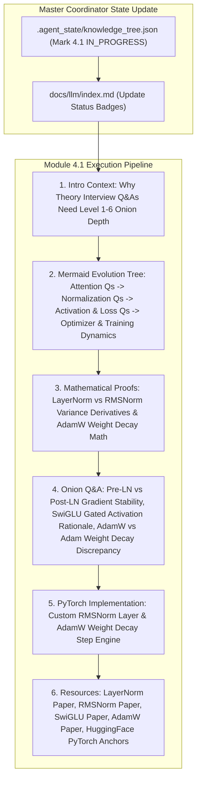

# Module 4.1 Implementation Plan: LLM Theory Deep Q&A Chains

> **For agentic workers:** REQUIRED SUB-SKILL: Use superpowers:subagent-driven-development to implement this plan task-by-task. Steps use checkbox (`- [ ]`) syntax for tracking.

**Goal:** Execute the full 6-Agent Multi-Agent pipeline for topic **`4.1-theory-deep-qa.md` (LLM 理论算法高频深度题)**, entering Section 4 (Interview Q&A Chains) and following our standard article specification (Introductory background, Mermaid evolution tree, Knowledge Graph links, Math derivations, Onion Q&A, PyTorch code, and Supplementary Links).

**Architecture Diagram:**

**Tech Stack:** VitePress, Vue 3, KaTeX, Markdown, Node.js

---

### Task 1: Update Master Coordinator State & Portal Index Page

**Files:**
- Modify: `.agent_state/knowledge_tree.json`
- Modify: `docs/llm/index.md`

- [ ] **Step 1: Update `.agent_state/knowledge_tree.json`**
Mark `3.2-vllm-deepspeed` as `COMPLETED`, and `4.1-theory-deep-qa` as `IN_PROGRESS`.

- [ ] **Step 2: Update `docs/llm/index.md` status badge**
Update `4.1 理论算法高频题` badge to `<Badge type="tip" text="已就绪" />`.

---

### Task 2: Create Deep Article `docs/llm/4-interview-qa/4.1-theory-deep-qa.md`

**Files:**
- Create: `docs/llm/4-interview-qa/4.1-theory-deep-qa.md`

- [ ] **Step 1: Write `docs/llm/4-interview-qa/4.1-theory-deep-qa.md`**

Must include:
- **📖 1. 导言与背景**：大模型面试不仅考察基础概念，更侧重考察底层数学推导、梯度流稳定性（Gradient Flow）与硬件算子层面的优化选择。为什么在百亿参数模型训练中，微小的架构细节（如 LayerNorm 位置、激活函数选择）会导致训练崩溃？
- **🌳 2. 理论算法考点演进图谱 (Mermaid Graph)**：
  - 分支 A：归一化层演进 (BatchNorm $\rightarrow$ LayerNorm Post-LN $\rightarrow$ Pre-LN $\rightarrow$ DeepNorm $\rightarrow$ RMSNorm).
  - 分支 B：激活函数演进 (ReLU $\rightarrow$ GELU $\rightarrow$ Swish / SwiGLU Gated Multi-linear).
  - 分支 C：优化器与正则化演进 (SGD Momentum $\rightarrow$ Adam $\rightarrow$ AdamW decoupled weight decay $\rightarrow$ 8-bit Adam).
- **🕸️ 3. 知识网格与图谱依赖**：
  - 入度：反向传播 (Backpropagation), 链式法则, 矩阵导数, GPU 算子内存读写.
  - 出度：千卡分布式预训练稳定性、梯度爆炸/消失防护、模型收敛速度。
- **🧮 4. 数学推导与硬核机制**：
  - **RMSNorm 方差简化公式**：
    $$\text{RMS}(x) = \sqrt{\frac{1}{d} \sum_{i=1}^d x_i^2 + \epsilon}, \quad \bar{y}_i = \frac{x_i}{\text{RMS}(x)} \cdot \gamma_i$$
  - **AdamW 解耦权重衰减 (Decoupled Weight Decay) 数学公式**：
    $$\theta_{t+1} = \theta_t - \eta_t \lambda \theta_t - \frac{\eta_t}{\sqrt{\hat{v}_t} + \epsilon} \hat{m}_t$$
- **🔥 5. 连环面试追问 (Level 1~6 Onion Chain)**：
  - *L1*: 为什么 Transformer 选用 LayerNorm 而不是计算机视觉中常用的 BatchNorm？
  - *L2*: 为什么早期 Transformer (Post-LN) 必须配合很长阶段的 Warmup，而 Pre-LN / RMSNorm 架构可以去掉 Warmup 阶段？（从残差块梯度流导数推导）。
  - *L3*: LLaMA / DeepSeek 为什么要用 **RMSNorm** 替代传统的 LayerNorm？消去均值偏移 $\mu$ 能带来多大的计算/显存带宽收益？
  - *L4*: 为什么 SwiGLU (Swish Gated Linear Unit) 比传统 GELU 表现更好？引入额外的 Gate Projection 参数后，如何维持总参数量不变？
  - *L5*: 为什么 PyTorch 中 $L_2$ 正则化 (Weight Decay) 在使用 Adam 优化器时会导致数学上的解耦失效，从而必须使用 **AdamW**？
- **💻 6. PyTorch 算法实战**：
  - 纯 PyTorch 手写性能优化版 `RMSNorm` 模块。
  - 手写包含解耦 Weight Decay 的 `AdamWOptimizerStep` 逻辑。
- **🔗 7. 扩展学习与多维资源**：
  - 🎬 **YouTube / B站**：李沐《Transformer 论文逐字逐句精读》与 LayerNorm 梯度推导视频。
  - 📄 **经典论文**：LayerNorm (Ba et al., 2016), RMSNorm (Zhang et al., 2019), SwiGLU (Shazeer, 2020), AdamW (Loshchilov et al., 2017)。
  - 🐙 **GitHub 源码**：`huggingface/transformers` (`LlamaRMSNorm`)、`pytorch/pytorch` (`torch.optim.AdamW`)。

---

### Task 3: Update VitePress Sidebar & Test Build

**Files:**
- Modify: `docs/.vitepress/config.js`

- [ ] **Step 1: Register `4.1 理论算法高频深度题` under Section 4 in `docs/.vitepress/config.js` sidebar**
- [ ] **Step 2: Run `npm run build` in `/Users/soul/AiPro/personal-website` to ensure clean build with 0 broken links**
- [ ] **Step 3: Commit changes to Git**
