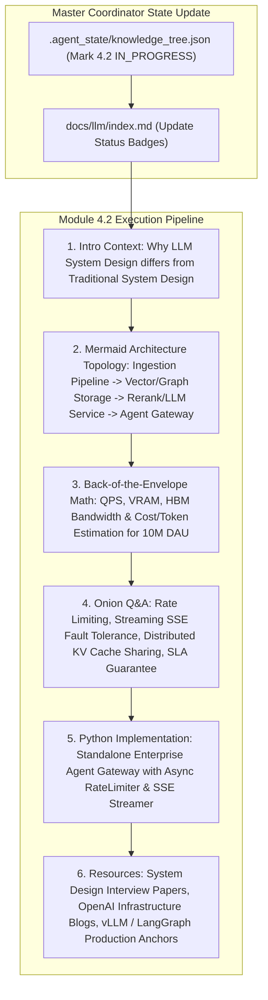

# Module 4.2 Implementation Plan: LLM System Design Deep-Dive

> **For agentic workers:** REQUIRED SUB-SKILL: Use superpowers:subagent-driven-development to implement this plan task-by-task. Steps use checkbox (`- [ ]`) syntax for tracking.

**Goal:** Execute the full 6-Agent Multi-Agent pipeline for topic **`4.2-system-design-qa.md` (大模型系统设计题: 从零设计高并发 RAG + Multi-Agent 平台)**, following our standard article specification (Introductory background, Mermaid evolution tree, Knowledge Graph links, System Math / Sizing calculations, Onion Q&A, Python architecture code, and Supplementary Links).

**Architecture Diagram:**

**Tech Stack:** VitePress, Vue 3, KaTeX, Markdown, Node.js

---

### Task 1: Update Master Coordinator State & Portal Index Page

**Files:**
- Modify: `.agent_state/knowledge_tree.json`
- Modify: `docs/llm/index.md`

- [ ] **Step 1: Update `.agent_state/knowledge_tree.json`**
Mark `4.1-theory-deep-qa` as `COMPLETED`, and `4.2-system-design-qa` as `IN_PROGRESS`.

- [ ] **Step 2: Update `docs/llm/index.md` status badge**
Update `4.2 大模型系统设计题` badge to `<Badge type="tip" text="已就绪" />`.

---

### Task 2: Create Deep Article `docs/llm/4-interview-qa/4.2-system-design-qa.md`

**Files:**
- Create: `docs/llm/4-interview-qa/4.2-system-design-qa.md`

- [ ] **Step 1: Write `docs/llm/4-interview-qa/4.2-system-design-qa.md`**

Must include:
- **📖 1. 导言与背景**：大模型系统设计（LLM System Design）与传统分布式系统设计有什么本质区别？除了高可用（HA）、高并发（High Concurrency）、低延迟（Low Latency）外，必须额外处理**GPU 显存瓶颈（VRAM）、首包延迟（TTFT - Time to First Token）、流式响应（SSE Streaming）、长文本 Cache 共享与非确定性输出防范**。
- **🌳 2. 系统设计演进架构拓扑图 (Mermaid Topology Graph)**：
  - 展示从 客户端请求 $\rightarrow$ 接入层 (Agent Gateway / Rate Limiter) $\rightarrow$ 编排层 (LangGraph / Multi-Agent Router) $\rightarrow$ 检索层 (Hybrid Vector DB + GraphRAG + Cross-Encoder Rerank) $\rightarrow$ 推理服务集群 (vLLM / TensorRT-LLM TP Cluster) $\rightarrow$ 监控审计 (Guardrails / Token Metrics) 的端到端生产级架构。
- **🕸️ 3. 知识网格与图谱依赖**：
  - 入度：vLLM PagedAttention, Continuous Batching, Hybrid Search, Async Python FastAPI, Redis Token Bucket.
  - 出度：企业级 AI 平台落地、SLA 99.9% 线上防护、多租户 (Multi-Tenancy) 隔离。
- **🧮 4. 容量估算与显存/带宽数学推导 (Back-of-the-Envelope Calculation)**：
  - **1000 万 DAU (日活) 系统容量计算**：
    假设峰值 QPS 为 500，平均 Prompt 1000 Tokens，Response 500 Tokens。
    - **显存与卡数推导**：使用 LLaMA-3-70B (FP16 140GB)，计算所需 H100 80GB 卡数及 KV Cache 内存池需求。
    - **吞吐量与网络带宽需求**：计算出入口网络带宽 ($500 \times 1500 \text{ tokens/s} \times \text{bytes}$).
- **🔥 5. 连环面试追问 (Level 1~6 Onion Chain)**：
  - *L1*: 大模型流式输出（Server-Sent Events, SSE）在经过 Nginx 反向代理与 Agent Gateway 时，如果遇到缓存卡顿怎么配置？（`proxy_buffering off;`）。
  - *L2*: 当大量用户同时发起请求时，如何设计**首包延迟 (TTFT)** 与 **包间延迟 (TBT - Time Between Tokens)** 的 SLA 调度策略？
  - *L3*: 多 Agent 系统（如 CrewAI / LangGraph）在长路径执行时，如果中间某步 Tool Call 崩溃，系统如何实现 **断点重试与状态持久化 (State Checkpointing)**？
  - *L4*: 在多租户企业级 RAG 平台中，如何防止用户 A 通过 Prompt Injection 越权检索出用户 B 的私有文档？（Row-Level Security 向量数据库隔离 + Guardrails 敏感词过滤）。
  - *L5*: 如何在推理集群前构建**语义缓存 (Semantic Cache / RedisVL)**，降低 30%+ 的重复大模型调用开销？
- **💻 6. Python 算法实战**：
  - 纯 Python 手写高并发异步 `AsyncAgentGateway` 框架（支持 Token 桶限流、语义缓存 Lookup、SSE 流式管道）。
- **🔗 7. 扩展学习与多维资源**：
  - 🎬 **YouTube / B站**：System Design Interview for LLM / AI Infrastructure 架构解析视频。
  - 📄 **经典论文与指南**：OpenAI Production Best Practices, Chip Huyen *Building LLM Applications for Production*。
  - 🐙 **GitHub 源码**：`vllm-project/vllm` (vLLM Entrypoint API Server)、`redis/redis-vl`。

---

### Task 3: Update VitePress Sidebar & Test Build

**Files:**
- Modify: `docs/.vitepress/config.js`

- [ ] **Step 1: Register `4.2 大模型系统设计题` under Section 4 in `docs/.vitepress/config.js` sidebar**
- [ ] **Step 2: Run `npm run build` in `/Users/soul/AiPro/personal-website` to ensure clean build with 0 broken links**
- [ ] **Step 3: Commit changes to Git**
