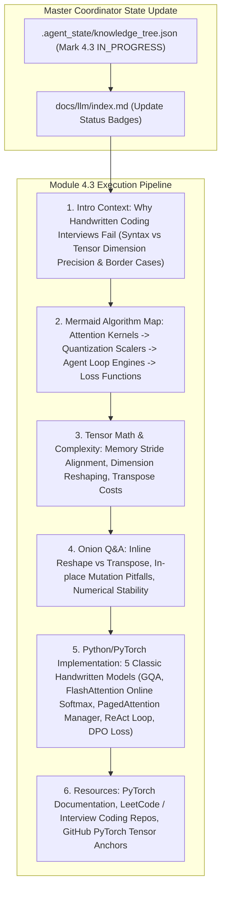

# Module 4.3 Implementation Plan: Handwritten Coding & Kernel Algorithms Deep-Dive

> **For agentic workers:** REQUIRED SUB-SKILL: Use superpowers:subagent-driven-development to implement this plan task-by-task. Steps use checkbox (`- [ ]`) syntax for tracking.

**Goal:** Execute the full 6-Agent Multi-Agent pipeline for topic **`4.3-coding-handwritten.md` (手撕代码与算子实现)**, completing Section 4 and following our standard article specification (Introductory background, Mermaid evolution tree, Knowledge Graph links, Mathematical/Algorithmic derivations, Onion Q&A, Standalone runnable PyTorch/Python code, and Supplementary Links).

**Architecture Diagram:**

**Tech Stack:** VitePress, Vue 3, KaTeX, Markdown, Node.js

---

### Task 1: Update Master Coordinator State & Portal Index Page

**Files:**
- Modify: `.agent_state/knowledge_tree.json`
- Modify: `docs/llm/index.md`

- [ ] **Step 1: Update `.agent_state/knowledge_tree.json`**
Mark `4.2-system-design-qa` as `COMPLETED`, and `4.3-coding-handwritten` as `IN_PROGRESS`.

- [ ] **Step 2: Update `docs/llm/index.md` status badge**
Update `4.3 手撕代码与算子实现` badge to `<Badge type="tip" text="已就绪" />`.

---

### Task 2: Create Deep Article `docs/llm/4-interview-qa/4.3-coding-handwritten.md`

**Files:**
- Create: `docs/llm/4-interview-qa/4.3-coding-handwritten.md`

- [ ] **Step 1: Write `docs/llm/4-interview-qa/4.3-coding-handwritten.md`**

Must include:
- **📖 1. 导言与背景**：在大模型与 AI Agent 岗位面试中，“手撕代码”（Handwritten Coding）不仅考察 Python/PyTorch 的语法熟练度，更考察对**张量维度转换 (Reshape/Transpose/Permute)、显存连续性 (Contiguous)、数值稳定性与算法复杂度**的深刻理解。
- **🌳 2. 手撕代码核心题型分支树 (Mermaid Graph)**：
  - 分支 A：注意力算子类 (Scaled Dot-Product Attention, GQA, FlashAttention Online Softmax).
  - 分支 B：模型层与位置编码类 (RMSNorm, Dynamic NTK RoPE).
  - 分支 C：强化学习与损失函数类 (DPO Loss, GRPO Advantage Calculator).
  - 分支 D：系统与 Agent 引擎类 (PagedAttention Page Table Manager, ReAct Loop Engine).
- **🕸️ 3. 知识网格与图谱依赖**：
  - 入度：PyTorch Tensor API, Einops / Broadcasting, Complex Euler Rotation, PyTorch Autograd.
  - 出度：大厂 AI 面试 Coding 关卡、自定义 CUDA / Triton 算子开发、模型架构自定义改写。
- **🧮 4. 维度变化与数值稳定性推导**：
  - **MHA 到 GQA 张量维度转换推导**：
    $$(B, S, H_{kv}, D) \xrightarrow{\text{repeat\_interleave}} (B, S, H_{kv} \cdot \text{group\_size}, D) \rightarrow (B, H_q, S, D)$$
  - **Online Softmax 分块结合律公式**：
    $$m = \max(m_1, m_2), \quad d = d_1 e^{m_1 - m} + d_2 e^{m_2 - m}$$
- **🔥 5. 连环面试追问 (Level 1~6 Onion Chain)**：
  - *L1*: PyTorch 中 `view()` 与 `reshape()` 有什么区别？为什么在 `transpose()` 之后必须调用 `contiguous()`？
  - *L2*: 手写 Attention 时，如果忘记给 Softmax 上游施加 Mask （如 Causal Mask），会有什么严重后果？
  - *L3*: 手写 DPO Loss 时，如果直接用 `torch.exp` 计算概率比值，为什么容易触发 `Inf` 或 `NaN`？（必须使用 `torch.log_softmax` 与 Log-Sum-Exp 技巧）。
  - *L4*: 如何在不用任何第三方库的前提下，手写一个包含工具注册与正则提取的 `ReAct` 智能体执行循环？
  - *L5*: 如何在白板上手写 PagedAttention 的物理块分配器（Block Allocator）？如何处理 Page Fault？
- **💻 6. 5 大经典手撕代码完整实现**：
  1. 题目一：手写 `GroupedQueryAttention`（支持 KV Cache 与 Causal Mask）。
  2. 题目二：手写 `FlashAttentionOnlineSoftmax`（分块 Tiling 递推增量更新）。
  3. 题目三：手写 `DynamicNTKRotaryEmbedding`（复数旋转矩阵与动态 Base 调整）。
  4. 题目四：手写 `DPOLossCalculator`（Log-Softmax 数值稳定版）。
  5. 题目五：手写 `ReActAgentLoopEngine`（纯 Python 自主循环）。
- **🔗 7. 扩展学习与多维资源**：
  - 🎬 **YouTube / B站**：Andrej Karpathy *Let's build GPT from scratch* 代码走读视频。
  - 📄 **参考指南**：PyTorch Tensor Mechanics, HuggingFace Transformers Modeling Code.
  - 🐙 **GitHub 源码**：`karpathy/minGPT`、`karpathy/nanoGPT`。

---

### Task 3: Update VitePress Sidebar & Test Build

**Files:**
- Modify: `docs/.vitepress/config.js`

- [ ] **Step 1: Register `4.3 手撕代码与算子实现` under Section 4 in `docs/.vitepress/config.js` sidebar**
- [ ] **Step 2: Run `npm run build` in `/Users/soul/AiPro/personal-website` to ensure clean build with 0 broken links**
- [ ] **Step 3: Commit changes to Git**
