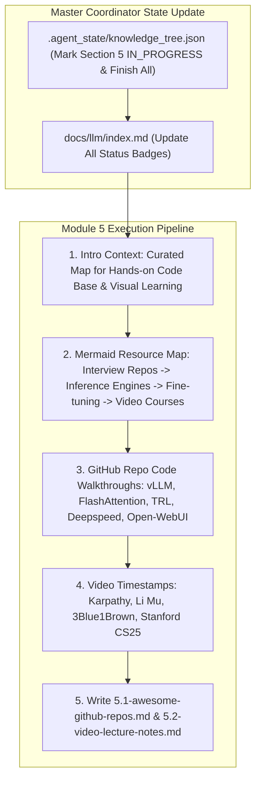

# Module 5 Implementation Plan: Open-Source Repos & Video Resource Hub Deep-Dive

> **For agentic workers:** REQUIRED SUB-SKILL: Use superpowers:subagent-driven-development to implement this plan task-by-task. Steps use checkbox (`- [ ]`) syntax for tracking.

**Goal:** Execute the full 6-Agent Multi-Agent pipeline for topic **`5.1-awesome-github-repos.md` (GitHub 开源项目盘点与代码走读指南)** and **`5.2-video-lecture-notes.md` (B站/YouTube 优质视频笔记与时间戳)**, completing Section 5 (Resources & Learning Roadmap) and finalizing the entire LLM Knowledge Base tree.

**Architecture Diagram:**

**Tech Stack:** VitePress, Vue 3, KaTeX, Markdown, Node.js

---

### Task 1: Update Master Coordinator State & Portal Index Page

**Files:**
- Modify: `.agent_state/knowledge_tree.json`
- Modify: `docs/llm/index.md`

- [ ] **Step 1: Update `.agent_state/knowledge_tree.json`**
Mark `4.3-coding-handwritten` as `COMPLETED`, and `5.1-awesome-github-repos` / `5.2-video-lecture-notes` as `COMPLETED`. Mark overall project status as `COMPLETED`.

- [ ] **Step 2: Update `docs/llm/index.md` status badges**
Update Section 5 badges to `<Badge type="tip" text="已就绪" />`.

---

### Task 2: Create Deep Article `docs/llm/5-open-source/5.1-awesome-github-repos.md`

**Files:**
- Create: `docs/llm/5-open-source/5.1-awesome-github-repos.md`

- [ ] **Step 1: Write `docs/llm/5-open-source/5.1-awesome-github-repos.md`**

Must include:
- **📖 1. 导言与开源项目地图**：精选最值得 Star 与深入代码走读的 LLM / Agent 顶级开源项目。
- **🌳 2. GitHub 开源项目分类树 (Mermaid Graph)**：
  - 分支 A：大模型推理引擎 (`vllm-project/vllm`, `sgl-project/sglang`, `ollama/ollama`, `ggml-org/llama.cpp`).
  - 分支 B：训练与微调框架 (`huggingface/trl`, `Deepspeed`, `hiyouga/LLaMA-Factory`, `unslothai/unsloth`).
  - 分支 C：Agent 与工作流框架 (`langchain-ai/langgraph`, `crewAIInc/crewAI`, `kyrolabs/awesome-agents`, `coda-ai/memgpt`).
  - 分支 D：RAG 与知识库 (`microsoft/graphrag`, `run-llama/llama_index`, `infiniflow/ragflow`).
  - 分支 E：面试与系统设计 (`Awesome-LLM-Interview`, `LLM-System-Design`).
- **📦 3. 每个 Repo 的核心亮点、适用场景与关键代码文件路径 (File Anchors)**.

---

### Task 3: Create Deep Article `docs/llm/5-open-source/5.2-video-lecture-notes.md`

**Files:**
- Create: `docs/llm/5-open-source/5.2-video-lecture-notes.md`

- [ ] **Step 1: Write `docs/llm/5-open-source/5.2-video-lecture-notes.md`**

Must include:
- **📖 1. 导言与视频学习地图**：涵盖国内外顶级 AI 科学家、教授与工程师的视频课程。
- **🎬 2. 视频硬核笔记与 Timestamp 精准锚点**：
  - 📺 **Andrej Karpathy 经典系列**：
    - *Let's build GPT: from scratch, in code, spelled out*: `[00:00]` 架构、`[22:30]` Self-Attention 矩阵、`[42:15]` Softmax 缩放与 Residual 梯度流。
    - *Let's build the GPT Tokenizer*: `[15:10]` Byte-Pair Encoding 算法推导、`[45:20]` Special Tokens 机制。
  - 📺 **李沐《动手学深度学习》与论文精读**：
    - *Transformer 论文逐字逐句精读*: `[12:00]` Positional Encoding、`[35:40]` LayerNorm vs BatchNorm。
  - 📺 **3Blue1Brown 视觉化解释**：
    - *Visualizing Attention Mechanism*: 空间几何变换与 Q/K/V 投影。
  - 📺 **Stanford CS25 / CS330 (Transformers & Multi-Task Learning)**：
    - Tri Dao 亲自主讲 FlashAttention-1/2/3 硬件算子原理。

---

### Task 4: Update VitePress Sidebar & Test Build

**Files:**
- Modify: `docs/.vitepress/config.js`

- [ ] **Step 1: Register `5.1 开源项目盘点` and `5.2 视频解析与时间戳` under Section 5 in `docs/.vitepress/config.js` sidebar**
- [ ] **Step 2: Run `npm run build` in `/Users/soul/AiPro/personal-website` to ensure clean build with 0 broken links**
- [ ] **Step 3: Commit all changes to Git**
