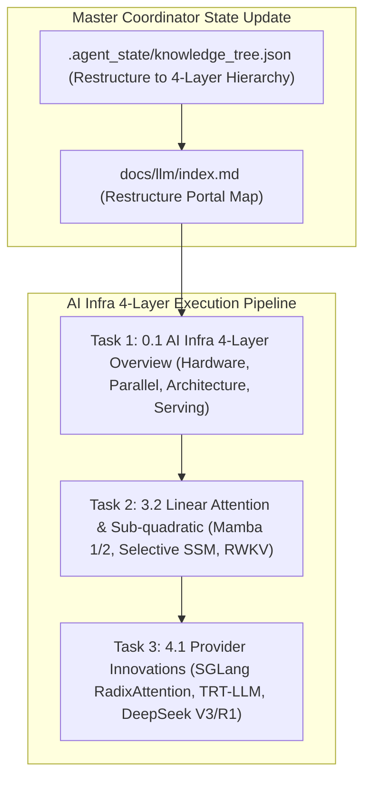

# AI Infra 4-Layer Architecture Implementation Plan

> **For agentic workers:** REQUIRED SUB-SKILL: Use superpowers:subagent-driven-development to implement this plan task-by-task. Steps use checkbox (`- [ ]`) syntax for tracking.

**Goal:** Execute the full 6-Agent Multi-Agent pipeline to restructure the VitePress site into the **AI Infra 4-Layer Architecture**, and write 3 crucial newly introduced articles: **`0.1-ai-infra-4layers-overview.md` (AI Infra 四层架构全景剖析与 Roofline 瓶颈图谱)**, **`3.2-linear-attention-mamba.md` (线性注意力与亚二次方架构: Mamba 1/2, SSM, RWKV)**, and **`4.1-provider-innovations.md` (厂商与推理框架改进: SGLang RadixAttention, TensorRT-LLM, DeepSeek V3/R1 架构优化)**.

**Architecture Diagram:**

**Tech Stack:** VitePress, Vue 3, KaTeX, Markdown, Node.js

---

### Task 1: Module 0.1 - AI Infra 四层架构全景剖析与 Roofline 瓶颈图谱 (`0.1-ai-infra-4layers-overview.md`)

**Files:**
- Create: `docs/llm/0-infra-overview/0.1-ai-infra-4layers-overview.md`

- [ ] **Step 1: Write `0.1-ai-infra-4layers-overview.md`**

Must include:
- **📖 1. 导言与背景**：为什么孤立看技术算法会导致迷失？引入 **AI Infra 4 层架构**（Layer 1: 硬件与算力 -> Layer 2: 并行与编译器 -> Layer 3: 模型架构与注意力 -> Layer 4: 推理服务与应用）。
- **🌳 2. AI Infra 四层架构拓扑与演进主干图 (Mermaid Topology Graph)**：
  - 绘制包含物理算子、3D并行、注意力演进、SLA服务梯度的完整四层关系图。
- **🕸️ 3. 四层架构瓶颈矩阵与 Roofline 算术强度**：
  - 分析 Layer 1 HBM 带宽瓶颈 $\rightarrow$ Layer 2 FlashAttention 算子重算 $\rightarrow$ Layer 3 MLA/GQA 显存压缩 $\rightarrow$ Layer 4 PagedAttention 页表与 SGLang RadixAttention 共享前缀。
- **🔥 4. 连环面试追问 (Level 1~6)**：
  - *L1*: 如何用一句话解释 GPU 的算术强度 (Arithmetic Intensity)？
  - *L2*: 为什么大模型训练主要吃算力 (Compute-Bound)，而单人 Decode 推理主要吃显存带宽 (Memory-Bandwidth Bound)？
  - *L3*: 四层架构中，底层硬件改进（如 H100 FP8 Tensor Cores）是如何一步步传导并改变上层推理框架（如 TRT-LLM / vLLM）实现的？
- **💻 5. Python 实战**：手写 Roofline Model 分析器计算特定模型参数下在 A100 vs H100 上的瓶颈类型。
- **🔗 6. 扩展学习资源与论文/Repo**。

---

### Task 2: Module 3.2 - 线性注意力与亚二次方架构 (`3.2-linear-attention-mamba.md`)

**Files:**
- Create: `docs/llm/3-architecture-attention/3.2-linear-attention-mamba.md`

- [ ] **Step 1: Write `3.2-linear-attention-mamba.md`**

Must include:
- **📖 1. 导言与背景**：标准 Attention $O(N^2)$ 复杂度瓶颈。非线性注意力 vs 线性注意力（Linear Attention）的本质区别。
- **🌳 2. 线性/亚二次方注意力演进树 (Mermaid Graph)**：
  - Linear Attention (Kernel Trick) $\rightarrow$ State Space Models (SSM) $\rightarrow$ Mamba 1 (Selective SSM) $\rightarrow$ Mamba 2 (SSD: State Space Duality) $\rightarrow$ RWKV $\rightarrow$ RetNet $\rightarrow$ Hybrid Mamba-Transformer (Jamba)。
- **🧮 3. 数学推导与硬核机制**：
  - **连续状态空间方程到离散化**：
    $$h'(t) = A h(t) + B x(t), \quad y(t) = C h(t) \quad \xrightarrow{\text{ZOH 离散化}} \quad h_k = \bar{A} h_{k-1} + \bar{B} x_k, \quad y_k = C h_k$$
  - **Mamba 1 选择性机制 (Selective SSM)**：让 $B, C, \Delta$ 成为输入 $x$ 的函数（Input-Dependent）。
  - **Mamba 2 状态空间对偶性 (SSD)**：将 SSM 转化为块对角矩阵乘法，融合 GPU Tensor Core 矩阵计算。
- **🔥 4. 连环面试追问 (Level 1~6)**：
  - *L1*: 为什么线性注意力在长文本检索和“大海捞针 (Needle in a Haystack)”测试中往往不如标准 Transformer？
  - *L2*: Mamba 1 如何通过 Hardware-aware 算法解决 Selective SSM 无法并行训练的问题？（SRAM 内重算与 Scan 扫描）。
  - *L3*: 为什么混合架构（Hybrid Mamba-Transformer，如 Jamba）能兼具 Mamba 的高吞吐与 Transformer 的精确 recall？
- **💻 5. PyTorch 算法实战**：纯 PyTorch 手写 `SelectiveSSM` 核心离散化与状态更新模块。
- **🔗 6. 扩展学习与资源**：Mamba 1 / Mamba 2 / RWKV 论文与 GitHub `state-spaces/mamba` Anchors。

---

### Task 3: Module 4.1 - 厂商与推理框架改进详解 (`4.1-provider-innovations.md`)

**Files:**
- Create: `docs/llm/4-serving-application/4.1-provider-innovations.md`

- [ ] **Step 1: Write `4.1-provider-innovations.md`**

Must include:
- **📖 1. 导言与背景**：大模型服务提供商（OpenAI, DeepSeek, 月之暗面 Kimi）与主流推理框架（vLLM, SGLang, TensorRT-LLM, Ollama）是如何通过架构与工程创新提升生产效果与降低 Token 成本的？
- **🌳 2. 厂商与框架技术改进全景树 (Mermaid Graph)**：
  - 厂商维度：OpenAI (GPT-4o 多模态) / DeepSeek (V3 MLA + Dynamic Router, R1 GRPO 慢思考) / Kimi (长文本无损压缩).
  - 框架维度：vLLM (PagedAttention) vs SGLang (RadixAttention 前缀树共享) vs TensorRT-LLM (Tensor Core FP8/FP4 极值加速).
- **🧮 3. SGLang RadixAttention 树状前缀 Cache 匹配算法推导**：
  - Radix Tree LRU 淘汰与 Agent 复杂多轮对话/Tree-of-Thought 中的 KV Cache 命中率提升：
    $$\text{Cache Hit Ratio} = \frac{\sum \text{Shared Prefix Tokens}}{\sum \text{Total Tokens}}$$
- **🔥 4. 连环面试追问 (Level 1~6)**：
  - *L1*: SGLang 的 RadixAttention 在 Agent 复杂工作流（如多路分支尝试）中相比 vLLM 为什么能实现数倍性能提升？
  - *L2*: DeepSeek-V3 为何能在训练和推理成本上做到极低？（MLA 压缩 KV + Dynamic Router 无辅助损失 + 极低通信重叠）。
- **💻 5. Python 算法实战**：手写 `RadixTreeKVCacheManager` 前缀树插入、匹配与 LRU 淘汰模拟逻辑。
- **🔗 6. 扩展学习与资源**：SGLang 论文、DeepSeek-V3 报告、vLLM vs SGLang 性能基测。

---

### Task 4: Restructure VitePress Navigation & Verify Build

**Files:**
- Modify: `.agent_state/knowledge_tree.json`
- Modify: `docs/llm/index.md`
- Modify: `docs/.vitepress/config.js`

- [ ] **Step 1: Restructure `.agent_state/knowledge_tree.json` and `docs/llm/index.md` to match the AI Infra 4-Layer Hierarchy**
- [ ] **Step 2: Update `docs/.vitepress/config.js` sidebar to group all articles into Layer 0, Layer 1, Layer 2, Layer 3, Layer 4, and Interview Section**
- [ ] **Step 3: Run `npm run build` in `/Users/soul/AiPro/personal-website` to ensure clean build with 0 broken links**
- [ ] **Step 4: Commit changes to Git**
