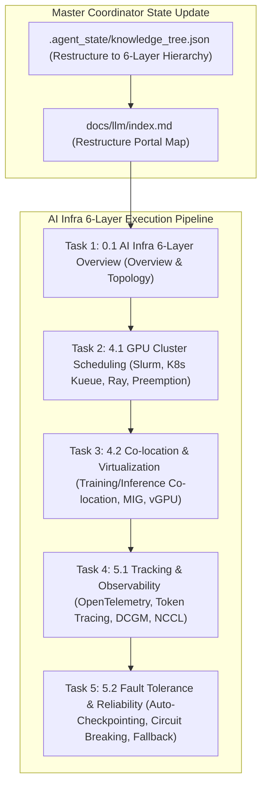

# AI Infra 6-Layer Production Architecture Implementation Plan

> **For agentic workers:** REQUIRED SUB-SKILL: Use superpowers:subagent-driven-development to implement this plan task-by-task. Steps use checkbox (`- [ ]`) syntax for tracking.

**Goal:** Execute the full 6-Agent Multi-Agent pipeline to upgrade the VitePress site into the **AI Infra 6-Layer Production Architecture (Layer 0 ~ Layer 5)**, creating 5 critical newly introduced articles: **`0.1-ai-infra-6layers-overview.md`**, **`4.1-gpu-cluster-scheduling.md`**, **`4.2-colocation-gpu-virtualization.md`**, **`5.1-tracking-observability.md`**, and **`5.2-fault-tolerance-degradation.md`**.

**Architecture Diagram:**

**Tech Stack:** VitePress, Vue 3, KaTeX, Markdown, Node.js

---

### Task 1: Module 0.1 - 工业级 AI Infra 6层全景拓扑与集群瓶颈 (`0.1-ai-infra-6layers-overview.md`)

**Files:**
- Modify: `docs/llm/0-infra-overview/0.1-ai-infra-6layers-overview.md` (renamed & upgraded from 4-layer overview)

- [ ] **Step 1: Write `0.1-ai-infra-6layers-overview.md`**
Must cover Layer 0 (Physical) -> Layer 1 (Parallel/Compiler) -> Layer 2 (Engines/Arch) -> Layer 3 (Cluster Scheduling) -> Layer 4 (Ops & Reliability) -> Layer 5 (App & Agent), Roofline & cluster communication bottlenecks, Python 6-Layer Diagnostic script, Level 1-6 Onion Q&A, and resources.

---

### Task 2: Module 4.1 - GPU 集群资源调度与配额管理 (`4.1-gpu-cluster-scheduling.md`)

**Files:**
- Create: `docs/llm/4-cluster-scheduling/4.1-gpu-cluster-scheduling.md`

- [ ] **Step 1: Write `4.1-gpu-cluster-scheduling.md`**
Must cover Slurm (HPC Batch), Kubernetes Kueue / KubeFlow (Cloud Native), Ray Cluster (Distributed Python Agent/ML Scheduling), multi-tenant quotas, task preemption & Gang Scheduling, Python `RayClusterGangScheduler` code, Level 1-6 Onion Q&A, and resources.

---

### Task 3: Module 4.2 - 训练/推理混部与 GPU 虚拟化隔离 (`4.2-colocation-gpu-virtualization.md`)

**Files:**
- Create: `docs/llm/4-cluster-scheduling/4.2-colocation-gpu-virtualization.md`

- [ ] **Step 1: Write `4.2-colocation-gpu-virtualization.md`**
Must cover Co-location rationale (training batch jobs + inference low-latency peak/off-peak sharing), NVIDIA MIG (Multi-Instance GPU), vGPU time-slicing vs spatial isolation, CUDA IPC shared memory, Python `GPUMIGResourceAllocator` code, Level 1-6 Onion Q&A, and resources.

---

### Task 4: Module 5.1 - 全链路可观测性与 Token 追踪 (`5.1-tracking-observability.md`)

**Files:**
- Create: `docs/llm/5-ops-observability-reliability/5.1-tracking-observability.md`

- [ ] **Step 1: Write `5.1-tracking-observability.md`**
Must cover OpenTelemetry distributed tracing across Gateway -> Router -> RAG -> vLLM -> LLM, NVIDIA DCGM GPU metrics (SMA, NVLink throughput, temperature), NCCL communication bottleneck profiling, Python `OpenTelemetryTokenTracer` code, Level 1-6 Onion Q&A, and resources.

---

### Task 5: Module 5.2 - 千卡故障自动恢复与推理熔断降级 (`5.2-fault-tolerance-degradation.md`)

**Files:**
- Create: `docs/llm/5-ops-observability-reliability/5.2-fault-tolerance-degradation.md`

- [ ] **Step 1: Write `5.2-fault-tolerance-degradation.md`**
Must cover Training fault tolerance: Straggler detection, NCCL timeout handling, asynchronous/fast checkpointing (In-memory/S3 async checkpointing); Inference reliability: Circuit Breaking (Leaky Bucket / Token Bucket), exponential backoff with jitter, fallback degradation (switching to smaller models / static response), Python `ResilientInferenceCircuitBreaker` code, Level 1-6 Onion Q&A, and resources.

---

### Task 6: Restructure Directory Organization & VitePress Config

**Files:**
- Modify: `.agent_state/knowledge_tree.json`
- Modify: `docs/llm/index.md`
- Modify: `docs/.vitepress/config.js`

- [ ] **Step 1: Reorganize directories into `0-infra-overview/`, `1-physical-infra/`, `2-parallel-compiler/`, `3-engines-architecture/`, `4-cluster-scheduling/`, `5-ops-observability-reliability/`, `6-application-agent/`, `7-interview-qa-coding/`**
- [ ] **Step 2: Update `.agent_state/knowledge_tree.json`, `docs/llm/index.md`, and `docs/.vitepress/config.js` sidebar to match the 6-layer structure**
- [ ] **Step 3: Run `npm run build` in `/Users/soul/AiPro/personal-website` to ensure clean build with 0 broken links**
- [ ] **Step 4: Commit changes to Git**
