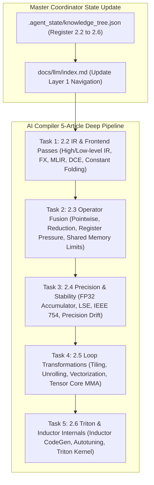

# AI Compiler Deep-Dive Series Implementation Plan

> **For agentic workers:** REQUIRED SUB-SKILL: Use superpowers:subagent-driven-development to implement this plan task-by-task. Steps use checkbox (`- [ ]`) syntax for tracking.

**Goal:** Execute the full 6-Agent Multi-Agent pipeline to build **5 deep-dive AI Compiler articles** under Layer 1 (`docs/llm/2-parallel-compiler/`): **`2.2-ir-and-frontend-passes.md`**, **`2.3-operator-fusion-strategies.md`**, **`2.4-operator-precision-and-stability.md`**, **`2.5-loop-transformations-and-codegen.md`**, and **`2.6-triton-and-inductor-internals.md`**, following our strict 7-section depth specification.

**Architecture Diagram:**

**Tech Stack:** VitePress, Vue 3, KaTeX, Markdown, Node.js

---

### Task 1: Module 2.2 - AI 编译器 IR 表达与前端 Pass 优化 (`2.2-ir-and-frontend-passes.md`)
- High-level Graph IR (FX, TorchScript) vs Low-level Tile IR (MLIR, TVM TIR).
- Dead Code Elimination (DCE), Constant Folding, Common Subexpression Elimination (CSE), Algebraic simplification.
- Python FX Graph Pass Transformer code + Level 1-6 Onion Q&A.

---

### Task 2: Module 2.3 - 算子融合原理、策略与物理边界 (`2.3-operator-fusion-strategies.md`)
- HBM IO elimination mechanics, Pointwise, Reduction, Vertical Pipeline & Horizontal Fusion.
- Physical boundaries: Register Pressure spilling, Shared memory limits, Dynamic shape pre-compilation challenges.
- PyTorch / C++ Fusion Profitability Model code + Level 1-6 Onion Q&A.

---

### Task 3: Module 2.4 - 融合算子数值精度与稳定性控制 (`2.4-operator-precision-and-stability.md`)
- IEEE 754 floating point & FP16/BF16/FP8 precision loss mechanics.
- FP32 hardware accumulator, Log-Sum-Exp (LSE) numerically stable Softmax/LayerNorm, Catastrophic Cancellation defense.
- Python Precision Drift Debugger & ULP (Unit in the Last Place) checker + Level 1-6 Onion Q&A.

---

### Task 4: Module 2.5 - 后端循环变换与硬件指令映射 (`2.5-loop-transformations-and-codegen.md`)
- 5 Loop Transformations: Tiling, Unrolling, Interchange, Fusion, Reordering.
- Hardware ISA mapping: Nvidia Tensor Core `wmma` / `mma.sync` assembly & Shared Memory Bank Conflict elimination.
- Python Tile Scheduler & Bank Conflict simulator code + Level 1-6 Onion Q&A.

---

### Task 5: Module 2.6 - PyTorch Inductor 与 OpenAI Triton 编译器源码级实战 (`2.6-triton-and-inductor-internals.md`)
- PyTorch 2.0 `torch.compile` / Inductor architecture.
- Triton compiler internals: C-like Python to MLIR, Block Tiling, Autotuning.
- Standalone Triton RMSNorm & Softmax fused kernel with FP32 accumulator & bank conflict defense + Level 1-6 Onion Q&A.

---

### Task 6: Directory & Navigation Update & Build Verification
- Update `.agent_state/knowledge_tree.json`, `docs/llm/index.md`, and `docs/.vitepress/config.js` sidebar.
- Run `npm run build` in `/Users/soul/AiPro/personal-website` to ensure VitePress compiles cleanly with 0 broken links.
- Commit changes to Git.
